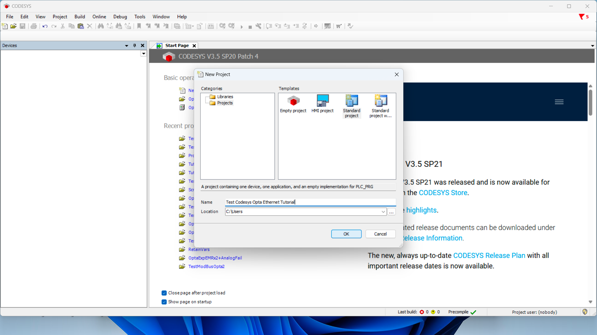
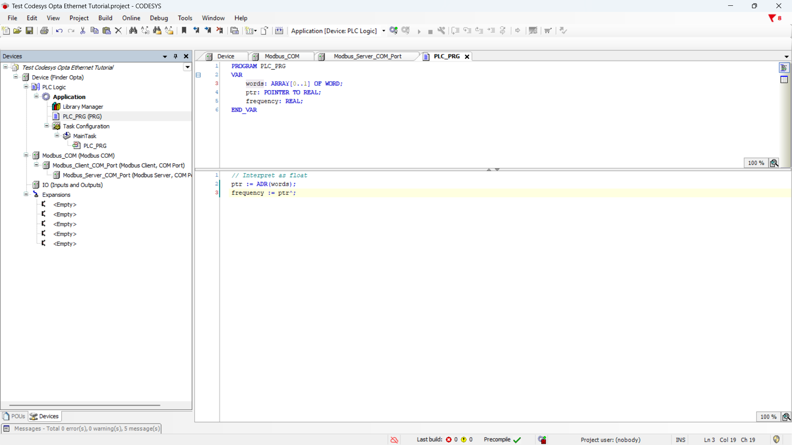

# Reading a Finder 6M Series via Modbus RTU with Finder OPTA in CODESYS

## Overview

Finder OPTA is equipped with an RS-485 port that allows communication with devices compatible with the Modbus RTU protocol, such asthe Finder 6M series. In this tutorial, we will show step-by-step how to configure Finder OPTA in CODESYS to correctly read datafrom a Finder 6M series network analyzer.

## Goals

- Configure Finder OPTA via Ethernet to read registers from a Finder 6M series in CODESYS
- Read registers from a Finder 6M series via Modbus RTU in CODESYS

## Requirements

Before you begin, make sure you have:

- [PLC Finder OPTA CODESYS](https://opta.findernet.com/en/codesys) (x1)
- [12W or 25W switching power supply for OPTA](https://opta.findernet.com/en/codesys#moduli-espansione)(1x)
- Finder 6M series network analyzer (x1)
  - [6M.TA.9.024.1200](https://www.findernet.com/en/worldwide/series/serie-6m-analizzatori-di-rete/type/tipo-6mta-analizzatore-di-rete-monofase/)
  - [6M.TB.9.024.1200](https://www.findernet.com/en/worldwide/series/serie-6m-analizzatori-di-rete/type/tipo-6mtb-analizzatore-di-rete-monofase/)
  - [6M.TF.9.024.1200](https://www.findernet.com/en/worldwide/series/serie-6m-analizzatori-di-rete/type/tipo-6mtf-analizzatore-di-rete-monofase/)
- Ethernet cable (x1)
- Wire with either specification for RS-485 connection (x2):
  - STP/UTP 24-18AWG (Unterminated) 100-130Ω rated
  - STP/UTP 22-16AWG (Terminated) 100-130Ω rated
- CODESYS development environment installed with OPTA Configurator plug-in. You can find an installation guide [at this
  link](https://opta.findernet.com/en/tutorial/codesys-plugin-tutorial).
- Properly configured network: the PC must communicate correctly with Finder OPTA via Ethernet. Configuration guide is available [at
  this link](https://opta.findernet.com/en/tutorial/codesys-via-ethernet).

To follow this tutorial, you will need to connect the Finder 6M series network analyzer to the power supply and provide a suitable
load. You will also need to power Finder OPTA with a 12-24VDC/500mA power supply and properly configure the RS-485 serial
connection. The diagram below shows the correct configuration of the connections between Finder OPTA and the Finder 6M series.


The Modbus configuration of the Finder 6M series is determined by the position of the DIP switches, as indicated on page 6 of the
[user manual](https://cdn.findernet.com/app/uploads/6M.Tx-User-Guide.pdf). In this tutorial the expected communication parameters
are:

- Modbus address: `1`.
- Baudrate: `38400`.

We can set these values **by setting both DIP switches of the Finder 6M series to the `UP` position**, as shown in the figure below.


## Instructions

### Creating a CODESYS Project

Open CODESYS.


Create a new project and choose `Standard Project`.



Make sure the device is `Finder Opta`, then select the programming language (we will use ST).


### Identifying Finder OPTA via Ethernet

Now double-click on the `Device (Finder Opta)` entry in the `Devices` menu, a tab will open as shown below.


Press the `Browse Network` button and ensure Finder OPTA device appears under the Gateway, then press `OK`.


### Modbus Configuration

At this stage, we configure the RS-485 port and Modbus protocol parameters to ensure Finder OPTA can communicate with the Finder 6M
series.

Right-click on `Device (Finder Opta)` and select `Add device...`.


From the list select `Modbus COM Port` and click `Add device`.


Now set the serial port values:

- COM port: `2`, i.e., the RS-485 port of Finder OPTA.
- Baud rate: `38400`.
- Parity: `NONE`.
- Data bits: `8`.
- Stop bits: `1`.


After setting the serial port values, right-click on `Modbus_COM_Port(Modbus COM Port)` and then on `Add device`.


From the list select `Modbus Client, COM Port` and click `Add device`.


Then right-click on the newly added item `Modbus_Client_COM_Port(Modbus Client, COM Port)` and click `Add device`.


Select `Modbus Server, COM port`, then `Add device`.


Now click on the newly added item and make sure the `Server address` is set to `1`.


In the same screen click on `Modbus Server Channel` then on `Add channel` at the bottom right. In this tutorial we read the
frequency value from the Finder 6M series. As defined in the [device technical
manual](https://cdn.findernet.com/app/uploads/Modbus_RS485_6MTx.pdf), the frequency value is stored in Input Registers `40085` and
`40086` in `float` format. Therefore, set the channel values as follows:

- Name: `Frequency`.
- Access type: `Read Input Registers (Function code 4)`.
- Trigger: `Cyclic`.
- Cycle time: `1000`, meaning one read per second.
- Offset: `84`.
- Length: `2`.
- Error handling: `Keep last value`.

The Finder 6M series technical manual counts addresses starting from `1` while CODESYS starts from `0`. For this reason, to access
Input Register `40085`, we set the address to `84`.


After pressing `OK`, you will see the summary of the newly configured channel.


### Preparing the ST Program

Now we write the ST program that reads the frequency value.

This program directly accesses the variable's memory address and interprets the content as a `float` value. This step is essential
to obtain the actual measurement stored in the device and transform it into a readable and usable format. In CODESYS, the `float`
format is denoted as `REAL`.

In the sidebar, click on `PLC_PRG (PRG)`.


At the top of the editor insert the following code:

```st
PROGRAM PLC_PRG
VAR
    words: ARRAY[0..1] OF WORD;
    ptr: POINTER TO REAL;
    frequency: REAL;
END_VAR
```


At the bottom of the editor insert the following code:

```st
// Interpret as float
ptr := ADR(words);
frequency := ptr^;
```



Now it is necessary to associate the program variables with the Modbus channel, so that the variables contain the values read from
the channel.

In the sidebar, double-click on `Server_Modbus_COM_port`. Now click on the section `ModbusGenericSerialServer mapping I/O` and in
the table double-click the `Variable` cell to display the option button.


Click the options button to display the list of variables, expand `Application` and then `PLC_PRG`. Now click on the `words`
variable and press `OK` to assign it to the `Frequency` channel.


The summary shows the variable assigned to the `Frequency` channel.


### Uploading the Program to Finder OPTA

At this stage, CODESYS downloads the program and configuration to the device. This step is crucial to properly update the device
configuration, especially if Finder OPTA still contains an outdated configuration.

Now you can upload the program and configuration to the device by pressing the green button at the top labeled `Login`.


The program is uploaded to Finder OPTA, to start it press the `Start` button.


The `PLC_PRG` tab displays the frequency value in real time, stored in the `frequency` variable, in this case `49.94 Hz`.


## Conclusions

By following these steps, you have performed a Modbus RTU read from the registers of a Finder 6M series using Finder OPTA in
CODESYS.

If you encounter issues, verify that the devices are wired correctly and that the Modbus parameters are configured as specified in
the tutorial.

<!-- Insert contact information for support -->