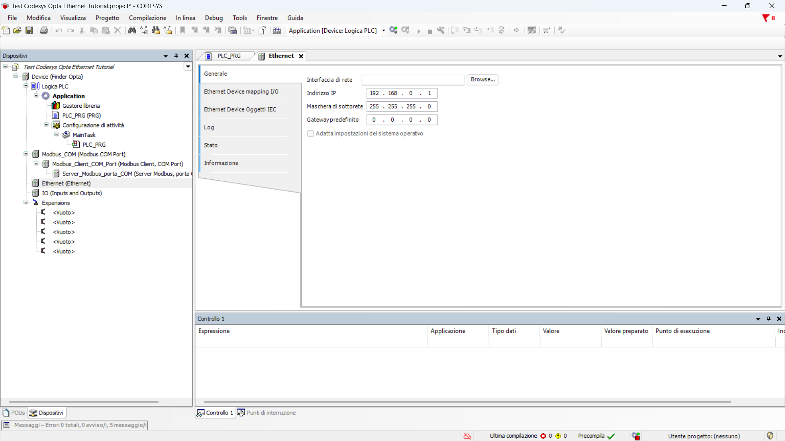

# Leggere un Finder serie 7M via Modbus TCP con Finder OPTA come gateway Modbus in CODESYS

Scopri come implementare un server Modbus TCP su Finder OPTA in CODESYS per esporre i dati letti da un dispositivo Finder serie 7M tramite Modbus RTU.

## Panoramica

Come visto nei tutorial precedenti, Finder OPTA è dotato di una porta RS-485 che consente la comunicazione con dispositivi
compatibili con il protocollo Modbus RTU, come i Finder serie 7M. In questo tutorial mostreremo come implementare un server Modbus
TCP con Finder OPTA in CODESYS per esporre ad un client i valori letti da un Finder serie 7M via Modbus RTU.

## Obbiettivi

- Configurare la porta Ethernet di Finder OPTA in CODESYS
- Configurare un server Modbus TCP con Finder OPTA in CODESYS
- Esporre i valori letti con Modbus RTU ad un client Modbus TCP

## Requisiti

Prima di iniziare, assicurati di avere:

- [PLC Finder OPTA CODESYS](https://opta.findernet.com/it/codesys) (x1)
- [Alimentatore switching 12W o 25W per
  OPTA](https://opta.findernet.com/it/codesys#moduli-espansione)(1x)
- Finder serie 7M con Modbus RTU (x1)
    - [7M.24.8230.0210](https://www.findernet.com/it/italia/series/serie-7m-contatori-di-energia/type/tipo-7m-24-contatore-di-energia-monofase-bidirezionale-con-display-lcd/)
    - [7M.38.8400.0212](https://www.findernet.com/it/italia/series/serie-7m-contatori-di-energia/type/tipo-7m-38-contatori-di-energia-multifunzione-bidirezionale-80-a/)
- Cavo Ethernet (x1)
- Cavo per la connettività RS-485 con una delle seguenti specifiche (x2):
    - STP/UTP 24-18AWG (non terminato) con resistenza di 100-130Ω
    - STP/UTP 22-16AWG (terminato) con resistenza di 100-130Ω
- Ambiente di sviluppo CODESYS installato con plug-in OPTA Configurator. Trovi
  una guida all'installazione [a questo
  link](https://opta.findernet.com/it/tutorial/codesys-plugin-tutorial).
- Rete configurata correttamente: il PC deve comunicare correttamente con
  Finder OPTA tramite Ethernet. Trovi una guida alla configurazione [a questo
  link](https://opta.findernet.com/it/tutorial/codesys-via-ethernet).
- Programma [QModBus](https://sourceforge.net/projects/qmodbus/) installato e
  funzionante. Questo programma permette di leggere dei valori da un server
  Modbus TCP utilizzando un computer Windows.

Per seguire questo tutorial, sarà necessario collegare il contatore di energia
Finder serie 7M alla rete elettrica e fornire un carico adeguato. Sarà inoltre
necessario alimentare il Finder Opta con l'alimentatore e configurare
correttamente la connessione seriale RS-485. Il diagramma sottostante mostra la
configurazione corretta dei collegamenti tra il Finder Opta e il Finder serie
7M.

## Istruzioni

Questo tutorial rappresenta la seconda parte della guida dedicata alla lettura
di un Finder serie 7M tramite Modbus utilizzando Finder OPTA. Se hai già
completato la prima parte, puoi proseguire con questo tutorial. In caso
contrario, ti consigliamo di configurare completare la guida disponibile a
questo [link](https://opta.findernet.com/it/tutorial/serie7m-modbus-rtu) prima
di proseguire.

La guida mostra come utilizzare Finder OPTA come gateway Modbus per rendere
disponibili in Modbus TCP i valori letti dal contatore via Modbus RTU. In
questo modo un client con supporto al protocollo Modbus TCP può accedere ai
valori misurati da un dispositivo Finder serie 7M.

### Configurazione della porta Ethernet

In questa sezione configuriamo la porta Ethernet di Finder OPTA in CODESYS,
specificando l'indirizzo IP a cui sarà accessibile il server Modbus TCP.

Iniziamo aggiungendo l'adattatore Ethernet: premi il testo destro sulla voce
`Device (Finder OPTA)` e scegli `Aggiungi dispositivo...`.

Dal menu, espandi la voce `Adattatore Ethernet`, seleziona `Ethernet` e clicca
su `Aggiungi dispositivo`.

Adesso clicca due volte sulla voce `Ethernet (Ethernet)` nel menu laterale.

A questo punto leggi da Finder OPTA la sua configurazione di rete: cliccando
sul pulsante `Browse...` appare una finestra con i parametri di rete del
dispositivo collegato.

Premi `OK` per mantenere i parametri di rete di Finder OPTA. Prima di
proseguire ricordati di spuntare l'opzione `Adatta impostazioni del sistema
operativo` e successivamente clicca su `Yes` per confermare la modifica.

### Configurazione del server Modbus TCP

In questa sezione configuriamo un server Modbus TCP su Finder OPTA. Questo
server è raggiungibile via Ethernet all'indirizzo IP precedentemente
configurato. Il server Modbus TCP replica nei propri registri il valore di
frequenza letto da Finder OPTA tramite Modbus RTU.

Come prima cosa aggiungi un dispositivo slave Modbus TCP alla porta Ethernet di
Finder OPTA: clicca il tasto destro sulla voce `Ethernet` e `Aggiungi
dispositivo...`.

Successivamente, configuriamo un server Modbus TCP sullo slave. Dal menu
espandi la voce `Modbus` poi `Dispositivo slave ModbusTCP`, clicca su
`ModbusTCP Server Device` e `Aggiungi dispositivo`.

Adesso puoi configurare i regsitri del server Modbus. In particolare, servono
due Input Register per contenere il valore di frequenza.

Imposta i valori come segue:

- Porta del server: `502`, porta di default per il protocollo Modbus TCP.
- Registri di holding: `2`, non li utilizziamo quindi li impostiamo al valore
  minimo.
- Registri di ingresso: `2`, gli Input Register che contengono il valore di
  frequenza.
- Registro di ingresso: `2`, indirizzo di partenza degli Input Register.

Tutti gli altri parametri possono essere lasciati al valore predefinito.

Il configuratore di CODESYS conta gli indirizzi a partire da `0`. Nel nostro
tutorial abbiamo scelto di far partire gli Holding Register dall’indirizzo `0`
e gli Input Register dall’indirizzo `2` solo per evitare confusione. In realtà
gli Holding Register e gli Input Register appartengono a spazi di indirizzi
distinti, quindi nulla vieta di farli partire entrambi da `0`.

Adesso è necessario associare la variabile del programma contenente la
frequenza agli Input Register del server Modbus cosicchè i registri ne
contegano il valore.

Clicca sulla sezione `Modbus TCP Server Device mapping I/O` e nella tabella
clicca due volte sulla cella `Variabile` per far comparire il pulsante opzioni.

Clicca sul pulsante opzioni per far comparire la lista di variabili, espandi la
voce `Application` e la voce `PLC_PRG`. A questo punto clicca sulla variabile
`frequency_w` e premi `OK` per assegnarla agli Input Register.

Il riepilogo mostra la variabile assegnata ai Register.

Dopo questo passaggio il valore della frequenza viene replicato all'interno
degli Input Register del server Modbus TCP agli indirizzi precedentemente
configurati. Sarà quindi possibile per un client accedere ai registri del
server per leggere il valore misurato dal contatore.

### Caricamento del programma su Finder OPTA

In questa fase, scarichiamo il programma e la configurazione hardware su Finder
OPTA, così che esegua il codice appena scritto.

Scarica il programma e la configurazione sul dispositivo premendo il pulsante
verde in alto etichettato come `Login`.

A questo punto conferma il messaggio per sovrascrivere il programma in
esecuzione su Finder OPTA.

Terminato lo scaricamento, il programma è scaricato su Finder OPTA. Fallo
partire premendo il pulsante `Start`.

In questo modo noterai che, nella cella della riga evidenziata in figura, i
byte relativi al valore della frequenza cambiano. Questi byte rappresentano la
frequenza misurata dal Finder serie 7M, espressa in formato `float` dopo la
conversione effettuata dal programma ST.

### Configurazione di QModBus

In questa ultima sezione verifichiamo con un client Modbus TCP di poter leggere
da Finder OPTA il valore di frequenza. In particolare useremo il programma
**QModBus**.

Dopo aver aperto l'applicazione, fai click sul pulsante `Modbus TCP`.

Imposta i valori dei parametri come segue:

- Slave IP: `010.000.000.002`, l'indirizzo IP del server Modbus TCP in
  esecuzione su Finder OPTA.
- TCP Port: `502`, porta di default per il protocollo Modbus TCP.

Dopo aver impostato i parametri premi `OK` per confermare.

Adesso assicurati che i valori della schermata siano i seguenti:

- Modbus Mode: `TCP`.
- Unit ID: `1`.
- Scan Rate (ms): `1000`.
- Function Code: `Read Input Registrers (0x04)`.
- Start Address: `3 Dec`.
- Number of Registers: `2`.
- Data Format: `Float`.
- Precision: `2`.

Questi parametri indicano al programma di leggere due Input Register a partire
dall'indirizzo `3` (a differenza di CODESYS il programma conta gli indirizzi a
partire da 1). Inoltre i parametri indicano che stiamo leggendo un valore in
formato `float`.

A questo punto possiamo connetterci al server: premi su `Connect`.

Adesso che sei connesso al server, premi `Read/Write` per leggere i registri.

Il valore di lettura compare nel primo slot del vettore, nel nostro caso il
valore letto è `50`. Nota che il programma approssima il valore di lettura ad
un numero intero, ma se necessario è possibile cambiare il data format e
leggere i byte in binario o esadecimale per verificarne la correttezza.

## Conclusioni

Seguendo questi passaggi, hai utilizzato Finder OPTA come server Modbus TCP in
CODESYS per esporre ad un client i valori letti da un Finder serie 7M via
Modbus RTU.

Se riscontri problemi, verifica di aver cablato correttamente i dispositivi e
di aver configurato i parametri Modbus ed Ethernet come specificato nel
tutorial.

<!-- Inserire informazioni di contatto per supporto -->
