# Reading a Finder 7M series via Modbus TCP using Finder OPTA as Modbus gateway in CODESYS

Learn how to implement a Modbus TCP server on Finder OPTA in CODESYS to expose data read from a Finder 7M series via Modbus RTU.

## Overview

As shown in previous tutorials, Finder OPTA is equipped with an RS-485 port that allows communication with devices compatible with
the Modbus RTU protocol, such as the Finder 7M series. In this tutorial, we will show how to implement a Modbus TCP server with
Finder OPTA in CODESYS to expose to a client the values read from a Finder 7M series via Modbus RTU.

## Goals

- Configure the Ethernet port of Finder OPTA in CODESYS  
- Set up a Modbus TCP server using Finder OPTA in CODESYS  
- Expose values read via Modbus RTU to a Modbus TCP client

## Requirements

Before starting, make sure you have:

- [Finder OPTA CODESYS PLC](https://opta.findernet.com/en/codesys) (x1)
- [12W or 25W switching power supply for
  OPTA](https://opta.findernet.com/en/codesys#moduli-espansione) (1x)
- Finder 7M series with Modbus RTU (x1)  
  - [7M.24.8230.0210](https://www.findernet.com/en/worldwide/series/serie-7m-contatori-di-energia/type/tipo-7m-24-contatore-di-energia-monofase-bidirezionale-con-display-lcd/)  
  - [7M.38.8400.0212](https://www.findernet.com/en/worldwide/series/serie-7m-contatori-di-energia/type/tipo-7m-38-contatori-di-energia-multifunzione-bidirezionale-80-a/)  
- Ethernet cable (x1)  
- Wire with either specification for RS-485 connection (x2):
  - STP/UTP 24-18AWG (Unterminated) 100-130Ω rated
  - STP/UTP 22-16AWG (Terminated) 100-130Ω rated
- CODESYS development environment installed with the OPTA Configurator plug-in.  
  You can find an installation guide [at this
  link](https://opta.findernet.com/en/tutorial/codesys-plugin-tutorial).  
- Properly configured network: your PC must be able to communicate with Finder
  OPTA via Ethernet.  
  Configuration guide available
  [here](https://opta.findernet.com/en/tutorial/codesys-via-ethernet).
- [QModBus](https://sourceforge.net/projects/qmodbus/) program installed and
  running. This software allows you to read values from a Modbus TCP server
  using a Windows computer.

To follow this tutorial, you will need to connect the Finder 7M series energy
meter to the electrical grid and provide an appropriate load. You will also
need to power the Finder OPTA using the power supply and properly configure the
RS-485 serial connection. The diagram below shows the correct wiring between
Finder OPTA and the Finder 7M series.

## Instructions

This tutorial is the second part of the guide dedicated to reading data from a
Finder 7M series device using Modbus and Finder OPTA.  
If you have already completed the first part, you can continue with this
tutorial. Otherwise, we recommend following the guide available at this
[link](https://opta.findernet.com/en/tutorial/serie7m-modbus-rtu) before
proceeding.

The guide shows how to use Finder OPTA as a Modbus gateway to make the values
read from the meter via Modbus RTU available over Modbus TCP.  
This allows a client that supports the Modbus TCP protocol to access the
measurements from a Finder 7M series.

### Ethernet Port Configuration

In this section, we configure the Ethernet port of Finder OPTA in CODESYS,
specifying the IP address where the Modbus TCP server will be accessible.

Start by adding the Ethernet adapter: right-click on `Device (Finder OPTA)` and
choose `Add Device...`.

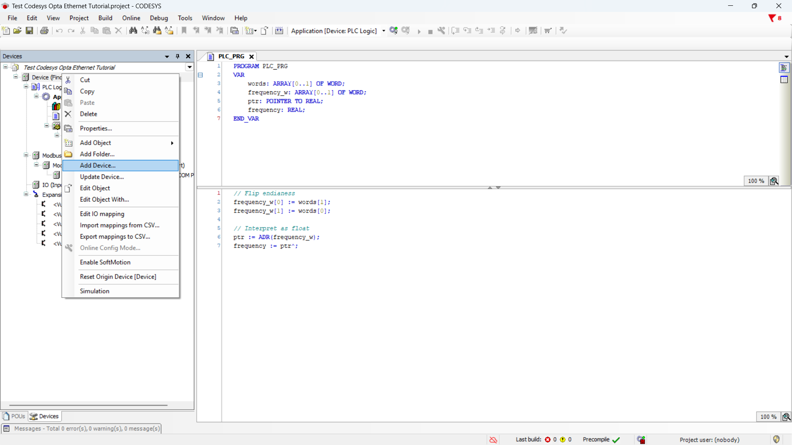

From the menu, expand the `Ethernet Adapter` section, select `Ethernet`, and
click `Add Device`.

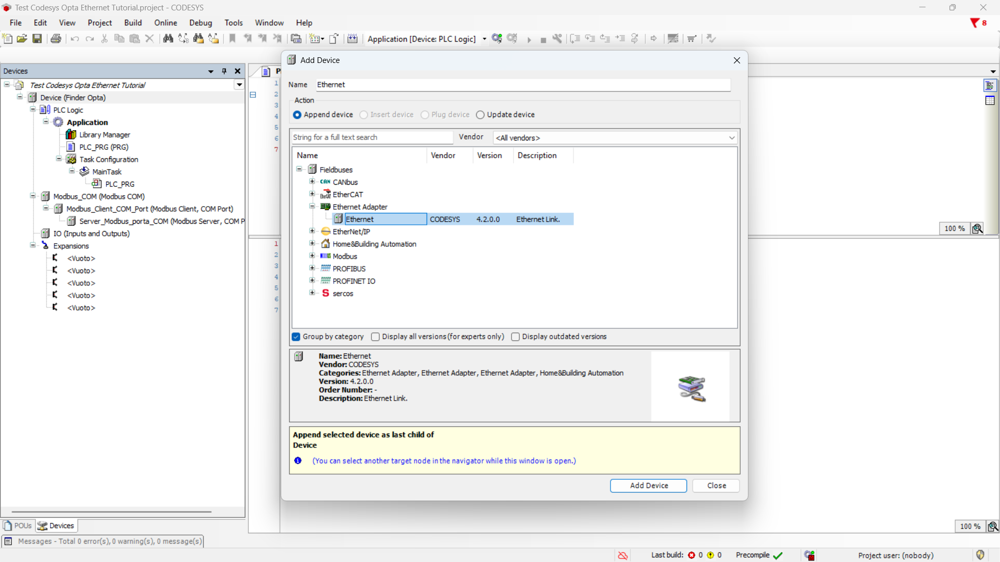

Now double-click on `Ethernet (Ethernet)` in the side menu.

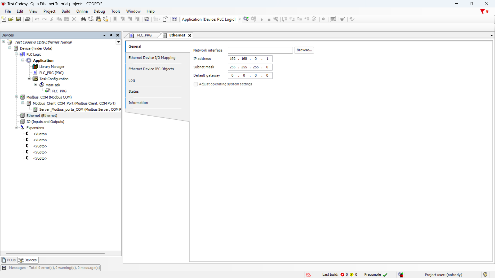

At this point, read the network configuration from Finder OPTA: by clicking the
`Browse...` button, a window will appear showing the network parameters of the
connected device.

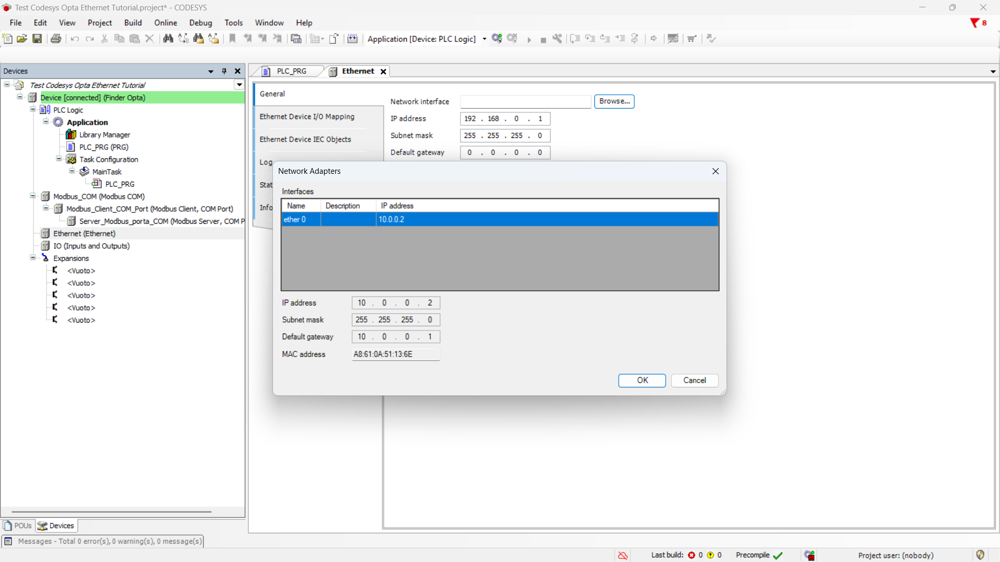

Click `OK` to keep the network settings of Finder OPTA.  
Before proceeding, make sure to check the `Adapt operating system settings`
option and then click `Yes` to confirm the changes.

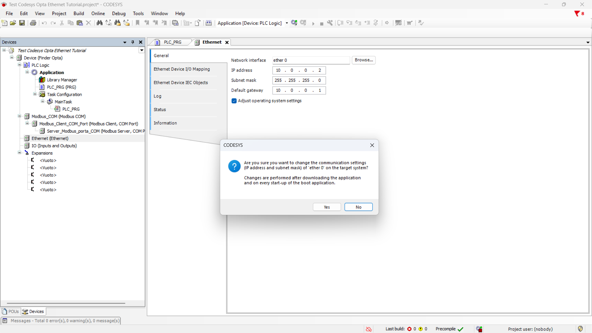

### Modbus TCP Server Configuration

In this section, we configure a Modbus TCP server on Finder OPTA. This server
will be reachable via Ethernet at the previously configured IP address.  
The Modbus TCP server replicates in its registers the frequency value read by
Finder OPTA via Modbus RTU.

First, add a Modbus TCP slave device on the Ethernet port of Finder OPTA:
right-click on `Ethernet` and select `Add Device...`.

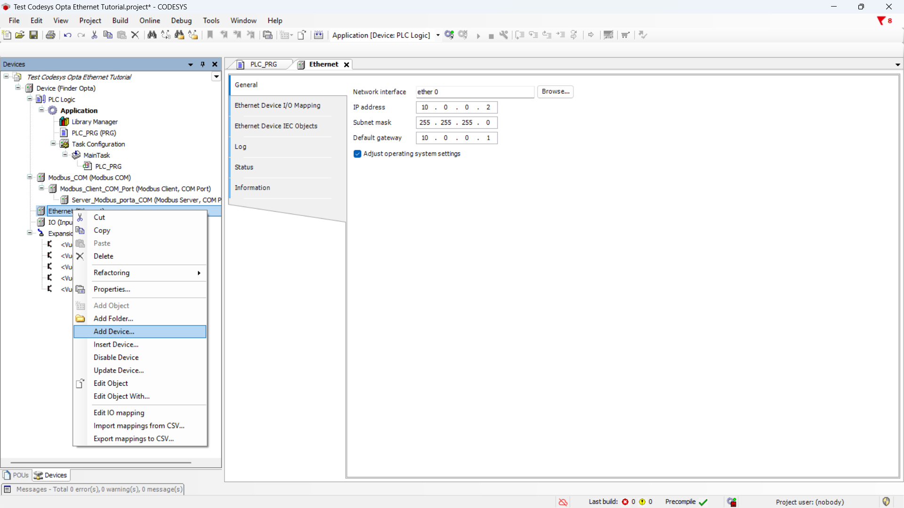

Next, on the slave device we configure a Modbus TCP server. From the menu,
expand `Modbus`, then `ModbusTCP Slave Device`, click on `ModbusTCP Server
Device`, and then `Add Device`.

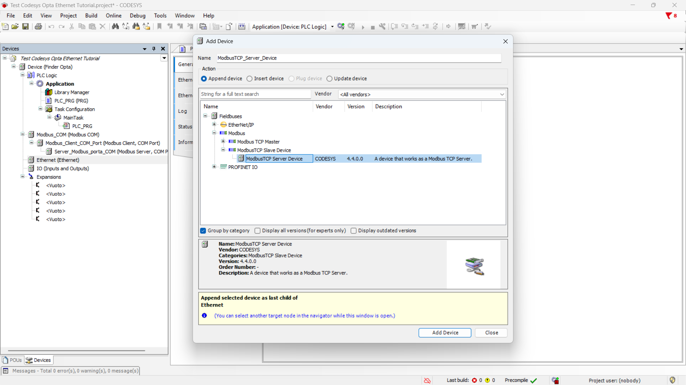

Now you can configure the server’s registers. Specifically, you’ll need two
Input Registers to store the frequency value.

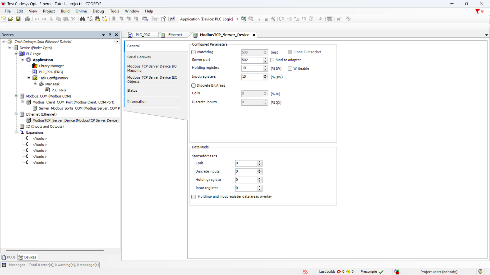

Set the values as follows:

- Server Port: `502`, the default port for Modbus TCP.
- Holding Registers: `2`, not used in this case, so set to the minimum value.
- Input Registers: `2`, these contain the frequency value.
- Input Register: `2`, starting address of the Input Registers.

All other parameters can remain at their default values.

Note that the starting address is set to `2` because the first two addresses
are occupied by Holding Registers. Also, the CODESYS configurator starts
counting addresses from `0`.

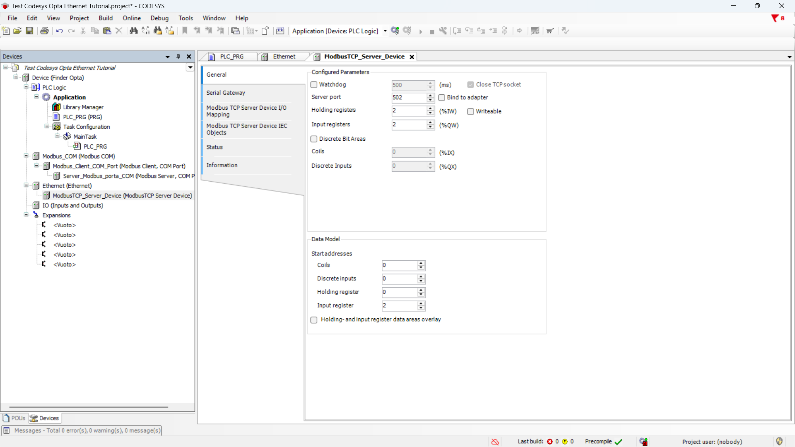

Now you need to associate the program variable that contains the frequency
value with the Modbus server’s Input Registers, so the registers will hold its
value.

Click on the `Modbus TCP Server Device mapping I/O` section and double-click
the `Variable` cell in the table to bring up the options button.

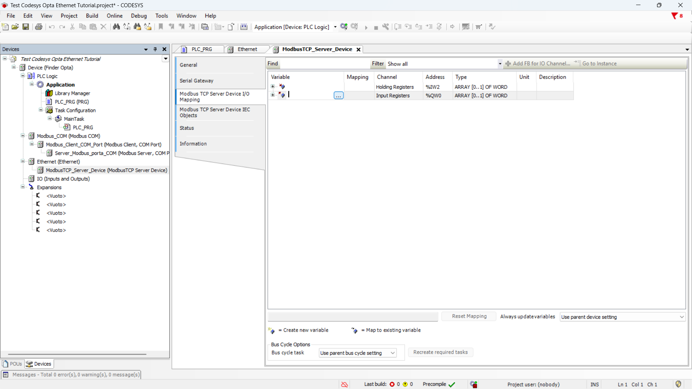

Click the options button to show the list of variables, expand `Application`,
then `PLC_PRG`.  
Now click on the variable `frequency_w` and press `OK` to assign it to the
Input Registers.

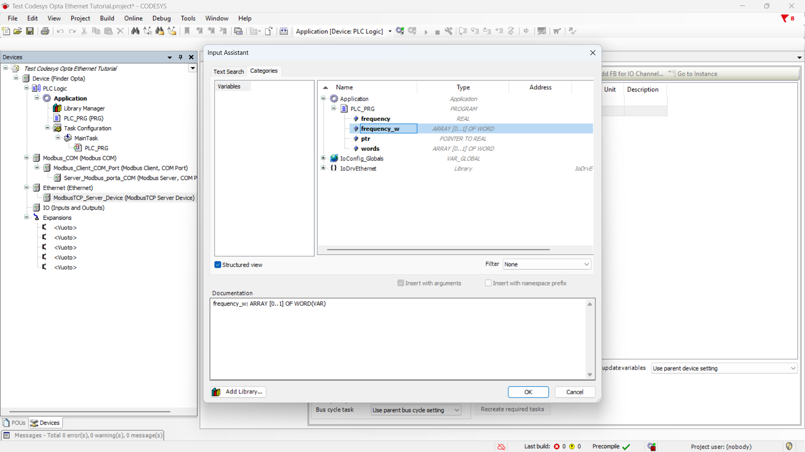

The summary now shows the variable assigned to the registers.

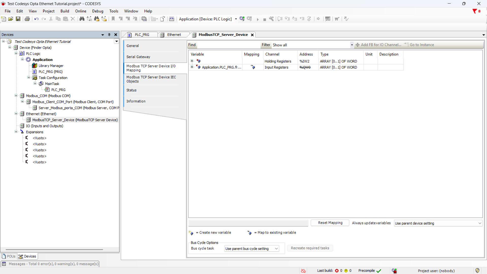

After this step, the frequency value is replicated inside the Modbus TCP
server’s Input Registers at the configured addresses.  
A client will now be able to access the server registers to read the measured
value from the meter.

### Uploading the Program to Finder OPTA

At this stage, we download the program and the hardware configuration to Finder
OPTA, so that it executes the code we just wrote.

Download the program and configuration to the device by pressing the green
button at the top labeled `Login`.

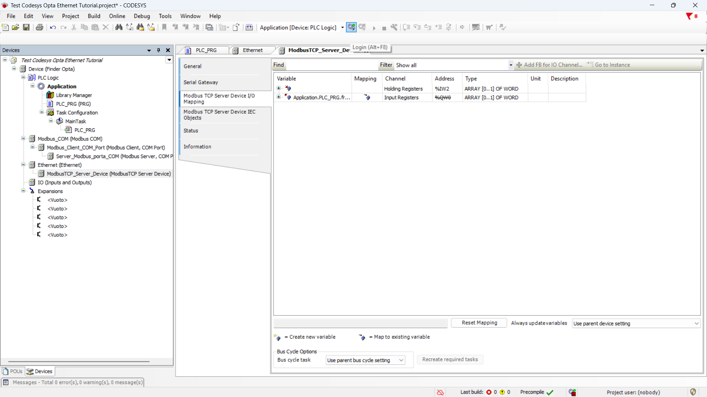

Confirm the message to overwrite the running program on Finder OPTA.

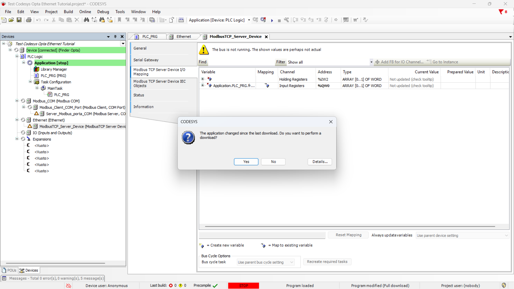

Once the download is over, the program will be downloaded on Finder OPTA.
Execute it by pressing the `Start` button.

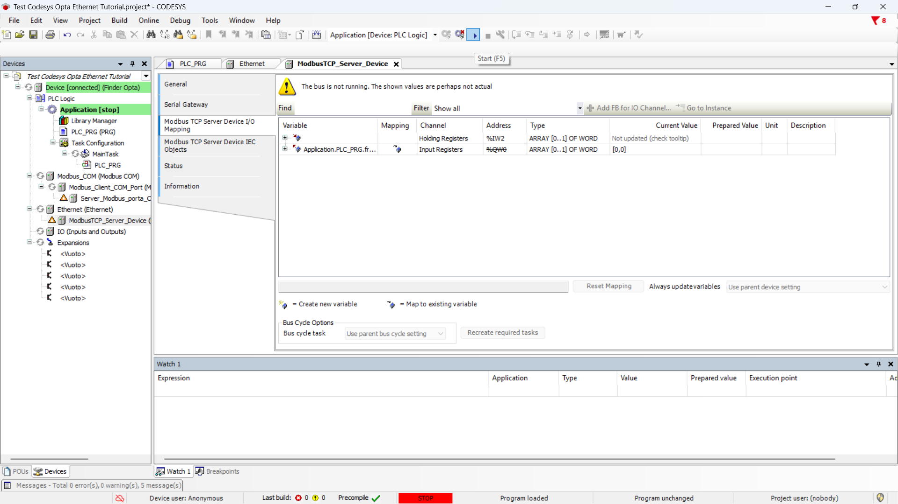

At this point, you’ll notice that in the cell of the highlighted row in the
figure, the bytes related to the frequency value change.  
These bytes represent the frequency measured by the Finder 7M device, expressed
in `float` format after the conversion performed by the ST program.

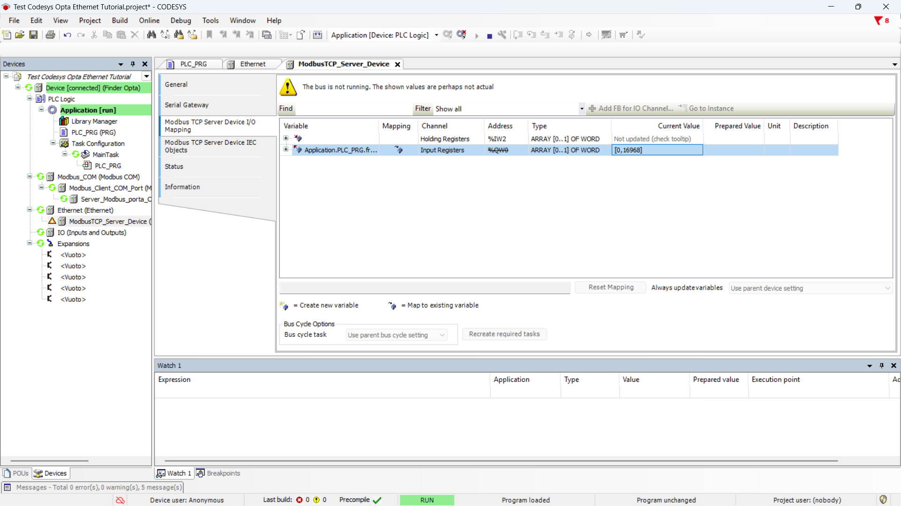

### QModBus Configuration

In this final section, we will verify with a Modbus TCP client that we can read
the frequency value from Finder OPTA. We’ll use **QModBus** program for this.

After launching the application, click the `Modbus TCP` button.

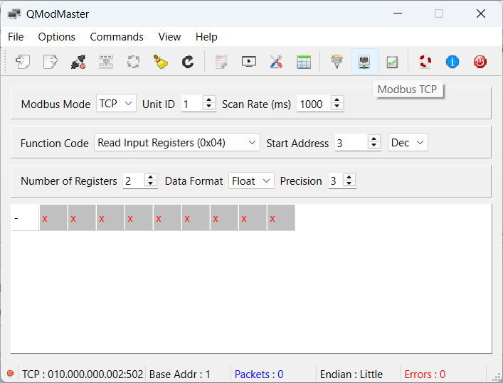

Set the parameter values as follows:

- Slave IP: `010.000.000.002`, the IP address of the Modbus TCP server running
  on Finder OPTA.
- TCP Port: `502`, the default port for Modbus TCP.

After setting the parameters, click `OK` to confirm.

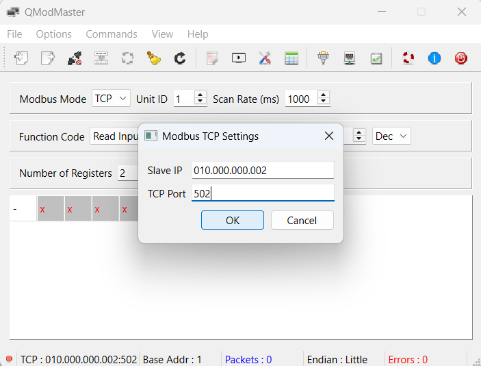

Now make sure the screen values are as follows:

- Modbus Mode: `TCP`.
- Unit ID: `1`.
- Scan Rate (ms): `1000`.
- Function Code: `Read Input Registers (0x04)`.
- Start Address: `3 Dec`.
- Number of Registers: `2`.
- Data Format: `Float`.
- Precision: `2`.

These parameters instruct the program to read two Input Registers starting from
address `3` (note that unlike CODESYS, this program starts address counting
from `1`). Also, the settings specify that we are reading a value in `float`
format.

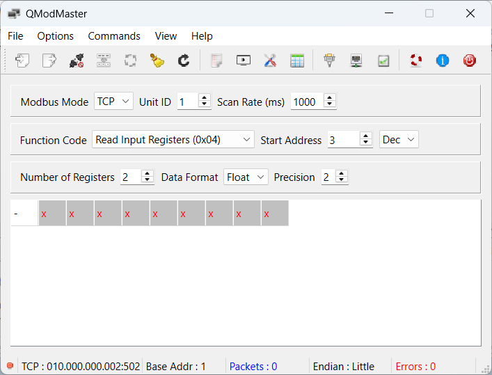

Now you can connect to the server: click `Connect`.

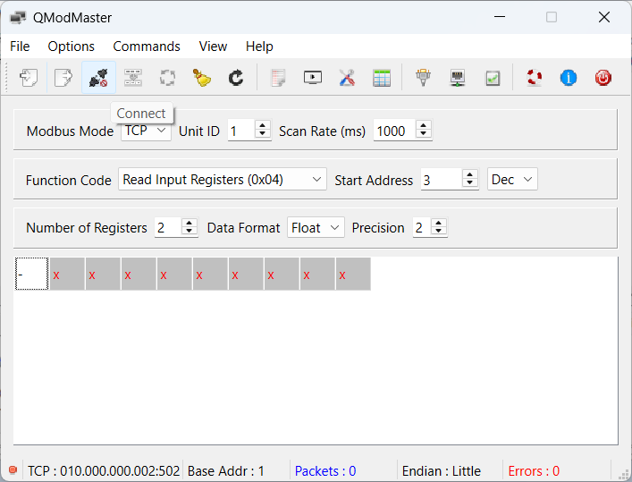

Once connected to the server, press `Read/Write` to read the registers.

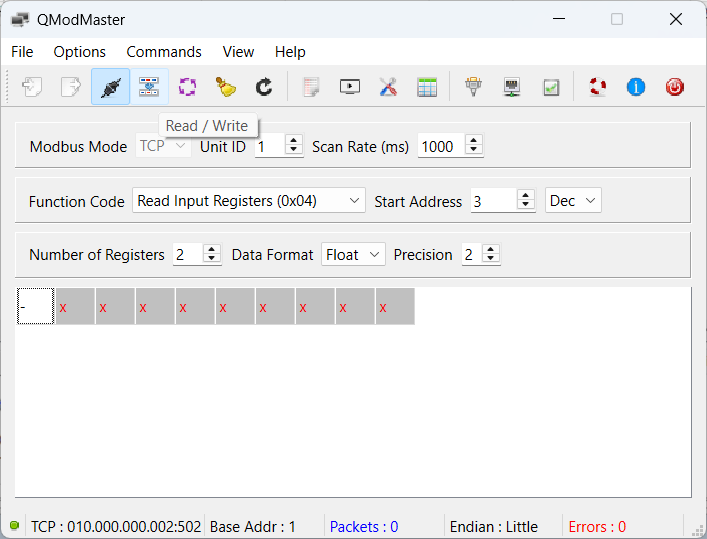

The read value appears in the first slot of the vector; in our case, the value
read is `50`. Note that the program approximates the value to an integer, but
if needed, you can change the data format to binary or hexadecimal to verify
correctness.

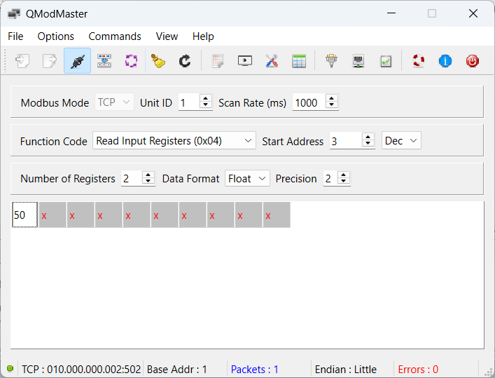

## Conclusion

By following these steps, you have used Finder OPTA as a Modbus TCP server in
CODESYS to expose to a client the values read from a Finder 7M series via
Modbus RTU.

If you encounter any issues, make sure the devices are wired correctly and that
the Modbus and Ethernet parameters are configured as described in the tutorial.

<!-- Add contact info for support -->