# Leggere un Finder serie 7M via Modbus RTU con Finder OPTA in CODESYS

## Panoramica

Finder OPTA è dotato di una porta RS-485 che consente la comunicazione con dispositivi compatibili con il protocollo Modbus RTU, come i Finder serie 7M. In questo tutorial mostreremo, passo dopo passo, come configurare Finder OPTA in CODESYS per leggere correttamente i dati da un contatore Finder serie 7M.

## Obbiettivi

- Configurare Finder OPTA tramite Ethernet per la lettura dei registri di un Finder serie 7M in CODESYS
- Leggere i registri di un Finder serie 7M tramite Modbus RTU in CODESYS

## Requisiti

Prima di iniziare, assicurati di avere:

- [PLC Finder OPTA CODESYS](https://opta.findernet.com/it/codesys) (x1)
- [Alimentatore switching 12W o 25W per OPTA](https://opta.findernet.com/it/codesys#moduli-espansione)(1x)
- Finder serie 7M con Modbus RTU (x1)
  - [7M.24.8230.0210](https://www.findernet.com/it/italia/series/serie-7m-contatori-di-energia/type/tipo-7m-24-contatore-di-energia-monofase-bidirezionale-con-display-lcd/)
  - [7M.38.8400.0212](https://www.findernet.com/it/italia/series/serie-7m-contatori-di-energia/type/tipo-7m-38-contatori-di-energia-multifunzione-bidirezionale-80-a/)
- Cavo Ethernet (x1)
- Cavo per la connettività RS-485 con una delle seguenti specifiche (x2):
  - STP/UTP 24-18AWG (non terminato) con resistenza di 100-130Ω
  - STP/UTP 22-16AWG (terminato) con resistenza di 100-130Ω
- Ambiente di sviluppo CODESYS installato con plug-in OPTA Configurator. Trovi una guida all'installazione [a questo
  link](https://opta.findernet.com/it/tutorial/codesys-plugin-tutorial).
- Rete configurata correttamente: il PC deve comunicare correttamente con Finder OPTA tramite Ethernet. Trovi una guida alla
  configurazione [a questo link](https://opta.findernet.com/it/tutorial/codesys-via-ethernet).

Per seguire questo tutorial, sarà necessario collegare il contatore di energia Finder serie 7M alla rete elettrica e fornire un
carico adeguato. Sarà inoltre necessario alimentare il Finder Opta con l'alimentatore e configurare correttamente la connessione
seriale RS-485. Il diagramma sottostante mostra la configurazione corretta dei collegamenti tra il Finder Opta e il Finder serie 7M.


## Istruzioni

In questo tutorial i parametri di configurazione utilizzati per la comunicazione Modbus con il Finder serie 7M sono:

- Indirizzo Modbus: `1`.
- Baudrate: `38400`.
- Stop bit: `1`.
- Parity: `NO`.

Possiamo impostare questi valori tramite NFC utilizzando [l'applicazione Finder Toolbox
NFC](https://www.findernet.com/it/italia/supporto/software-e-app/).

### Creazione progetto CODESYS

Apri CODESYS.

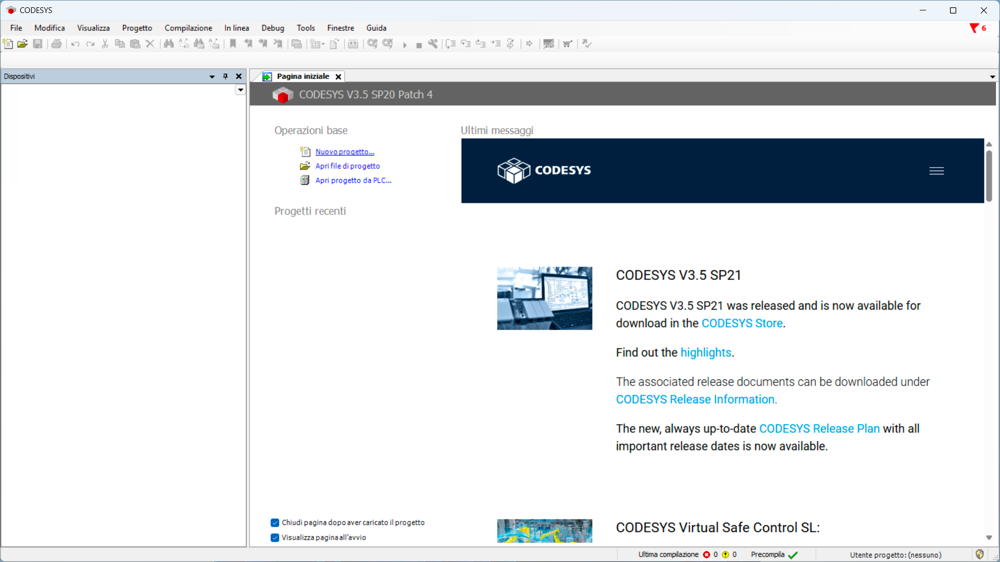

Crea un nuovo progetto e scegli `Progetto standard`.

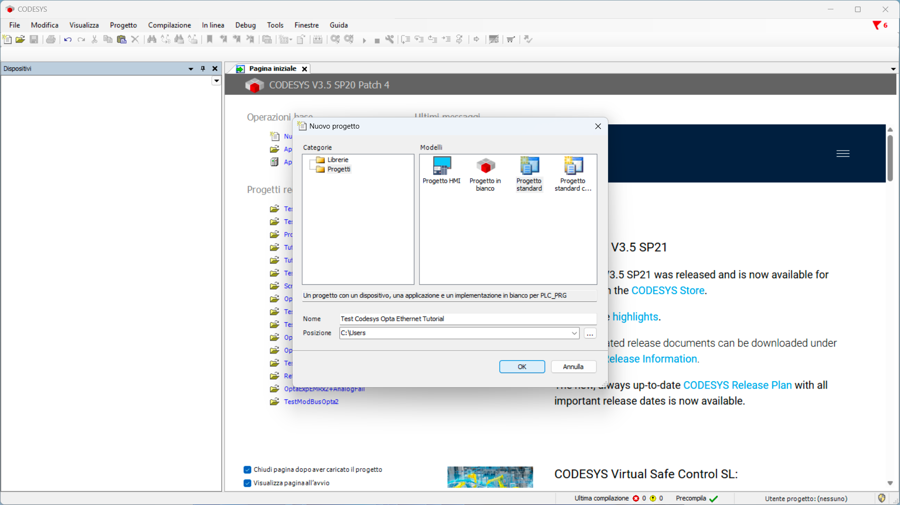

Assicurati che il dispositivo sia `Finder Opta`, poi seleziona il linguaggio del programma (in seguito usiamo ST).


### Identificazione Finder OPTA via Ethernet

A questo punto fai doppio click sulla voce `Device (Finder Opta)` del menu `Dispositivi`, si aprirà una scheda come mostrato qui
sotto.


Premi il bottone `Sfoglia la rete` e assicurati di vedere il dispositivo Finder OPTA comparire sotto il Gateway, poi premi `OK`.

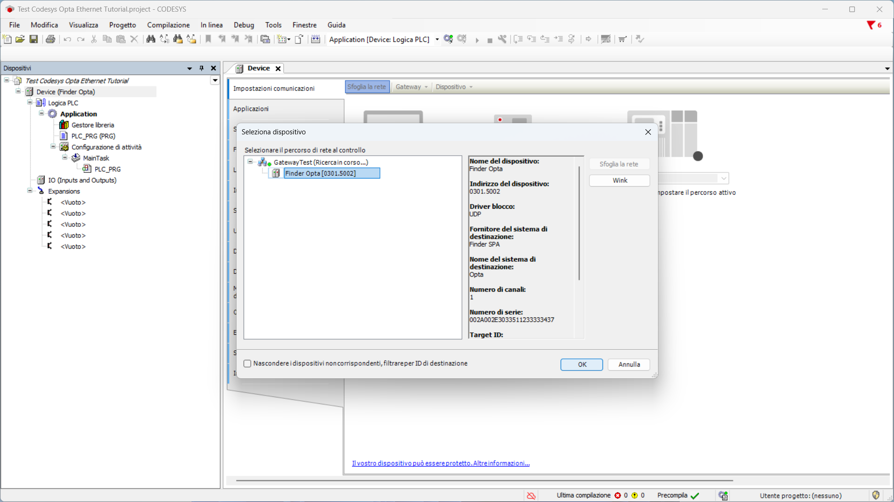

### Configurazione Modbus

In questa fase configuriamo la porta RS-485 e i parametri del protocollo Modbus per garantire che il Finder OPTA sia in grado di
comunicare con il Finder serie 7M.

Premi il tasto destro sulla voce `Device (Finder Opta)` e seleziona `Aggiungi dispositivo`.

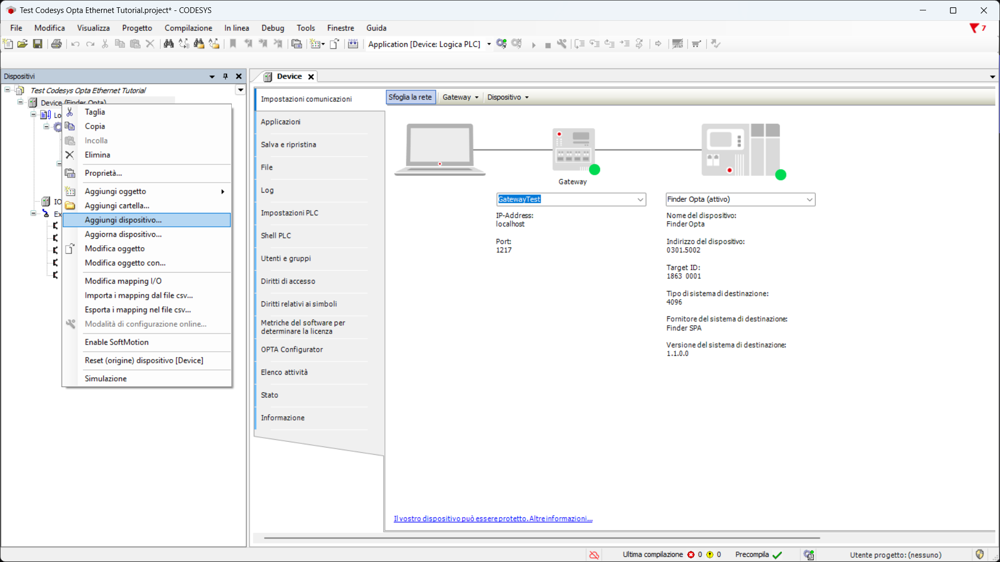

Dalla lista seleziona `Modbus COM Port` e fai click su `Aggiungi dispositivo`.

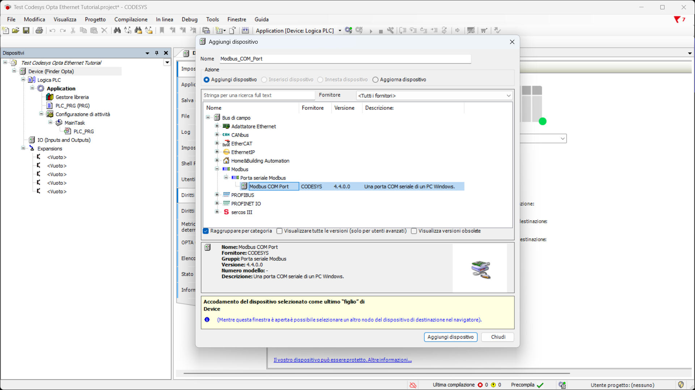

Adesso imposta i valori della porta seriale:

- Porta COM: `2`, ovvero la porta RS-485 del Finder OPTA.
- Velocità in baud: `38400`.
- Parità: `NONE`.
- Bit di dati: `8`.
- Bit di stop: `1`.

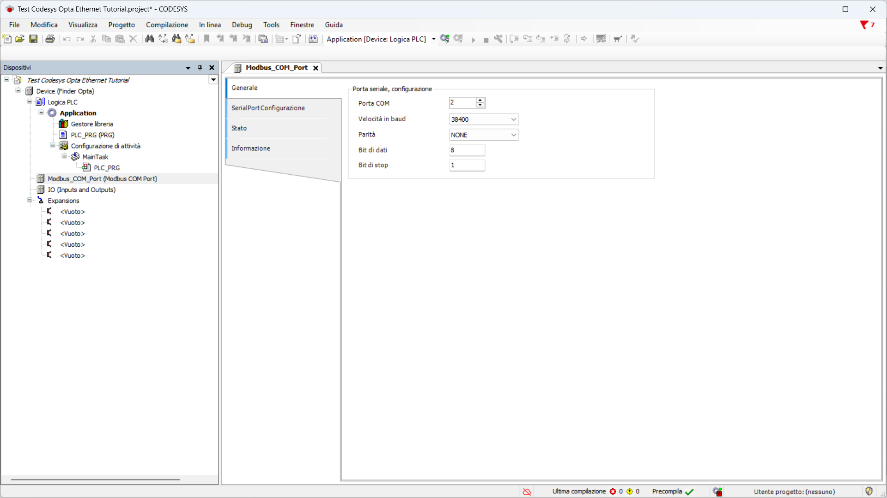

Dopo aver impostato i valori della porta seriale, premi il tasto destro su `Modbus_COM_Port(Modbus COM Port)` e poi su `Aggiungi
dispositivo`.

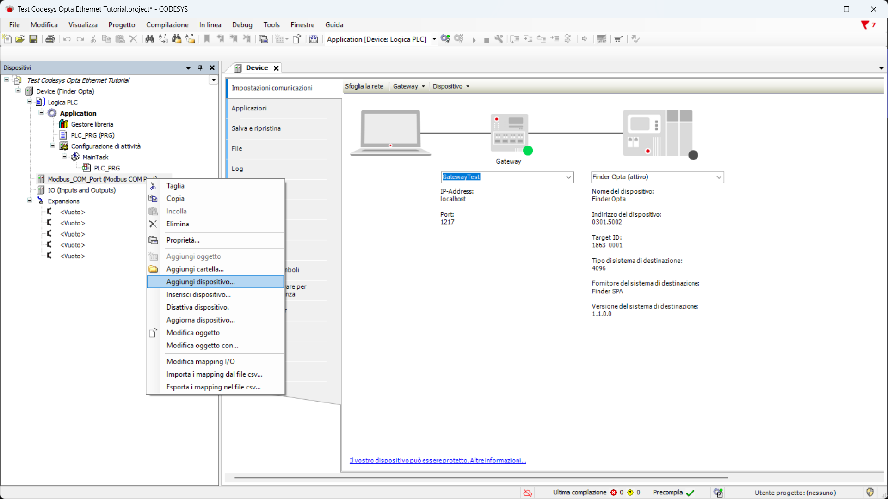

Dalla lista seleziona `Modbus Client, COM Port` e fai `Aggiungi dispositivo`.

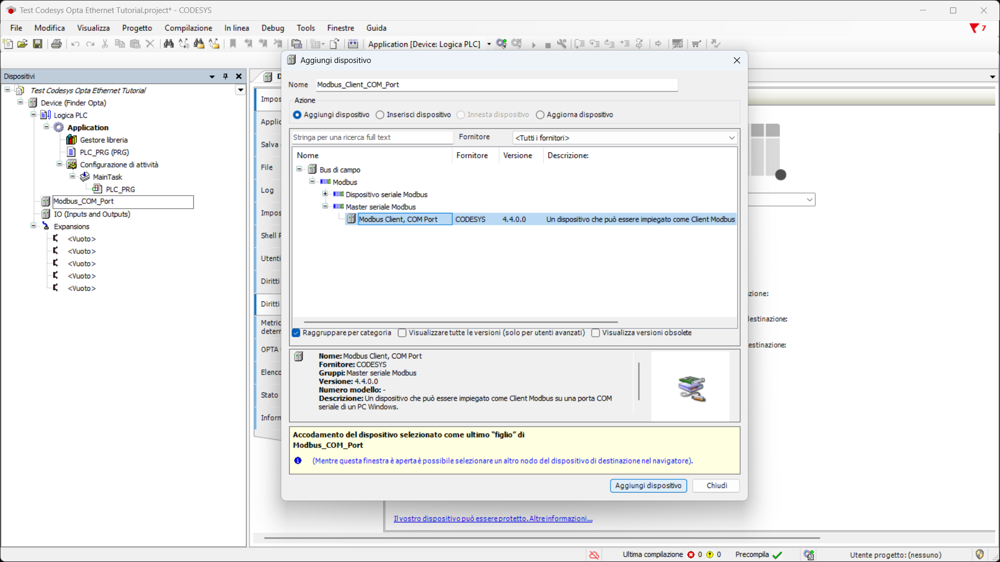

Poi premi il tasto destro sull'elemento appena aggiunto nel menu laterale `Modbus_Client_COM_Port(Modbus Client, COM Port)` e fai
`Aggiungi dispositivo`.

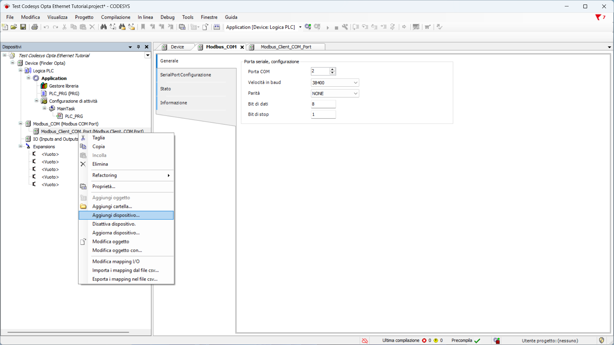

Seleziona `Server Modbus, porta COM`, poi `Aggiungi dispositivo`.

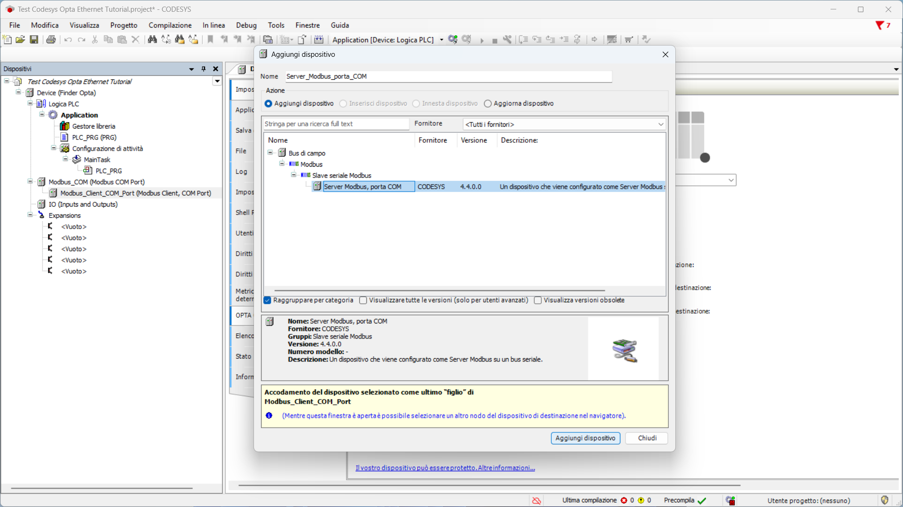

A questo punto clicca sull'elemento appena aggiunto nel menu laterale e assicurati che `Indirizzo del server` sia `1`.

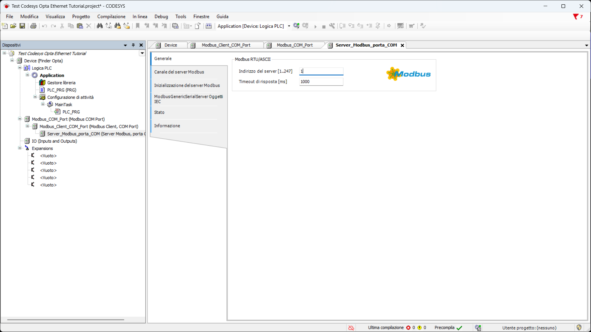

Nella stessa schermata clicca su `Canale del server Modbus` poi su `Aggiungi canale` in basso a destra. In questo tutorial leggiamo
il valore della frequenza del Finder serie 7M. Come definito nel [manuale tecnico del
dispositivo](https://cdn.findernet.com/app/uploads/2021/09/20090052/Modbus-7M24-7M38_v2_30062021.pdf), il valore di frequenza è
contenuto negli Input Register `32498` e `32499` in formato `float`. Pertanto, imposta i valori del canale come segue:

- Nome: `Frequenza`.
- Tipo di accesso: `Read Input Registers (Codice funzione 4)`.
- Trigger: `Ciclico`.
- Tempo di ciclo: `1000`, ovvero una lettura al secondo.
- Offset: `2498`.
- Lunghezza: `2`.
- Trattamento errore: `Mantieni ultimo valore`.

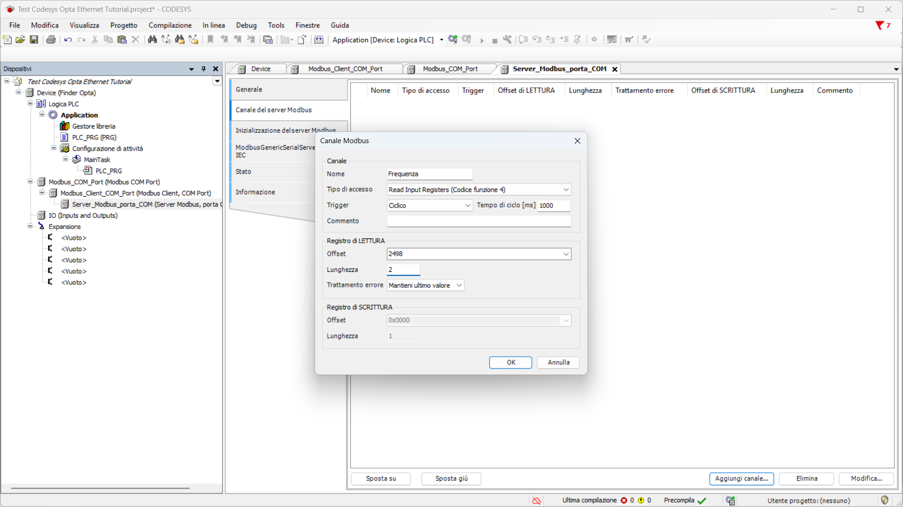

Dopo aver premuto `OK` vedrai il riepilogo del canale appena impostato.

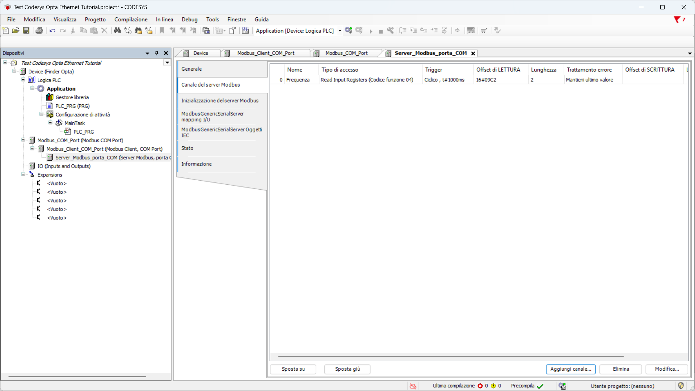

### Preparazione del programma ST

Adesso scriviamo il programma ST che legge il valore di frequenza.

Questo programma si occupa di invertire l’ordine dei byte letti dal Finder serie 7M per interpretarli correttamente come numeri in
virgola mobile (`float`). L’operazione è necessaria perché i dati del contatore sono memorizzati in formato Little Endian, mentre
per la corretta interpretazione come `float` è richiesto l’ordine Big Endian. Dopo l’inversione, il programma accede direttamente
all’indirizzo di memoria della variabile ricostruita e ne interpreta il contenuto come un valore `float`. Questo passaggio è
fondamentale per ottenere la misura reale memorizzata nel dispositivo, trasformandola in un formato leggibile e utilizzabile
dall’utente. In CODESYS il formato `float` è indicato come `REAL`.

Nel menu laterale, clicca su `PLC_PRG (PRG)`.

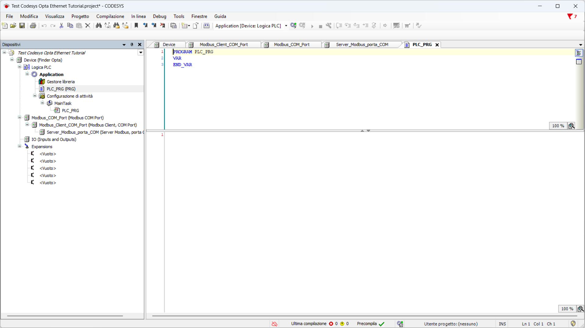

Nella parte superiore dell'editor inserisci il seguente codice:

```st
PROGRAM PLC_PRG
VAR
    words: ARRAY[0..1] OF WORD;
    frequency_w: ARRAY[0..1] OF WORD;
    ptr: POINTER TO REAL;
    frequency: REAL;
END_VAR
```

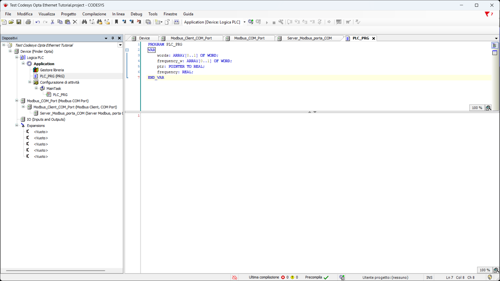

Nella parte inferiore dell'editor inserisci il seguente codice:

```st
// Flip endianness
frequency_w[0] := words[1];
frequency_w[1] := words[0];

// Interpret as float
ptr := ADR(frequency_w);
frequency := ptr^;
```

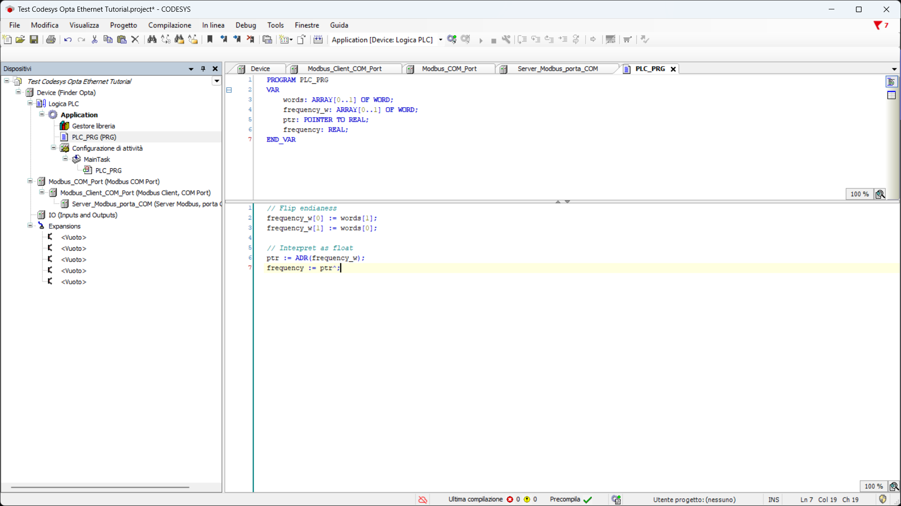

Adesso è necessario associare le variabili del programma al canale Modbus, in modo che le variabili contengano i valori letti dal canale.

Nel menu laterale clicca due volte su `Server_Modbus_porta_COM`. Adesso clicca sulla sezione `ModbusGenericSerialServer mapping I/O`
e nella tabella clicca due volte sulla cella `Variabile` per far comparire il pulsante opzioni.

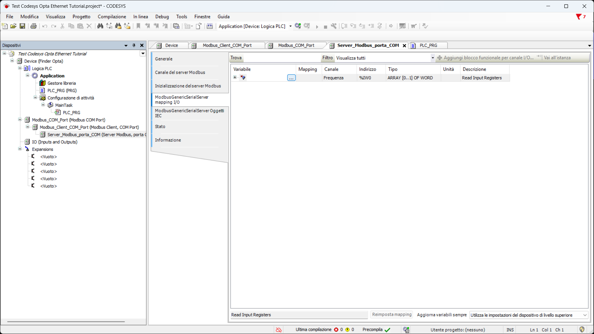

Clicca sul pulsante opzioni per far comparire la lista di variabili, espandi la voce `Application` e la voce `PLC_PRG`. A questo
punto clicca sulla variabile `words` e premi `OK` per assegnarla al canale `Frequenza`.

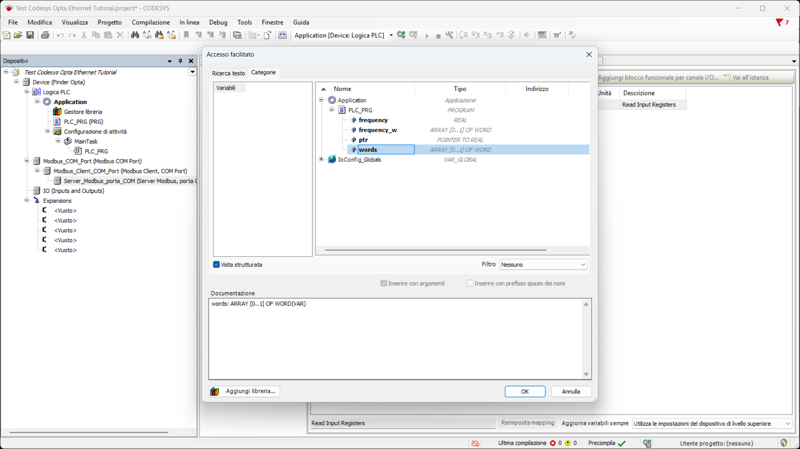

Il riepilogo mostra la variabile assegnata al canale `Frequenza`.

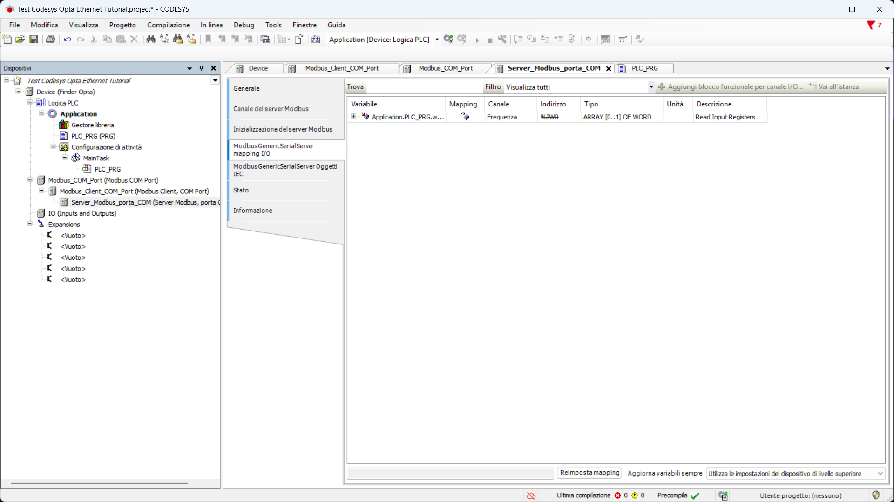

### Caricamento del programma su Finder OPTA

In questa fase, CODESYS scarica il programma e la configurazione sul dispositivo. Questo passaggio è fondamentale per aggiornare
correttamente la configurazione del dispositivo, soprattutto se il Finder OPTA contiene ancora una configurazione obsoleta.

Adesso è possibile caricare il programma e la configurazione sul dispositivo premendo il pulsante verde in alto etichettato come
`Login`.

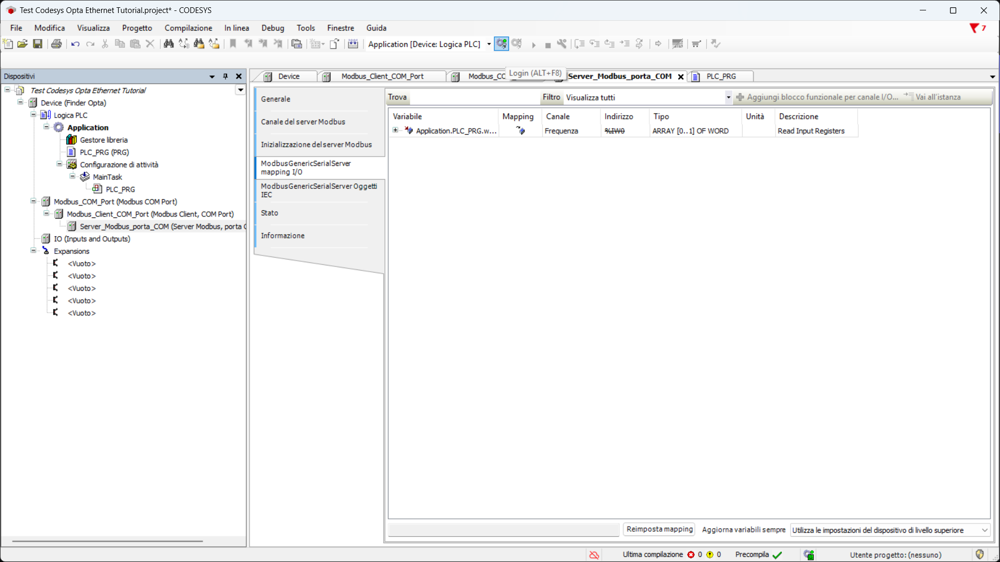

Il programma viene caricato su Finder OPTA, per farlo partire premi il pulsante `Start`.

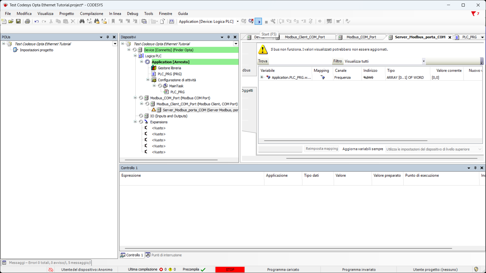

La tab `PLC_PRG` mostra in tempo reale il valore della frequenza contenuta nella variabile `frequency`, in questo caso `49.98 Hz`.

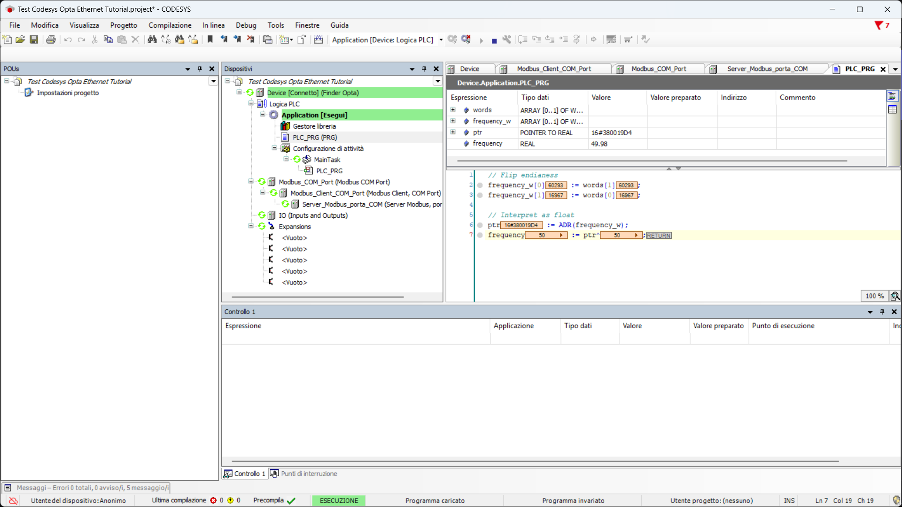

## Conclusioni

Seguendo questi passaggi, hai effettuato una lettura Modbus RTU dai registri di un Finder serie 7M utilizzando Finder OPTA in
CODESYS.

Se riscontri problemi, verifica di aver cablato correttamente i dispositivi e di aver configurato i parametri Modbus come
specificato nel tutorial.

<!-- Inserire informazioni di contatto per supporto -->