# Reading a Finder 7M series via Modbus RTU with Finder OPTA in CODESYS

## Overview

Finder OPTA is equipped with an RS-485 port that enables communication with devices compatible with the Modbus RTU protocol, such as the Finder 7M series. In this tutorial, we will show step by step how to configure Finder OPTA in CODESYS to correctly read data from a Finder 7M series energy meter.

## Goals

- Configure Finder OPTA via Ethernet to read registers from a Finder 7M series device in CODESYS.
- Read registers from a Finder 7M series device via Modbus RTU CODESYS.

## Requirements

Before starting, make sure you have:

- [Finder OPTA CODESYS PLC](https://opta.findernet.com/en/codesys) (x1)
- [12W or 25W switching power supply for OPTA](https://opta.findernet.com/en/codesys#moduli-espansione) (1x)
- Finder 7M series with Modbus RTU (x1)  
  - [7M.24.8230.0210](https://www.findernet.com/en/worldwide/series/serie-7m-contatori-di-energia/type/tipo-7m-24-contatore-di-energia-monofase-bidirezionale-con-display-lcd/)  
  - [7M.38.8400.0212](https://www.findernet.com/en/worldwide/series/serie-7m-contatori-di-energia/type/tipo-7m-38-contatori-di-energia-multifunzione-bidirezionale-80-a/)  
- Ethernet cable (x1)
- Wire with either specification for RS-485 connection (x2):
  - STP/UTP 24-18AWG (Unterminated) 100-130Ω rated
  - STP/UTP 22-16AWG (Terminated) 100-130Ω rated
- CODESYS development environment installed with the OPTA Configurator plug-in.  
  You can find an installation guide [at this link](https://opta.findernet.com/en/tutorial/codesys-plugin-tutorial).  
- Properly configured network: your PC must be able to communicate with Finder OPTA via Ethernet.  
  Configuration guide available [here](https://opta.findernet.com/en/tutorial/codesys-via-ethernet).

To follow this tutorial, you will need to connect the Finder 7M energy meter to the electrical grid and provide an appropriate load.
You will also need to power the Finder OPTA using the power supply and properly configure the RS-485 serial connection. The diagram
below shows the correct wiring between Finder OPTA and the Finder 7M series.

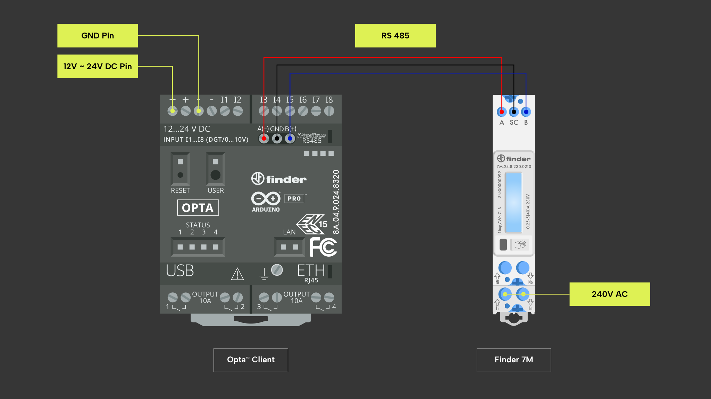

## Instructions

In this tutorial, the configuration parameters used for Modbus communication with the Finder 7M series are:

- Modbus Address: `1`.
- Baudrate: `38400`.
- Stop bit: `1`.
- Parity: `NO`.

You can set these values via NFC using the [Finder Toolbox NFC
application](https://www.findernet.com/en/worldwide/supporto/software-e-app/).

### Creating the CODESYS Project

Open CODESYS.


Create a new project and choose `Standard Project`.


Ensure the device is `Finder Opta`, then select the programming language (we’ll use ST).


### Identifying Finder OPTA via Ethernet

Now double-click on the `Device (Finder Opta)` entry in the `Devices` menu. A tab will open as shown below.


Click the `Scan Network` button and ensure the Finder OPTA device appears under the Gateway.


### Modbus Configuration

At this stage, we configure the RS-485 port and Modbus protocol parameters to
ensure Finder OPTA can communicate with the Finder 7M series.

Right-click on `Device (Finder Opta)` and select `Add device...`.

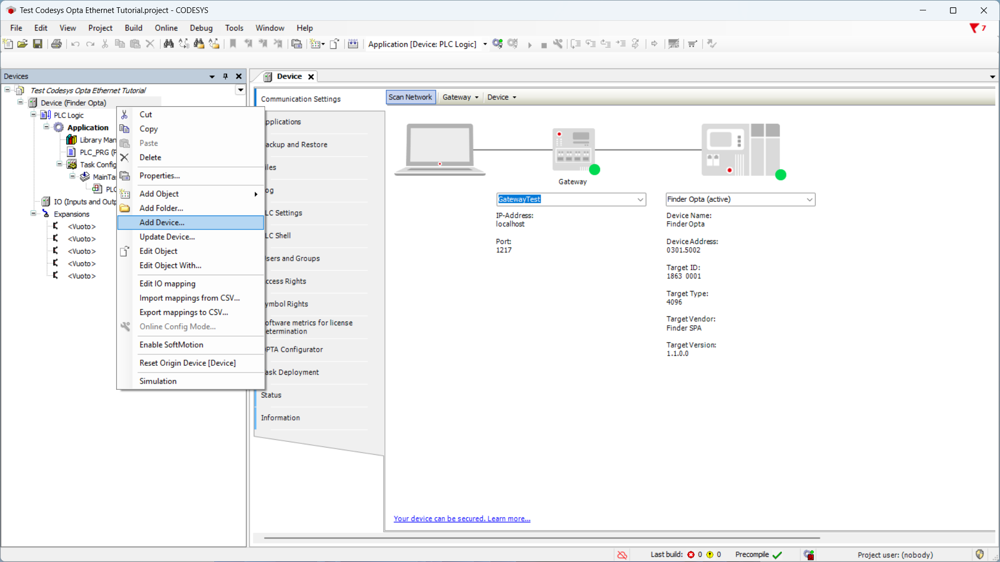

Now configure the Modbus RTU protocol on the RS-485 port of Finder OPTA. From
the list select `Modbus COM Port` and click `Add device`.

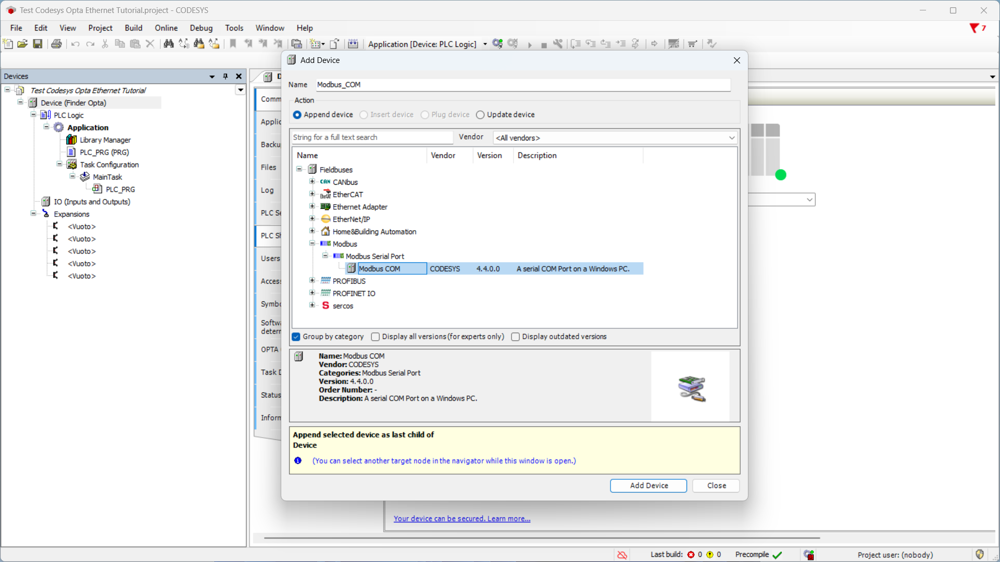

Now set the serial port values:

- COM Port: `2`, which is the RS-485 port of Finder OPTA.
- Baudrate: `38400`.
- Parity: `NONE`.
- Data bits: `8`.
- Stop bits: `1`.

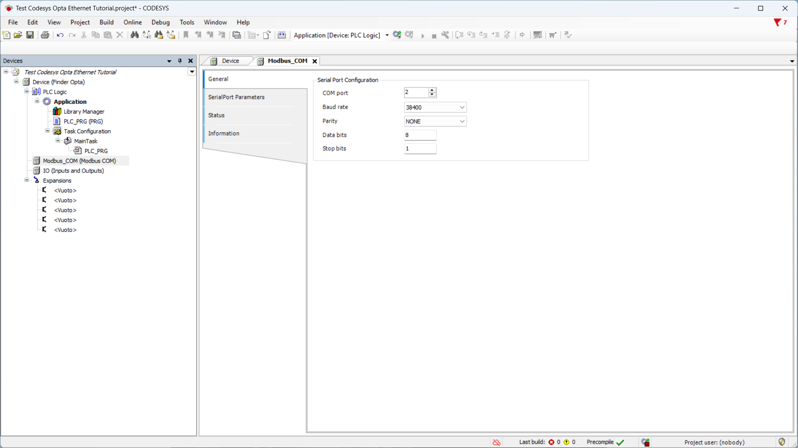

After setting the serial port, right-click on `Modbus_COM_Port(Modbus COM Port)` and then on `Add Device`.

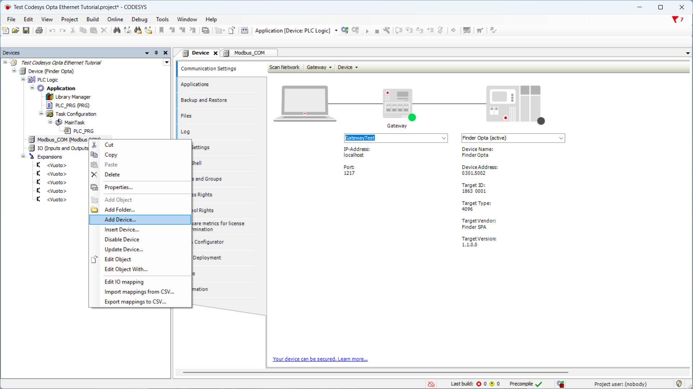

From the list select `Modbus Client, COM Port` and click `Add device`. In this
way you add a Modbus client communicating on the previously configured serial
port, i.e. the Finder 7M series.

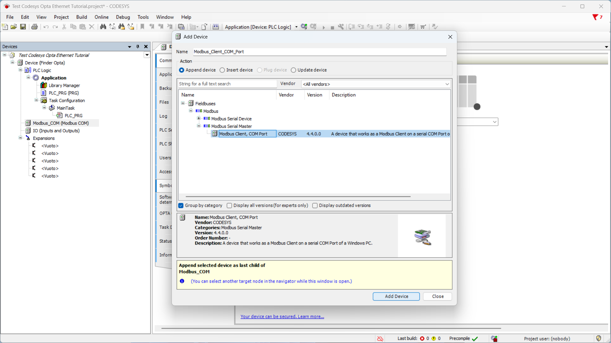

Then right-click on the newly added entry in the side menu `Modbus_Client_COM_Port(Modbus Client, COM Port)` and click `Add Device`.


Select `Modbus Server, COM port`, then `Add device` to specify that the Finder
7M serie will act as server, while the Finder OPTA will act as client.

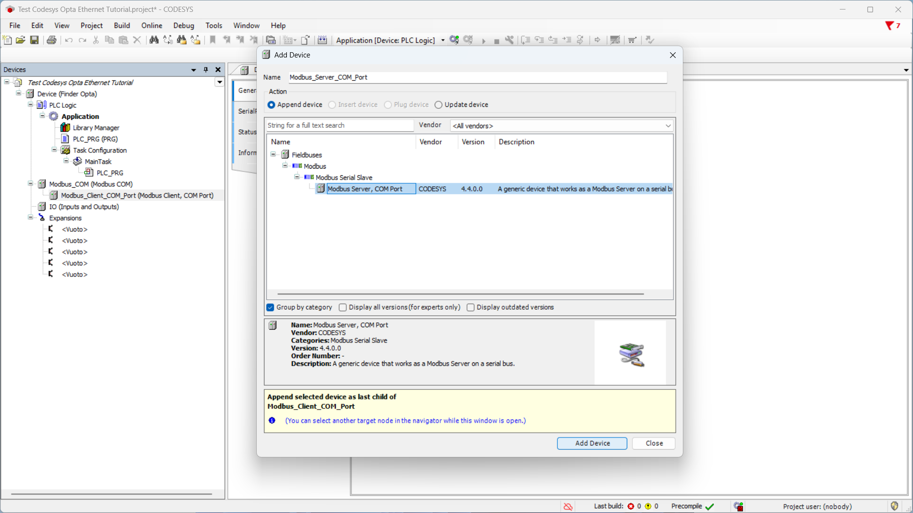

Click the newly added item in the side menu and ensure the `Server Address` is
`1`, the Modbus address of the Finder 7M series.

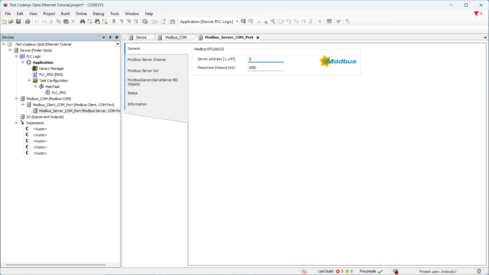

Finally, we configure a Modbus server channel, meaning we set the parameters
that will be used by the program to read from the Finder 7M series. On the same
screen, click `Modbus Server Channel` and then `Add Channel` at the bottom
right.  
In this tutorial, we’ll read the frequency value from the Finder 7M. As defined in the [device technical
manual](https://cdn.findernet.com/app/uploads/2021/09/20090052/Modbus-7M24-7M38_v2_30062021.pdf), the frequency value is in Input
Registers `32498` and `32499` in `float` format. Set the channel values as follows:

- Name: `Frequency`.
- Access Type: `Read Input Registers (Function Code 4)`.
- Trigger: `Cyclic`.
- Cycle Time: `1000` (one read per second).
- Offset: `2498`.
- Length: `2`.
- Error Handling: `Keep last value`.

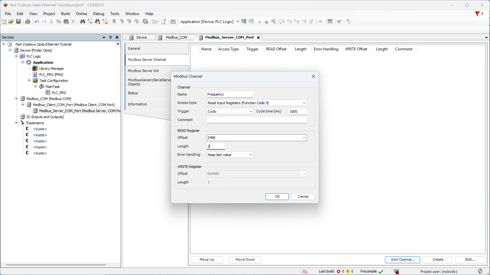

After clicking `OK`, you will see the channel summary.

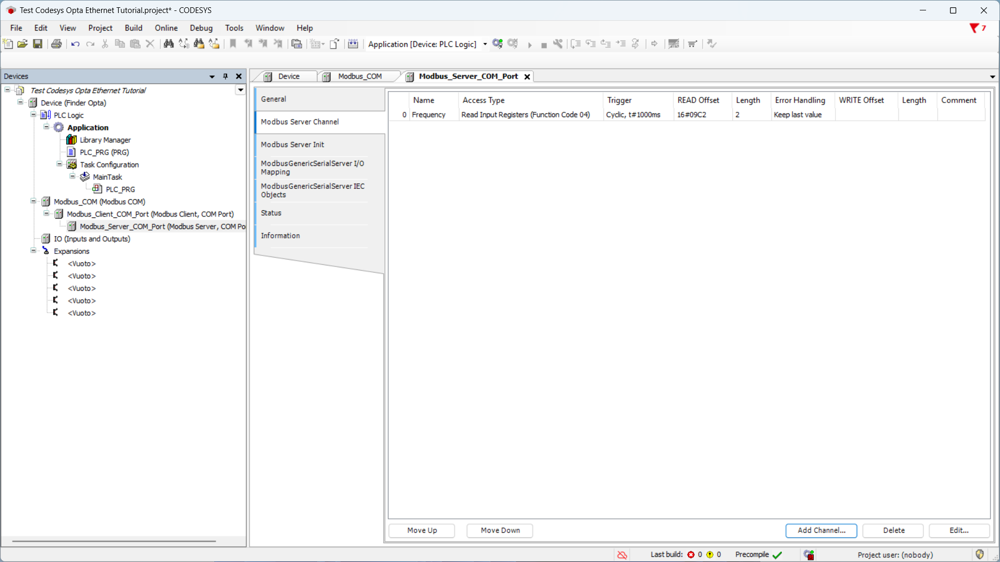

### Preparing the ST Program

Now write the ST program that reads the frequency value.  

This program handles the byte order inversion of data read from the Finder 7M series, allowing it to be correctly interpreted as
floating-point numbers (`float`). This operation is necessary because the counter data is stored in Little Endian format, whereas
correct interpretation as a `float` requires Big Endian ordering. After the inversion, the program directly accesses the memory
address of the reconstructed variable and interprets its contents as a `float` value. This step is essential to retrieve the actual
measurement stored in the device and convert it into a readable and usable format for the user. In CODESYS, the `float` data type is
referred to as `REAL`.

In the side menu, click on `PLC_PRG (PRG)`.

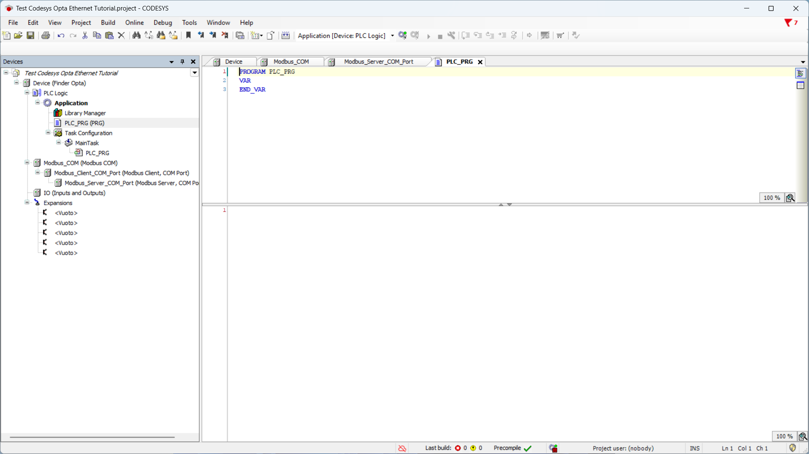

At the top of the editor - section dedicated to variables declaration - insert
the following code:

```st
PROGRAM PLC_PRG
VAR
    words: ARRAY[0..1] OF WORD;
    frequency_w: ARRAY[0..1] OF WORD;
    ptr: POINTER TO REAL;
    frequency: REAL;
END_VAR
```

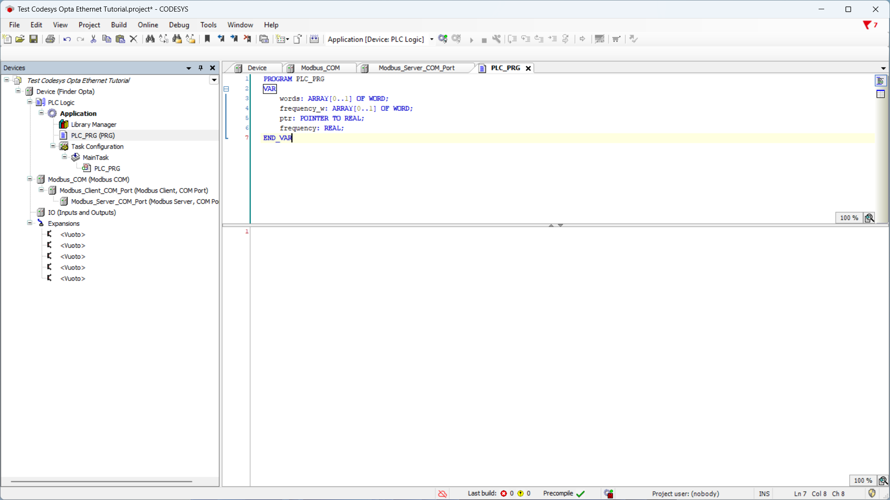

At the bottom of the editor - section dedicated to program logic - insert the
following code:

```st
// Flip endianness
frequency_w[0] := words[1];
frequency_w[1] := words[0];

// Interpret as float
ptr := ADR(frequency_w);
frequency := ptr^;
```

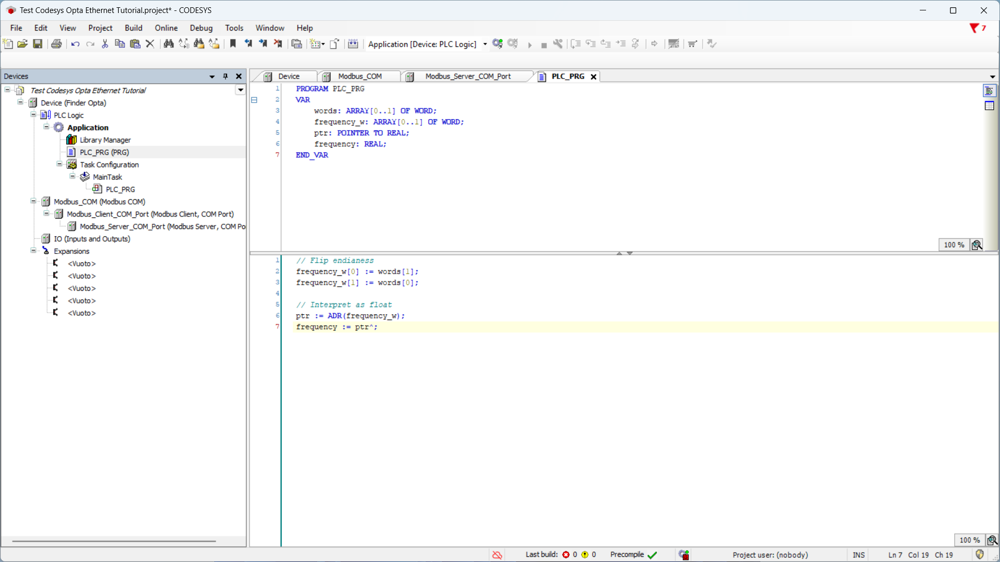

Now it is necessary to link the program variables to the Modbus channel, so that the variables contain the values read from the channel.

In the side menu, double-click on `Server_Modbus_porta_COM`. Now click on the  
`ModbusGenericSerialServer mapping I/O` section, and in the table double-click on the `Variable`  
cell to bring up the options button.

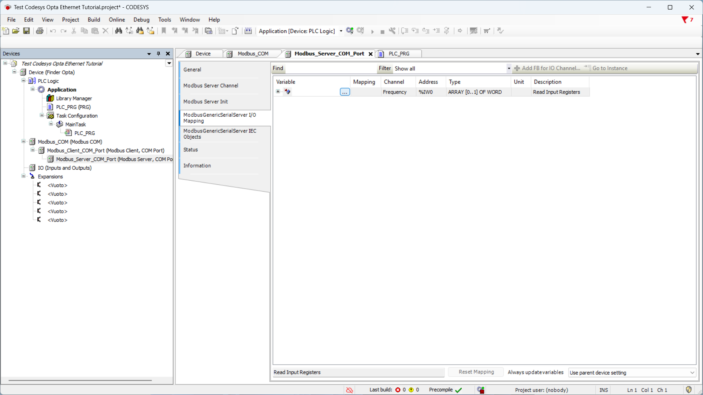

Click the options button to display the list of variables, expand `Application`
and then `PLC_PRG` to access the variables previously defined in the ST
program. Now click on the `words` variable and press `OK` to assign it to the
`Frequency` channel.

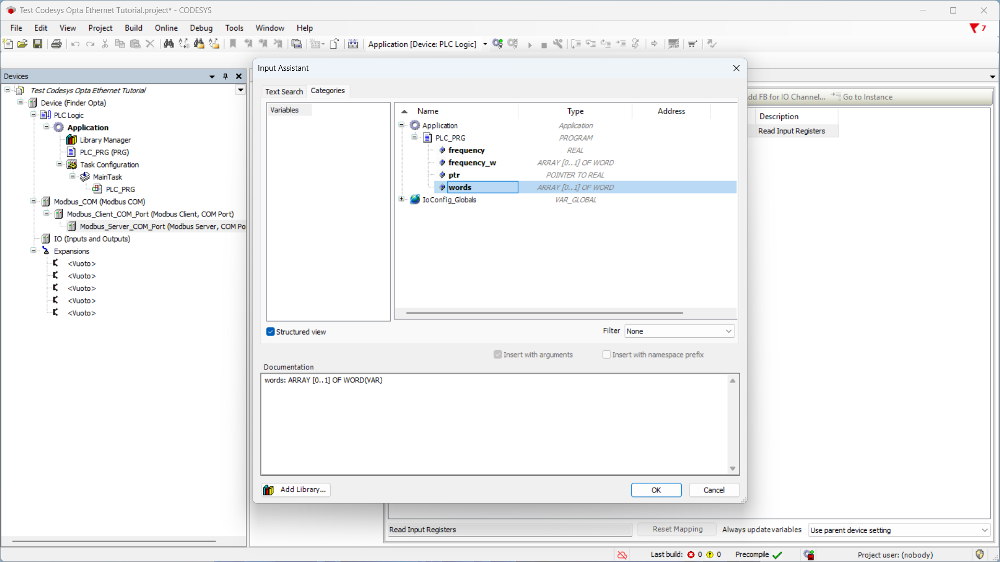

The summary shows the variable assigned to the `Frequency` channel. From now
on, the variable `words` contains the bytes read from the registers of the
Finder 7M series, representing the frequency value measured by the device. It's
our ST program that transforms these bytes in `float`.

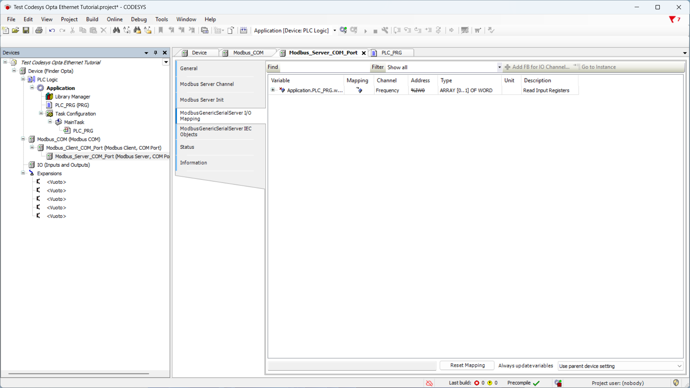

### Uploading the Program to Finder OPTA

At this stage, we download the program and the hardware configuration to Finder
OPTA, so that it executes the code we just wrote, returning the frequency value
read by the Finder 7M series.

Download the program and configuration to the device by pressing the green
button at the top labeled `Login`.

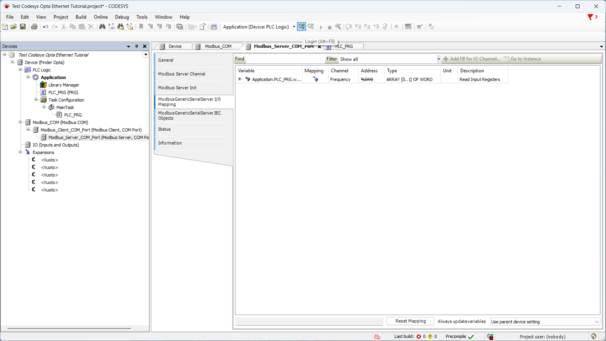

Once the download is over, the program will be downloaded on Finder OPTA.
Execute it by pressing the `Start` button.

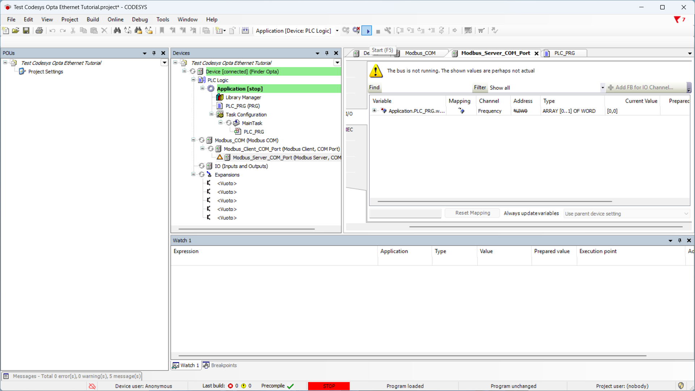

The `PLC_PRG` tab now displays the real-time frequency value stored  
in the `frequency` variable — in this case, `50.01 Hz`.

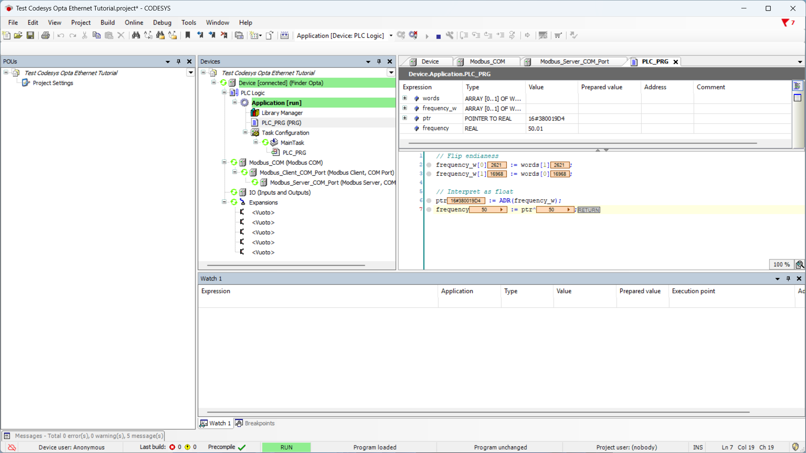

## Conclusion

By following these steps, you have successfully performed a Modbus RTU read  
from the registers of a Finder 7M series device using Finder OPTA in CODESYS.

If you encounter any issues, make sure the devices are properly wired  
and that the Modbus parameters are configured as specified in the tutorial.

<!-- Add contact info for support -->