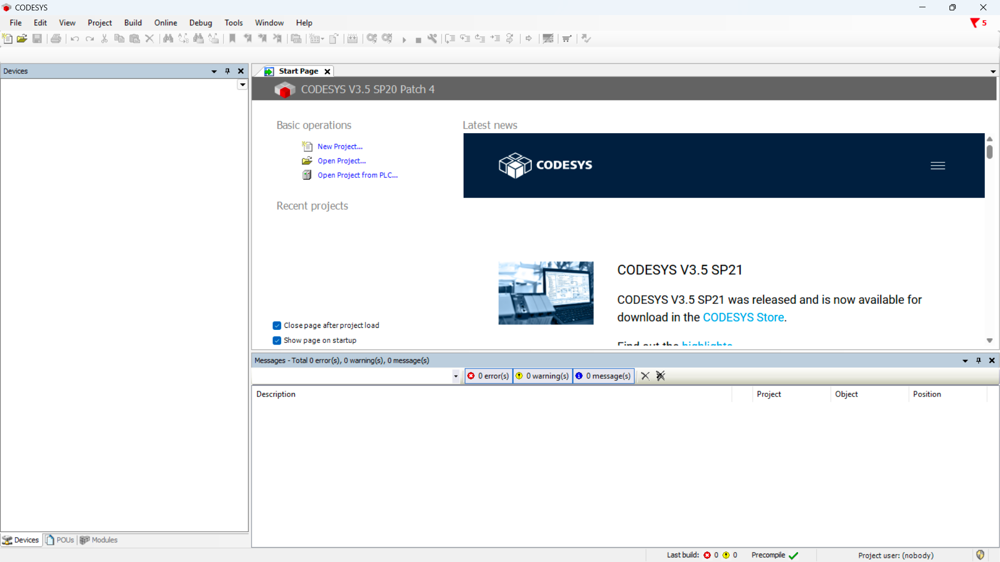
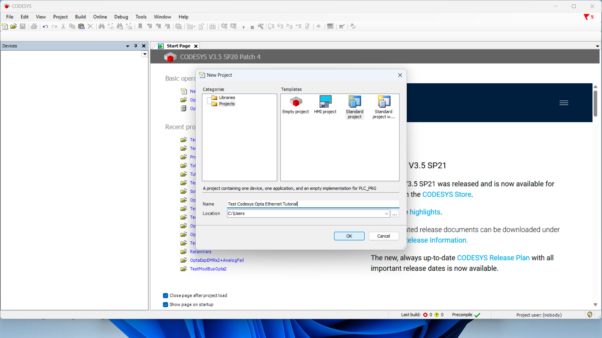
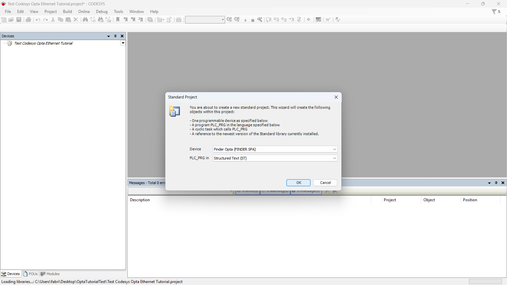
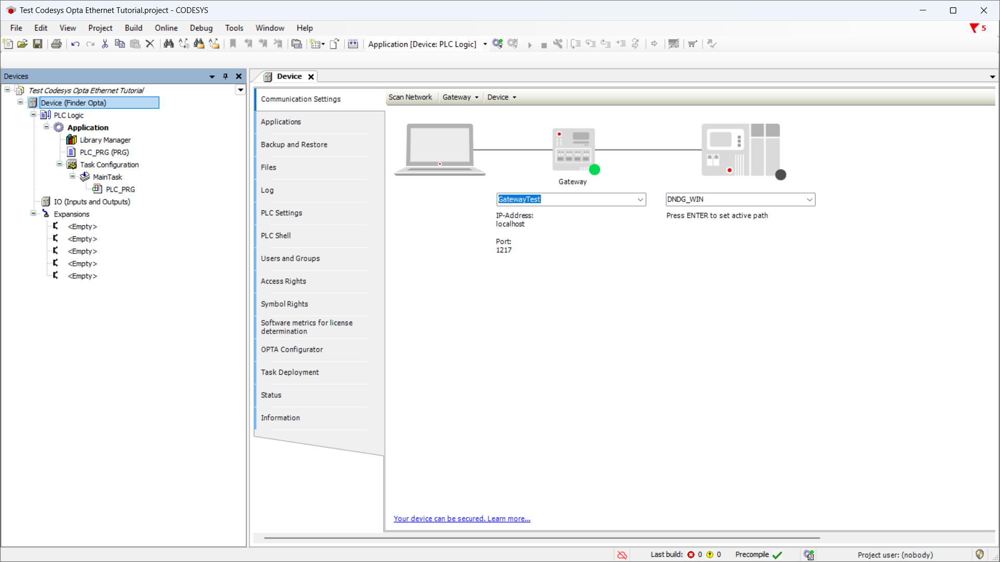
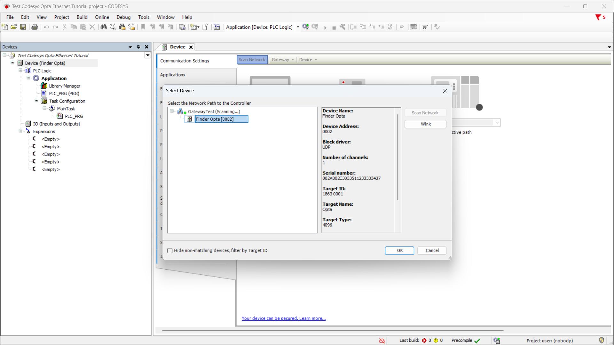

# Reading a Finder 7M Modbus series using Finder OPTA in CODESYS

## Overview

CODESYS is one of the leading development environments for PLCs and 
allows you to program Finder OPTA using standard languages such as LD and ST.

This tutorial will guide you through reading a Finder 7M series 
using a Finder OPTA in just a few simple steps.

## Objectives

- Configure Finder OPTA via Ethernet to read the registers of a Finder 7M series device  
- Read the registers of a Finder 7M series device via Modbus RTU

## Requirements

Before starting, make sure you have:

- [Finder OPTA CODESYS PLC](https://opta.findernet.com/en/codesys) (x1)  
- [12W or 25W switching power supply for OPTA](https://opta.findernet.com/en/codesys#expansion-modules) (x1)  
- [Finder 7M series](https://www.findernet.com/en/worldwide/series/7m-series-smart-energy-meters/) **Modbus** connected to the Finder OPTA (x1)  
- Ethernet cable (x1)  
- CODESYS development environment installed with the OPTA Configurator plug-in. You can find an installation guide [at this link](https://opta.findernet.com/en/tutorial/codesys-plugin-tutorial)  
- Properly configured network: the PC must be able to communicate with Finder OPTA via Ethernet. You can find a configuration guide [at this link](https://opta.findernet.com/en/tutorial/codesys-via-ethernet) 

## Instructions

### Creating a CODESYS Project

Open CODESYS:

Create a new project and choose **Standard Project**:

Ensure the device is **Finder OPTA**, then select your programming language:

### Detecting Finder OPTA over Ethernet

Now double-click **Device (Finder OPTA)** in the **Devices** tree; a pane like this will open:

Click **Scan Network** and confirm you see the Finder OPTA device appear under the Gateway:

## Conclusions

By following these steps, you have successfully programmed Finder OPTA in CODESYS via Ethernet and verified that the device is correctly connected to the network.

If you encounter any issues during setup, make sure you followed each step carefully.

<!-- Include contact information for support -->
