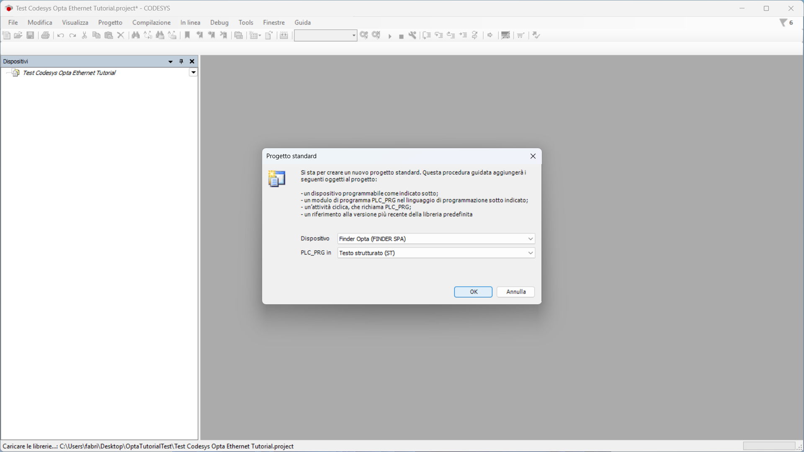

# Programmare Finder OPTA tramite connessione Ethernet in CODESYS

## Panoramica

Questo tutorial fornisce una guida per programmare Finder OPTA tramite Ethernet utilizzando CODESYS.

## Obbiettivi

- Configurare la rete Ethernet in modo da comunicare con Finder OPTA
- Caricare un programma su Finder OPTA tramite Ethernet

## Requisiti

Prima di iniziare, assicurati di avere:

- [PLC Finder OPTA CODESYS](https://opta.findernet.com/it/codesys) (x1)
- [Alimentatore switching 12W o 25W per OPTA](https://opta.findernet.com/it/codesys#moduli-espansione)(1x)
- Cavo Ethernet (x1)
- Ambiente di sviluppo CODESYS installato con plug-in OPTA Configurator. Trovi una guida all'installazione [a questo
  link](https://opta.findernet.com/it/tutorial/codesys-plugin-tutorial)

## Istruzioni

Il Finder OPTA è configurato di default con l’indirizzo IP **10.0.0.2** e la subnet mask **255.255.255.0**. Di conseguenza, è
necessario assegnare al PC un indirizzo appartenente alla stessa rete.

Nel corso del tutorial viene utilizzato l’indirizzo **10.0.0.1** con maschera **255.255.255.0**, ma si tratta soltanto di un
esempio: è possibile scegliere qualsiasi indirizzo all’interno dell’intervallo definito dalla subnet.

### Impostazione dell'indirizzo IP del PC

Per modificare l'indirizzo IP del tuo PC Windows è necessario aprire le impostazioni e andare su `Rete e internet`:


Selezionare la voce `Ethernet`:


Adesso premi `Modifica`:


Sostituire l'indirizzo presente con `10.0.0.1`:


Salva ed esci dalla schermata di modifica.

### Caricare un programma su Finder OPTA tramite Ethernet

Alimenta il Finder OPTA con l'alimentatore switching, poi collegalo al PC con l'IP appena configurato.

#### Creazione progetto CODESYS

Apri CODESYS:


Crea un nuovo progetto e scegli `Progetto standard`:


Assicurati che il dispositivo sia `Finder Opta`, poi seleziona il linguaggio del programma (in seguito usiamo ST):



#### Identificazione Finder OPTA via Ethernet

A questo punto fai doppio click sulla voce `Device (Finder Opta)` del menu `Devices`, si aprirà una scheda come mostrato qui sotto:


Premi il bottone `Sfoglia la rete` e assicurati di vedere il dispositivo Finder OPTA comparire sotto il Gateway, poi premi `OK`.


#### Setup del programma ST

Se hai già a disposizione un programma ST da caricare sull'OPTA puoi saltare i passaggi successivi e andare direttamente [alla
sezione successiva.](#caricamento-del-programma-su-finder-opta)

A questo punto fai doppio click sul nome del programma nel menu `Devices`, nell'immagine seguente il nome è `PLC_PRG (PRG)`:


Di seguito è possibile copiare il codice ST visto nell'immagine precedente:

```st
PROGRAM PLC_PRG
VAR
    led1, led2, led3, led4: BOOL := FALSE;
    timer: TON;
    state: INT := 0;
END_VAR

led1 := FALSE;
led2 := FALSE;
led3 := FALSE;
led4 := FALSE;

CASE state OF
    0: 
        led1 := TRUE;
    1: 
        led2 := TRUE;
    2: 
        led3 := TRUE;
    3: 
        led4 := TRUE;
END_CASE

timer(IN := TRUE, PT := T#1S);
IF timer.Q THEN
    timer(IN := FALSE);
    state := (state + 1) MOD 4;
    timer(IN := TRUE);
END_IF
```

Adesso fai doppio click sulla voce `IO` del menu `Devices`, seleziona `Opta I/O Mapping`:


Facendo doppio click sulla cella della variabile compare il pulsante opzioni, selezionalo. In seguito espandi la voce `Application`
e dopo espandi il nome del programma, così facendo compaiono le variabili dei LED.


Associa ogni LED alla variabile corrispondente fino ad arrivare ad una situazione come la seguente:


#### Caricamento del programma su Finder OPTA

In questa fase, CODESYS scarica il programma e la configurazione sul dispositivo. Questo passaggio è fondamentale per aggiornare
correttamente la configurazione del dispositivo, soprattutto se il Finder OPTA contiene ancora una configurazione obsoleta.

Adesso è possibile caricare il programma e la configurazione sul dispositivo premendo il pulsante verde in alto etichettato come
`Login`:


Il programma verrà caricato su Finder OPTA, per farlo partire premere il pulsante `Start` come in figura:


A questo punto il programma partirà e i quattro LED dell'OPTA inizieranno ad accendersi ciclicamente, per fermarlo premere `Stop`:


Infine è possibile scollegarsi dall'OPTA premendo `Logout`:


## Conclusioni

Seguendo questi passaggi, hai programmato con successo Finder OPTA in CODESYS tramite Ethernet e verificato che il dispositivo sia
connesso correttamente alla rete.

Se riscontri problemi durante la configurazione, verifica di aver seguito correttamente tutti i passaggi.

<!-- Inserire informazioni di contatto per supporto -->