# Programming Finder OPTA via Ethernet in CODESYS

## Overview

CODESYS is one of the leading development environments for PLCs and allows you to program Finder OPTA using standard languages such as LD and ST.

This tutorial will guide you through programming Finder OPTA in just a few simple steps.

## Goals

- Configure the Ethernet network to communicate with Finder OPTA  
- Upload a program to Finder OPTA via Ethernet

## Requirements

Before you begin, make sure you have:

- [Finder OPTA PLC CODESYS](https://opta.findernet.com/en/codesys) (×1)  
- [12 W or 25 W switching power supply for OPTA](https://opta.findernet.com/en/codesys#moduli-espansione) (×1)   
- Ethernet cable (×1)  
- CODESYS development environment installed with the OPTA Configurator plug-in. See the installation guide [here](https://opta.findernet.com/en/tutorial/codesys-plugin-tutorial)

## Instructions
The Finder OPTA is preset with the IP address **10.0.0.2** and the subnet mask **255.255.255.0**.
 Therefore, your PC must be assigned an address on the same network.
In the tutorial, the address **10.0.0.1** with mask **255.255.255.0** is used, but this is just 
an example: you can choose any address within the range defined by the subnet.


### Setting the PC’s IP Address

To change your Windows PC’s IP address, open **Settings** and go to **Network & Internet**:

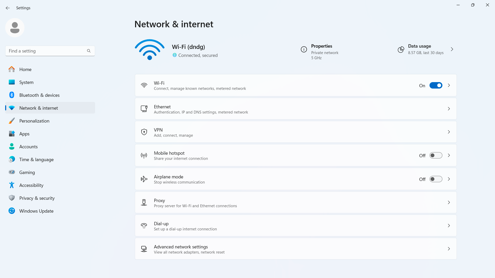

Select **Ethernet**:

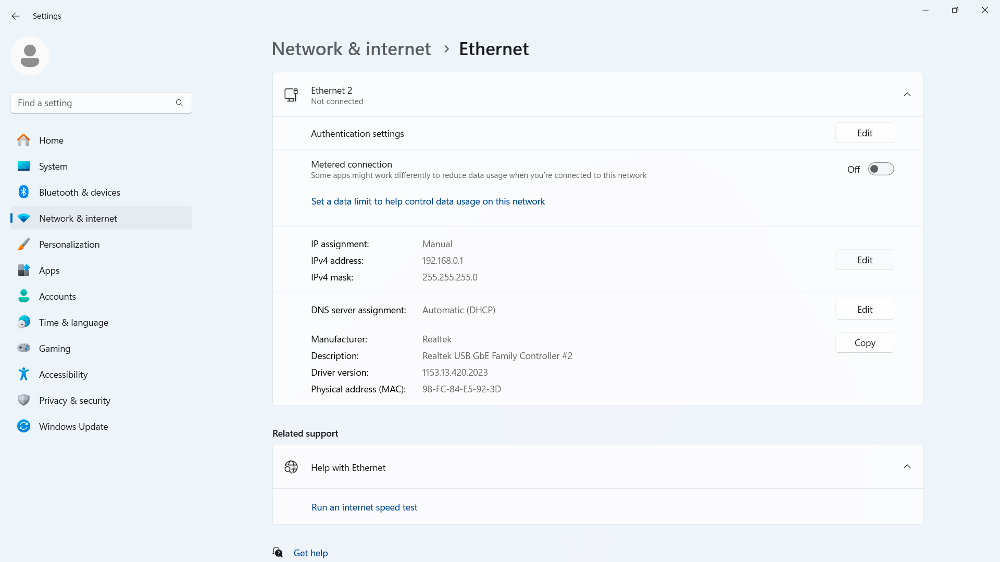

Click **Edit**:


Replace the existing address with **10.0.0.1**:

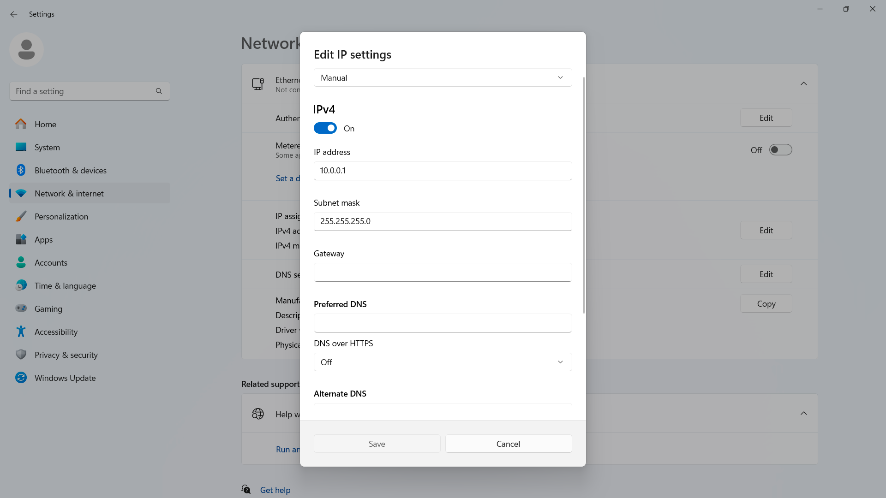

Save and exit the edit screen.

### Uploading a Program to Finder OPTA via Ethernet

Power the Finder OPTA with the switching power supply, then connect it to your PC using the newly configured IP.

#### Creating a CODESYS Project

Open CODESYS:


Create a new project and choose **Standard Project**:

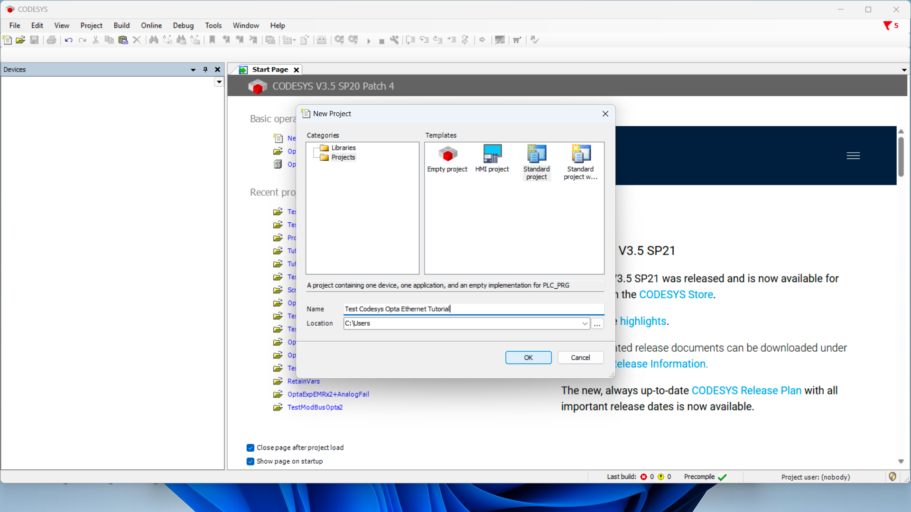

Ensure the device is **Finder OPTA**, then select your programming language:

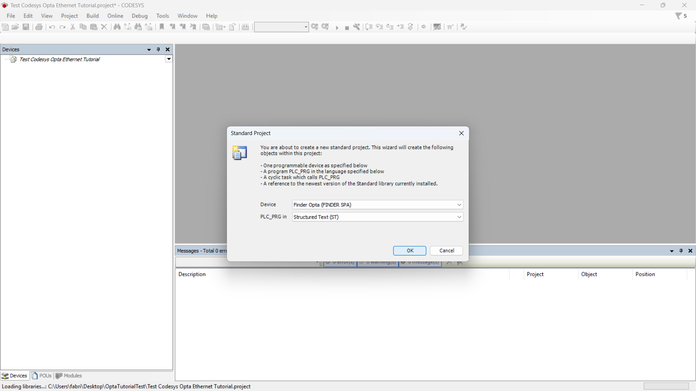

#### Detecting Finder OPTA over Ethernet

Now double-click **Device (Finder OPTA)** in the **Devices** tree; a pane like this will open:


Click **Scan Network** and confirm you see the Finder OPTA device appear under the Gateway:

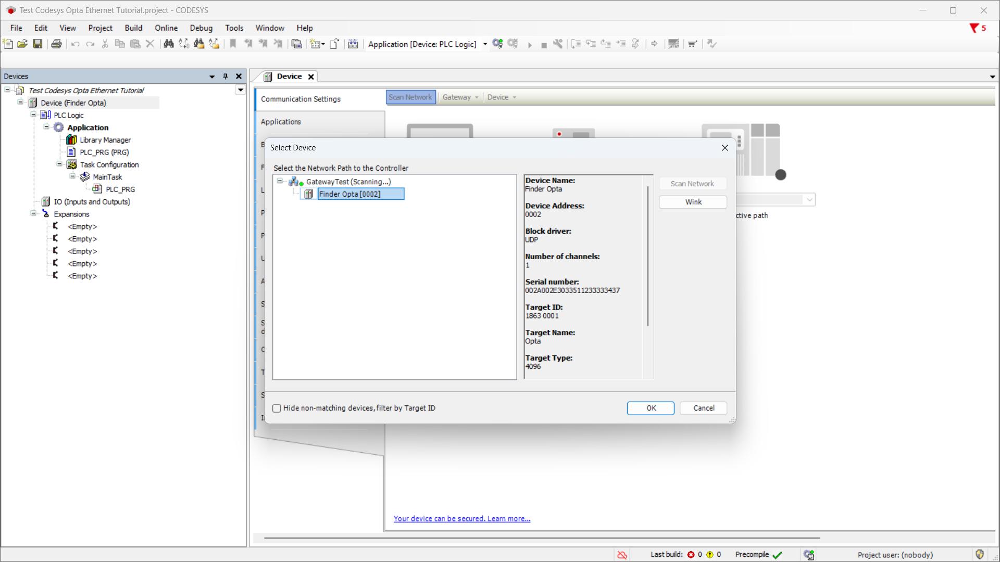

#### ST Program Setup

> If you already have an ST program to upload to OPTA, skip the next steps and 
go directly to [Uploading the Program to Finder OPTA](#uploading-the-program-to-finder-opta).

Double-click the program name under **Devices** (here it’s **PLC_PRG (PRG)**):

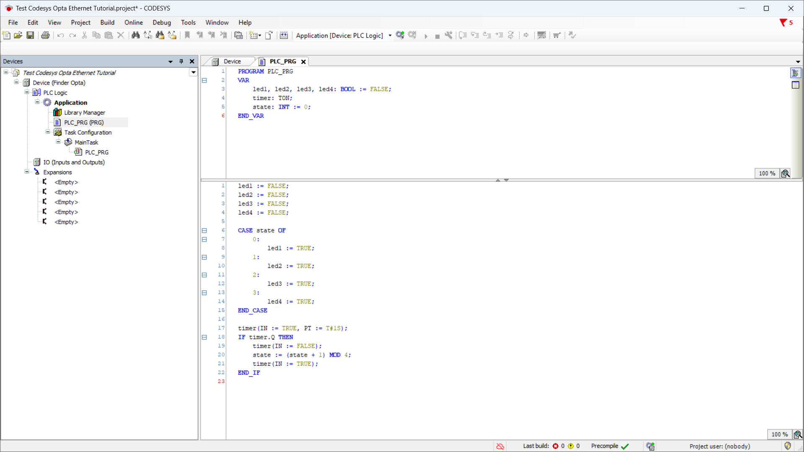

Copy the following ST code:

```st
PROGRAM PLC_PRG
VAR
    led1, led2, led3, led4: BOOL := FALSE;
    timer: TON;
    state: INT := 0;
END_VAR

led1 := FALSE;
led2 := FALSE;
led3 := FALSE;
led4 := FALSE;

CASE state OF
    0: 
        led1 := TRUE;
    1: 
        led2 := TRUE;
    2: 
        led3 := TRUE;
    3: 
        led4 := TRUE;
END_CASE

timer(IN := TRUE, PT := T#1S);
IF timer.Q THEN
    timer(IN := FALSE);
    state := (state + 1) MOD 4;
    timer(IN := TRUE);
END_IF
```

Next, double-click **I/O** under **Devices**, then select **Opta I/O Mapping**:

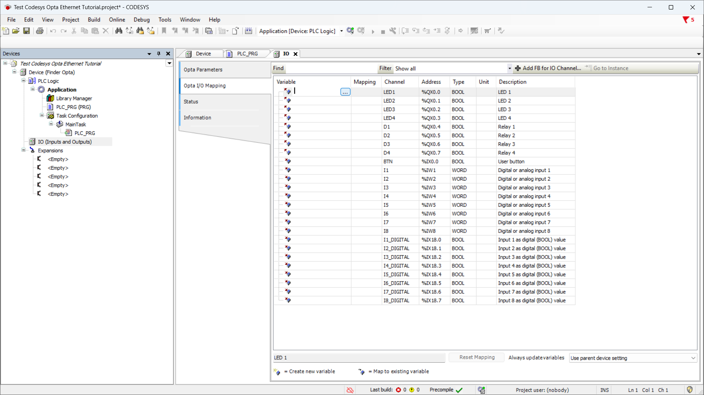

Double-click a variable cell to show the options button, click it, expand **Application**, then expand your program name to reveal the LED variables:

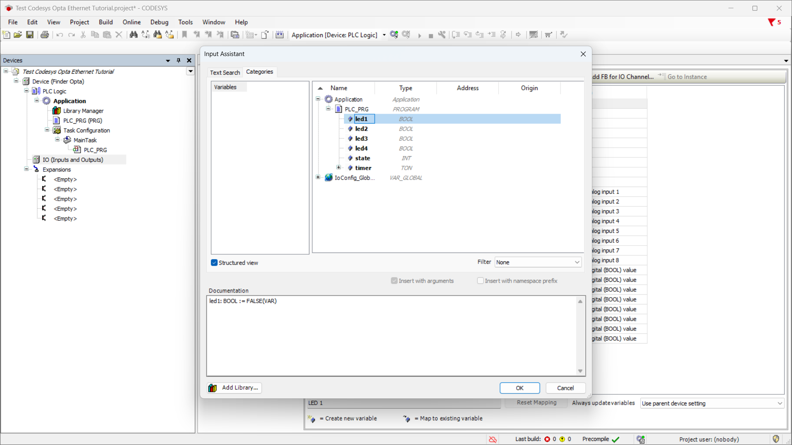

Map each LED to its corresponding variable until it looks like this:

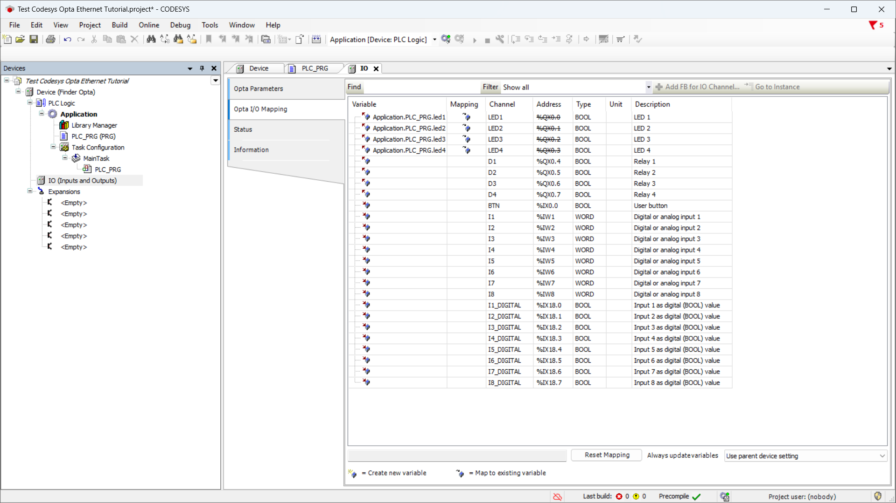

#### Uploading the Program to Finder OPTA

Now upload the program by clicking the green **Login** button at the top:

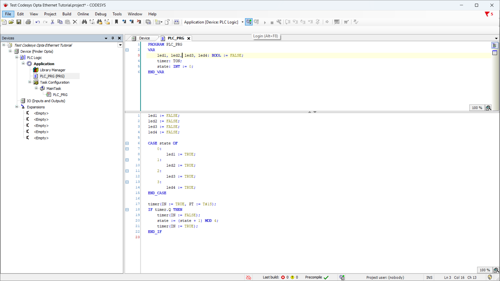

After it loads, press **Start** to run the program:

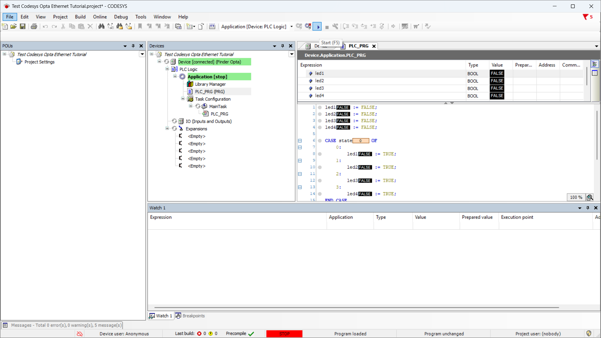

The program will start, and the four LEDs on OPTA will begin cycling on and off. To stop it, click **Stop**:

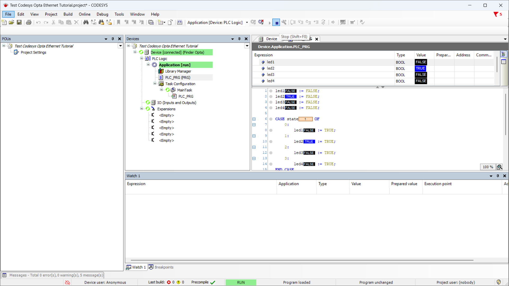

Finally, disconnect by clicking **Logout**:

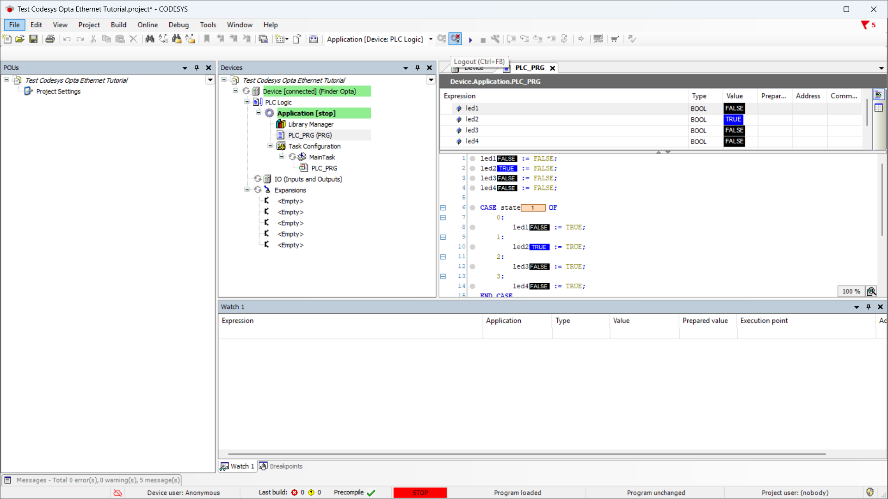

## Conclusions

By following these steps, you have successfully programmed Finder OPTA in CODESYS via Ethernet and verified that the device is correctly connected to the network.

If you encounter any issues during setup, make sure you followed each step carefully.

<!-- Include contact information for support -->
