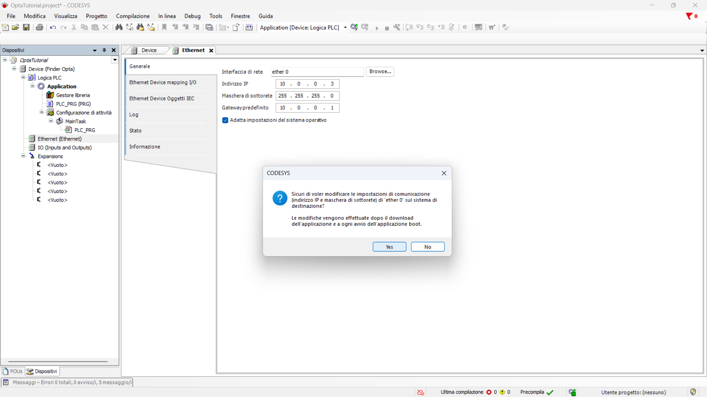

# Cambiare indirizzo IP di Finder OPTA in CODESYS

## Panoramica

Questo tutorial fornisce una guida per modificare l'indirizzo IP di Finder OPTA in CODESYS.

## Obiettivi

- Verificare che Finder OPTA sia raggiungibile ad uno specifico indirizzo IP.
- Configurare l'indirizzo IP di Finder OPTA in CODESYS.

## Requisiti

Prima di iniziare, assicurati di avere:

- [PLC Finder OPTA CODESYS](https://opta.findernet.com/it/codesys) (x1)
- Cavo USB-C (x1)
- Cavo Ethernet (x1)
- Ambiente di sviluppo CODESYS installato con plug-in OPTA Configurator. Trovi una guida all'installazione [a questo
  link](https://opta.findernet.com/it/tutorial/codesys-plugin-tutorial).
- Rete configurata correttamente: il PC deve comunicare correttamente con Finder OPTA tramite Ethernet. Trovi una guida alla
  configurazione [a questo link](https://opta.findernet.com/it/tutorial/codesys-via-ethernet).

## Istruzioni

Collega Finder OPTA al tuo PC con il cavo USB-C e con il cavo Ethernet.

In questo tutorial utilizzeremo un dispositivo Finder OPTA configurato con l’indirizzo IP predefinito `10.0.0.2`, che modificheremo
in `10.0.0.3`, appartenente alla stessa sottorete. Il primo passo consiste nel verificare che il dispositivo sia effettivamente
raggiungibile all’indirizzo `10.0.0.2`. Per farlo, apriamo un terminale — in questo caso *PowerShell* — e inviamo un semplice
comando di verifica della connettività.

Inserisci il seguente comando nel terminale:

```bash
ping 10.0.0.2
```


L'output indica che Finder OPTA è raggiungibile all'indirizzo specificato e sta rispondendo.

### Creazione progetto CODESYS

Per poter cambiare l'indirizzo IP di Finder OPTA è necessario creare un nuovo progetto CODESYS.

Apri CODESYS.


Crea un nuovo progetto e scegli `Progetto standard`.


Assicurati che il dispositivo sia `Finder Opta`, poi seleziona il linguaggio del programma.


### Collegamento e identificazione di Finder OPTA

In questo passaggio dobbiamo identificare Finder OPTA in CODESYS. Per farlo, clicca due volte sulla voce `Device (Finder Opta)` del
menu `Dispositivi`, si aprirà una scheda come mostrato qui sotto.


Cliccando su `Sfoglia la rete` compare una schermata con i dipositivi individuati da CODESYS.


Adesso clicca su `Finder Opta [...]` e premi `OK`, in questo modo ci siamo assicurati che Finder OPTA sia connesso e visibile dal
gateway.

### Configurazione della porta Ethernet

In questa sezione configuriamo i parametri della rete Ethernet di Finder OPTA. Per farlo clicca con il tasto destro sulla voce
`Device (Finder Opta)` del menu `Dispositivi` e scegli `Aggiungi dispositivo...`.


Dal menu espandi la voce `Ethernet` e scegli `Adattatore Ethernet` per aggiungerlo a Finder OPTA.


A questo punto clicca due volte sulla voce `Ethernet` comparsa nel menu laterale.


Questa schermata permette di configurare i parametri di rete da inviare a Finder OPTA. Clicca su `Browse...` per visualizzare la
finestra con la configurazione di rete a bordo di Finder OPTA.


Premi `OK` e immetti i valori di configurazione Ethernet che desideri scaricare su Finder OPTA. In questo caso i valori sono i
seguenti:

- Indirizzo IP: `10.0.0.3`.
- Maschera di sottorete: `255.255.255.0`.
- Default gateway: `10.0.0.1`.

Ricordati di spuntare l'opzione `Adatta impostazioni del sistema operativo` e confermare prima di procedere.



### Caricamento della configurazione su Finder OPTA

Per configurare la rete del dispositivo, è necessario premere il pulsante verde in alto etichettato `Login`. Questa operazione
consente a CODESYS di stabilire una connessione con Finder OPTA, applicare i parametri di rete specificati durante la fase di
configurazione e avviare il download del progetto sul dispositivo.


Scegli `Sì` per confermare e attendi la fine del caricamento.


### Verifica del cambio di indirizzo IP

A questo punto dobbiamo verificare che la configurazione di rete sia stata impostata correttamente su Finder OPTA. Per farlo apri
nuovamente il terminale, e inserisci il seguente comando:

```bash
ping 10.0.0.3
```


L'output indica che Finder OPTA è raggiungibile al nuovo indirizzo.

## Conclusioni

Hai completato con successo la modifica dell’indirizzo IP di Finder OPTA in CODESYS. Seguendo questi passaggi, hai configurato
correttamente la rete del dispositivo e ne hai verificato la raggiungibilità. Ora Finder OPTA è pronto per essere utilizzato nella
tua rete con il nuovo indirizzo IP.

Se riscontri problemi durante l'installazione o la configurazione, verifica di aver seguito correttamente tutti i passaggi.

<!-- Inserire informazioni di contatto per supporto -->
