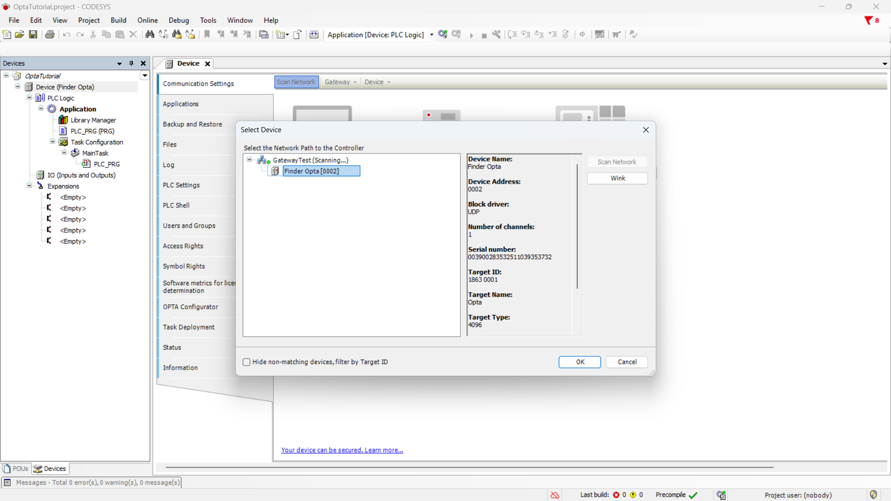
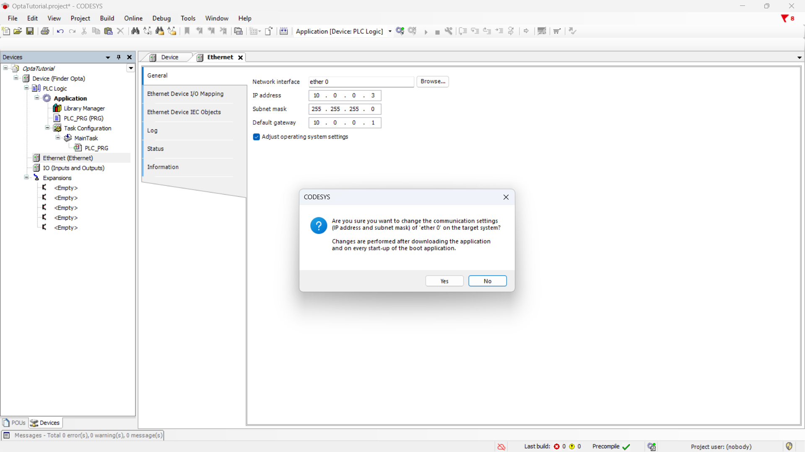

# Changing Finder OPTA IP Address in CODESYS

Learn how to change the IP address of Finder OPTA in CODESYS.

## Overview

In this tutorial, you'll learn how to change the IP address of Finder OPTA using CODESYS. We’ll walk you through verifying the
current IP, configuring the Ethernet settings, and applying the new address to the device. By the end, you’ll have successfully
updated Finder OPTA’s IP and confirmed it's reachable on your network.

## Goals

- Verify that Finder OPTA is reachable at a specific IP address.
- Configure Finder OPTA's IP address using CODESYS.

## Requirements

Before you begin, make sure you have:

- [PLC Finder OPTA CODESYS](https://opta.findernet.com/en/codesys) (x1)
- USB-C cable (x1)
- Ethernet cable (x1)
- CODESYS development environment installed with the OPTA Configurator plug-in. You can find an installation guide [at this
  link](https://opta.findernet.com/en/tutorial/codesys-plugin-tutorial).
- Properly configured network: your PC must be able to communicate with Finder OPTA via Ethernet. A configuration guide is available
  [at this link](https://opta.findernet.com/en/tutorial/codesys-via-ethernet).

## Instructions

Connect Finder OPTA to your PC using both the USB-C and Ethernet cables.

In this tutorial, we will use a Finder OPTA device configured with the default IP address `10.0.0.2`, which we will change to
`10.0.0.3`, belonging to the same subnet. The first step is to verify that the device is reachable at the address `10.0.0.2`. To do
this, open a terminal — in this case *PowerShell* — and send a simple connectivity check command.

Enter the following command in the terminal:

```bash
ping 10.0.0.2
```


The output confirms that Finder OPTA is reachable at the specified address and is responding.

### Creating a CODESYS Project

To change the IP address of Finder OPTA, you need to create a new CODESYS project.

Open CODESYS.


Create a new project and select `Standard Project`.


Ensure the selected device is `Finder Opta`, then choose the programming language.


### Connecting and Identifying Finder OPTA

In this step, we need to identify Finder OPTA in CODESYS. To do this, double-click on `Device (Finder Opta)` in the `Devices` menu
to open the device configuration tab.


Click on `Browse Network` to open a window showing the devices detected by CODESYS.



Now click on `Finder Opta [...]` and press `OK`. This ensures that Finder OPTA is connected and visible to the gateway.

### Configuring the Ethernet Port

In this section, we will configure the Ethernet network parameters of Finder OPTA. Right-click on `Device (Finder Opta)` in the
`Devices` menu and select `Add Device...`.


From the menu, expand `Ethernet` and choose `Ethernet Adapter` to add it to Finder OPTA.


Then, double-click on the newly added `Ethernet` entry in the side menu.


This screen allows you to configure the network settings to be downloaded to Finder OPTA. Click `Browse...` to open the onboard
network configuration window.


Click `OK` and enter the Ethernet settings you wish to apply to Finder OPTA. In this case, the values are:

- IP Address: `10.0.0.3`
- Subnet Mask: `255.255.255.0`
- Default Gateway: `10.0.0.1`

Make sure to check the option `Adapt operating system settings` and confirm before proceeding.



### Uploading the Configuration to Finder OPTA

To configure the device's network, press the green `Login` button at the top. This operation allows CODESYS to connect to Finder
OPTA, apply the specified network settings, and download the project to the device.


Select `Yes` to confirm and wait for the upload to complete.


### Verifying the New IP Address

Now we need to verify that the new network configuration was successfully applied to Finder OPTA. Open the terminal again and enter
the following command:

```bash
ping 10.0.0.3
```


The output confirms that Finder OPTA is reachable at the new address.

## Conclusion

You have successfully changed the IP address of Finder OPTA in CODESYS. By following these steps, you have correctly configured the
device's network and verified its reachability. Finder OPTA is now ready to be used in your network with the new IP address.

If you encounter issues during installation or configuration, double-check that all steps were followed correctly.

<!-- Insert contact information for support -->