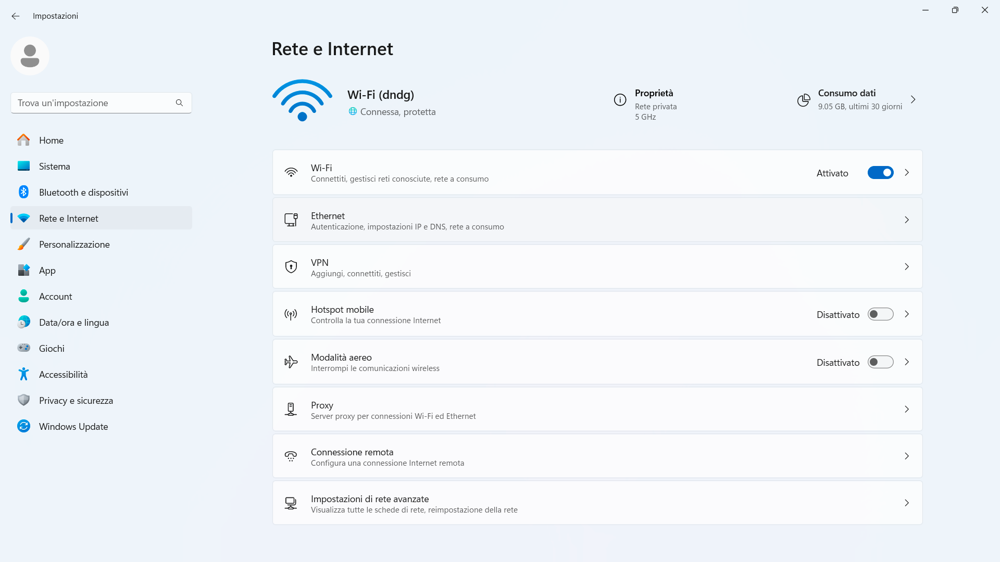
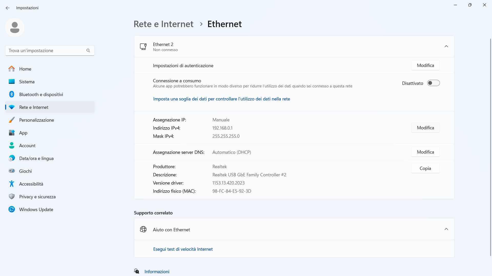
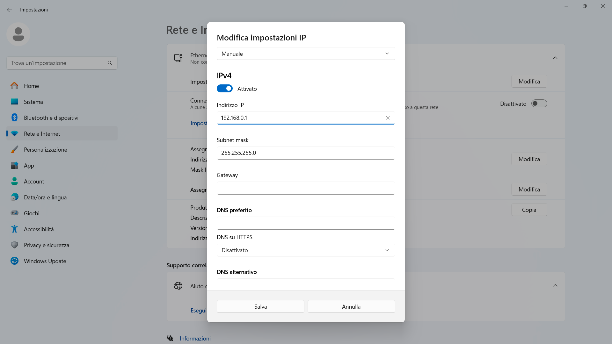
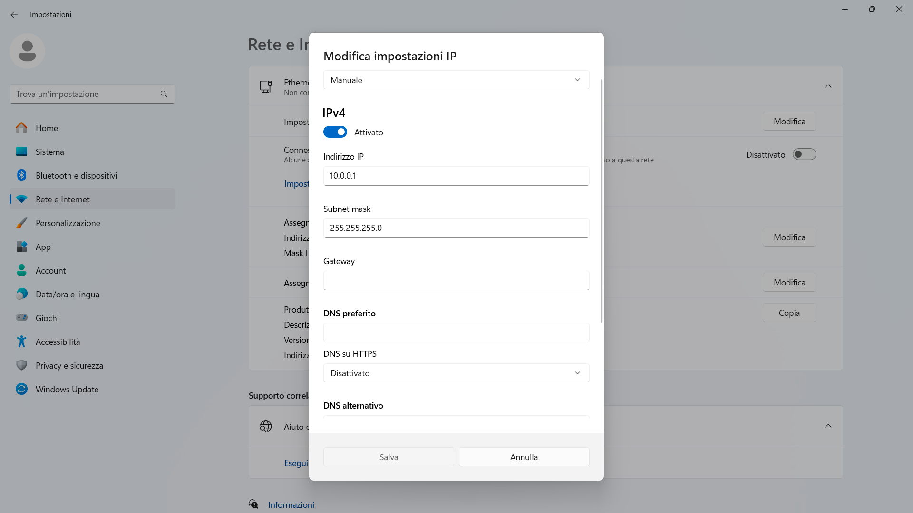

### Impostazione dell'indirizzo IP del PC

Per modificare l'indirizzo IP del tuo PC Windows è necessario aprire le impostazioni e andare su `Rete e internet`.

Selezionare la voce `Ethernet`.

Adesso premi `Modifica`.

Sostituire l'indirizzo presente con `10.0.0.1`.

Salva ed esci dalla schermata di modifica.
