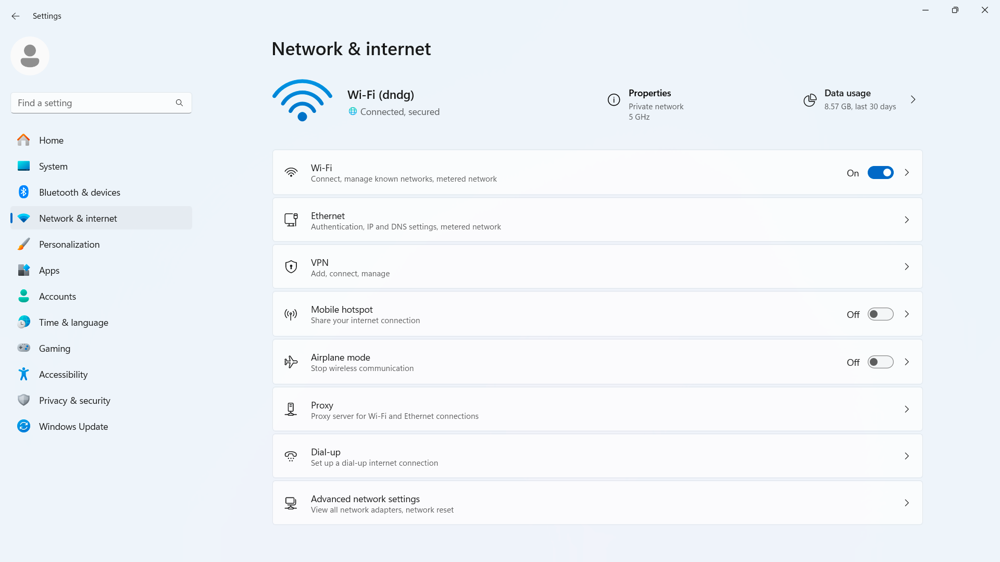
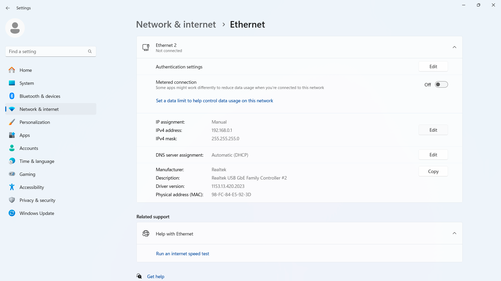
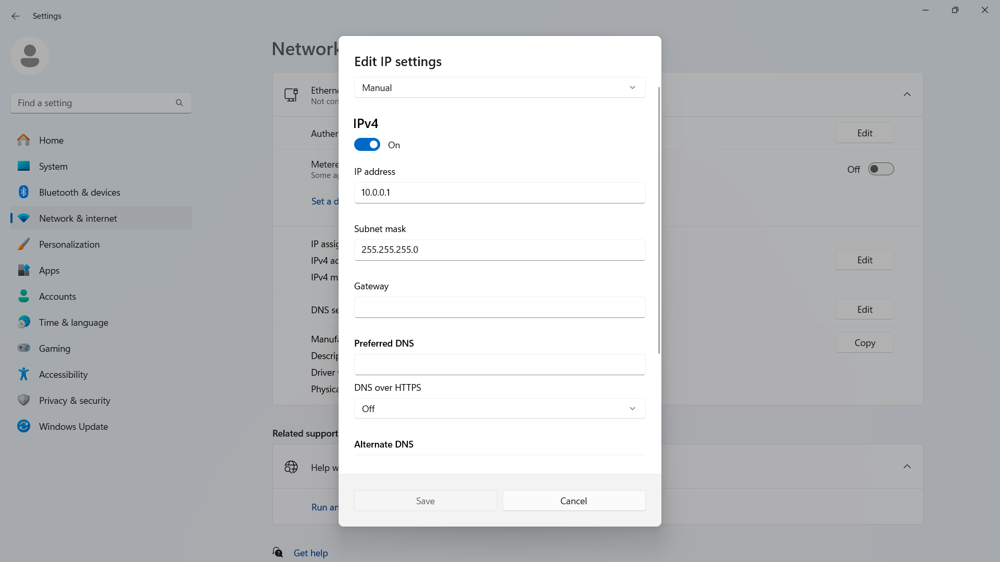

### Setting the PC’s IP Address

To change your Windows PC’s IP address, open `Settings` and go to `Network & Internet`.

Select `Ethernet`.

Click `Edit`.

Replace the existing address with `10.0.0.1`.

Save and exit the edit screen.
