# Come configurare un client Modbus TCP con Finder OPTA in CODESYS

Scopri come configurare Finder OPTA come client Modbus TCP in CODESYS per
leggere un registro esposto da un secondo Finder OPTA che si comporta da server
Modbus TCP.

## Panoramica

Grazie alla porta Ethernet integrata, Finder OPTA può comportarsi da client
Modbus TCP e leggere i registri esposti da qualsiasi dispositivo che implementa
un server Modbus TCP. Questo rende possibile lo scambio di dati tra due PLC su
una normale rete Ethernet, senza alcun hardware aggiuntivo.

In un [tutorial precedente](https://opta.findernet.com/tutorial/implementare-un-server-modbus-tcp)
abbiamo configurato un Finder OPTA come server Modbus TCP, esponendo il valore
di una variabile interna tramite un Input Register in modo che un HMI potesse
leggerlo e visualizzarlo. In questo tutorial ci mettiamo dal punto di vista
opposto: configureremo un secondo Finder OPTA come client Modbus TCP che legge
quello stesso Input Register e ne utilizza il valore per accendere i propri LED.

Per rendere l'esempio concreto, modificheremo leggermente il programma del
Finder OPTA configurato come server, in modo che faccia ciclare una variabile
tra i valori `0`, `1`, `2` e `3`, cambiandolo una volta al secondo. Il Finder
OPTA configurato come client leggerà quella variabile via Modbus TCP e accenderà
il LED corrispondente: LED 1 per il valore `0`, LED 2 per il valore `1`, e così
via. Guardare i LED del client è quindi sufficiente per verificare che la
comunicazione Modbus TCP tra i due dispositivi stia funzionando.

Inizieremo creando un nuovo progetto CODESYS per il client, configurando la sua
porta Ethernet e aggiungendo il client Modbus TCP insieme al canale utilizzato
per leggere l'Input Register remoto. Scriveremo poi il programma ST che comanda
i LED e mapperemo le sue variabili sia al canale Modbus sia ai LED del
dispositivo. Successivamente adatteremo il progetto del Finder OPTA configurato
come server, e infine scaricheremo entrambi i programmi e verificheremo il
risultato.

## Obbiettivi

- Configurare la porta Ethernet di due Finder OPTA in CODESYS
- Configurare un client Modbus TCP con Finder OPTA in CODESYS
- Leggere un Input Register esposto da un secondo Finder OPTA che si comporta da
  server Modbus TCP
- Utilizzare il valore letto via Modbus TCP per comandare i LED di Finder OPTA

## Requisiti

Prima di iniziare, assicurati di avere:

- [PLC Finder OPTA CODESYS](https://opta.findernet.com/it/codesys) (x2)
- [Alimentatore switching 12W o 25W per OPTA
  CODESYS](https://opta.findernet.com/it/codesys#moduli-espansione) (x2)
- Cavo Ethernet (x3)
- Dispositivo di rete che permetta ai due Finder OPTA e al PC di comunicare
  sulla stessa rete Ethernet, come uno switch o un router (x1)
- Ambiente di sviluppo CODESYS installato con plug-in OPTA Configurator. Trovi
  una guida all'installazione [a questo
  link](https://opta.findernet.com/it/tutorial/codesys-plugin-tutorial).
- Rete configurata correttamente: il PC deve comunicare correttamente con
  entrambi i Finder OPTA tramite Ethernet. Trovi una guida alla configurazione
  [a questo link](https://opta.findernet.com/it/tutorial/codesys-via-ethernet).
- Un Finder OPTA già configurato come server Modbus TCP in CODESYS, come
  descritto in [questo
  tutorial](https://opta.findernet.com/tutorial/implementare-un-server-modbus-tcp).

Per seguire questo tutorial sarà necessario alimentare entrambi i Finder OPTA
con l'alimentatore switching per OPTA CODESYS, e collegarli alla stessa rete
Ethernet del PC. In questo tutorial abbiamo utilizzato uno switch, ma qualsiasi
dispositivo di rete che permetta ai tre di comunicare sulla stessa sottorete -
un router, ad esempio - è ugualmente adatto.

Dato che i due dispositivi devono essere raggiungibili a indirizzi differenti,
in questo tutorial il Finder OPTA che si comporta da server mantiene
l'indirizzo IP predefinito `10.0.0.2`, mentre il Finder OPTA che si comporta da
client viene configurato all'indirizzo `10.0.0.3` della stessa sottorete. Il
nostro PC è configurato all'indirizzo `10.0.0.1`. Se entrambi i tuoi
dispositivi hanno ancora l'indirizzo IP di fabbrica, collegali uno alla volta e
cambia l'indirizzo di quello che farà da client, come spiegato in [questo
tutorial](https://opta.findernet.com/tutorial/change-ip-codesys).

## Istruzioni per creare il client Modbus TCP

Questa sezione mostra come configurare un Finder OPTA come client Modbus TCP
che legge ciclicamente un Input Register da un server Modbus TCP remoto, e
utilizza il valore letto per accendere uno dei suoi quattro LED.

### Creazione progetto CODESYS

Apri CODESYS.

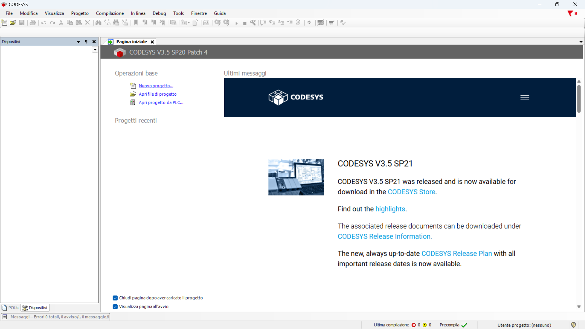

Crea un nuovo progetto e scegli `Progetto standard`.

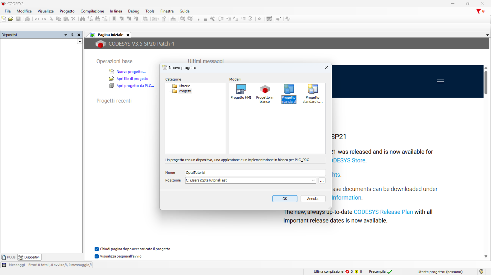

Assicurati che il dispositivo sia `Finder Opta`, poi seleziona il linguaggio del
programma.

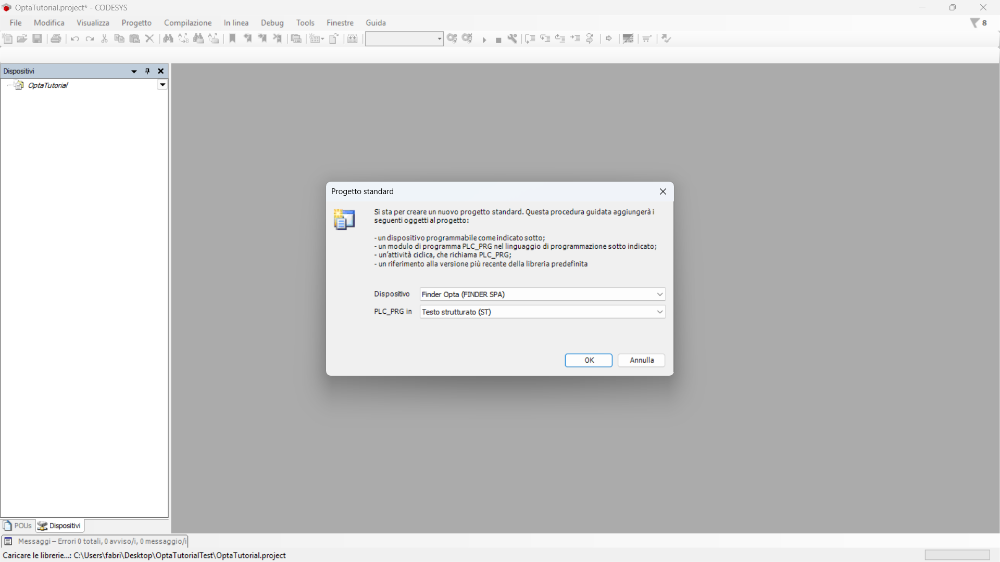

### Identificazione Finder OPTA via Ethernet

Fai doppio click sulla voce `Device (Finder Opta)` del menu `Dispositivi`, si
aprirà una scheda come mostrato qui sotto.

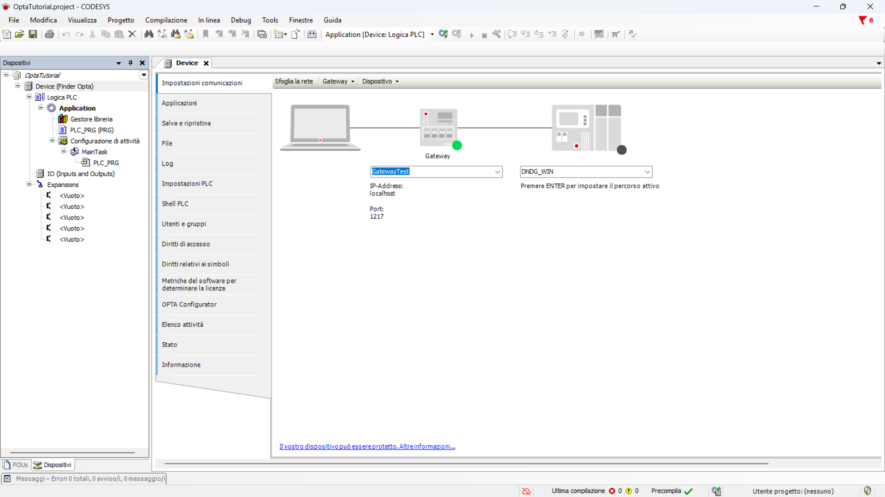

Premi il bottone `Sfoglia la rete` e assicurati di vedere il dispositivo Finder
OPTA comparire sotto il Gateway, poi premi `OK`. Se entrambi i Finder OPTA sono
già collegati alla rete, fai attenzione a selezionare quello che vuoi
configurare come client.

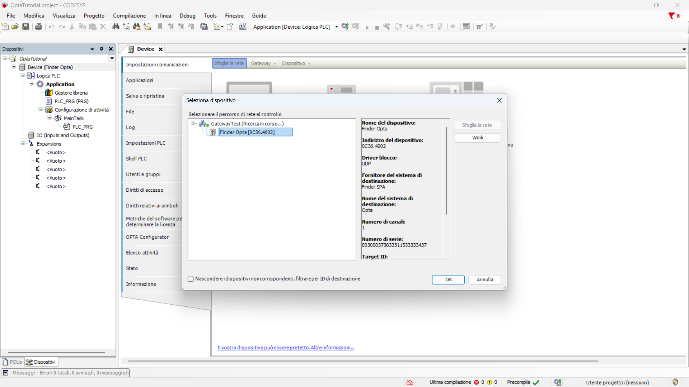

### Configurazione della porta Ethernet

In questa sezione configuriamo la porta Ethernet del Finder OPTA che si
comporta da client, ovvero la porta utilizzata per raggiungere il server Modbus
TCP.

Iniziamo aggiungendo l'adattatore Ethernet: premi il tasto destro sulla voce
`Device (Finder OPTA)` e scegli `Aggiungi dispositivo...`.

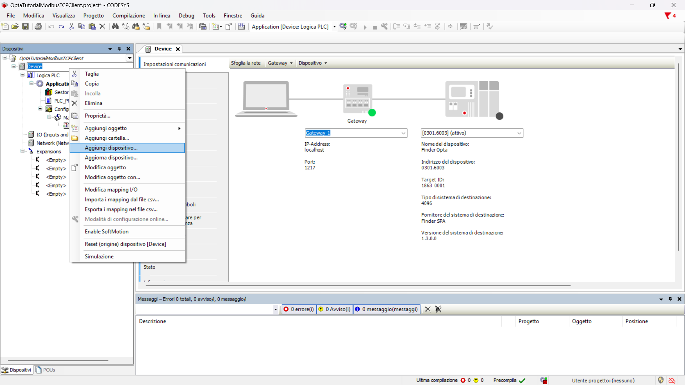

Dal menu, espandi la voce `Adattatore Ethernet`, seleziona `Ethernet` e clicca
su `Aggiungi dispositivo`.

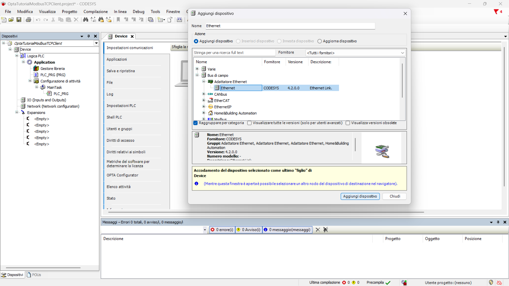

Adesso clicca due volte sulla voce `Ethernet (Ethernet)` nel menu laterale.

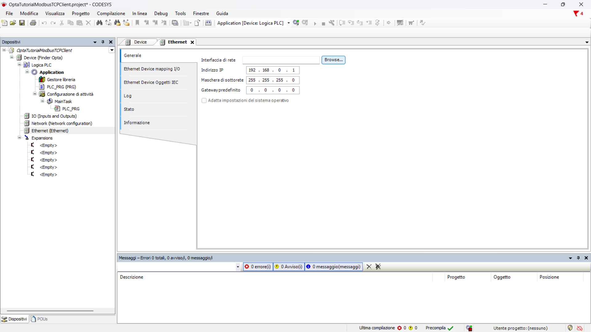

A questo punto leggi da Finder OPTA la sua configurazione di rete: cliccando
sul pulsante `Browse...` appare una finestra con i parametri di rete del
dispositivo collegato. Assicurati che i valori siano quelli del Finder OPTA che
si comporta da client:

- Indirizzo IP: `10.0.0.3`
- Maschera di sottorete: `255.255.255.0`
- Gateway predefinito: `10.0.0.1`

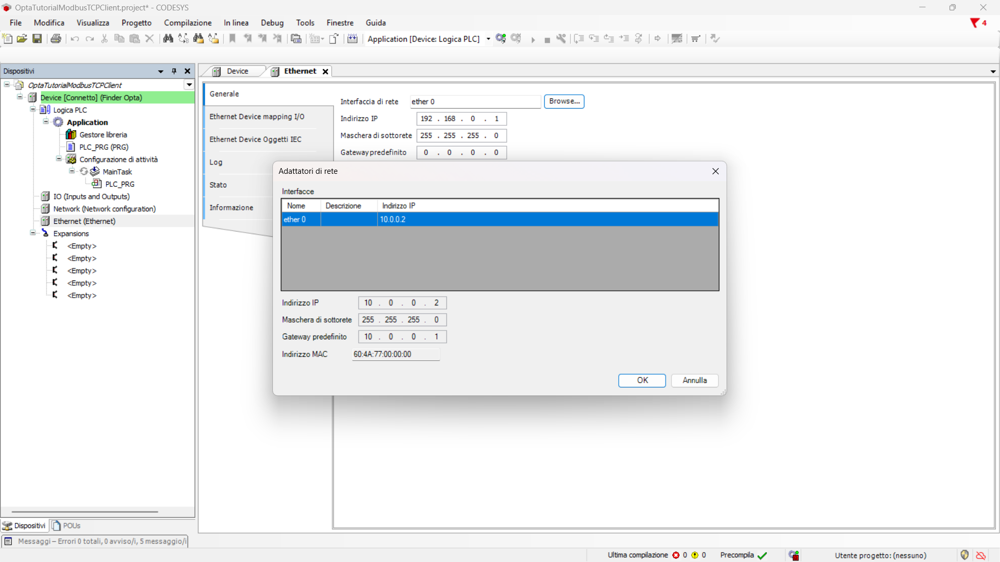

Premi `OK` per mantenere i parametri di rete di Finder OPTA. Prima di
proseguire ricordati di spuntare l'opzione `Adatta impostazioni del sistema
operativo` e successivamente clicca su `Yes` per confermare la modifica.

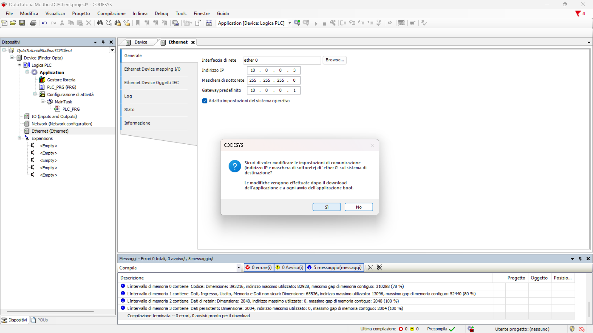

I parametri di rete sono adesso impostati nel progetto CODESYS, ma non sono
ancora salvati sul dispositivo: per salvarli su Finder OPTA è necessario
scaricare il programma sul dispositivo. Premi il pulsante verde in alto
etichettato come `Login` e conferma lo scaricamento.

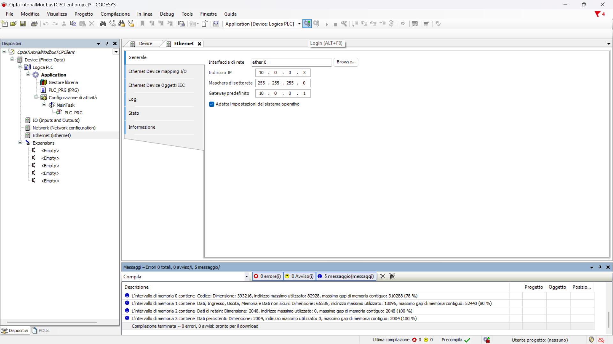

Durante questo passaggio CODESYS potrebbe restituire un errore come quello
mostrato qui sotto. Questo accade perché Finder OPTA ha appena cambiato il
proprio indirizzo IP, quindi il progetto punta ancora a quello precedente. In
questo caso è sufficiente ripetere la ricerca in rete vista nei primi passaggi -
clicca due volte sulla voce `Device (Finder Opta)`, premi `Sfoglia la rete` e
seleziona il Finder OPTA - per allineare il progetto al nuovo indirizzo IP del
dispositivo, poi premi di nuovo `Login`.

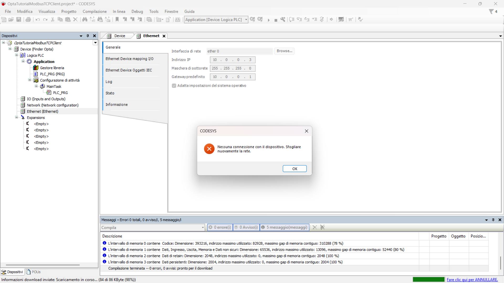

### Configurazione del client Modbus TCP

In questa sezione configuriamo il client Modbus TCP sulla porta Ethernet di
Finder OPTA, insieme al server remoto da cui vogliamo leggere e al canale che
esegue l'operazione di lettura.

Come prima cosa aggiungi il client Modbus TCP sulla porta Ethernet di Finder
OPTA: clicca il tasto destro sulla voce `Ethernet` e seleziona `Aggiungi
dispositivo...`. Dal menu espandi la voce `Modbus`, clicca su `Modbus TCP
Client` e poi su `Aggiungi dispositivo`.

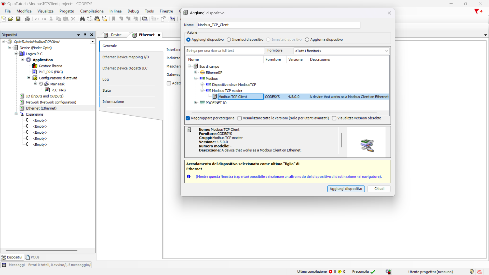

Clicca due volte sulla voce `Modbus_TCP_Client (Modbus TCP Client)` appena
aggiunta e lascia i parametri predefiniti: un `Response timeout` di `1000` ms è
adatto al nostro esempio.

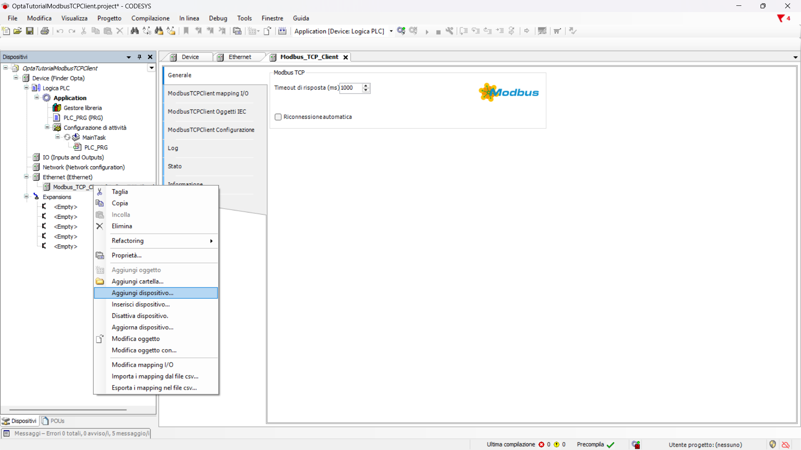

Adesso descriviamo il server Modbus TCP remoto che il client deve contattare,
ovvero l'altro Finder OPTA. Clicca il tasto destro sulla voce
`Modbus_TCP_Client (Modbus TCP Client)` e seleziona `Aggiungi dispositivo...`,
poi clicca su `Modbus TCP Server` e `Aggiungi dispositivo`.

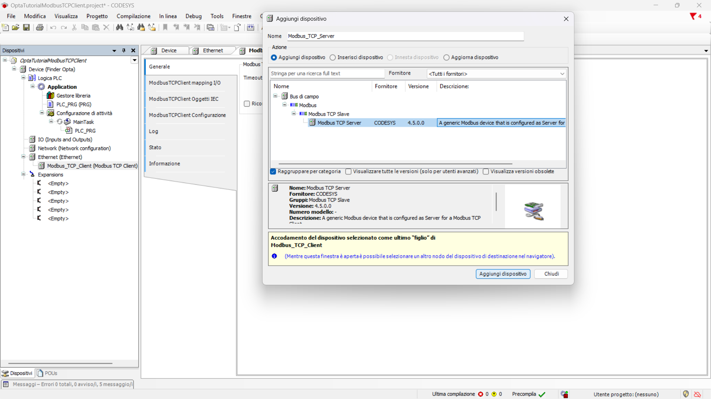

Clicca due volte sulla voce `Modbus_TCP_Server (Modbus TCP Server)` appena
aggiunta e imposta i parametri come segue, in accordo con la configurazione del
Finder OPTA che si comporta da server:

- Server IP address: `10.0.0.2`, l'indirizzo IP del Finder OPTA che si comporta
  da server Modbus TCP.
- Response timeout(ms): `1000`.
- Port: `502`, porta di default per il protocollo Modbus TCP.

Tutti gli altri parametri possono essere lasciati al valore predefinito.

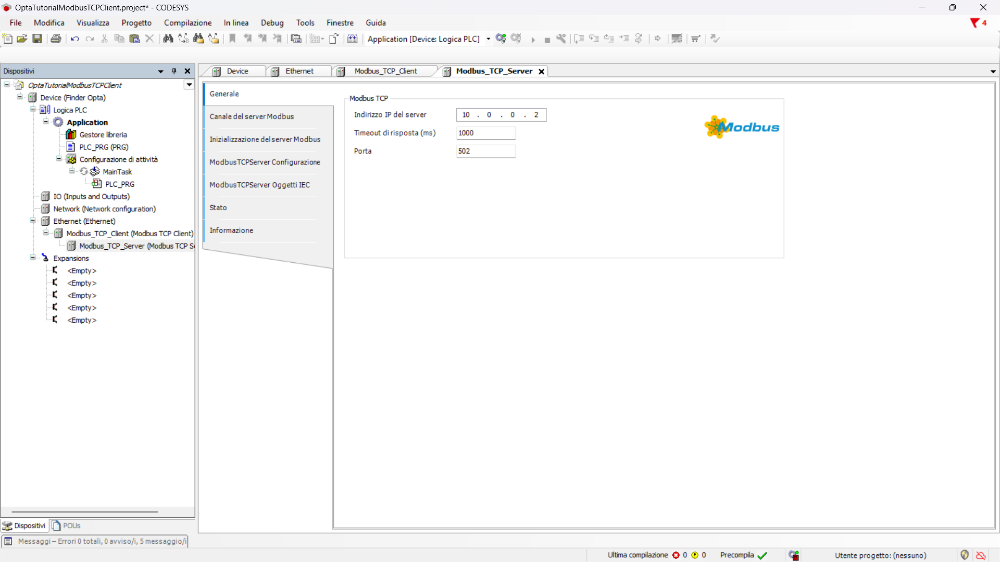

Non ci resta che configurare il canale Modbus, ovvero l'operazione di lettura
che il client esegue ciclicamente sul server. Nella stessa schermata clicca
sulla sezione `Canale del server Modbus`, poi su `Aggiungi canale` in basso a
destra.

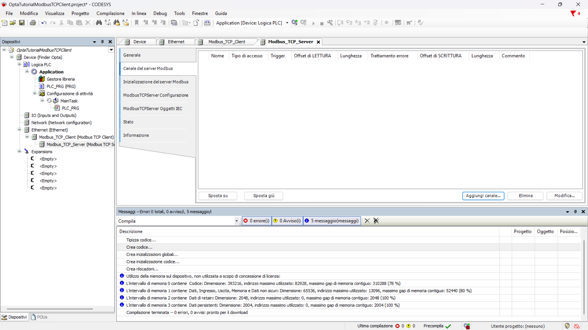

In questo tutorial leggiamo un singolo Input Register, quello in cui il server
pubblica il valore della sua variabile. Come vedremo nella prossima sezione,
quel registro è configurato all'indirizzo `1` del server, pertanto impostiamo i
valori del canale come segue:

- Nome: `Channel 0`.
- Tipo di accesso: `Read Input Registers (Codice funzione 4)`.
- Trigger: `Ciclico`.
- Tempo di ciclo: `100`.
- Offset: `1`, l'indirizzo dell'Input Register che vogliamo leggere.
- Lunghezza: `1`, leggiamo un singolo registro.
- Trattamento errore: `Mantieni ultimo valore`.

Il server aggiorna la propria variabile una volta al secondo, quindi una
lettura ogni `100` ms è più che sufficiente per seguirne prontamente i
cambiamenti. Nota che entrambi i progetti CODESYS contano gli indirizzi dei
registri a partire da `0`, quindi l'offset del canale corrisponde
all'indirizzo di partenza configurato sul server senza alcuna conversione.

Dopo aver premuto `OK`, vedrai il riepilogo del canale appena configurato.

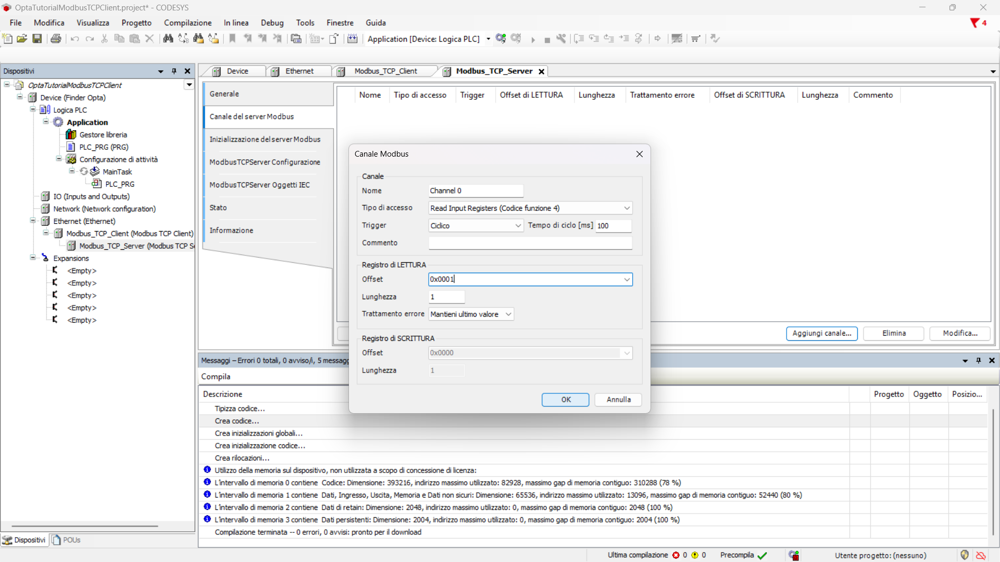

### Preparazione del programma ST

Adesso scriviamo il programma ST del client, che accende uno dei quattro LED di
Finder OPTA in base al valore letto dal server Modbus TCP.

Nel menu laterale, clicca su `PLC_PRG (PRG)` e inserisci il seguente codice,
dove la parte superiore dell'editor è dedicata alla definizione delle variabili
e la parte inferiore alla logica del programma:

```st
PROGRAM PLC_PRG
VAR
    led1, led2, led3, led4: BOOL := FALSE;
    state: WORD;
END_VAR

led1 := FALSE;
led2 := FALSE;
led3 := FALSE;
led4 := FALSE;

CASE state OF
    0:
        led1 := TRUE;
    1:
        led2 := TRUE;
    2:
        led3 := TRUE;
    3:
        led4 := TRUE;
END_CASE
```

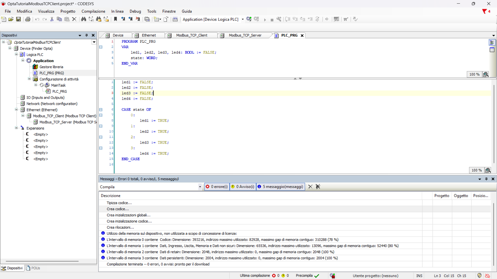

A ogni ciclo di esecuzione il programma spegne tutti i LED e poi accende solo
quello corrispondente al valore della variabile `state`. La variabile `state` è
dichiarata come `WORD` perché conterrà il contenuto di un Input Register, che
nel protocollo Modbus è un valore a 16 bit.

Adesso è necessario associare la variabile `state` al canale Modbus che abbiamo
configurato, in modo che contenga il valore letto dal server. Nel menu
laterale clicca due volte su `Modbus_TCP_Server (Modbus TCP Server)`, poi clicca
sulla sezione `ModbusTCPServer mapping I/O` e clicca due volte sulla cella
`Variabile` del canale `Channel 0` per far comparire il pulsante opzioni.

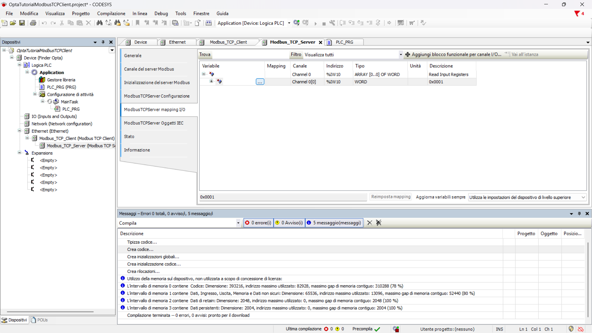

Clicca sul pulsante opzioni per far comparire la lista di variabili, espandi la
voce `Application` e la voce `PLC_PRG`. A questo punto clicca sulla variabile
`state` e premi `OK` per assegnarla al canale.

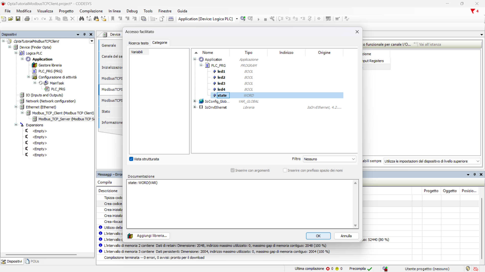

Il riepilogo mostra la variabile assegnata al canale. Da ora in poi la
variabile `state` contiene il valore dell'Input Register letto dal Finder OPTA
che si comporta da server Modbus TCP.

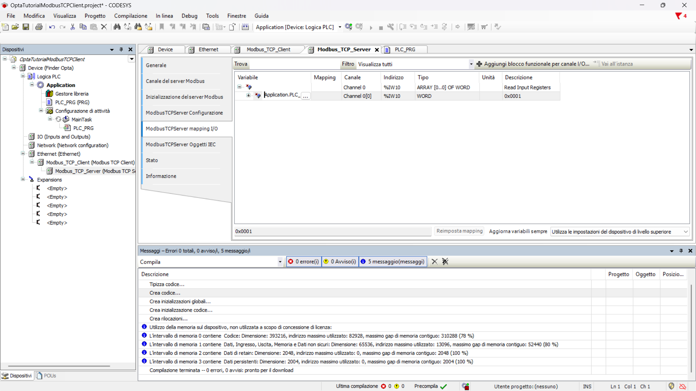

Infine associamo le variabili dei LED ai LED effettivi di Finder OPTA. Clicca
due volte sulla voce `I/O` del menu `Dispositivi` e seleziona la sezione `Opta
I/O Mapping`.

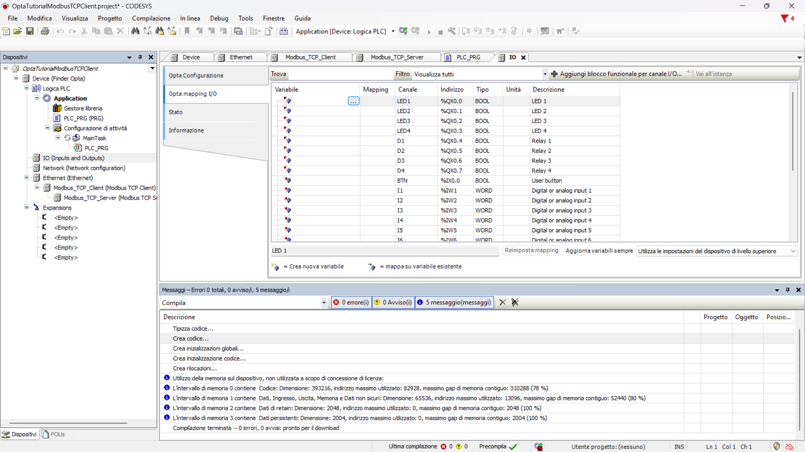

Clicca due volte sulla cella della variabile in modo da far comparire il
pulsante opzioni, poi selezionalo ed espandi la voce `Application` e la voce
`PLC_PRG` per visualizzare le variabili dei LED. Associa ogni LED alla
variabile corrispondente fino ad arrivare a un riepilogo come quello
sottostante.

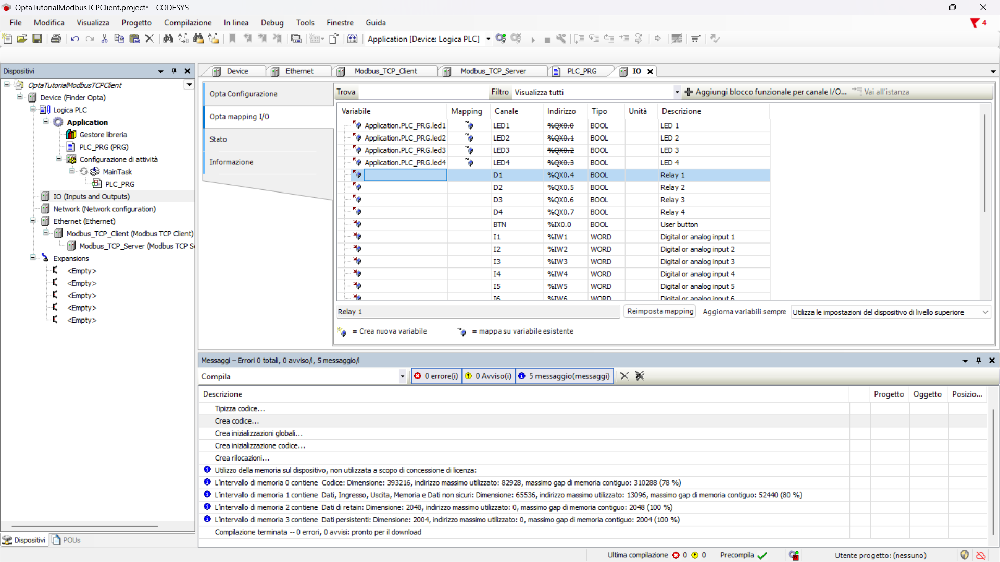

## Istruzioni per adattare il server Modbus TCP

Il Finder OPTA che si comporta da server Modbus TCP è quello che abbiamo
configurato in [questo
tutorial](https://opta.findernet.com/tutorial/implementare-un-server-modbus-tcp).
In questa sezione adattiamo quel progetto al nostro esempio: invece di
pubblicare un contatore da 0 a 100 per un HMI, il server pubblica una variabile
che cicla tra i valori `0`, `1`, `2` e `3`, cambiando una volta al secondo.

Apri il progetto CODESYS del Finder OPTA che si comporta da server, e collegati
al dispositivo come descritto nelle sezioni [Identificazione Finder OPTA via
Ethernet](#identificazione-finder-opta-via-ethernet) e [Configurazione della
porta Ethernet](#configurazione-della-porta-ethernet) di questo tutorial.
Questa volta, però, i parametri di rete del dispositivo devono essere i
seguenti:

- Indirizzo IP: `10.0.0.2`
- Maschera di sottorete: `255.255.255.0`
- Gateway predefinito: `10.0.0.1`

Sono gli stessi parametri che abbiamo configurato sul client, nella voce
`Modbus_TCP_Server (Modbus TCP Server)`, per raggiungere questo dispositivo.

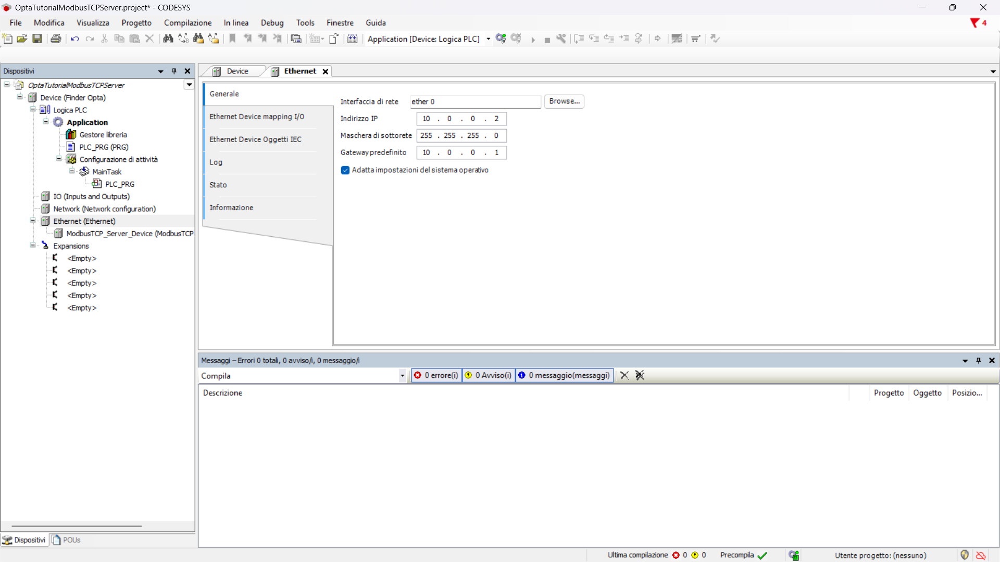

Come visto per il client, se modifichi la configurazione di rete devi
scaricarla sul dispositivo premendo il pulsante `Login`, altrimenti i nuovi
parametri rimangono solamente nel progetto CODESYS. Anche in questo caso, se
CODESYS restituisce un errore perché l'indirizzo IP del dispositivo è appena
cambiato, ripeti la ricerca in rete per allineare il progetto e poi premi di
nuovo `Login`.

### Modifica del programma ST

Nel menu laterale del progetto del server, clicca su `PLC_PRG (PRG)` e
sostituisci il programma del tutorial precedente con il seguente:

```st
PROGRAM PLC_PRG
VAR
    timer: TON;
    state: WORD := 0;
END_VAR

timer(IN := TRUE, PT := T#1S);
IF timer.Q THEN
    timer(IN := FALSE);
    state := (state + 1) MOD 4;
    timer(IN := TRUE);
END_IF
```

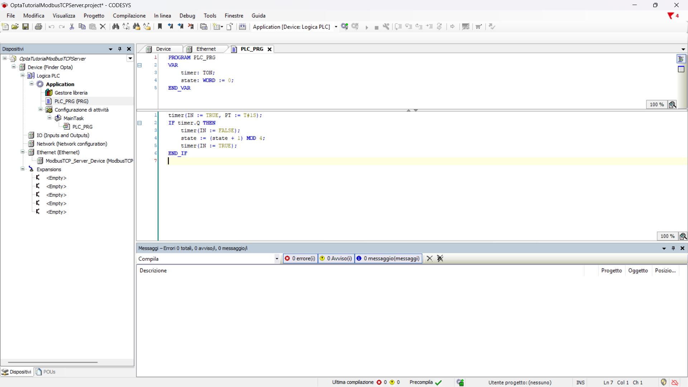

Il programma utilizza un timer `TON` con un tempo di preset di un secondo: ogni
volta che il timer scade, la variabile `state` viene incrementata e torna a `0`
dopo il valore `3`, poi il timer viene riavviato. La variabile è dichiarata
come `WORD` in modo da poter essere mappata direttamente a un Input Register,
senza la variabile intermedia utilizzata nel tutorial precedente.

### Verifica dei registri del server Modbus TCP

La configurazione dei registri è la stessa del tutorial precedente, ma vale la
pena verificarla perché determina l'indirizzo che il client deve leggere.
Clicca due volte sulla voce `Modbus_TCP_Server_Device (ModbusTCP Server
Device)` e assicurati che i valori siano i seguenti:

- Porta del server: `502`, porta di default per il protocollo Modbus TCP.
- Registri di holding: `2`, non li utilizziamo quindi li impostiamo al valore
  minimo.
- Registri di ingresso: `2`, utilizzeremo un singolo Input Register ma il
  valore minimo è 2.
- Registro di holding: `1`, indirizzo di partenza degli Holding Register.
- Registro di ingresso: `1`, indirizzo di partenza degli Input Register.

Tutti gli altri parametri possono essere lasciati al valore predefinito.

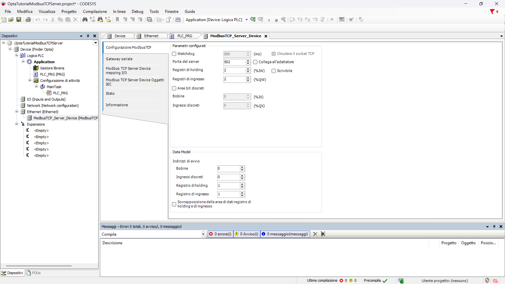

L'indirizzo di partenza `1` degli Input Register è il valore che abbiamo
impostato come `Offset` nel canale del client Modbus TCP, ed è l'indirizzo a
cui il client legge la variabile del server.

Adesso associamo la variabile `state` del programma del server all'Input
Register. Clicca sulla sezione `Modbus TCP Server Device mapping I/O`: come
mostrato qui sotto, la tabella elenca i registri del server e non c'è ancora
nessuna variabile mappata su di essi.


Espandi la sezione `Registri di input` della tabella e clicca due volte sulla
cella `Variabile` per far comparire il pulsante opzioni. Clicca sul pulsante
opzioni, espandi la voce `Application` e la voce `PLC_PRG`, poi clicca sulla
variabile `state` e premi `OK`.

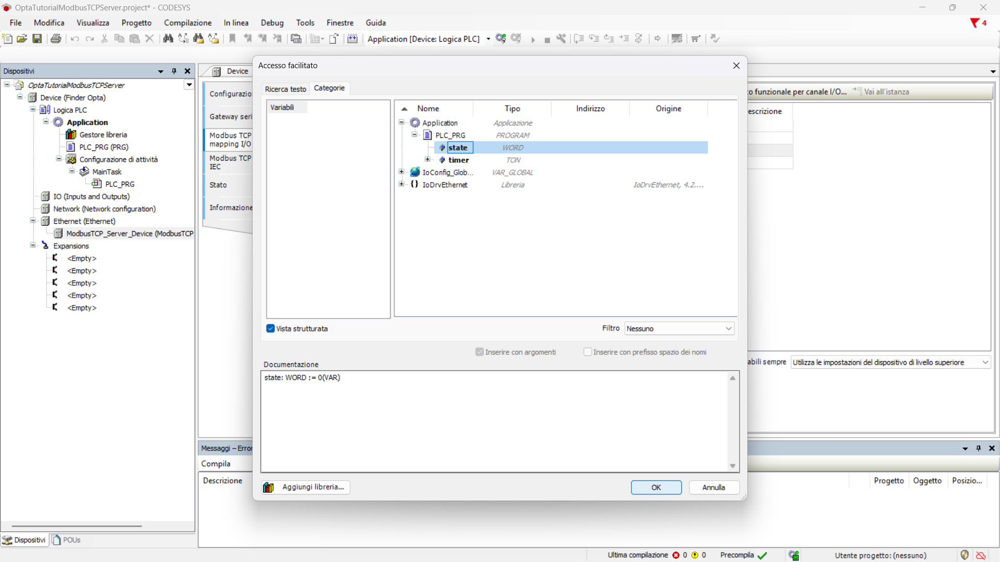

Il riepilogo mostra la variabile assegnata all'Input Register: da ora in poi il
valore che cicla da `0` a `3` viene replicato all'interno dell'Input Register
del server Modbus TCP, pronto per essere letto dal client.

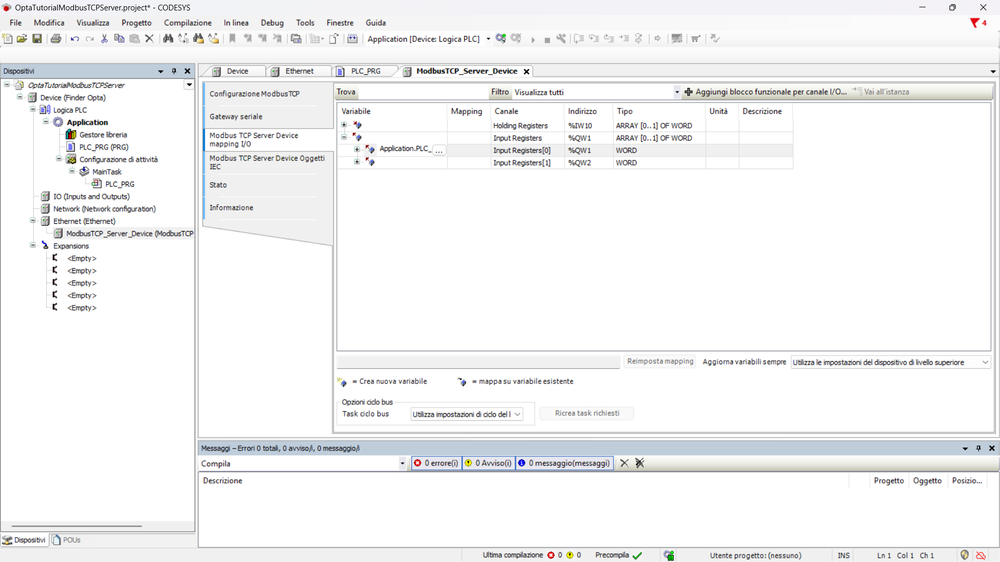

## Caricamento dei programmi su Finder OPTA

In questa fase scarichiamo entrambi i progetti sui rispettivi dispositivi, così
che eseguano il codice appena scritto.

Iniziamo dal Finder OPTA che si comporta da server: nel suo progetto CODESYS,
scarica il programma e la configurazione sul dispositivo premendo il pulsante
verde in alto etichettato come `Login`, poi fai partire il programma premendo
il pulsante `Start` - il pulsante di play nella barra degli strumenti in alto.
Se un messaggio chiede di sovrascrivere il programma in esecuzione su Finder
OPTA, confermalo.

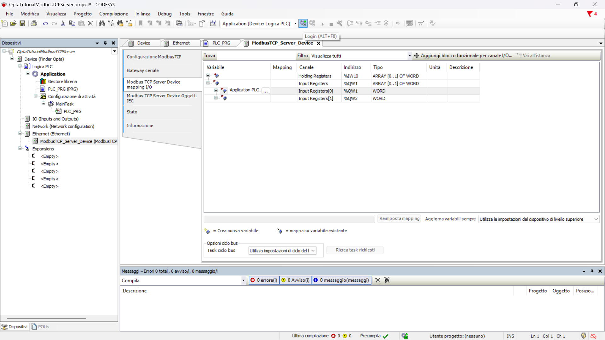

La tab `PLC_PRG` mostra in tempo reale il valore della
variabile scritto nell'Input Register, che cambia una volta al secondo.

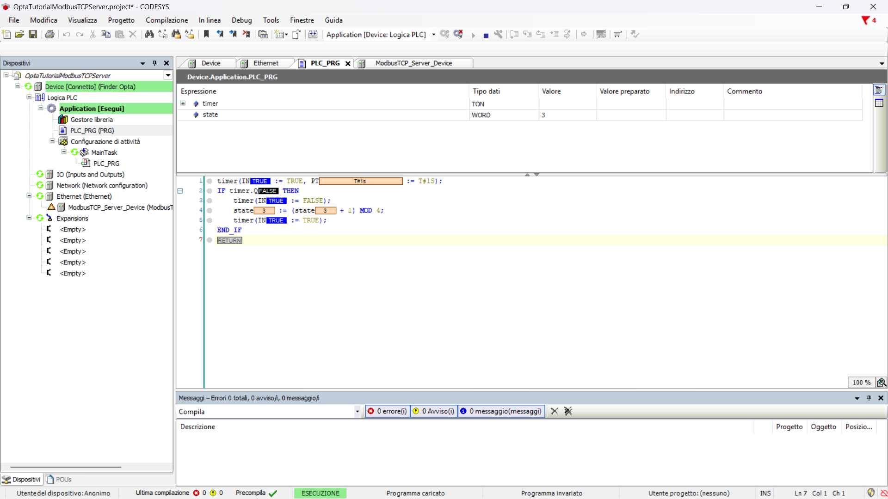

Adesso salva il progetto e disconnettiti dal dispositivo cliccando su `Logout`.
È importante **non** premere il pulsante `Stop` prima di disconnettersi: il
programma deve continuare a girare sul Finder OPTA che si comporta da server,
così che il suo server Modbus TCP continui a pubblicare il valore mentre
lavoriamo sul client. Una volta effettuato il logout, il dispositivo esegue il
programma in autonomia e puoi passare senza problemi all'altro progetto.

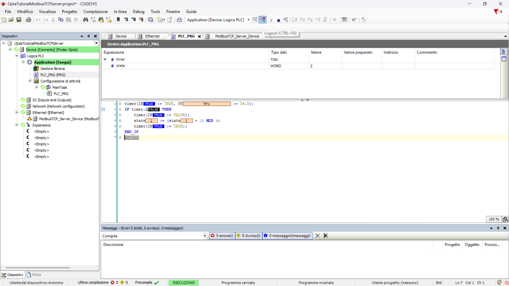

Adesso torna al progetto del Finder OPTA che si comporta da client, il primo
che abbiamo creato in questo tutorial: puoi aprirlo dal menu `File`, alla voce
`Progetti recenti`.

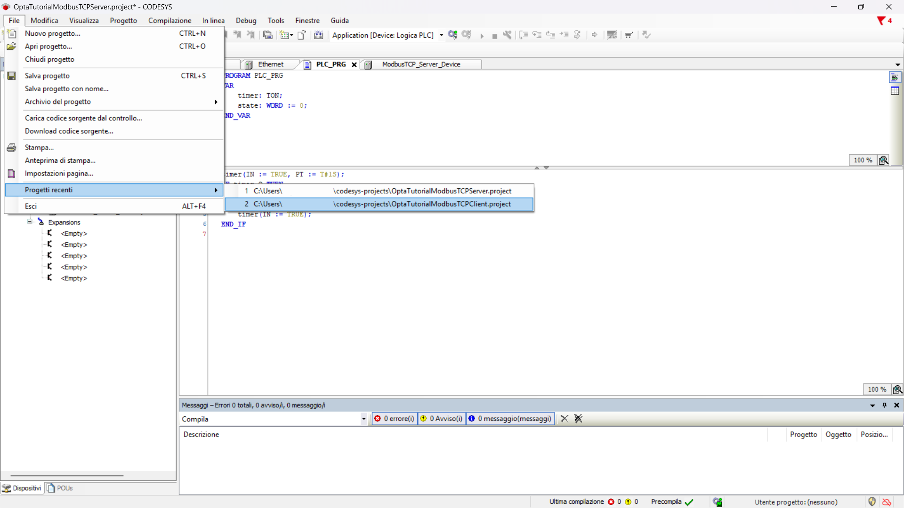

Nel progetto del client, ripeti le stesse operazioni: premi il pulsante verde
`Login` per scaricare il programma e la configurazione, poi premi `Start` per
farlo partire.

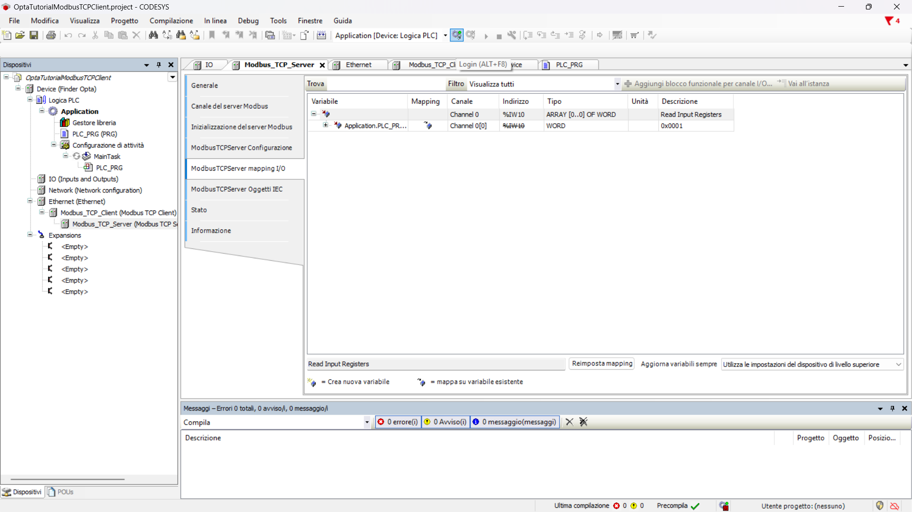

A questo punto i quattro LED del Finder OPTA che si comporta da client si
accendono uno alla volta, seguendo il valore pubblicato dal server: i LED si
illuminano in sequenza e il ciclo riparte ogni quattro secondi.

La tab `PLC_PRG` del progetto del client mostra in tempo reale il
valore letto dal canale, utile per verificare la comunicazione anche senza
guardare i LED.

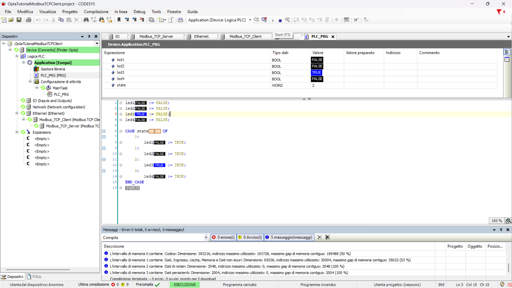

## Risoluzione dei problemi

Ogni Finder OPTA esce dalla fabbrica con lo stesso indirizzo IP predefinito
`10.0.0.2`. Se colleghi alla stessa rete due dispositivi nuovi di fabbrica
prima di cambiare l'indirizzo di uno dei due, entrambi risponderanno allo
stesso indirizzo: in questa situazione CODESYS non è in grado di distinguerli,
e la ricerca in rete potrebbe mostrare un solo dispositivo, mostrarlo in modo
intermittente, oppure collegarsi a un dispositivo diverso da quello che
volevi configurare.

Per questo motivo consigliamo di configurare un Finder OPTA alla volta: collega
solamente il dispositivo su cui vuoi lavorare, imposta i suoi parametri di rete
e scaricali con `Login` come descritto sopra, poi scollegalo e ripeti la
procedura con il secondo dispositivo. Una volta che i due dispositivi hanno
indirizzi IP differenti - `10.0.0.2` per il server e `10.0.0.3` per il client in
questo tutorial - puoi collegarli entrambi alla rete e CODESYS li identificherà
senza ambiguità.

Se sospetti un conflitto di indirizzi, scollega uno dei due dispositivi e
verifica che l'altro risponda all'indirizzo previsto, ad esempio con un comando
`ping` dal terminale del PC.

## Conclusioni

Seguendo questo tutorial hai configurato un Finder OPTA come client Modbus TCP
in CODESYS, leggendo un Input Register esposto da un secondo Finder OPTA che si
comporta da server Modbus TCP, e utilizzando il valore letto per comandare i
LED del dispositivo.

Hai visto come:

- Configurare la porta Ethernet di due Finder OPTA sulla stessa sottorete.
- Aggiungere e parametrizzare un client Modbus TCP in CODESYS.
- Descrivere un server Modbus TCP remoto e configurare un canale di lettura
  ciclica.
- Mappare il valore letto da un canale Modbus su una variabile del PLC.
- Adattare il programma e i registri del Finder OPTA che si comporta da server.

Se riscontri difficoltà durante la realizzazione, verifica con attenzione la
configurazione di rete dei due dispositivi, gli indirizzi Modbus configurati e
la mappatura dei registri. Assicurati che i due Finder OPTA abbiano indirizzi
IP differenti sulla stessa sottorete, e che l'`Offset` del canale del client
corrisponda all'indirizzo di partenza degli Input Register del server: una
configurazione errata degli indirizzi Modbus è la causa più frequente di
letture errate o di mancata comunicazione tra i due dispositivi.

<!-- Add contact info for support -->
