# How to configure a Modbus TCP Client with Finder OPTA in CODESYS

Learn how to configure Finder OPTA as a Modbus TCP client in CODESYS to read a
register exposed by a second Finder OPTA acting as a Modbus TCP server.

## Overview

Thanks to its integrated Ethernet port, Finder OPTA can act as a Modbus TCP
client and read the registers exposed by any device that implements a Modbus
TCP server. This makes it possible to exchange data between two PLCs over a
standard Ethernet network, without any additional hardware.

In a [previous tutorial](https://opta.findernet.com/tutorial/implementare-un-server-modbus-tcp)
we configured a Finder OPTA as a Modbus TCP server, exposing the value of an
internal variable through an Input Register so that an HMI could read and
display it. In this tutorial we will take the opposite point of view: we will
configure a second Finder OPTA as a Modbus TCP client that reads that same
Input Register and uses its value to drive its own LEDs.

<!-- TODO: update the link once the ENGLISH Modbus TCP server tutorial is back online -->

To make the example concrete, we will slightly modify the program of the Finder
OPTA configured as server, so that it cycles a variable through the values `0`,
`1`, `2` and `3`, changing it once per second. The Finder OPTA configured as
client will read that variable via Modbus TCP and switch on the corresponding
LED: LED 1 for the value `0`, LED 2 for the value `1`, and so on. Watching the
LEDs of the client is therefore enough to verify that the Modbus TCP
communication between the two devices is working.

We will start by creating a new CODESYS project for the client, configuring its
Ethernet port and adding the Modbus TCP client together with the channel used
to read the remote Input Register. We will then write the ST program that
drives the LEDs and map its variables both to the Modbus channel and to the
LEDs of the device. Next, we will adapt the project of the Finder OPTA
configured as server, and finally we will download both programs and verify the
result.

## Goals

- Configure the Ethernet port of two Finder OPTA devices in CODESYS
- Configure a Modbus TCP client on Finder OPTA in CODESYS
- Read an Input Register exposed by a second Finder OPTA acting as Modbus TCP
  server
- Use the value read via Modbus TCP to drive the LEDs of Finder OPTA

## Requirements

Before starting, make sure you have:

- [Finder OPTA CODESYS PLC](https://opta.findernet.com/en/codesys) (x2)
- [12W or 25W switching power supply for
  OPTA](https://opta.findernet.com/en/codesys#moduli-espansione) (x2)
- Ethernet cable (x3)
- Network device that allows the two Finder OPTA and your PC to communicate on
  the same Ethernet network, such as a switch or a router (x1)
- CODESYS development environment installed with the OPTA Configurator plug-in.
  You can find an installation guide [at this
  link](https://opta.findernet.com/en/tutorial/codesys-plugin-tutorial).
- Properly configured network: your PC must be able to communicate with both
  Finder OPTA devices via Ethernet. Configuration guide available [at this
  link](https://opta.findernet.com/en/tutorial/codesys-via-ethernet).
- A Finder OPTA already configured as a Modbus TCP server in CODESYS, as
  described in [this
  tutorial](https://opta.findernet.com/en/tutorial/codesys-modbus-tcp-server).

To follow this tutorial you will need to power both Finder OPTA devices with
the switching power supply for OPTA CODESYS, and to connect them to the same
Ethernet network as your PC. In this tutorial we used a switch, but any network
device that lets the three of them communicate on the same subnet - a router,
for example - is equally suitable.

Since the two devices must be reachable at different addresses, in this
tutorial the Finder OPTA acting as server keeps the default IP address
`10.0.0.2`, while the Finder OPTA acting as client is configured at the address
`10.0.0.3` of the same subnet. Our PC is configured at the address `10.0.0.1`.
If both your devices still have the factory IP address, connect them one at a
time and change the address of the one that will act as client, as explained in
[this tutorial](https://opta.findernet.com/tutorial/implementare-un-server-modbus-tcp).

## Instructions to create the Modbus TCP client

This section shows how to configure a Finder OPTA as a Modbus TCP client that
cyclically reads an Input Register from a remote Modbus TCP server, and uses
the value it reads to switch on one of its four LEDs.

### Creating a CODESYS Project

Open CODESYS.

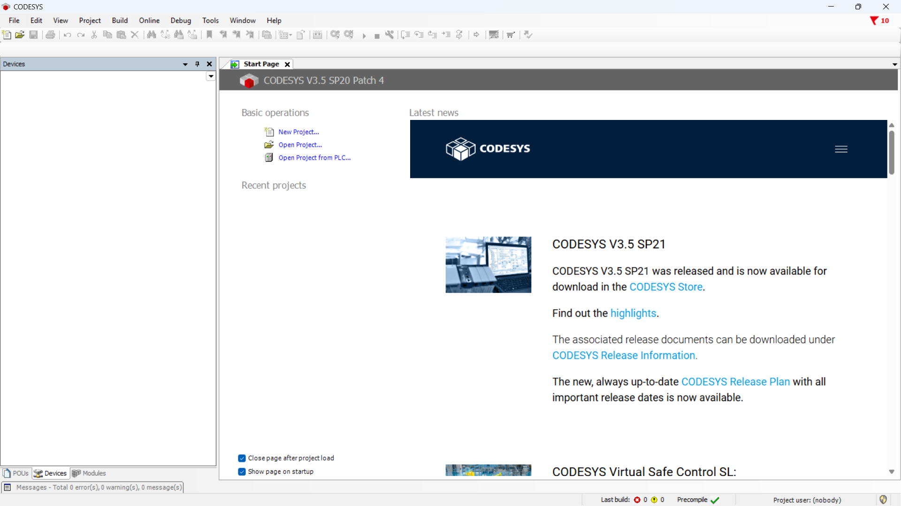

Create a new project and choose `Standard project`.

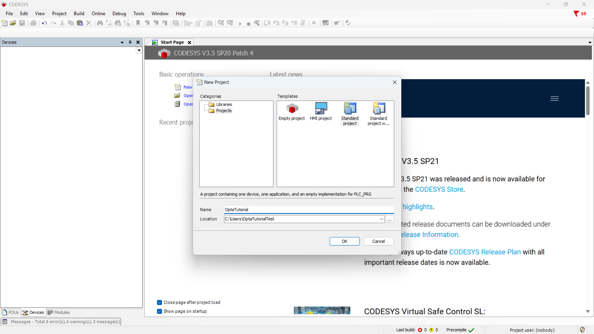

Make sure the device is `Finder Opta`, then select the program language.

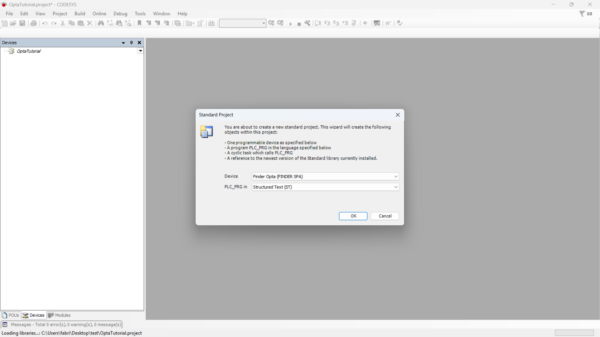

### Identifying Finder OPTA via Ethernet

Double-click the `Device (Finder Opta)` entry in the `Devices` menu. A tab will
open as shown below.

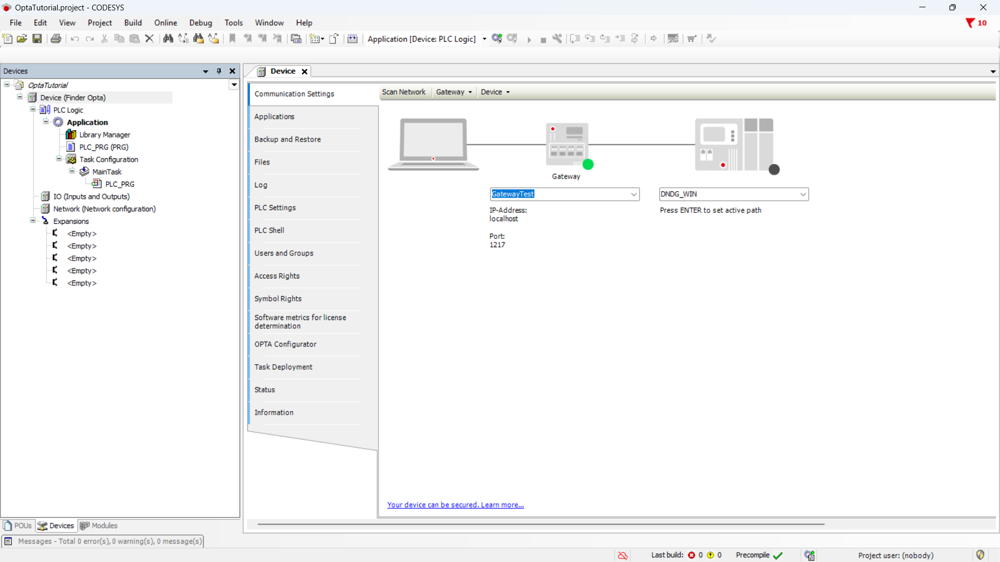

Click the `Scan network` button and make sure you see the Finder OPTA device
appear under the Gateway, then press `OK`. If both Finder OPTA devices are
already connected to the network, pay attention to selecting the one you want
to configure as client.

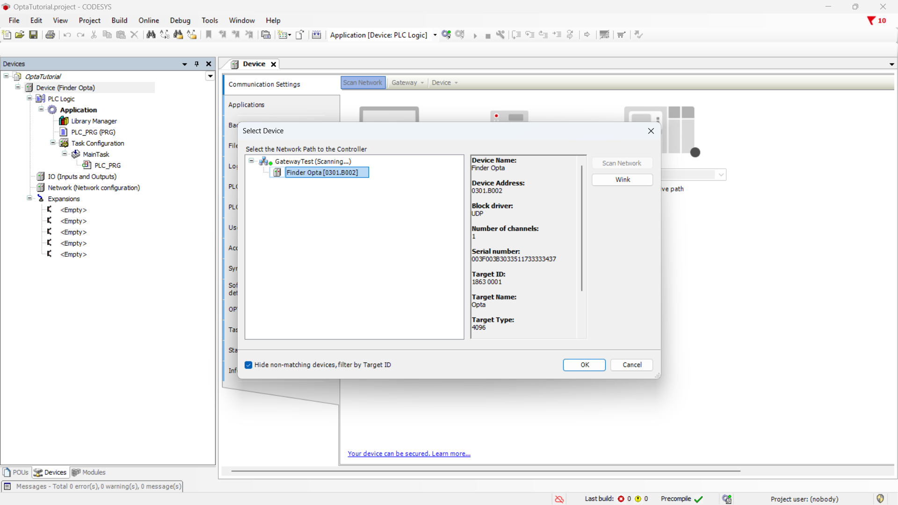

### Ethernet port configuration

In this section we will configure the Ethernet port of the Finder OPTA acting
as client, which is the port used to reach the Modbus TCP server.

Let's start by adding the Ethernet adapter: right-click on the
`Device (Finder OPTA)` item and choose `Add Device...`.

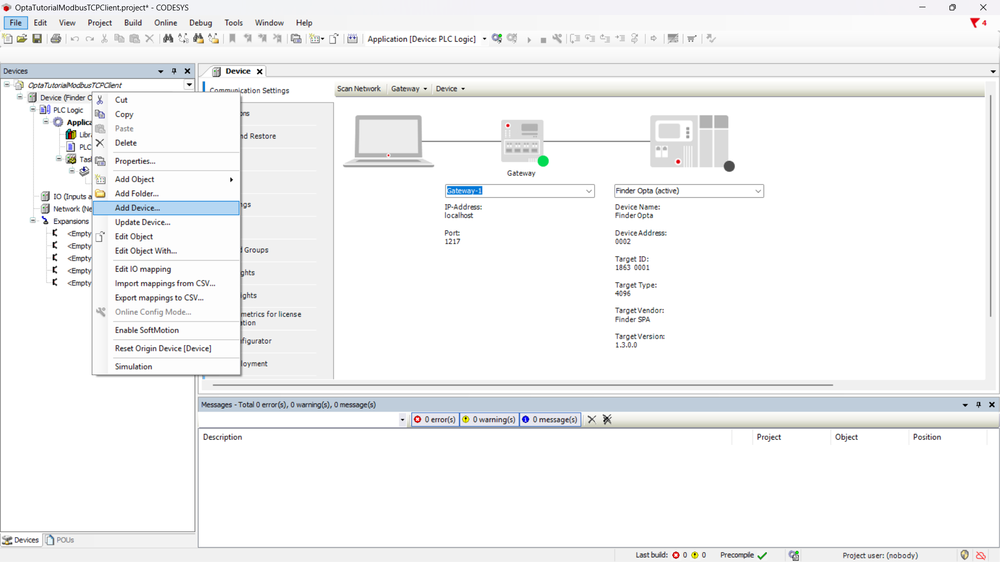

From the menu, expand the `Ethernet Adapter` item, select `Ethernet`, and click
`Add Device`.

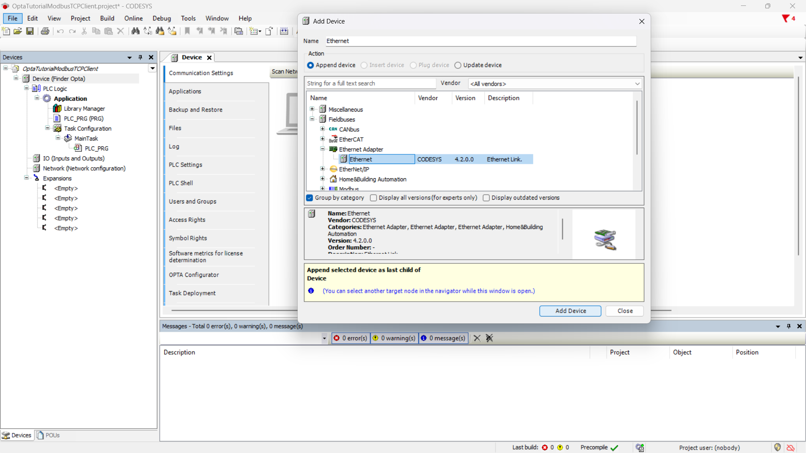

Now, double-click on the `Ethernet (Ethernet)` item in the side menu.

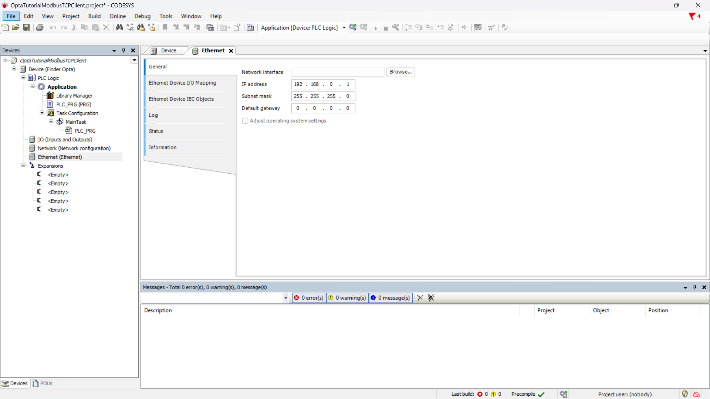

At this point, read the network configuration from the Finder OPTA: clicking
the `Browse...` button will open a window with the network parameters of the
connected device. Make sure the values are the ones of the Finder OPTA acting
as client:

- IP Address: `10.0.0.3`
- Subnet Mask: `255.255.255.0`
- Default Gateway: `10.0.0.1`

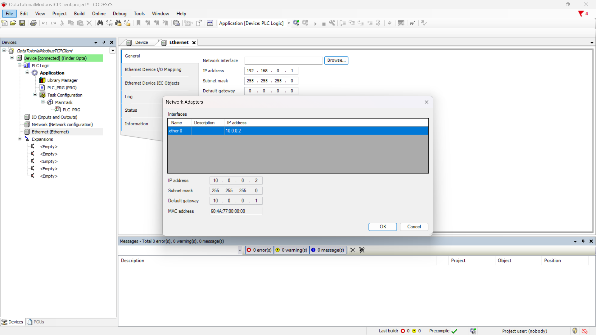

Press `OK` to keep the Finder OPTA network parameters. Before continuing,
remember to check the `Adapt operating system settings` option and then click
`Yes` to confirm the change.

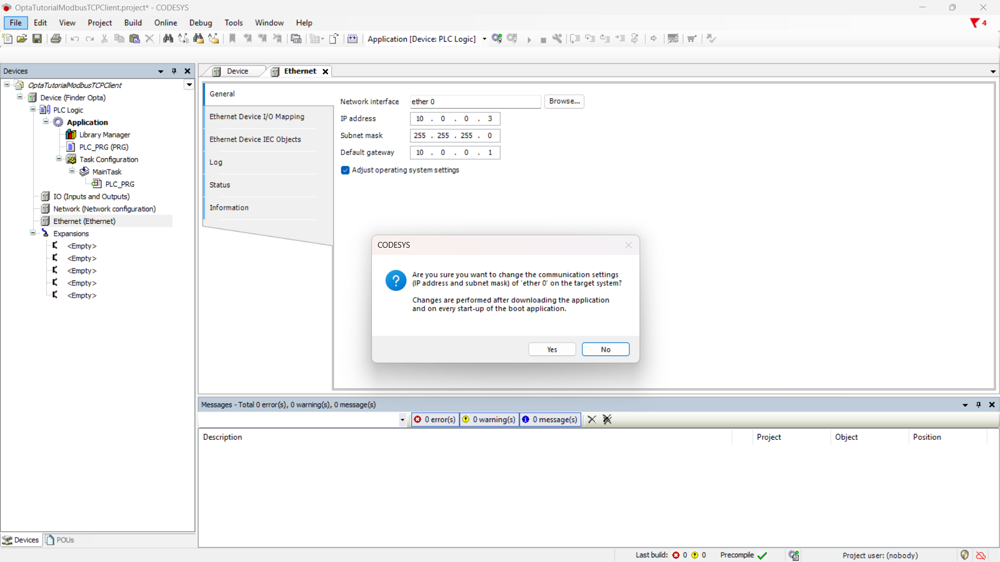

The network parameters are now set in the CODESYS project, but they are not
stored on the device yet: to save them on the Finder OPTA you need to download
the program to it. Press the green button at the top labeled `Login` and
confirm the download.

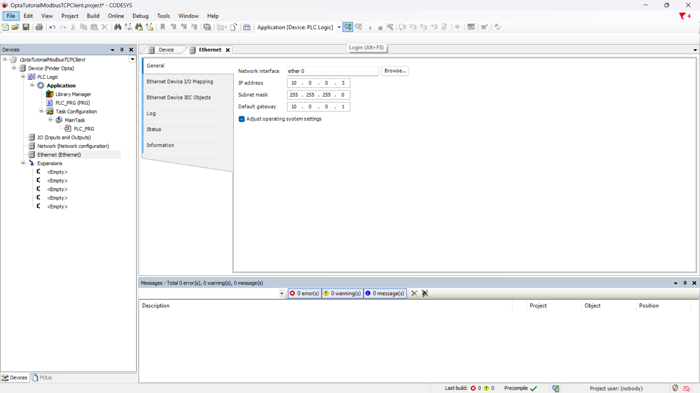

During this step CODESYS may return an error like the one shown below. This
happens because the Finder OPTA has just changed its IP address, so the project
is still pointing to the previous one. In this case simply repeat the network
scan we saw in the first steps - double-click the `Device (Finder Opta)` item,
click `Scan network` and select the Finder OPTA - to align the project with the
new IP address of the device, then press `Login` again.

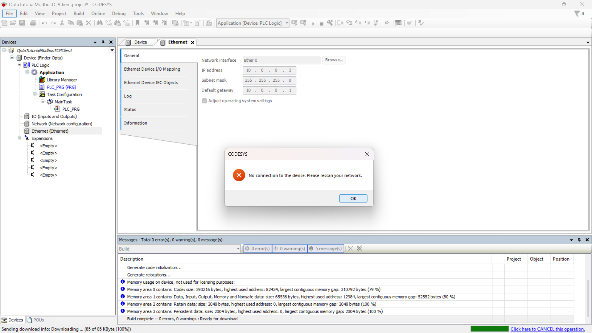

### Modbus TCP client configuration

In this section we will configure the Modbus TCP client on the Ethernet port of
the Finder OPTA, together with the remote server we want to read from and the
channel that performs the read operation.

First, add the Modbus TCP client on the Ethernet port of Finder OPTA:
right-click on the `Ethernet` item and select `Add Device...`. From the menu,
expand the `Modbus` item, click on `Modbus TCP Client` and then `Add Device`.

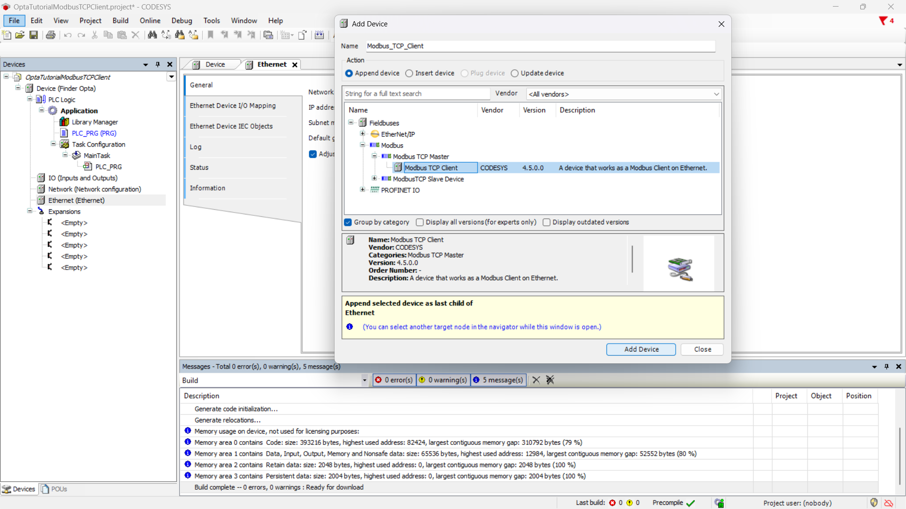

Double-click on the newly added `Modbus_TCP_Client (Modbus TCP Client)` item
and leave the default parameters: a `Response timeout` of `1000` ms is suitable
for our example.

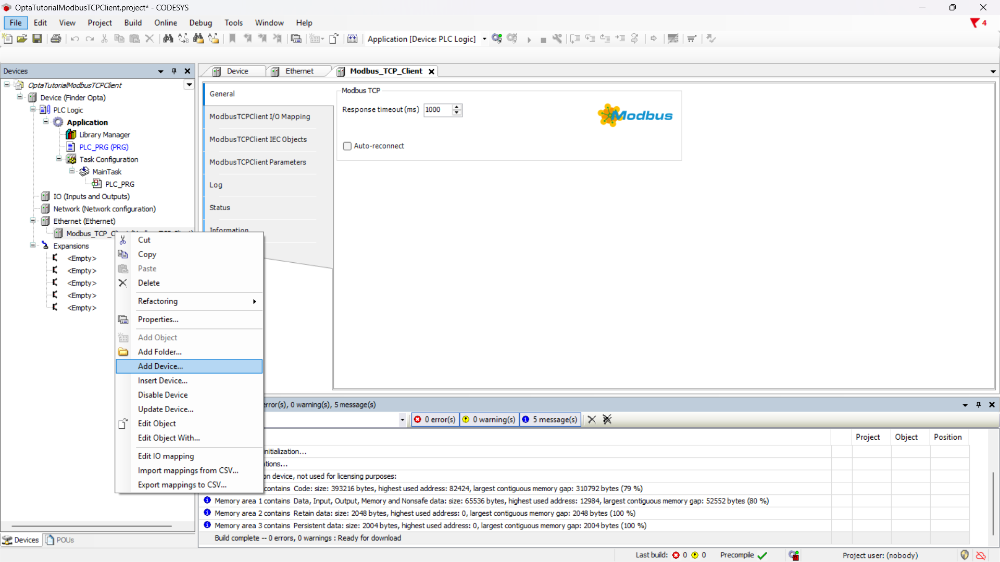

Now we describe the remote Modbus TCP server that the client has to contact,
which is the other Finder OPTA. Right-click on the
`Modbus_TCP_Client (Modbus TCP Client)` item and select `Add Device...`, then
click on `Modbus TCP Server` and `Add Device`.

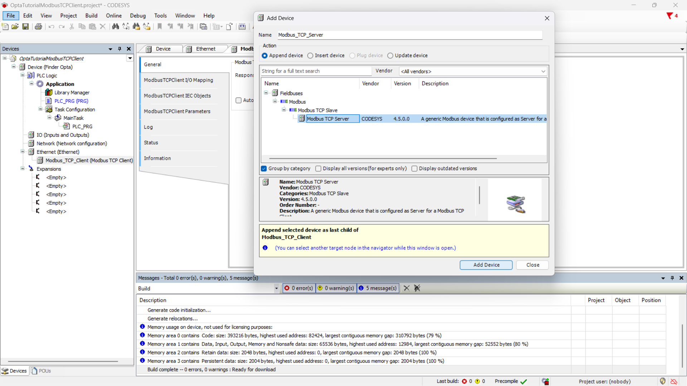

Double-click on the newly added `Modbus_TCP_Server (Modbus TCP Server)` item
and set the parameters as follows, according to the configuration of the Finder
OPTA acting as server:

- Server IP address: `10.0.0.2`, the IP address of the Finder OPTA acting as Modbus
  TCP server.
- Response timeout(ms): `1000`.
- Port: `502`, the default port for the Modbus TCP protocol.

All other parameters can be left at their default values.

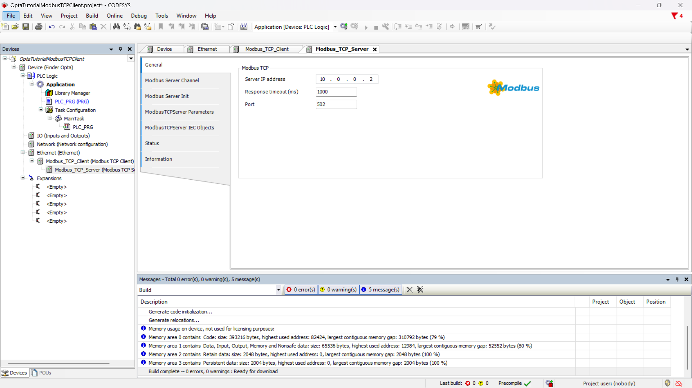

Finally, we configure the Modbus channel, meaning the read operation that the
client performs cyclically on the server. In the same screen click on the
`Modbus Server Channel` section, then on `Add channel` at the bottom right.

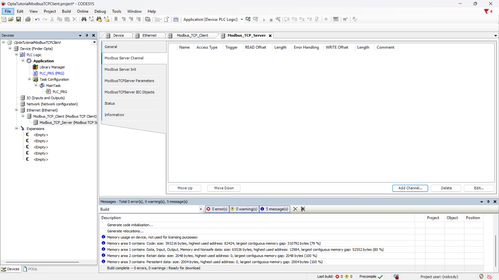

In this tutorial we read a single Input Register, the one in which the server
publishes the value of its variable. As we will see in the next section, that
register is configured at address `1` of the server, therefore we set the
channel values as follows:

- Name: `Channel 0`.
- Access type: `Read Input Registers (Function code 4)`.
- Trigger: `Cyclic`.
- Cycle time: `100`.
- Offset: `1`, the address of the Input Register we want to read.
- Length: `1`, we read a single register.
- Error handling: `Keep last value`.

The server updates its variable once per second, so reading every `500` ms is
enough to promptly follow its changes. Note that both CODESYS projects count
register addresses starting from `0`, so the offset of the channel matches the
starting address configured on the server without any conversion.

After pressing `OK`, you will see the summary of the newly configured channel.

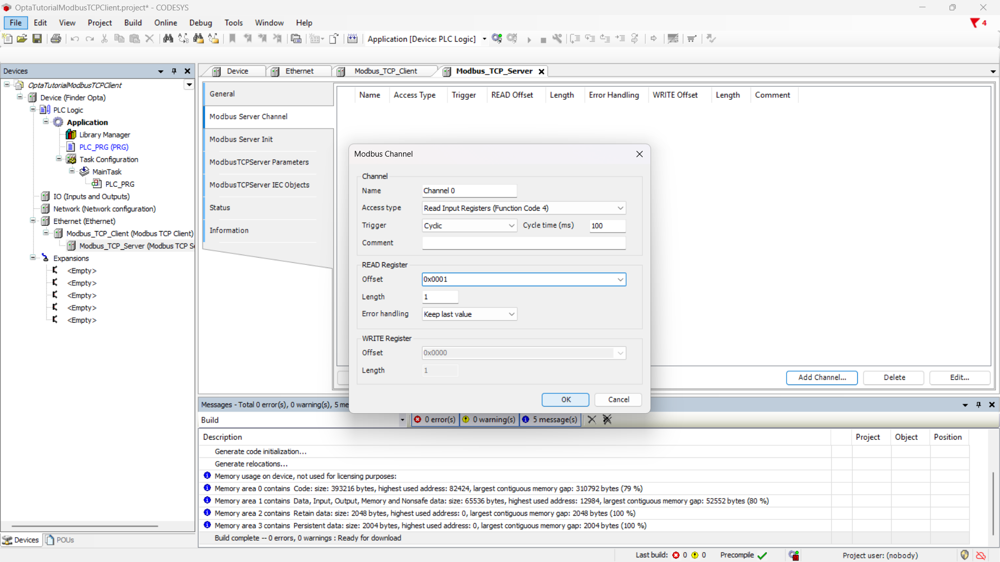

### Preparing the ST program

Now we write the ST program of the client, which switches on one of the four
LEDs of Finder OPTA depending on the value read from the Modbus TCP server.

In the side menu, click on `PLC_PRG (PRG)` and enter the following code, where
the upper part of the editor is dedicated to the variable definitions and the
lower part to the program logic:

```st
PROGRAM PLC_PRG
VAR
    led1, led2, led3, led4: BOOL := FALSE;
    state: WORD;
END_VAR

led1 := FALSE;
led2 := FALSE;
led3 := FALSE;
led4 := FALSE;

CASE state OF
    0:
        led1 := TRUE;
    1:
        led2 := TRUE;
    2:
        led3 := TRUE;
    3:
        led4 := TRUE;
END_CASE
```

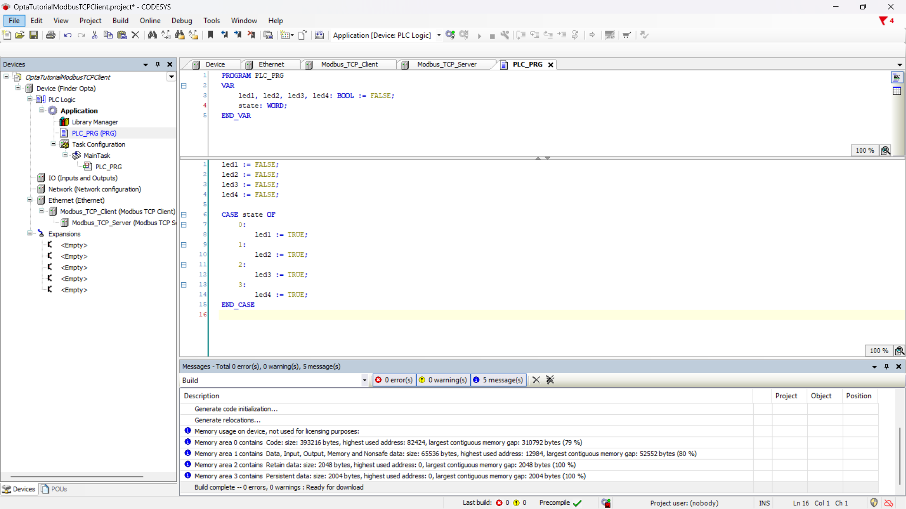

At every execution cycle the program switches off all the LEDs and then
switches on only the one corresponding to the value of the `state` variable.
The `state` variable is declared as a `WORD` because it will contain the
content of an Input Register, which in the Modbus protocol is a 16-bit value.

Now we need to associate the `state` variable with the Modbus channel we
configured, so that it contains the value read from the server. In the side
menu, double-click on `Modbus_TCP_Server (Modbus TCP Server)`, then click on
the `ModbusTCPServer I/O Mapping` section and double-click the `Variable` cell
of the `State` channel to make the options button appear.

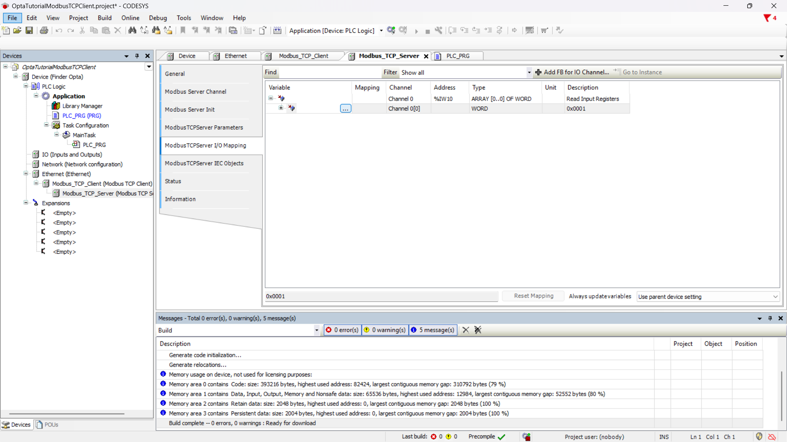

Click the options button to bring up the list of variables, expand the
`Application` item and the `PLC_PRG` item. At this point, click on the `state`
variable and press `OK` to assign it to the channel.

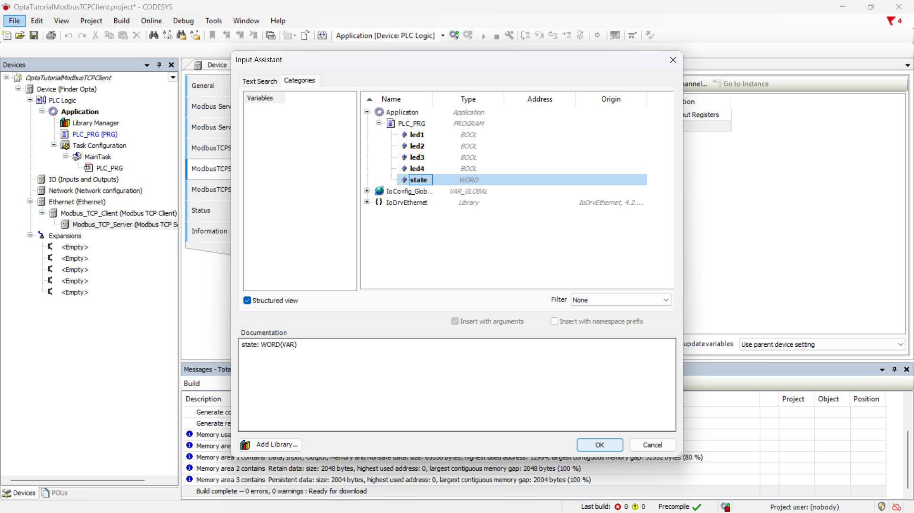

The summary shows the variable assigned to the channel. From now on, the
`state` variable contains the value of the Input Register read from the Finder
OPTA acting as Modbus TCP server.

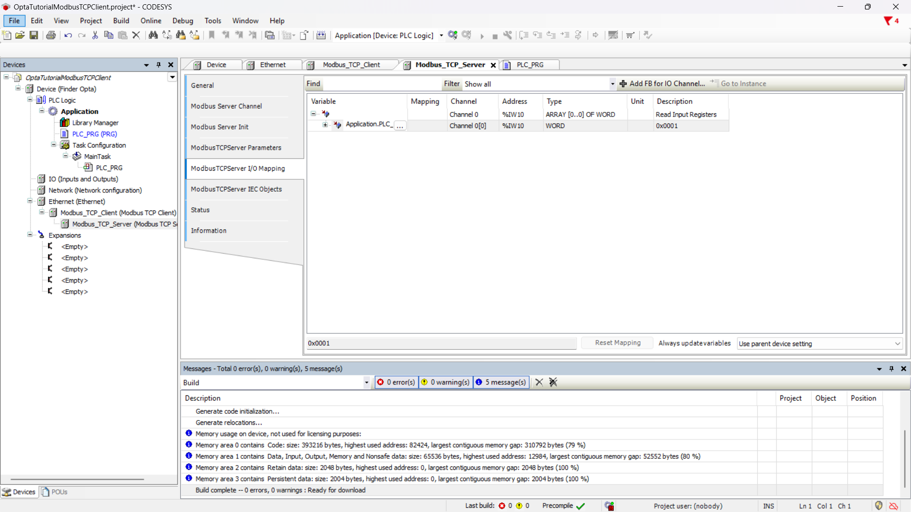

Finally, we associate the LED variables with the actual LEDs of the Finder
OPTA. Double-click on the `I/O` item in the `Devices` menu and select the
`Opta I/O Mapping` section.

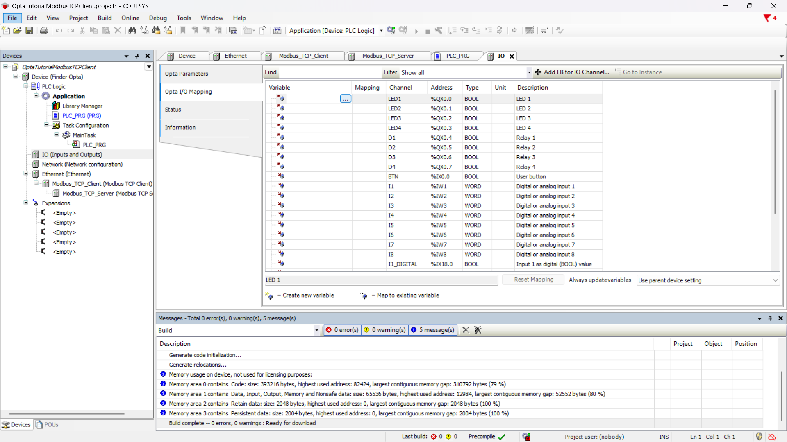

Double-click a variable cell to show the options button, click it, expand
`Application` and then `PLC_PRG` to reveal the LED variables. Map each LED to
its corresponding variable until the summary looks like the one below.

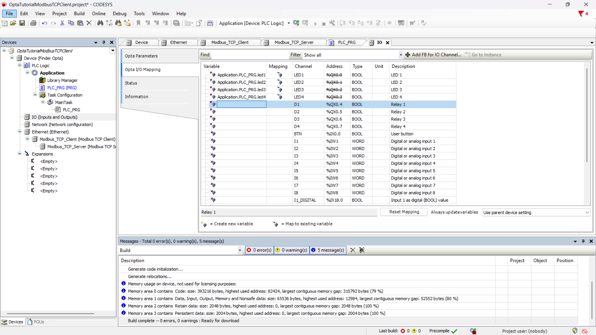

## Instructions to adapt the Modbus TCP server

The Finder OPTA acting as Modbus TCP server is the one we configured in [this
tutorial](https://opta.findernet.com/tutorial/implementare-un-server-modbus-tcp).
In this section we adapt that project to our example: instead of publishing a
counter from 0 to 100 for an HMI, the server publishes a variable that cycles
through the values `0`, `1`, `2` and `3`, changing once per second.

Open the CODESYS project of the Finder OPTA acting as server, and connect to
the device as described in the sections
[Identifying Finder OPTA via Ethernet](#identifying-finder-opta-via-ethernet)
and [Ethernet port configuration](#ethernet-port-configuration) of this
tutorial. This time, however, the network parameters of the device must be the
following:

- IP Address: `10.0.0.2`
- Subnet Mask: `255.255.255.0`
- Default Gateway: `10.0.0.1`

These are the same parameters we configured on the client, in the
`Modbus_TCP_Server (Modbus TCP Server)` item, to reach this device.

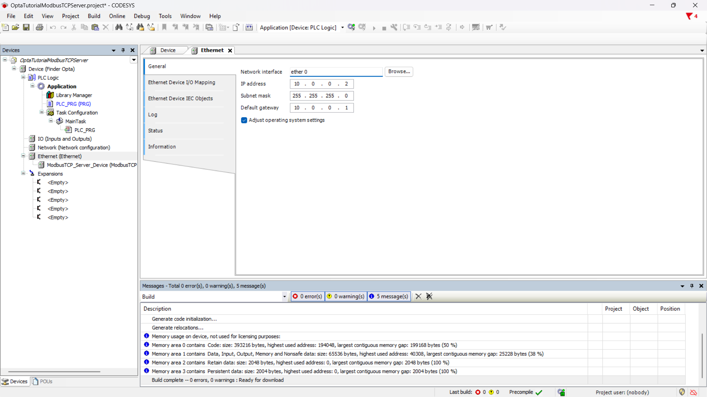

As we saw for the client, if you change the network configuration you have to
download it to the device by pressing the `Login` button, otherwise the new
parameters remain in the CODESYS project only. Here as well, should CODESYS
return an error because the IP address of the device has just changed, repeat
the network scan to align the project and then press `Login` again.

### Modifying the ST program

In the side menu of the server project, click on `PLC_PRG (PRG)` and replace
the program of the previous tutorial with the following one:

```st
PROGRAM PLC_PRG
VAR
    timer: TON;
    state: WORD := 0;
END_VAR

timer(IN := TRUE, PT := T#1S);
IF timer.Q THEN
    timer(IN := FALSE);
    state := (state + 1) MOD 4;
    timer(IN := TRUE);
END_IF
```

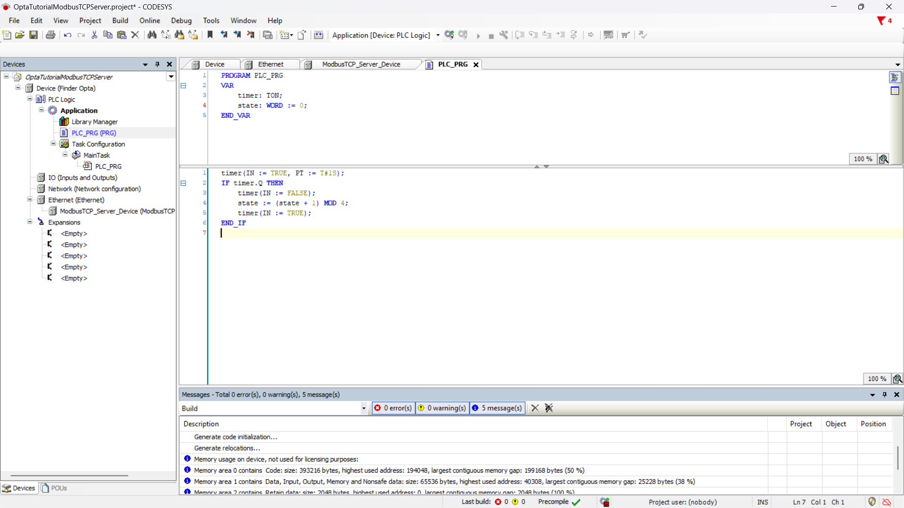

The program uses a `TON` timer with a preset time of one second: every time the
timer elapses, the `state` variable is incremented and wraps back to `0` after
the value `3`, then the timer is restarted. The variable is declared as a
`WORD` so that it can be mapped directly to an Input Register, without the
intermediate variable used in the previous tutorial.

### Checking the Modbus TCP server registers

The register configuration is the same as the one of the previous tutorial, but
it is worth checking it because it determines the address that the client has
to read. Double-click on the
`Modbus_TCP_Server_Device (ModbusTCP Server Device)` item and make sure the
values are the following:

- Server port: `502`, the default port for the Modbus TCP protocol.
- Holding registers: `2`, we are not using them so we set them to the minimum
  value.
- Input registers: `2`, we will use a single Input Register but the minimum
  value is 2.
- Holding register: `1`, the starting address for the Holding Registers.
- Input register: `1`, the starting address for the Input Registers.

All other parameters can be left at their default values.

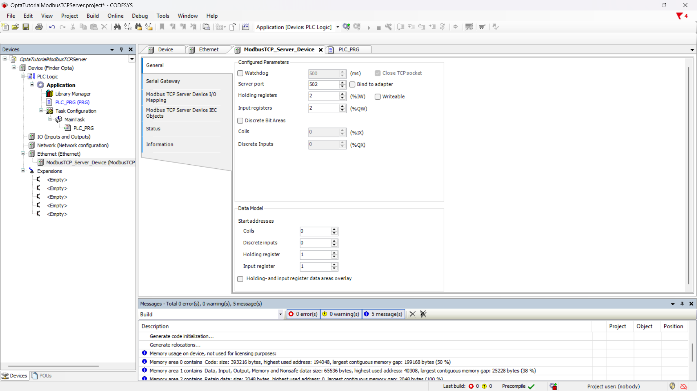

The Input Register starting address `1` is the value we set as `Offset` in the
channel of the Modbus TCP client, and it is the address at which the client
reads the variable of the server.

Now we associate the `state` variable of the server program with the Input
Register. Click on the `Modbus TCP Server Device I/O Mapping` section: as shown
below, the table lists the registers of the server and no variable is mapped to
them yet.


Expand the `Input registers` section of the table and double-click on the
`Variable` cell to make the options button appear. Click the options button,
expand the `Application` item and the `PLC_PRG` item, then click on the `state`
variable and press `OK`.

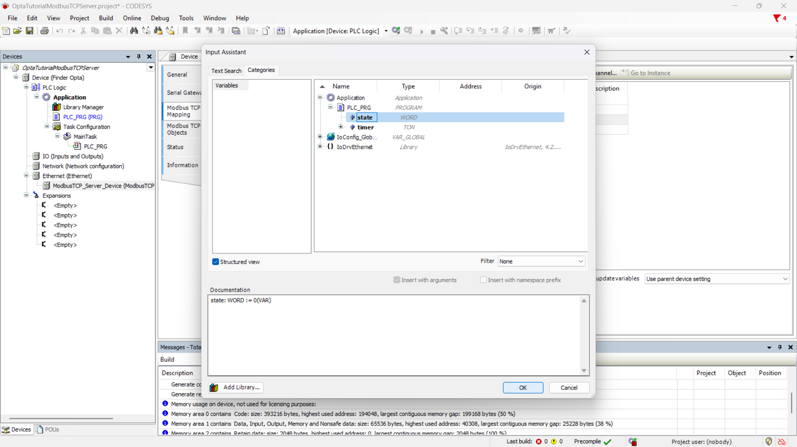

The summary shows the variable assigned to the Input Register: from now on, the
value cycling from `0` to `3` is replicated inside the Input Register of the
Modbus TCP server, ready to be read by the client.

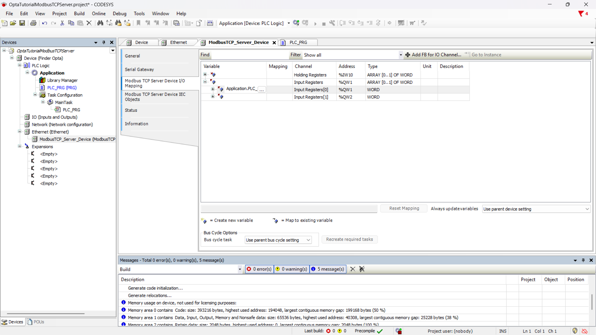

## Downloading the programs to Finder OPTA

In this step we download both projects to the respective devices, so that they
can run the code we just wrote.

Let's start with the Finder OPTA acting as server: in its CODESYS project,
download the program and the configuration to the device by pressing the green
button at the top labeled `Login`, then run the program by pressing the `Start`
button - the play button in the toolbar at the top. If a message asks to
overwrite the program running on the Finder OPTA, confirm it.

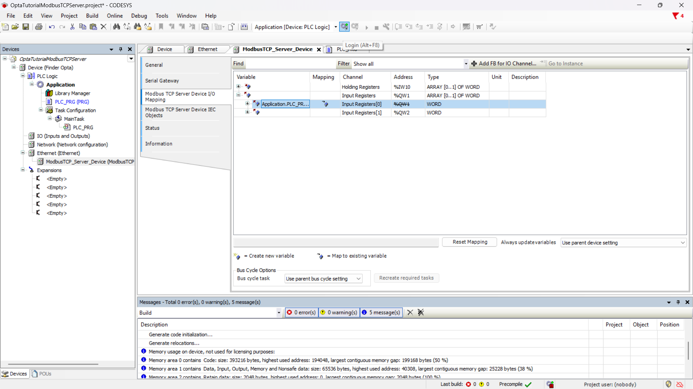

The `ModbusTCP_Server_Device` tab shows the real-time value of the variable
written in the Input Register, which changes once per second.

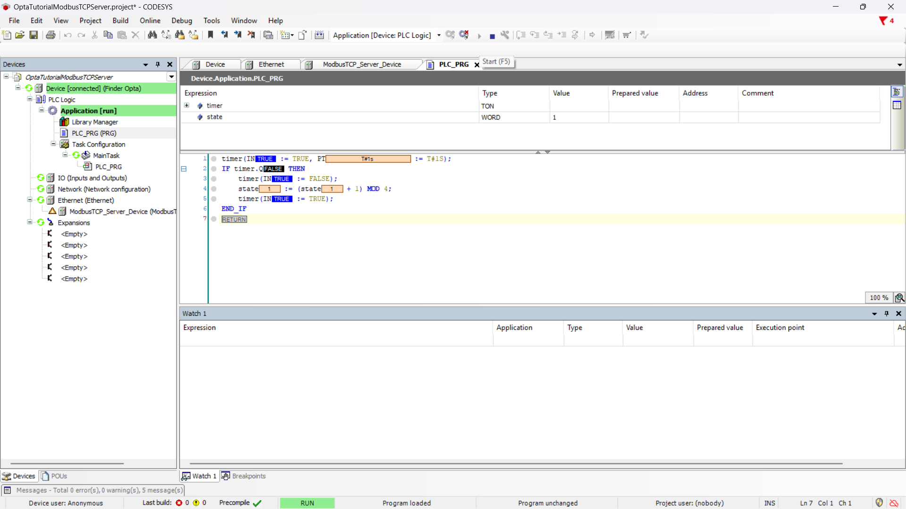

Now save the project and disconnect from the device by clicking `Logout`.
It is important **not** to press the `Stop` button before disconnecting: the
program has to keep running on the Finder OPTA acting as server, so that its
Modbus TCP server keeps publishing the value while we work on the client. Once
you have logged out, the device runs the program on its own and you can safely
move to the other project.

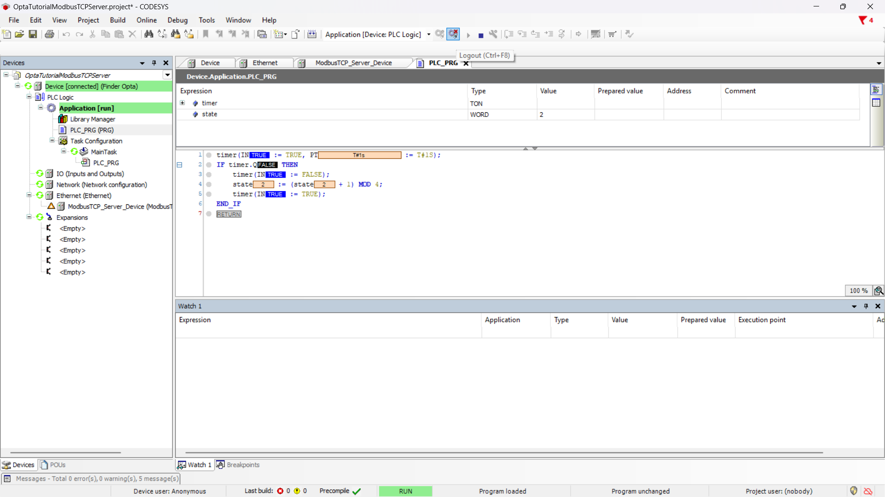

Now go back to the project of the Finder OPTA acting as client, the first one we
created in this tutorial: you can open it from the `File` menu, under
`Recent Projects`.

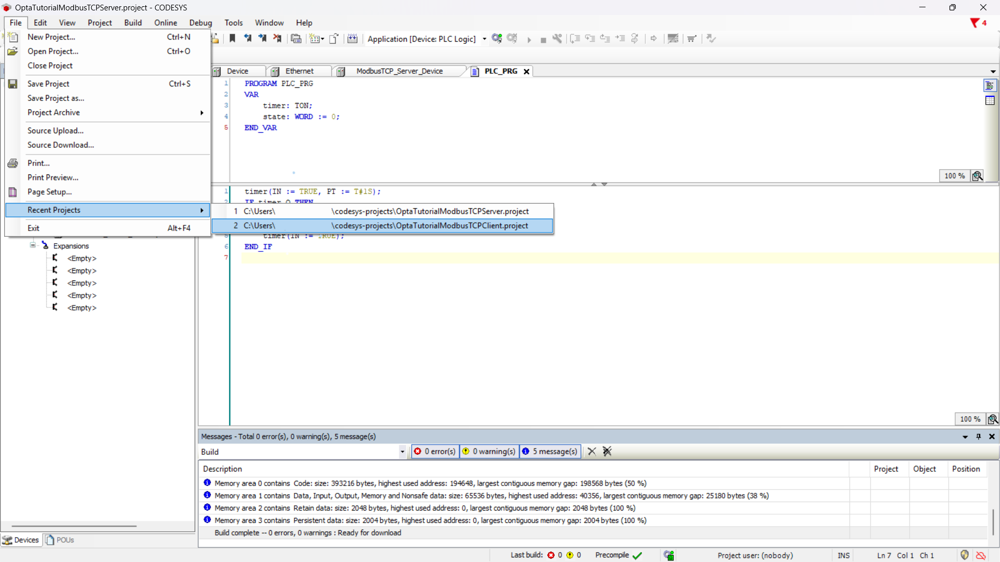

In the client project, repeat the same operations: press the green `Login`
button to download the program and the configuration, then press `Start` to run
it.

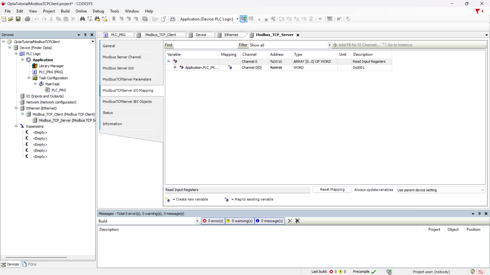

At this point the four LEDs of the Finder OPTA acting as client switch on one
at a time, following the value published by the server: the LEDs light up in
sequence and the cycle restarts every four seconds.

The `Modbus_TCP_Server` tab of the client project shows the value read from the
channel in real time, which is useful to verify the communication even without
looking at the LEDs.

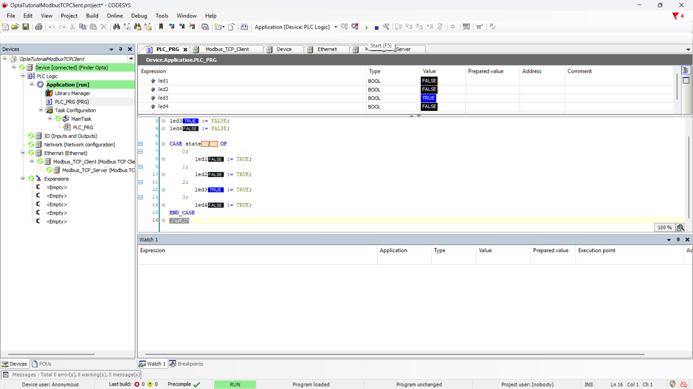

## Troubleshooting

Every Finder OPTA leaves the factory with the same default IP address
`10.0.0.2`. If you connect two factory-new devices to the same network before
changing the address of one of them, both will answer at the same address: in
this situation CODESYS is not able to tell them apart, and the network scan may
show a single device, show it intermittently, or connect to a device other than
the one you meant to configure.

For this reason we recommend configuring one Finder OPTA at a time: connect
only the device you want to work on, set its network parameters and download
them with `Login` as described above, then disconnect it and repeat the
procedure with the second device. Once the two devices have different IP
addresses - `10.0.0.2` for the server and `10.0.0.3` for the client in this
tutorial - you can connect both of them to the network and CODESYS will
identify them without any ambiguity.

If you suspect an address conflict, disconnect one of the two devices and check
that the other one answers at the expected address, for example with a `ping`
command from the terminal of your PC.

## Conclusions

By following this tutorial you have configured a Finder OPTA as a Modbus TCP
client in CODESYS, reading an Input Register exposed by a second Finder OPTA
acting as a Modbus TCP server, and using the value read to drive the LEDs of
the device.

You have seen how to:

- Configure the Ethernet port of two Finder OPTA devices on the same subnet.
- Add and parameterize a Modbus TCP client in CODESYS.
- Describe a remote Modbus TCP server and configure a cyclic read channel.
- Map the value read from a Modbus channel to a PLC variable.
- Adapt the program and the registers of the Finder OPTA acting as server.

If you encounter difficulties during the implementation, carefully check the
network configuration of the two devices, the configured Modbus addresses, and
the register mapping. Make sure the two Finder OPTA devices have different IP
addresses on the same subnet, and that the `Offset` of the client channel
matches the starting address of the Input Registers of the server: an incorrect
Modbus address configuration is the most frequent cause of incorrect readings
or communication failure between the two devices.

<!-- Add contact info for support -->
