# Implementare un server Modbus TCP su Finder OPTA per esporre valori a un HMI

Scopri come configurare Finder OPTA come server Modbus TCP in CODESYS,
esponendo una variabile tramite un registro Modbus in modo che un HMI esterno
possa leggerla e visualizzarla.

## Panoramica

Grazie alla porta Ethernet integrata, Finder OPTA può comportarsi da server
Modbus TCP ed esporre a qualsiasi client Modbus TCP connesso i valori delle
proprie variabili sotto forma di registri Modbus. Questa funzionalità risulta
particolarmente utile quando si desidera visualizzare questi valori su pannelli
HMI che supportano Modbus TCP, consentendo - ad esempio - di inserire Finder
OPTA in un sistema di monitoraggio.

In questo tutorial vedremo come configurare il Finder OPTA come server Modbus
TCP utilizzando CODESYS. Per rendere l’esempio concreto, implementeremo un
semplice programma che contiene un contatore da 0 a 100, incrementato a ogni
ciclo di esecuzione del PLC. Il valore del contatore verrà poi pubblicato dal
server Modbus TCP sotto forma di Input Register, rendendolo leggibile da un
qualsiasi client Modbus TCP.

Inizieremo creando un nuovo progetto in CODESYS e scrivendo il programma ST che
implementa il contatore. Successivamente configureremo la porta Ethernet di
Finder OPTA, e infine aggiungeremo e configureremo il server Modbus TCP, mappando
la variabile del contatore a uno degli Input Register.

Completata la configurazione, scaricheremo il progetto su Finder OPTA e
mostreremo due esempi di programmi per HMI che leggono e mostrano il valore
contenuto nell'Input Register del server Modbus TCP. Per questo tutorial
abbiamo verificato il funzionamento del sistema utilizzando un HMI Kinco GR070E
e un HMI Weintek MT8051iE.

## Obbiettivi

- Configurare la porta Ethernet di Finder OPTA in CODESYS
- Configurare un server Modbus TCP con Finder OPTA in CODESYS
- Esporre il contenuto di una variabile ad un client Modbus TCP
- Verificare il funzionamento del server Modbus TCP con un HMI Kinco GR070E o
  un HMI Weintek MT8051iE

## Requisiti

Prima di iniziare, assicurati di avere:

- [PLC Finder OPTA CODESYS](https://opta.findernet.com/it/codesys) (x1)
- [Alimentatore switching 12W o 25W per OPTA CODESYS](https://opta.findernet.com/it/codesys#moduli-espansione) (1x)
- Cavo Ethernet (x1)
- [HMI Kinco GR070E](https://en.kinco.cn/productdetail/gr04334.html) o
  [HMI Weintek MT8051iE](https://dl.weintek.com/public/MT8000iE/eng/Datasheet/MT8051iE1_Datasheet_ENG.pdf)
  con relativo alimentatore (x1)
- Ambiente di sviluppo CODESYS installato con plug-in OPTA Configurator. Trovi
  una guida all'installazione [a questo link](https://opta.findernet.com/it/tutorial/codesys-plugin-tutorial).
- Rete configurata correttamente: il PC deve comunicare correttamente con
  Finder OPTA tramite Ethernet. Trovi una guida alla configurazione
  [a questo link](https://opta.findernet.com/it/tutorial/codesys-via-ethernet).

Per seguire questo tutorial, sarà necessario alimentare il Finder OPTA con
l'alimentatore switching per OPTA CODESYS. Sarà inoltre necessario alimentare
il pannello HMI con un alimentatore appropriato: si invita il lettore a fare
riferimento alla documentazione del proprio modello di HMI.

## Istruzioni per creare il server Modbus TCP

Questo tutorial mostra come configurare Finder OPTA come server Modbus TCP per
rendere disponibile via Modbus TCP il valore di una variabile. In questo modo
un HMI con supporto al protocollo Modbus TCP può leggere e mostrare il valore.

### Creazione progetto CODESYS

Apri CODESYS.

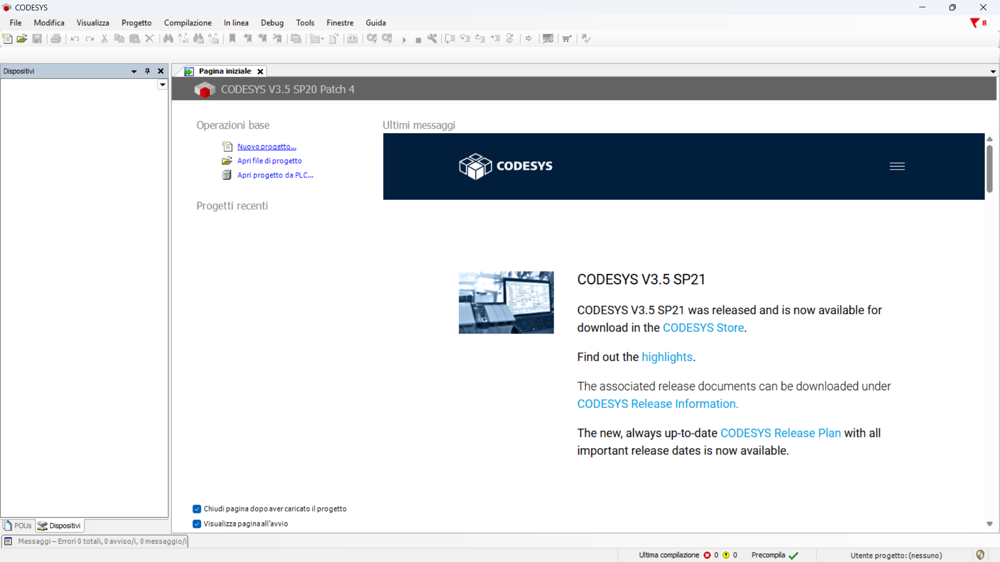

Crea un nuovo progetto e scegli `Progetto standard`.

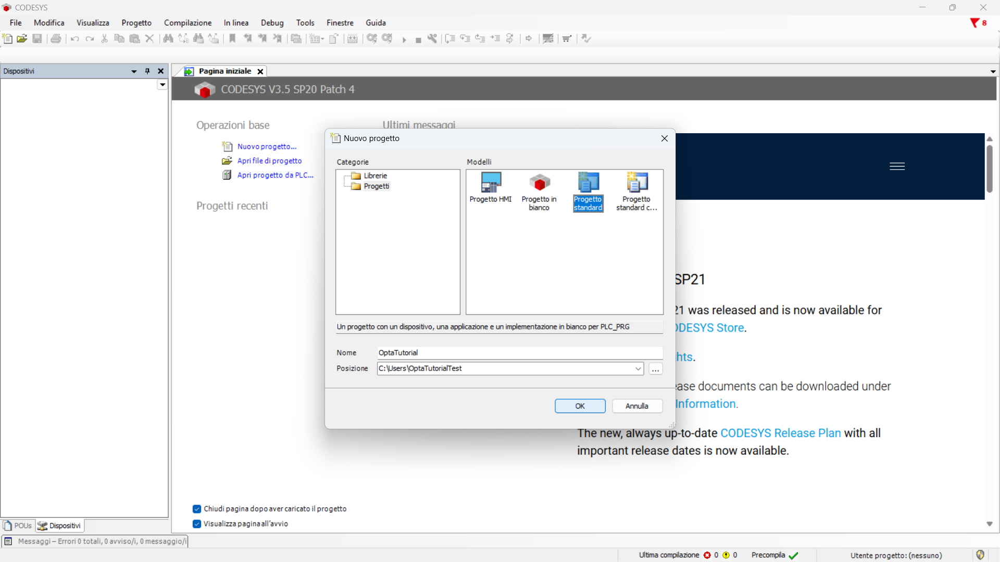

Assicurati che il dispositivo sia `Finder Opta`, poi seleziona il linguaggio del programma.

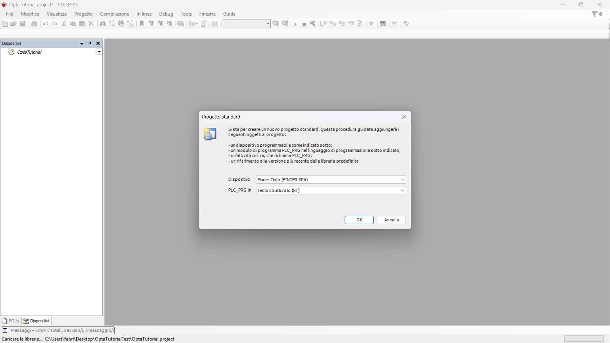

### Identificazione Finder OPTA via Ethernet

Fai doppio click sulla voce `Device (Finder Opta)` del menu `Dispositivi`, si aprirà una scheda come mostrato qui
sotto.

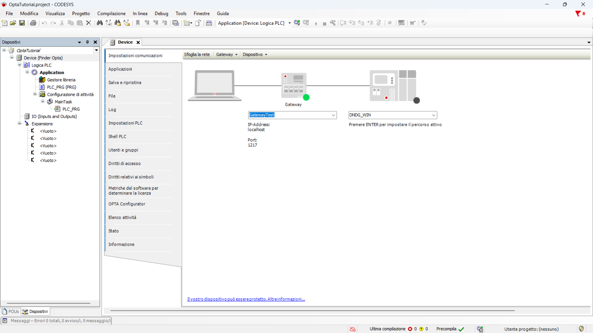

Premi il bottone `Sfoglia la rete` e assicurati di vedere il dispositivo Finder OPTA comparire sotto il Gateway, poi premi `OK`.


### Preparazione del programma ST

Adesso scriviamo il programma ST che implementa il contatore da 0 a 100. Alla
fine di ogni ciclo, il valore del contatore, viene copiato all'interno di una
variabile cha mapperemo all'Input Register del server Modbus TCP.

Nel menu laterale, clicca su `PLC_PRG (PRG)`.

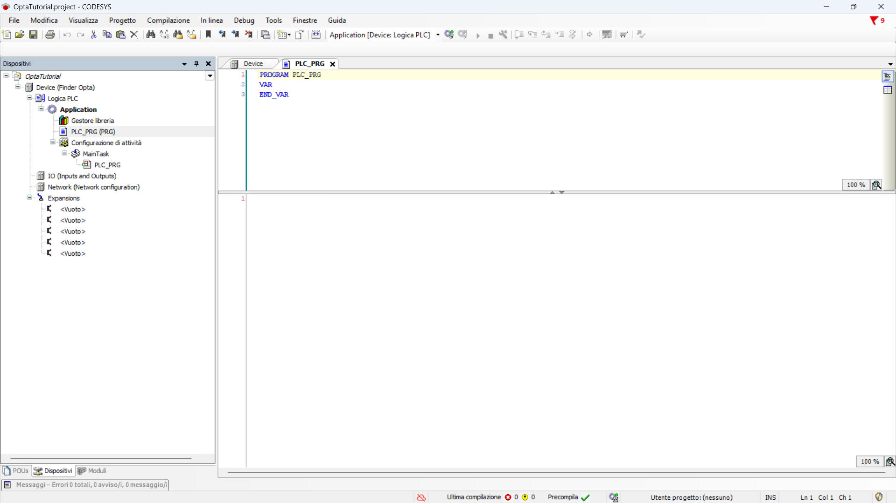

Nella parte superiore dell'editor - dedicata alla definizione delle variabili -
inserisci il seguente codice:

```st
PROGRAM PLC_PRG
VAR
    count: WORD := 0;
    mbCount: WORD;
END_VAR
```

Nella parte inferiore dell'editor - dedicata alla logica del programma -
inserisci il seguente codice:

```st
IF count < 100 THEN
    count := (count + 1);
ELSE
    count := 0;
END_IF

mbCount := count;
```

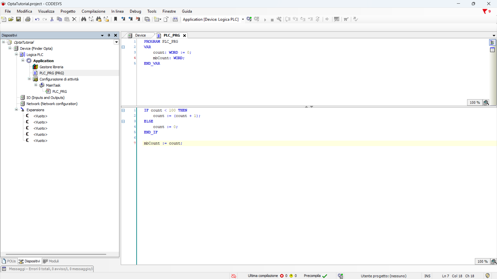

### Configurazione della porta Ethernet

In questa sezione configuriamo la porta Ethernet di Finder OPTA in CODESYS,
specificando l'indirizzo IP a cui sarà accessibile il server Modbus TCP.

Iniziamo aggiungendo l'adattatore Ethernet: premi il testo destro sulla voce
`Device (Finder OPTA)` e scegli `Aggiungi dispositivo...`.


Dal menu, espandi la voce `Adattatore Ethernet`, seleziona `Ethernet` e clicca
su `Aggiungi dispositivo`.

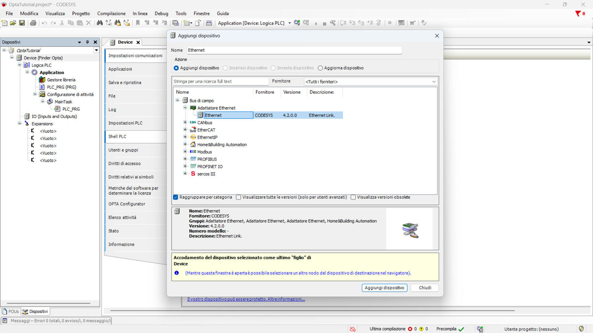

Adesso clicca due volte sulla voce `Ethernet (Ethernet)` nel menu laterale.

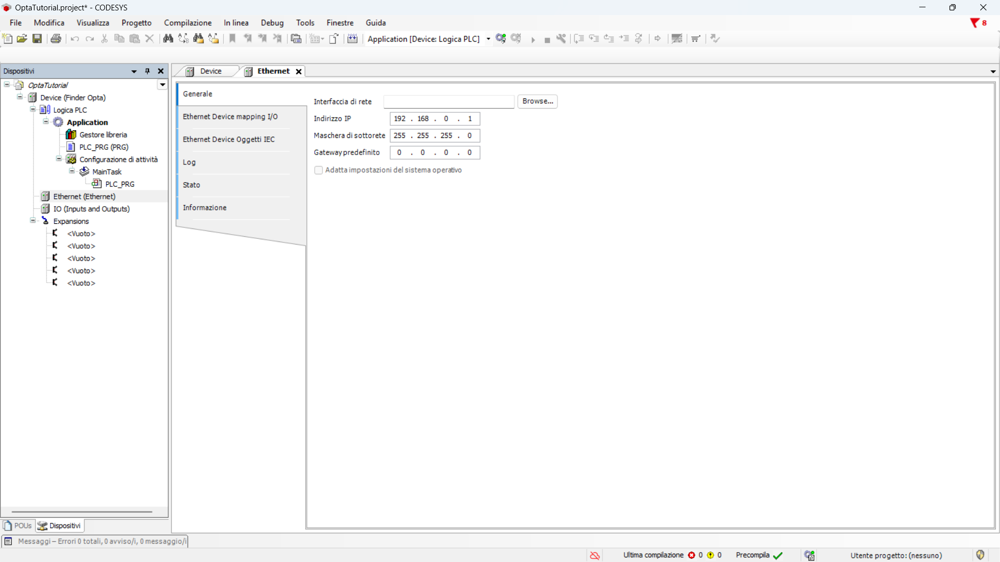

A questo punto leggi da Finder OPTA la sua configurazione di rete: cliccando
sul pulsante `Browse...` appare una finestra con i parametri di rete del
dispositivo collegato.


Premi `OK` per mantenere i parametri di rete di Finder OPTA. Prima di
proseguire ricordati di spuntare l'opzione `Adatta impostazioni del sistema
operativo` e successivamente clicca su `Yes` per confermare la modifica.


### Configurazione del server Modbus TCP

In questa sezione configuriamo un server Modbus TCP su Finder OPTA. Questo
server è raggiungibile via Ethernet all'indirizzo IP precedentemente
configurato. Il server Modbus TCP espone in un Input Register il valore del
contatore calcolato dal programma ST.

Come prima cosa aggiungi un dispositivo slave Modbus TCP alla porta Ethernet di
Finder OPTA: clicca il tasto destro sulla voce `Ethernet` e `Aggiungi
dispositivo...`. Successivamente, configuriamo un server Modbus TCP sullo
slave. Dal menu espandi la voce `Modbus` poi `Dispositivo slave ModbusTCP`,
clicca su `ModbusTCP Server Device` e `Aggiungi dispositivo`.

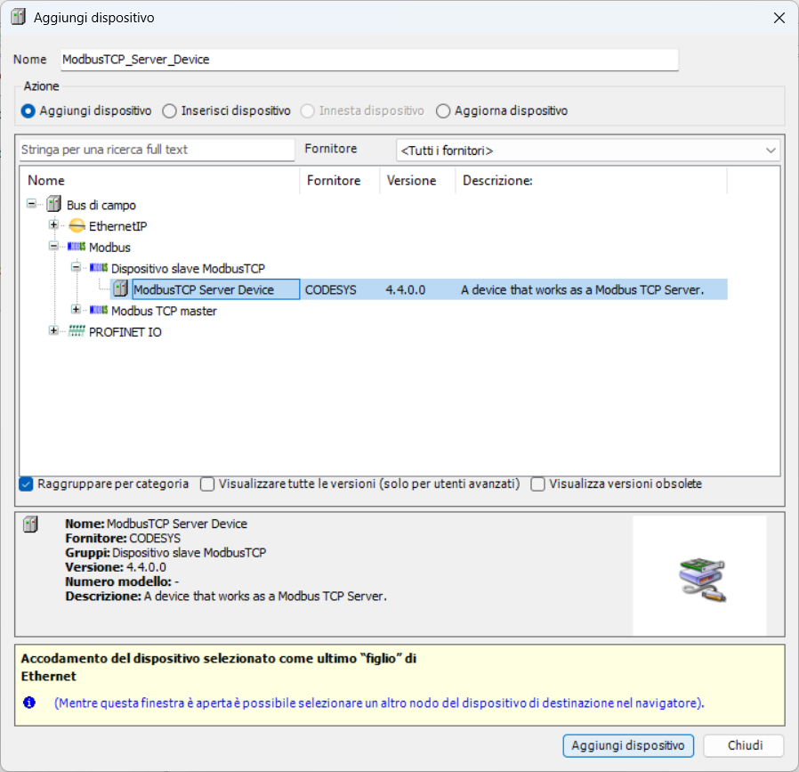

Adesso puoi configurare i regsitri del server Modbus. In particolare, serve
almeno un Input Register per contenere il valore del contatore. Imposta i
valori come segue:

- Porta del server: `502`, porta di default per il protocollo Modbus TCP.
- Registri di holding: `2`, non li utilizziamo quindi li impostiamo al valore
  minimo.
- Registri di ingresso: `2`, utilizzeremo un singolo Input Register ma il
  valore minimo è 2.
- Registro di holding: `1`, indirizzo di partenza degli Holding Register.
- Registro di ingresso: `1`, indirizzo di partenza degli Input Register.

Tutti gli altri parametri possono essere lasciati al valore predefinito.

Il configuratore di CODESYS conta gli indirizzi a partire da `0` e permette di
configurare i registri del server Modbus TCP a partire dall'indirizzo `0`.
Tuttavia gli IDE utilizzati per programmare alcuni HMI accetano `1` come valore
minimo: per rendere questo tutorial compatibile con il maggior numero di HMI
possibile, gli indirizzi di partenza del nostro server Modbus TCP sono
impostati a `1`. Inoltre, nel protocollo Modbus gli Holding Register e gli
Input Register appartengono a spazi di indirizzi distinti, quindi nulla vieta
di farli partire entrambi dallo stesso indirizzo.

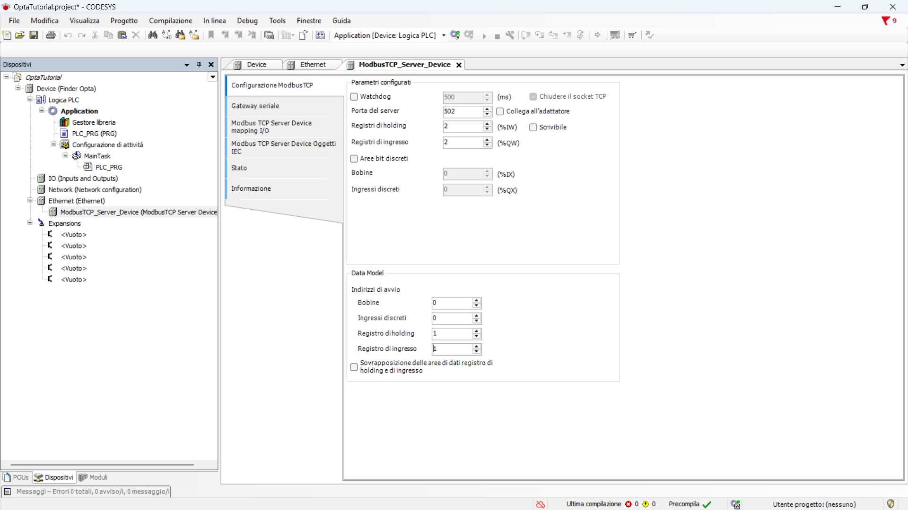

Adesso è necessario associare la variabile del contatore all'Input Register del
server Modbus TCP. Clicca sulla sezione `Modbus TCP Server Device mapping I/O`
e nella tabella espandi la sezione `Registri di input`, poi clicca due volte
sulla cella `Variabile` per far comparire il pulsante opzioni.

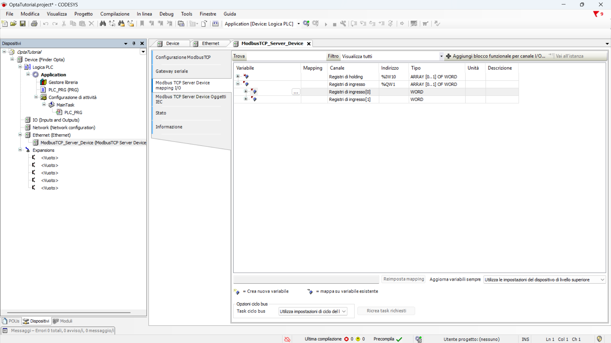

Clicca sul pulsante opzioni per far comparire la lista di variabili, espandi la
voce `Application` e la voce `PLC_PRG`. A questo punto clicca sulla variabile
`mbCount` e premi `OK` per assegnarla all'Input Register.

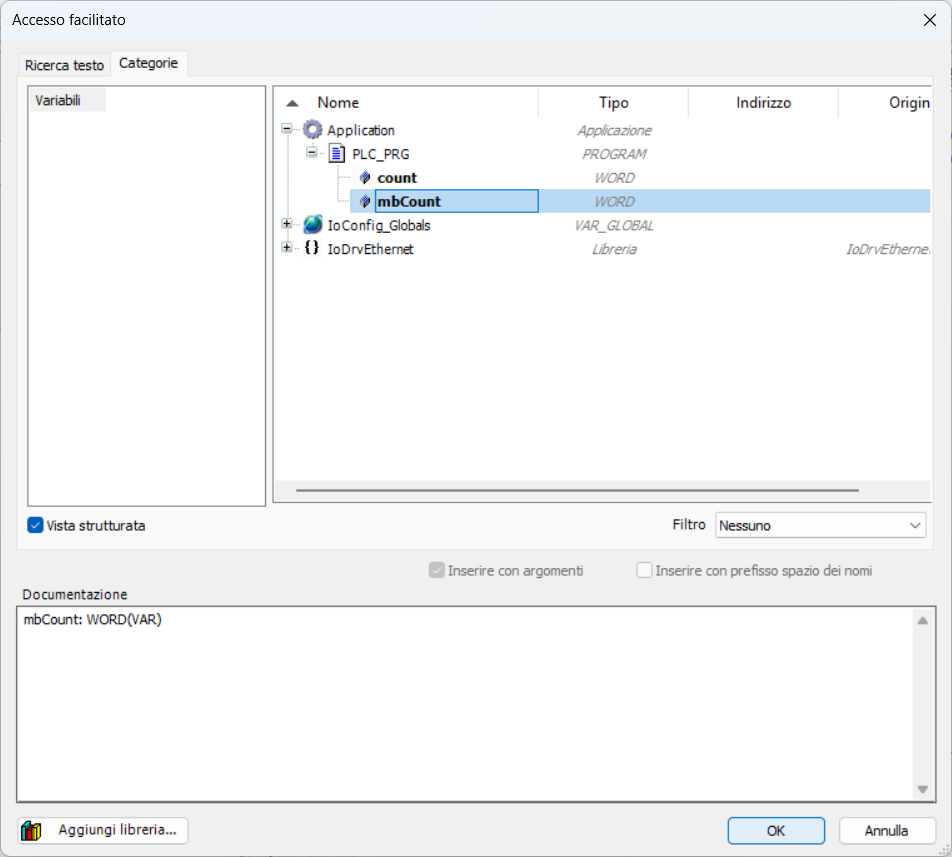

Il riepilogo mostra la variabile assegnata all'Input Register.


Dopo questo passaggio il valore del contatore viene replicato all'interno
dell'Input Register del server Modbus TCP. Sarà quindi possibile per un client
accedere al registro per leggere e mostrare il valore.

### Caricamento del programma su Finder OPTA

In questa fase, scarichiamo il programma e la configurazione hardware su Finder
OPTA, così che esegua il codice appena scritto e restituisca il valore del
contatore.

Scarica il programma e la configurazione sul dispositivo premendo il pulsante
verde in alto etichettato come `Login`.

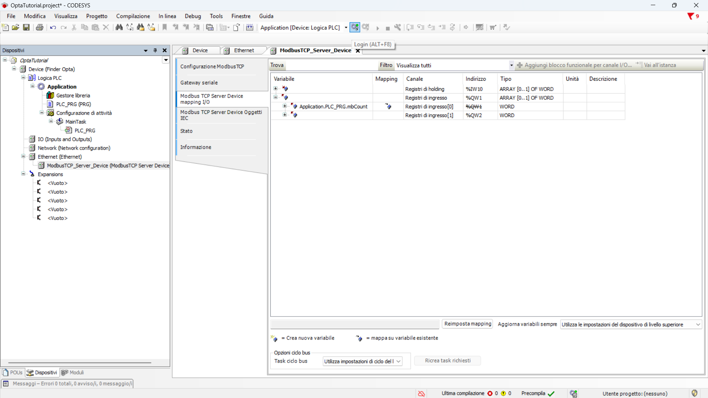

Terminato lo scaricamento, il programma è scaricato su Finder OPTA. Fallo
partire premendo il pulsante `Start`.

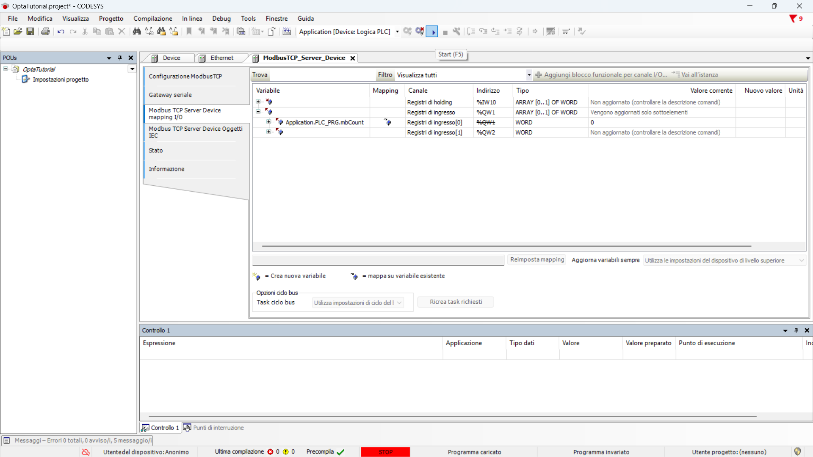

La tab `ModbusTCP_Server_Device` mostra in tempo reale il valore del contatore
scritto nell'Input Register.

## Istruzioni per creare un client Modbus TCP

Come detto in precedenza, per questo tutorial abbiamo verificato il
funzionamento del sistema utilizzando un HMI Kinco GR070E e un HMI Weintek
MT8051iE. A conclusione di questo tutorial implementeremo un programma per
ciascun HMI, che consenta al lettore di mostrare sullo schermo del pannello il
valore del contatore letto da Finder OPTA tramite Modbus TCP.

Sarà premura del lettore assicurarsi che l'HMI sia alimentato in maniera
corretta e che sia connesso tramite Ethernet a Finder OPTA, e al computer
da cui lo si programma.

### Programma per HMI Kinco GR070E

Crea un nuovo progetto utilizzando l'IDE [Kinco DTools](https://en.kinco.cn/download/hmisoftware.html)
e aggiungi al progetto l'HMI GR070E: dal pannello laterale chiamato `HMI`,
individua il modello corretto e trascinalo all'interno della schermata
principale del progetto.

Fai doppio click sull'icona del pannello e inserisci la configurazione di rete.


Dalla stessa schermata fai click su `System Param Settings` e aggiungi
un dispositivo con manifacturer `Modbus` e protocol `Modbus TCP Slave
(Zero-based Addressing)`. Questo dispositivo rappresenta il Finder OPTA,
pertanto configuriamo la sua rete con gli stessi parametri che abbiamo indicato
su CODESYS:

- IP Address: `10.0.0.2`.
- Port number: `502`.
- Station number: `1`.

Terminata la configurazione, il dispositivo comparirà nella lista con la
propria configurazione.

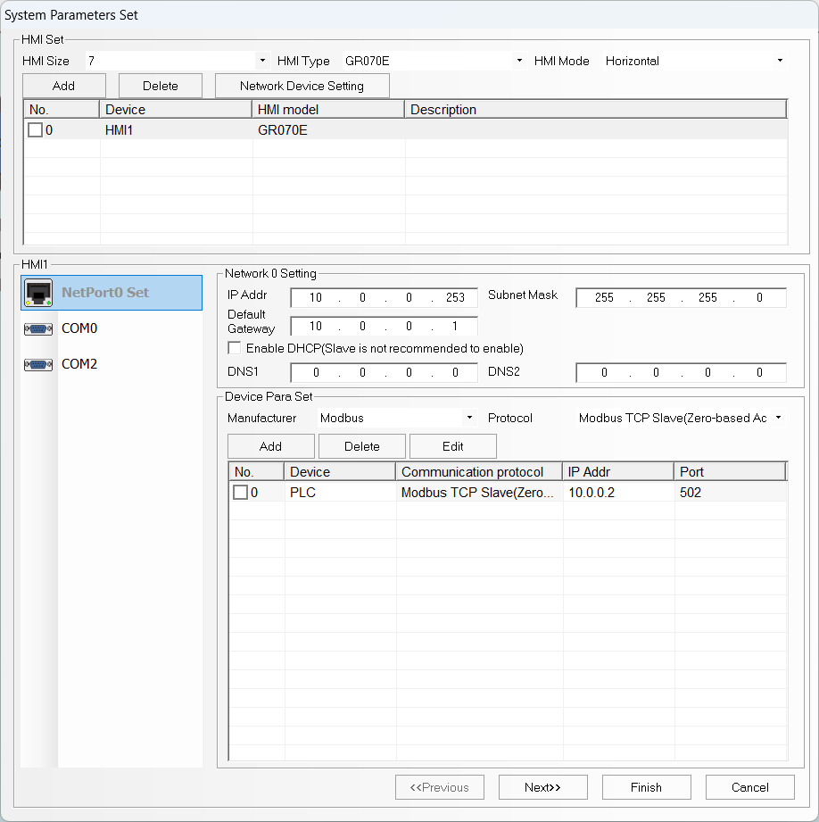

Chiudi la schermata di configurazione facendo click su `Finish` e poi su `Ok`.
A questo punto vedrai il tuo HMI e il server Modbus TCP configurati e connessi.


Dal pannello laterale destro espandi le sezione `HMI` > `Frames` e fai doppio
click su `Frame0`. Seleziona un elemento di tipo `Number Component` e trascinalo
nella griglia degli elementi grafici.


Fai doppio click sul componente che hai appena creato e configuralo con i
seguenti parametri, che ci permettono di leggere un Input Register
all'indirizzo 1 del server Modbus TCP e mostrarne il valore all'interno del
componente numerico.


A questo punto non resta che confermare la configurazione facendo click su `OK`
e poi premere il bottone `Download` per scaricare il programma sul pannello.
Assciurati che la configurazione di rete sia come quella mostrata in figura,
diversamente impostala facendo click su `Set`.


Fai click su `Download` e attendi: quando il programma sarà scaricato sull'HMI,
il pannello mostrerà il valore del contatore letto da Finder OPTA.

### Programma per HMI Weinter MT8051iE

Crea un nuovo progetto utilizzando l'IDE [EasyBuilder Pro](https://www.weintek.com/Software/EasyBuilder/EasyBuilderPro)
e seleziona il modello `MT8050iE / MT8051iE`.

Successivamente, comparirà la schermata dei dispositivi: fai click su `Nuovo
dispositivo` e aggiungi il server Modbus TCP impostando i parametri come
mostrato in figura, in accordo con quanto configurato su CODESYS.

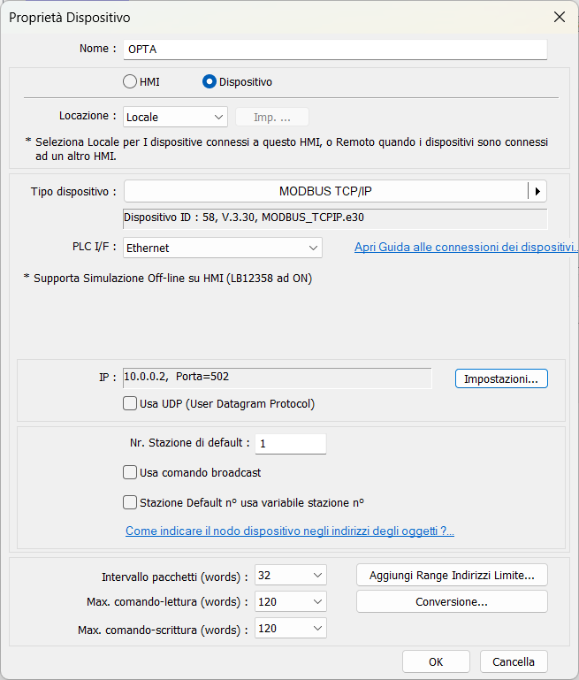

Fai click sul menù `Oggetto` e aggiungi un componente `Numerico`.


Imposta la seguente configurazione per leggere un Input Register all'indirizzo
1 del server Modbus TCP e mostrarne il valore all'interno del componente
numerico. Nota che - a differenza dell'HMI Kinco - l'HMI Weintek conta sempre
gli indirizzi a partire da 0, pertanto andremo a leggere il secondo indirizzo
`3x`.


Fai click su `OK` e poi al centro della schermata per inserire il componente.

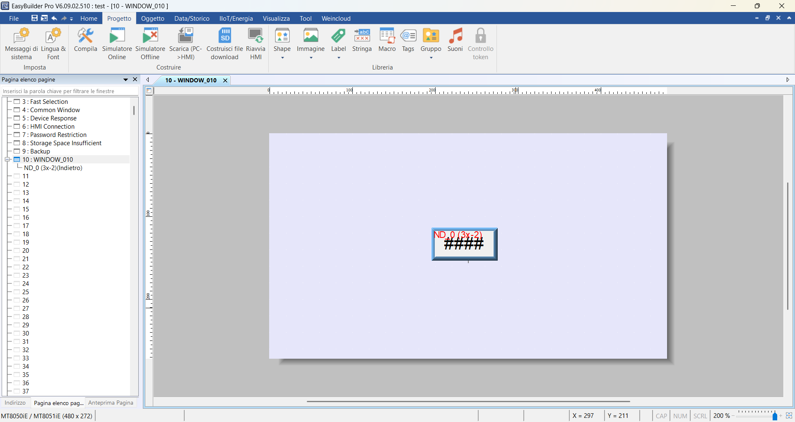

Fai click sul menù `Progetto` e poi su `Scarica (PC > HMI)`: a questo punto
dovrai indicare l'indirizzo IP del tuo HMI, che dovrà appartenere alla stessa
sottore di Finder OPTA. L'indirizzo IP dell'HMI Weintek e configurabile
utilizzando il pannello touch screen del dispositivo, e in questo caso lo
abbiamo impostato a `10.0.0.252`, quindi imposta lo stesso IP nella schermata
di download.

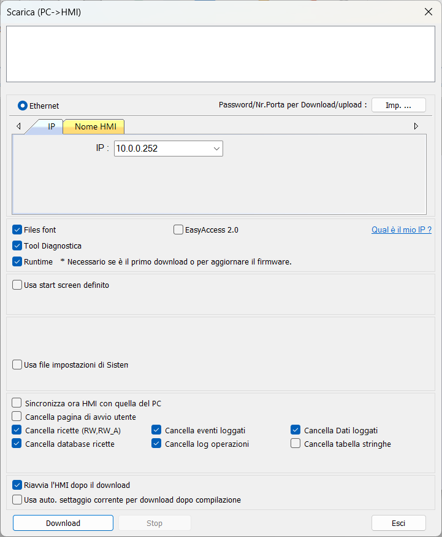

Fai click su `Download` e attendi: quando il programma sarà scaricato sull'HMI,
il pannello mostrerà il valore del contatore letto da Finder OPTA.

## Conclusioni

Seguendo questo tutorial hai configurato Finder OPTA come server Modbus TCP in
CODESYS, esponendo una variabile interna attraverso un Input Register e
rendendola leggibile da un qualsiasi HMI compatibile.

Hai visto come:

- Creare un semplice programma ST per generare un valore da pubblicare.
- Configurare la porta Ethernet di Finder OPTA.
- Aggiungere e parametrizzare un server Modbus TCP in CODESYS.
- Mappare una variabile del PLC a un registro Modbus.
- Leggere il valore tramite due HMI.

Se durante l’implementazione riscontri difficoltà, verifica attentamente la
configurazione di rete del PLC e dell’HMI, gli indirizzi Modbus impostati e la
mappatura dei registri. Una configurazione errata degli indirizzi Modbus è la
causa più frequente di letture non corrette o mancata comunicazione tra Finder
OPTA e l'HMI.
