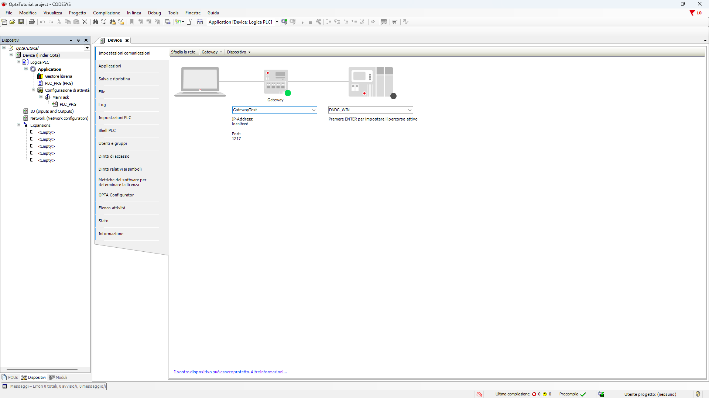
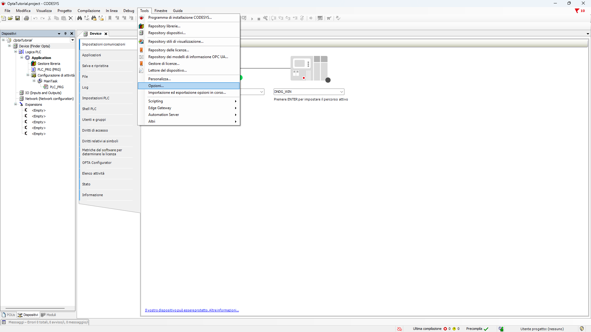
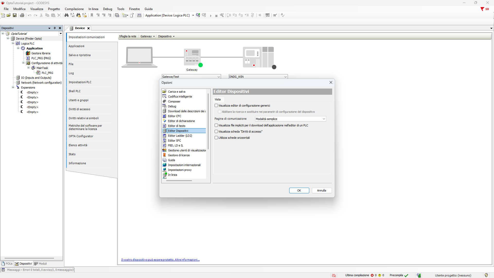
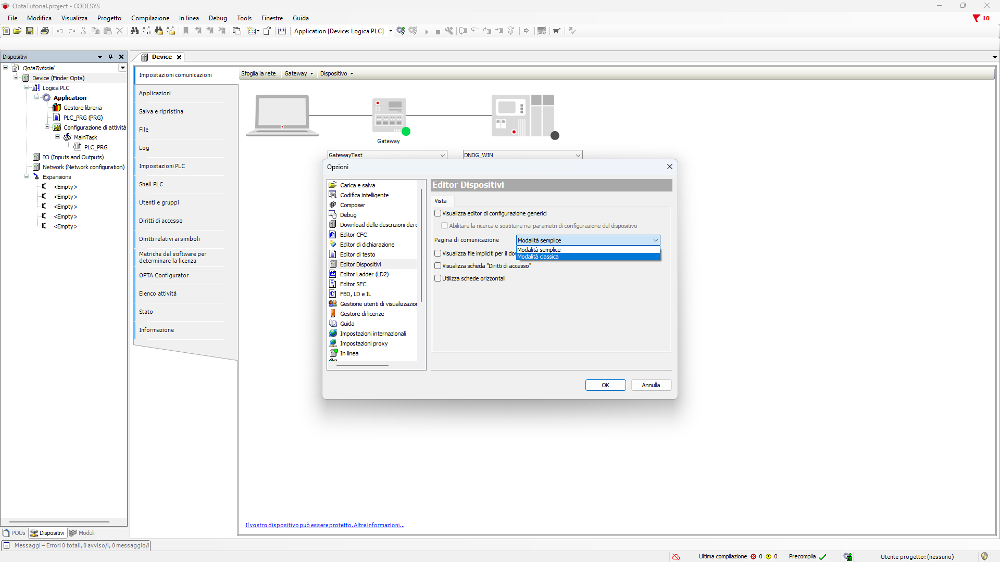
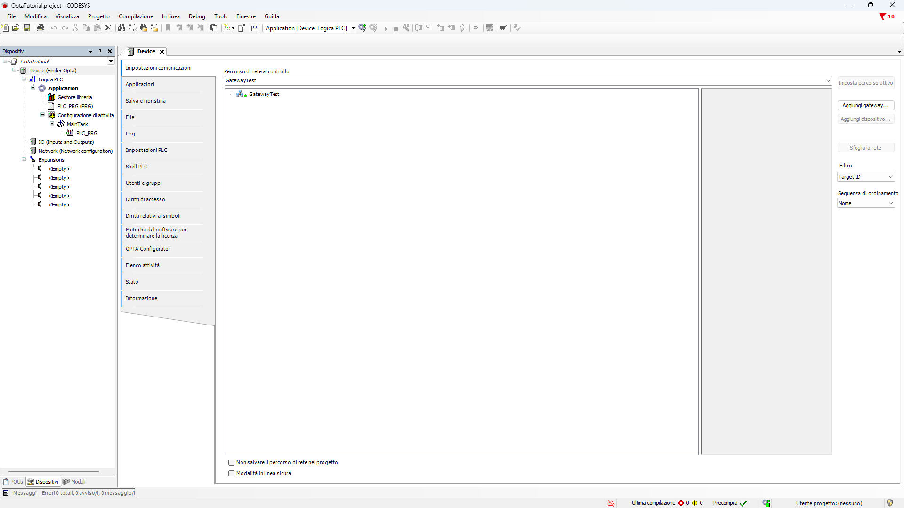
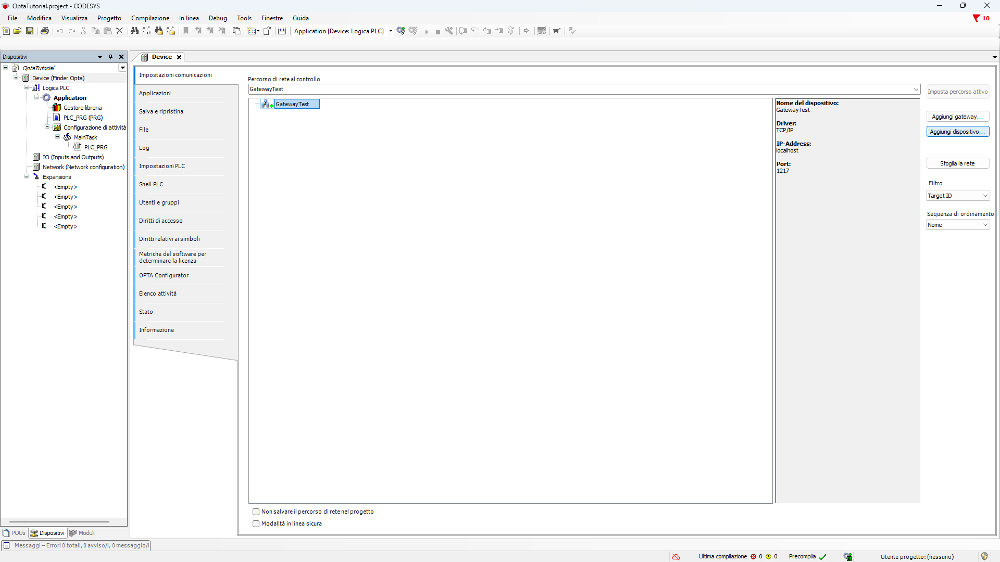
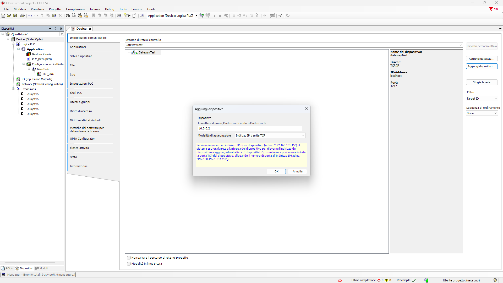
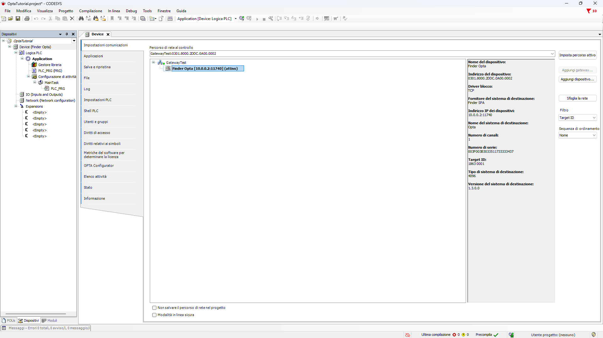
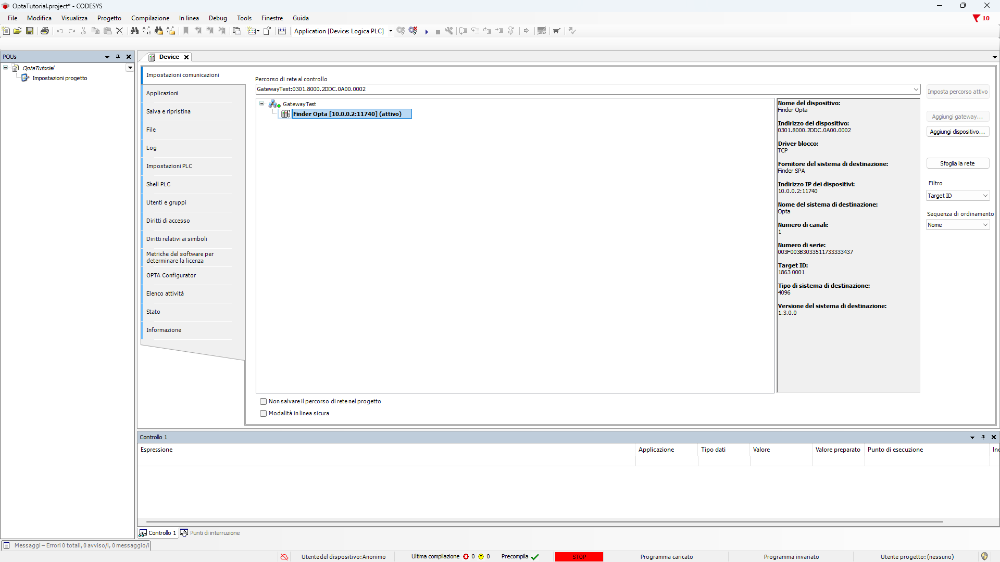

# Accesso remoto a Finder OPTA con CODESYS

Scopri come collegarti remotamente a Finder OPTA utilizzando CODESYS.

## Panoramica

CODESYS è in grado di rilevare automaticamente Finder OPTA quando il PC e il
PLC si trovano sulla stessa rete locale. Questo meccanismo funziona bene
all'interno delle reti LAN, ma non funziona quando il PC e il PLC si trovano su
due reti differenti.

Questa limitazione esiste perché CODESYS normalmente rileva
Finder OPTA utilizzando messaggi broadcast UDP, che sono limitati alla rete
locale e non vengono inoltrati dai router. Per superare questa limitazione, è
possibile accedere a Finder OPTA utilizzando una connessione TCP diretta, a
condizione che esista connettività di rete tra il PC e il PLC.

Questo tutorial spiega come utilizzare questo approccio per stabilire una
connessione remota a Finder OPTA usando CODESYS. Seguendo i passaggi forniti,
sarà possibile collegarsi e programmare Finder OPTA anche quando non si trova
sulla stessa rete del PC.

## Obbiettivi

- Configurare una connessione remota a Finder OPTA in CODESYS.
- Verificare che CODESYS possa connettersi remotamente a Finder OPTA.

## Requisiti

Prima di iniziare, assicurati di avere:

- [PLC Finder OPTA CODESYS](https://opta.findernet.com/it/codesys) (x1)
- [Alimentatore switching 12W o 25W per OPTA CODESYS](https://opta.findernet.com/it/codesys#moduli-espansione) (1x)
- Ambiente di sviluppo CODESYS installato con plug-in OPTA Configurator.
  Trovi una guida all'installazione [a questo
  link](https://opta.findernet.com/it/tutorial/codesys-plugin-tutorial).
- Rete configurata correttamente: deve esserci un percorso di routing valido
  tra il tuo PC e Finder OPTA.

## Istruzioni

Questo tutorial presuppone che tu abbia già creato un progetto funzionante e lo
abbia aperto in CODESYS. Quando il Finder OPTA non si trova sulla stessa rete
locale del tuo PC, la scansione di rete di CODESYS non rileverà il PLC.

Per configurare una connessione remota, apri il menu `Tools` e seleziona
`Opzioni...`.

Nella finestra `Opzioni`, seleziona la sezione `Editor Dispositivi`.

Imposta la pagina di comunicazione in `Modalità classica` e conferma cliccando
su `OK`.

Dopo aver applicato questa impostazione, la sezione
`Impostazioni comunicazioni` nella scheda `Device` cambierà di conseguenza e
apparirà simile a quella mostrata di seguito.

Seleziona il tuo gateway e clicca su `Aggiungi dispositivo...` dal menu sulla
destra.

Inserisci l'indirizzo IP del tuo Finder OPTA e imposta la modalità di
assegnazione su TCP/IP, come mostrato di seguito. Clicca su `OK` per confermare.

Se Finder OPTA è raggiungibile, apparirà nell'elenco dei dispositivi. Fai
doppio clic sul dispositivo per attivarlo.

Infine, clicca sul pulsante login per connetterti a Finder OPTA utilizzando
CODESYS.

## Conclusioni

L'utilizzo di una connessione TCP diretta consente di collegarsi a Finder OPTA
con CODESYS anche quando il dispositivo non si trova all'interno della stessa
LAN del PC. In questo modo, se esiste un percorso di rete valido tra il PC e il
PLC, è possibile accedere a Finder OPTA e programmarlo da remoto senza
dipendere dal rilevamento automatico dei dispositivi.
