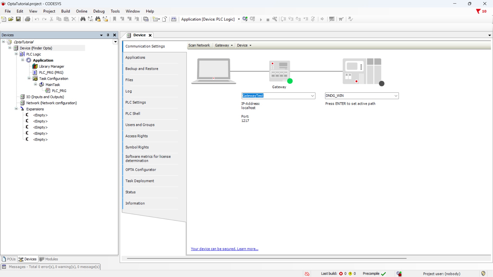
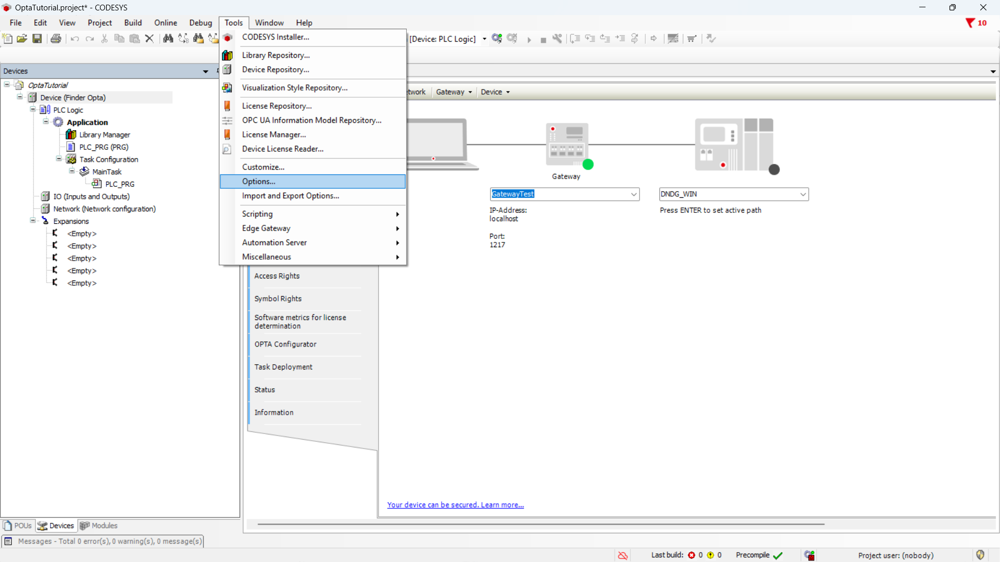
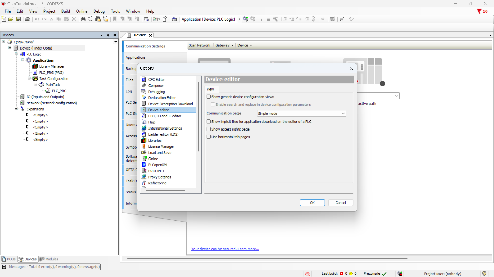
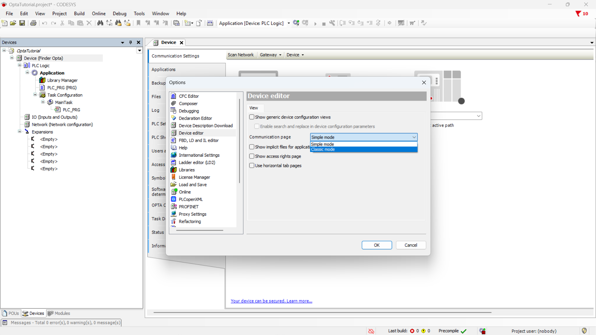
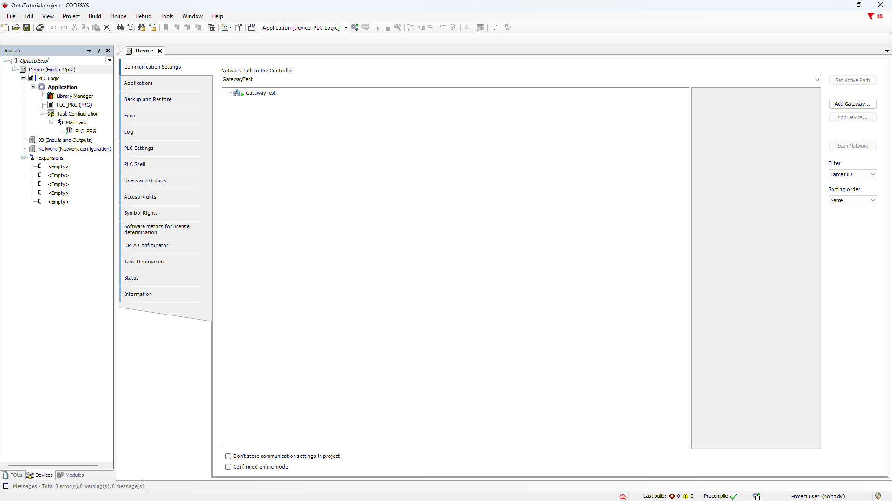
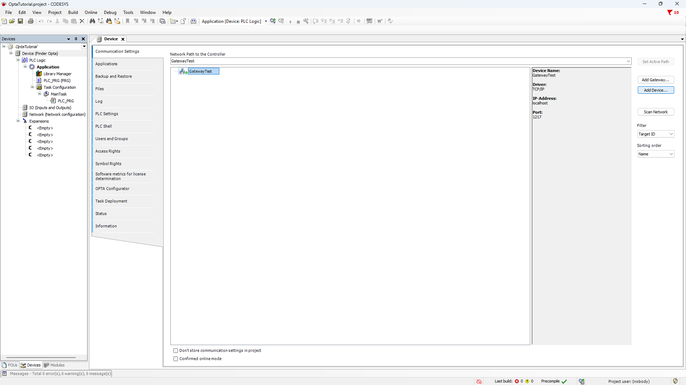
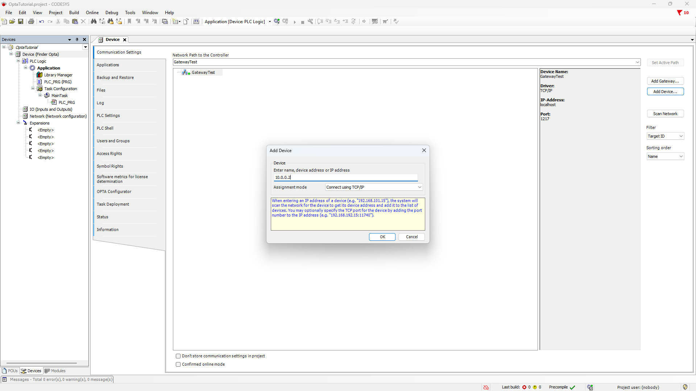
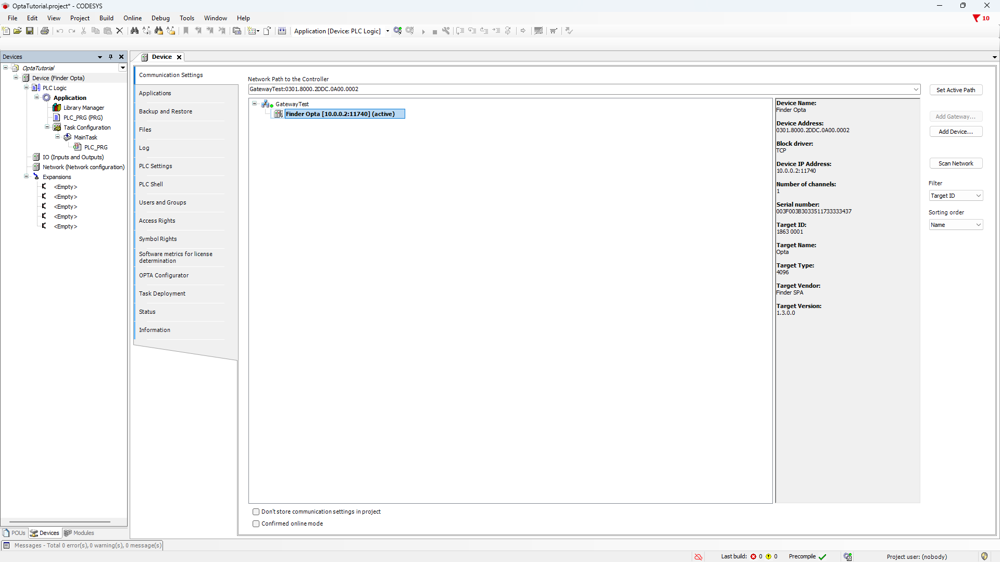
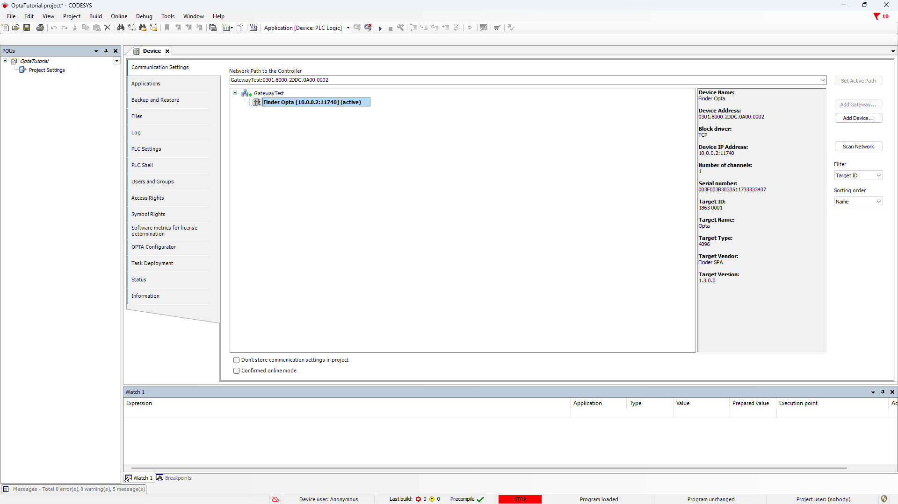

# Remotely access Finder OPTA using CODESYS

Learn how to remotely connect to Finder OPTA using CODESYS.

## Overview

CODESYS can automatically detect Finder OPTA when the PC and PLC are on the
same local network. This mechanism works well within LANs, but it does not work
when the device is on a different network.

This limitation exists because CODESYS normally discovers Finder OPTA devices
using UDP broadcast messages, which are limited to the local network and are
not forwarded by routers. To overcome this limitation, Finder OPTA can be
accessed using a direct TCP connection, provided that network connectivity
exists between the PC and the PLC.

This tutorial explains how to use this approach to establish a
remote connection to Finder OPTA using CODESYS. By following the steps
provided, you will be able to access and program Finder OPTA from outside the
local network.

## Goals

- Configure remote connectivity to Finder OPTA in CODESYS.
- Verify that CODESYS can remotely connect to Finder OPTA.

## Requirements

Before you begin, make sure you have:

- [PLC Finder OPTA CODESYS](https://opta.findernet.com/en/codesys) (x1)
- [12W or 25W switching power supply for OPTA](https://opta.findernet.com/en/codesys#moduli-espansione) (1x)
- CODESYS development environment installed with the OPTA Configurator plug-in.
  You can find an installation guide [at this
  link](https://opta.findernet.com/en/tutorial/codesys-plugin-tutorial).
- Properly configured network: there must be a valid routing path between your
  PC and Finder OPTA.

## Instructions

This tutorial assumes that you have already created a working project and
opened it in CODESYS. When Finder OPTA is not on the same local network as your
PC, the CODESYS network scan will not detect the PLC.

To configure a remote connection, open the `Tools` menu and select `Options...`.

In the `Options` window, select the `Device editor` section.

Switch the communication page to `Classic mode` and confirm by clicking `OK`.

After applying this setting, the `Communication settings` section in the
`Device` tab will change accordingly and appear similar to the one shown below.

Select your gateway and click on `Add Device...` from the menu on the right.

Enter the IP address of your Finder OPTA and set the assignment mode to TCP/IP,
as shown below. Click on `OK` to confirm.

If the Finder OPTA is reachable it will appear in the device list. Double-click
the device to activate it.

Finally, click the login button to connect to Finder OPTA using CODESYS.

## Conclusions

Using a direct TCP connection makes it possible to connect to Finder OPTA with
CODESYS even when the device is not on the same LAN as the PC. This way, if
there is a valid network path between the PC and the PLC, Finder OPTA can be
accessed and programmed remotely without relying on automatic device discovery.
