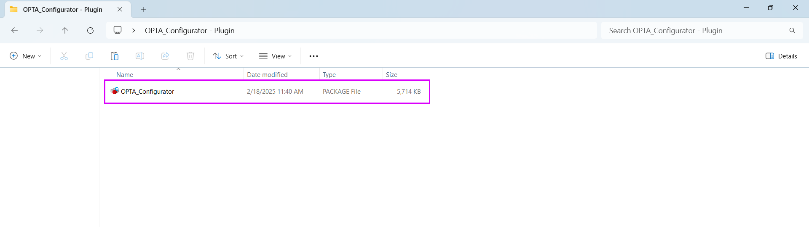
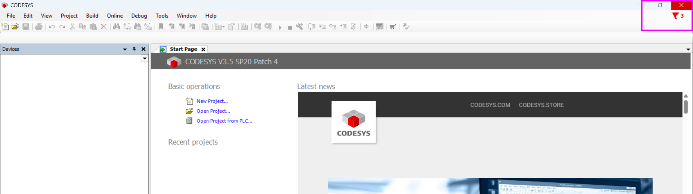
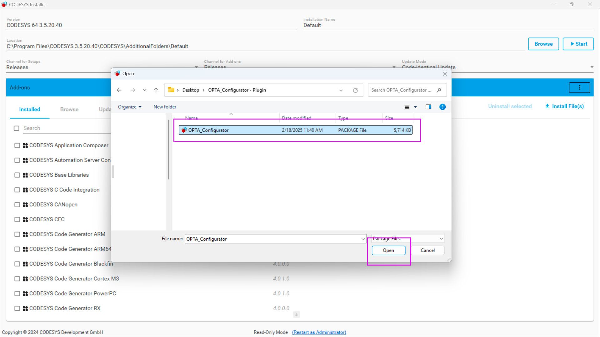
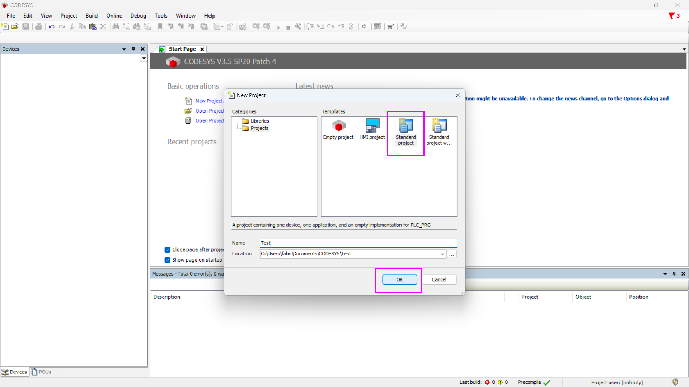
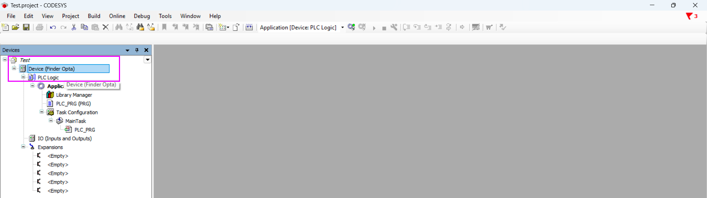

# Installare il plug-in di Finder OPTA in CODESYS

## Panoramica

CODESYS è uno dei principali ambienti di sviluppo per PLC e consente di programmare Finder OPTA con linguaggi standard, come LD e ST.

Per programmare Finder OPTA utilizzando CODESYS, è necessario installare il plug-in ufficiale. Questo tutorial guida all'installazione del plug-in in pochi semplici passi.

## Obiettivi

- Scaricare ed installare il plug-in OPTA Configurator.
- Verificare il corretto funzionamento di OPTA CODESYS all'interno dell'ambiente di sviluppo CODESYS.

## Requisiti

Prima di iniziare, assicurati di avere:

- [PLC Finder OPTA CODESYS](https://opta.findernet.com/it/codesys) (x1)
- Cavo USB-C (x1)
- Ambiente di sviluppo CODESYS installato. Lo puoi scaricare [a questo link](https://opta.findernet.com/it/codesys#download-software).
- Plug-in OPTA Configurator. Lo puoi scaricare [a questo link](https://opta.findernet.com/it/codesys#download-software).

## Istruzioni

### Installazione del plug-in

Dopo aver scaricato il plug-in OPTA Configurator, estrai il contenuto dell’archivio compresso. Il file estratto si chiamerà `OPTA_Configurator`.

Apri CODESYS e dal menu _Tools_, seleziona _CODESYS Installer..._:

Lascia CODESYS Installer aperto e chiudi CODESYS:

Ora, nel CODESYS Installer, fai clic sul pulsante _Install File(s)_:

Seleziona il file `OPTA_Configurator` che hai estratto in precedenza:

Dopo aver selezionato il file, apparirà una schermata di conferma. Fai clic su _OK_, autorizza CODESYS ad apportare modifiche al sistema:

Attendi il completamento dell'installazione:

Al termine dell'installazione, verrà visualizzato un messaggio di successo:

Per verificare che il plug-in sia stato installato correttamente, controlla l’elenco dei componenti installati: tra questi dovresti trovare OPTA Configurator.

### Verifica della corretta installazione

Chiudi CODESYS Installer e riapri CODESYS. A questo punto, collega il PLC Finder OPTA al computer utilizzando il cavo USB-C e crea un nuovo progetto standard:

Quando viene richiesto di selezionare un dispositivo, scegli _Finder Opta (FINDER SPA)_. Per il linguaggio di programmazione, puoi scegliere tra le opzioni disponibili, come ad esempio ST:

Fai doppio clic su _Device (Finder Opta)_:

Fai clic sul pulsante _Scan Network_ per avviare la scansione dei dispositivi connessi:

Se l’installazione è avvenuta correttamente, Finder Opta verrà rilevato e saranno visibili le informazioni relative al dispositivo, come il nome, il numero di serie e il vendor. Per proseguire premi il pulsante _OK_.

Apparirà una schermata che mostra la configurazione della connessione: il computer sarà collegato al Gateway, che a sua volta comunicherà con Finder Opta. A questo punto, Finder Opta è pronto per essere programmato utilizzando CODESYS.

## Conclusioni

Seguendo questi passaggi, hai installato con successo il plug-in Finder OPTA Configurator in CODESYS e verificato che il dispositivo venga riconosciuto correttamente. Questo permette di sfruttare appieno OPTA CODESYS all'interno dell'ambiente di sviluppo CODESYS, utilizzando i linguaggi standard per PLC, come LD e ST.

Se riscontri problemi durante l'installazione o la configurazione, verifica di aver seguito correttamente tutti i passaggi.

<!-- Inserire informazioni di contatto per supporto -->
