# Installare il plug-in di Finder OPTA in CODESYS

## Panoramica

CODESYS è uno dei principali ambienti di sviluppo per PLC e consente di programmare Finder OPTA con linguaggi standard, come LD e ST.

Per programmare Finder OPTA utilizzando CODESYS, è necessario installare il plug-in ufficiale. Questo tutorial guida
all'installazione del plug-in in pochi semplici passi.

## Obiettivi

- Scaricare ed installare il plug-in OPTA Configurator.
- Verificare il corretto funzionamento di OPTA CODESYS all'interno dell'ambiente di sviluppo CODESYS.

## Requisiti

Prima di iniziare, assicurati di avere:

- [PLC Finder OPTA CODESYS](https://opta.findernet.com/it/codesys) (x1)
- Cavo USB-C (x1)
- Ambiente di sviluppo CODESYS installato. Lo puoi scaricare [a questo
  link](https://opta.findernet.com/it/codesys#download-software).
- Plug-in OPTA Configurator. Lo puoi scaricare [a questo link](https://opta.findernet.com/it/codesys#download-software).

## Istruzioni

### Installazione del plug-in

Dopo aver scaricato il plug-in OPTA Configurator, estrai il contenuto dell’archivio compresso. Il file estratto si chiamerà
`OPTA_Configurator`.

Apri CODESYS e dal menu _Tools_, seleziona _CODESYS Installer..._:

Lascia CODESYS Installer aperto e chiudi CODESYS:

Ora, nel CODESYS Installer, fai clic sul pulsante _Install File(s)_:

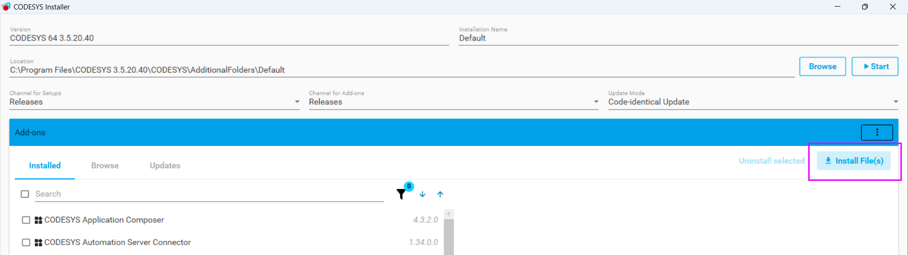

Seleziona il file `OPTA_Configurator` che hai estratto in precedenza:

Dopo aver selezionato il file, apparirà una schermata di conferma. Fai clic su _OK_, autorizza CODESYS ad apportare modifiche al
sistema:

Attendi il completamento dell'installazione:

Al termine dell'installazione, verrà visualizzato un messaggio di successo:

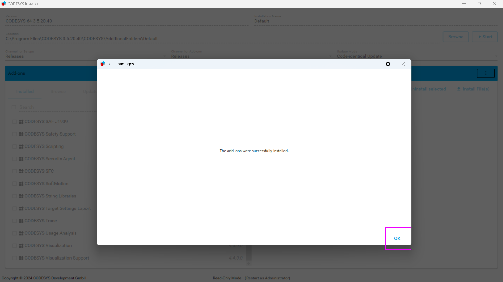

Per verificare che il plug-in sia stato installato correttamente, controlla l’elenco dei componenti installati: tra questi dovresti
trovare OPTA Configurator.

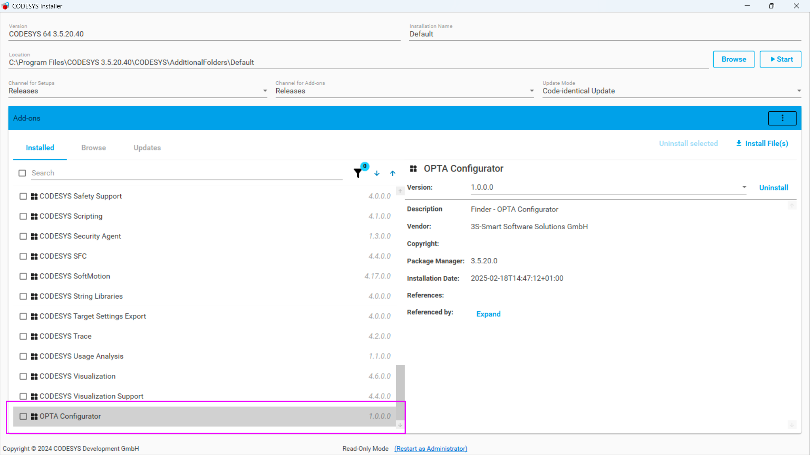

### Configurazione del Gateway CODESYS

Ora chiudi CODESYS Installer:

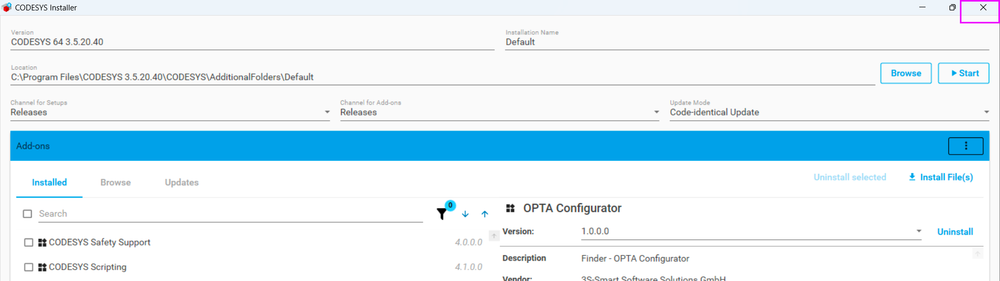

Riapri CODESYS. A questo punto, collega il PLC Finder OPTA al computer utilizzando il cavo USB-C e crea un nuovo progetto standard:

Quando viene richiesto di selezionare un dispositivo, scegli _Finder Opta (FINDER SPA)_. Per il linguaggio di programmazione, puoi
scegliere tra le opzioni disponibili, come ad esempio ST:

Fai doppio clic su _Device (Finder Opta)_:

Espandi le icone nascoste della taskbar di Windows e fai clic con il tasto destro sull'icona del servizio _CODESYS Gateway_:

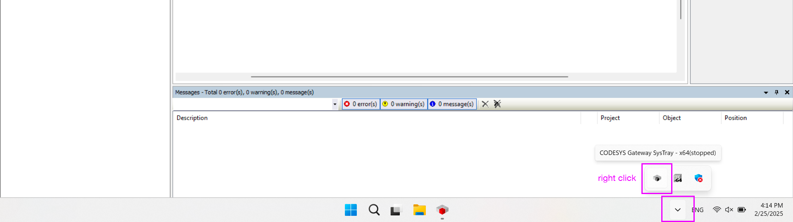

Fai clic sul pulsante _Start Gateway_:

Avviato il servizio del Gateway, non resta che configurarlo. Come prima cosa aggiungi un nuovo Gateway:

Assegna un nome al Gateway e selezione _TCP/IP_ come driver, poi conferma facendo clic su _OK_:

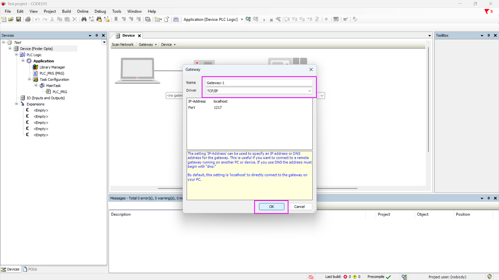

Ora nella schermata dovresti vedere il Gateway con il nome ad esso assegnato:

Fai clic sul pulsante _Gateway_, poi su _Configure the Local Gateway..._:

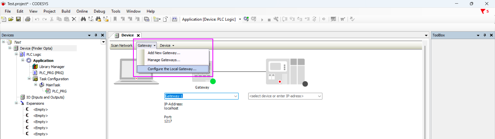

Apparirà una schermata con una lista di interfacce configurate. Se vedi altre interfacce configurate oltre a quella _UDP interface_,
rimuovile. La tua schermata di configurazione sarà identica a questa:

Connetti OPTA CODESYS al computer con il cavo USB, poi lancia il _Device Manager_ di Windows:

Verifica la porta COM a cui è connesso OPTA CODESYS, in particolare prendi nota del numero di porta. Nell'esempio, la porta COM è la
numero 7:

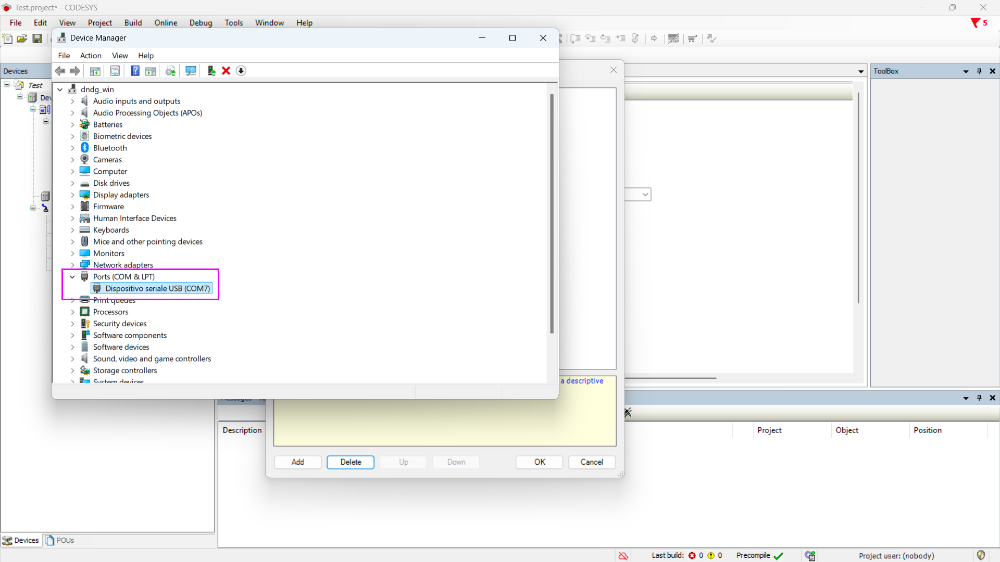

Torna al configuratore del Gateway, premi il pulsante _Add_ e in seguito _Add Interface..._:

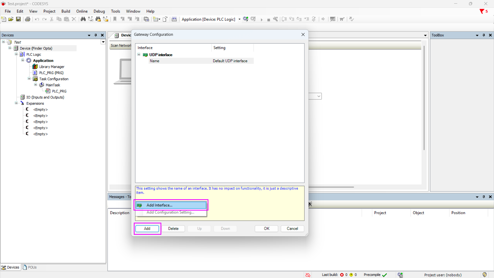

Vedrai apparire una porta COM. Fai clic sul suo riquadro _Settings_:

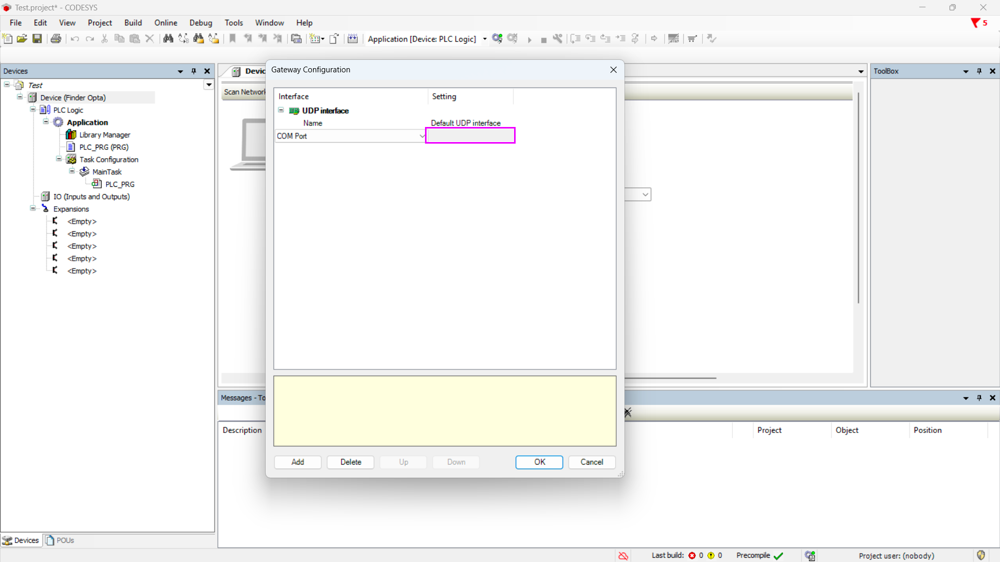

Imposta il parametro _Port_ con il numer di porta letto nel Device Manager di Windows. Nell'esempio impostiamo il valore a 7:

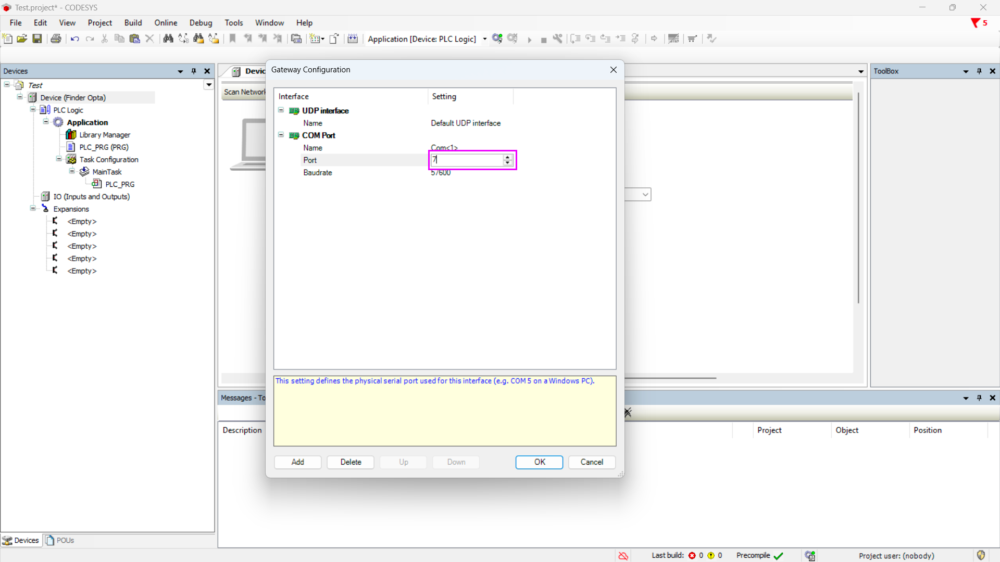

Gli altri parametri della porta non vanno cambiati. Fai clic sul pulsante _OK_ e procedi:

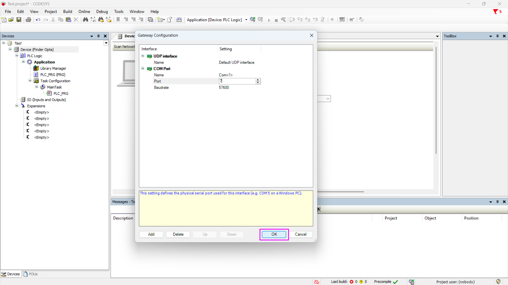

Infine, è necessario far ripartire il servizio del Gateway di CODESYS. Sempre dalla taskbar di Windows, ferma il servizio:

In seguito, fallo ripartire:

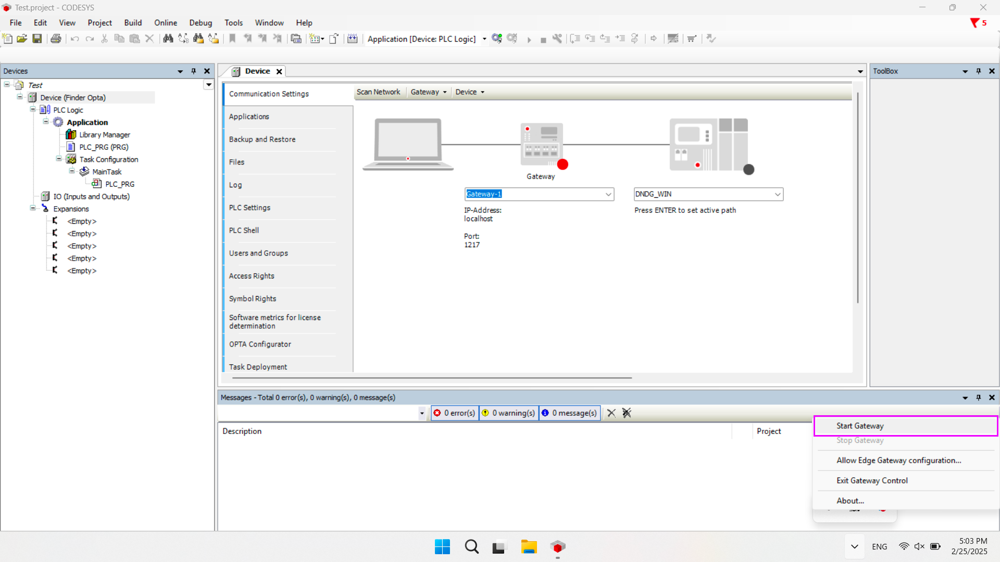

### Verifica della configurazione

Dalla schermata _Device_, fai clic sul pulsante _Scan Network_ per avviare la scansione dei dispositivi connessi:

Se viene mostrato un errore di comunicazione con il Gateway, chiudi CODESYS e riaprilo, per permettere all'IDE di riconoscere il
servizio del Gateway precedentemente riavviato.

Se invece la configurazione è avvenuta correttamente, Finder Opta verrà rilevato e saranno visibili le informazioni relative al
dispositivo, come il nome, il numero di serie e il vendor. Per proseguire premi il pulsante _OK_.

Apparirà una schermata che mostra la configurazione della connessione: il computer sarà collegato al Gateway, che a sua volta
comunicherà con Finder Opta. A questo punto, Finder Opta è pronto per essere programmato utilizzando CODESYS.

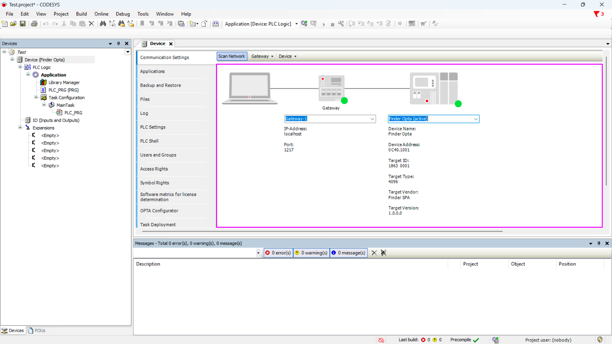

## Conclusioni

Seguendo questi passaggi, hai installato con successo il plug-in Finder OPTA Configurator in CODESYS e verificato che il dispositivo
venga riconosciuto correttamente. Questo permette di sfruttare appieno OPTA CODESYS all'interno dell'ambiente di sviluppo CODESYS,
utilizzando i linguaggi standard per PLC, come LD e ST.

Se riscontri problemi durante l'installazione o la configurazione, verifica di aver seguito correttamente tutti i passaggi.

<!-- Inserire informazioni di contatto per supporto -->
