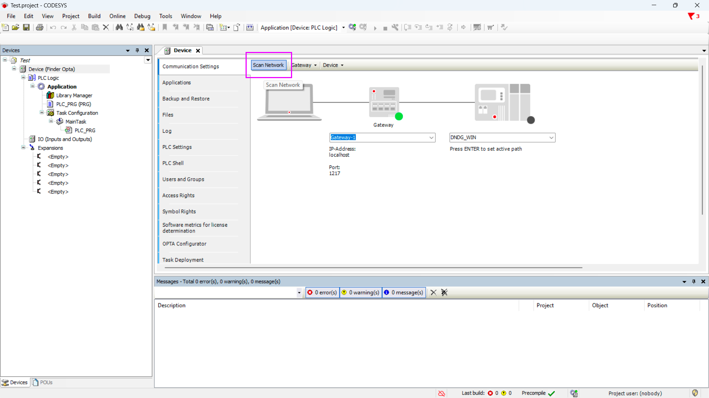
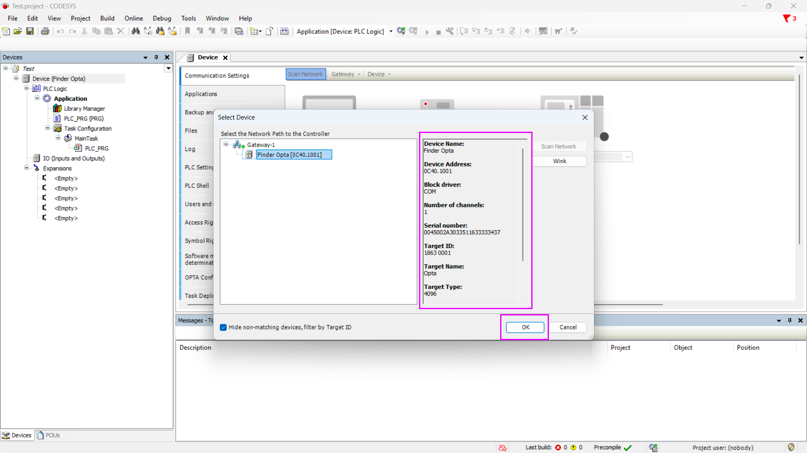

# Installing the Finder OPTA Plug-in in CODESYS

## Overview

CODESYS is one of the leading development environments for PLCs and it allows you to program Finder OPTA using standard languages, like LD and ST.

To program Finder OPTA using CODESYS, you need to install the official plug-in.
This tutorial will guide you through the installation in just a few simple
steps.

## Goals

- Download and install the OPTA Configurator plug-in.
- Verify the correct functioning of OPTA CODESYS within the CODESYS development
  environment.

## Requirements

Before starting, make sure you have:

- [Finder OPTA CODESYS PLC](https://opta.findernet.com/it/codesys) (x1)
- USB-C cable (x1)
- CODESYS development environment installed. You can download it
  [here](https://opta.findernet.com/it/codesys#download-software).
- OPTA Configurator plug-in. You can download it
  [here](https://opta.findernet.com/it/codesys#download-software).

## Instructions

### Installing the plug-in

After downloading the OPTA Configurator plug-in, extract the contents of the
compressed archive. The extracted file will be named `OPTA_Configurator`.

Open CODESYS and from the _Tools_ menu, select _CODESYS Installer..._:

Leave the CODESYS Installer open and close CODESYS:

Now, in the CODESYS Installer, click on _Install File(s)_:

Select the `OPTA_Configurator` file that you extracted earlier:

After selecting the file, a confirmation screen will appear. Click _OK_ and
authorize CODESYS to make changes to the system:

Wait for the installation to complete:

Once the installation is complete, a success message will appear:

To verify that the plug-in was installed correctly, check the list of installed
components: you should see OPTA Configurator in the list.

### Configuring the CODESYS Gateway

Now close the CODESYS Installer:

Reopen CODESYS. Then, connect the Finder OPTA PLC to your computer using the
USB-C cable and create a new standard project:

When prompted to select a device, choose _Finder Opta (FINDER SPA)_. For the
programming language, you can choose from the available options, such as ST:

Double-click on _Device (Finder Opta)_:

Expand the hidden icons in the Windows taskbar and right-click on the _CODESYS
Gateway_ service icon:

Click the _Start Gateway_ button:

Once the Gateway service is running, you need to configure it. First, add a new
Gateway:

Assign a name to the Gateway and select _TCP/IP_ as the driver, then confirm by
clicking _OK_:

Now you should see the Gateway with the assigned name in the list:

Click on _Gateway_, then select _Configure the Local Gateway..._:

A window will appear with a list of configured interfaces. If you see any
interfaces other than the _UDP interface_, remove them. Your configuration
window should look like this:

Connect the OPTA CODESYS device to your computer via USB, then open Windows
_Device Manager_:

Check the COM port to which OPTA CODESYS is connected, and take note of the
port number. In this example, the COM port is number 7:

Return to the Gateway configurator, press the _Add_ button, and then select
_Add Interface..._:

A COM port will appear. Click on its _Settings_ box:

Set the _Port_ parameter to the port number found in Windows Device Manager. In
this example, we set the value to 7:

The other port parameters do not need to be changed. Click _OK_ to proceed:

Finally, restart the CODESYS Gateway service. In the Windows taskbar, stop the
service:

Then restart it:

### Verifying the configuration

From the _Device_ screen, click the _Scan Network_ button to start scanning for
connected devices:

If a communication error with the Gateway appears, close and reopen CODESYS to
allow the IDE to recognize the Gateway service that was restarted earlier.

If the configuration was successful, Finder Opta will be detected, and
information about the device, such as name, serial number, and vendor, will be
visible. To proceed, click _OK_.

A window will appear showing the connection configuration: the computer will be
connected to the Gateway, which will then communicate with Finder Opta. At this
point, Finder Opta is ready to be programmed using CODESYS.

## Conclusion

By following these steps, you have successfully installed the Finder OPTA Configurator plug-in in CODESYS and verified that the device is correctly recognized. This allows you to fully utilize OPTA CODESYS within the CODESYS development environment, using standard PLC programming languages like LD and ST.

If you encounter any issues during installation or configuration, check that you have followed all the steps correctly.

<!-- Insert support contact information -->
