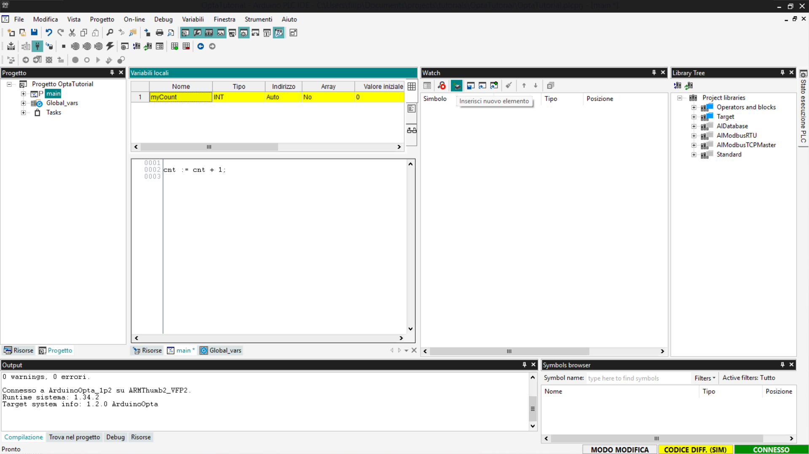

#  Primi passi con Finder OPTA e PLC IDE

Guida per l'utilizzo di Finder OPTA con Arduino PLC IDE.

## Panoramica

Questo tutorial fornisce una guida passo-passo all'utilizzo di Finder OPTA con
Arduino PLC IDE, coprendo la gestione delle variabili e la configurazione dei
task.

## Di cosa avrai bisogno

Prima di iniziare, assicurati di avere:

* [PLC Finder OPTA](https://opta.findernet.com/it/arduino) (x1)
* Cavo USB-C (x1)
* **Arduino PLC IDE** correttamente installato sul tuo computer.

Se non hai ancora attivato la licenza per il dispositivo Finder OPTA, segui
[questa guida](https://opta.findernet.com/it/tutorial/plc-ide-setup-license)
per completare l'attivazione.

## Come utilizzare PLC IDE

In questa sezione forniremo un'introduzione alla programmazione di Finder OPTA
utilizzando Arduino PLC IDE, attraverso una guida passo-passo che copre le
operazioni di base utili per programmare Finder OPTA.

Come definito nei requisiti, il tutorial presuppone che tu abbia già completato
la guida "[Guida al primo avvio di Finder OPTA con PLC
IDE](https://opta.findernet.com/it/tutorial/plc-ide-setup-license)", e che
abbia quindi a disposizione un Finder OPTA configurato e un progetto già creato
in PLC IDE.

###  Consultare il manuale utente

Per consultare il manuale utente integrato di PLC IDE fai clic su *Aiuto >
Indice*.

Si aprirà un PDF contenente il manuale utente, dove troverai informazioni
dettagliate su come utilizzare PLC IDE.

### Variabili

In Arduino PLC IDE, le variabili sono alla base del funzionamento di ogni
programma: rappresentano i dati che il PLC legge, modifica e utilizza per
controllare la macchina. Esistono due tipi di variabili:

* **Variabili globali**: accessibili da tutto il progetto.
* **Variabili locali**: sono visibili solo all’interno di un blocco funzione,
  programma o azione.

Di seguito vediamo il procedimento per aggiungere le variabili al progetto.

#### Aggiungere variabili globali

Per iniziare, accedi alla scheda *Progetto*, dove puoi consultare l’elenco
completo delle variabili globali attualmente definite nel progetto.

Successivamente, fai doppio clic sulla voce *Global_vars* per visualizzare
l'elenco delle variabili globali già presenti nel progetto.

Per aggiungere una nuova variabile globale, fai clic con il tasto destro sulla
tabella e seleziona *Inserisci*.

Arduino PLC IDE creerà una nuova variabile globale con valore predefinito. Puoi
modificarla facendo doppio clic su ciascun campo per specificarne nome, tipo e
valore iniziale.

La variabile appena aggiunta verrà visualizzata nella sezione *Global_vars* e
sarà accessibile da tutti i programmi contenuti nel progetto.

#### Aggiungere variabili locali

Per aggiungere variabili locali, prima visualizza l'elenco delle variabili
locali presenti nel programma, fai doppio clic all'interno della scheda
*Progetto* e successivamente seleziona il programma. Il pannello superiore
mostrerà una tabella contenente le variabili locali associate al programma
selezionato.

Per aggiungere una nuova variabile locale, fai clic con il tasto destro del
mouse sulla tabella e seleziona *Inserisci*.

Dopo aver inserito la nuova variabile, fai doppio clic su ciascun campo per
modificarlo in base alle esigenze del programma.

####  Aggiungere un Watch delle variabili

Lo strumento **Watch** in Arduino PLC IDE è una funzionalità fondamentale per
il monitoraggio in tempo reale delle variabili durante l'esecuzione di un
progetto. Prima di tutto è necessario connettersi a Finder OPTA, vai su
*On-line > Connetti*.

Per visualizzare la tab Watch vai su *Vista > Finestre strumenti > Watch*.

Si aprirà una nuova finestra degli strumenti, all'interno della quale puoi
trascinare e rilasciare le variabili da monitorare.

In alternativa, fai clic sul pulsante *Insert new item* per aggiungere una
variabile specifica.

Una volta aggiunta la variabile di interesse, avrai una visualizzazione
aggiornata in tempo reale del suo valore, utile per il debugging e il
monitoraggio del sistema.

### Aggiungere blocchi funzione

I blocchi funzione sono componenti disponibili nelle librerie di Arduino PLC
IDE che consentono di eseguire operazioni predefinite come:

* Porte logiche (`AND`, `OR`, `NOT`).
* Funzioni matematiche (`ADD`, `SUB`, `MUL`).

Questi blocchi possono essere utilizzati nei programmi scritti in linguaggi che
supportano la logica a blocchi funzione, come Ladder Diagram (LD), Sequential
Function Chart (SFC) e Function Block Diagram (FBD). In questo esempio, useremo
**Ladder Diagram (LD)**.

Come prima cosa aggiungi un nuovo programma LD al tuo progetto, per farlo vai
nella sezione *Progetto* e premi il tasto destro sul nome del tuo progetto; poi
seleziona *Aggiungi > Nuovo programma*.

Seleziona l'opzione *LD*, inserisci il nome del programma e premi *OK*.

I blocchi funzione si trovano nella sezione *Library Tree* che si trova sulla
destra, se non la vedi vai su *Vista > Finestre strumenti > Library Tree*. Dal
menu espandi la voce desiderata. In questo tutorial useremo come esempio un
blocco aritmetico che performa una semplice somma tra due input e restituisce
il risultato in un output. Per selezionare un blocco *ADD* espandi la voce
*Operators and blocks* poi *Aritmetica*.

Per aggiungere il blocco all'area di lavoro, trascina il blocco desiderato
all'interno delle linee di contatto. Una volta inserito il blocco, PLC IDE
genera un elemento con pin di input e output configurabili. Se necessario, puoi
fare clic con il tasto destro del mouse sul blocco per aggiungere ulteriori
pin.

Per completare il programma è necessario collegare delle variabili agli input e
agli output del blocco, prima di tutto aggiungi delle variabili locali come
visto in precedenza. Le variabili necessarie sono le seguenti:

* *counter*: una variabile che useremo come input.
* *addition*: una variabile che useremo come input, imposta il suo valore
  iniziale a `1` e imposta il suo campo *Attributo* a *CONSTANT* per indicare
  che è una costante.
* *res*: la variabile che useremo come output, imposta il suo valore iniziale a `0`.

Adesso è necessario associare le variabili ai pin corretti, il lato sinistro
del blocco ospita i pin di input, mentre quello a destra ospita i pin di
output. Per associarli clicca sui pin, così facendo si aprirà una finestra, poi
clicca sul pulsante *Sfoglia* indicato dai tre puntini.

Comparirà una lista di variabili, scegli quale associare al pin selezionato e
premi *OK* per chiudere le finestre.

Ripeti l'operazione con tutti i pin del blocco *ADD*. Una volta completata la
mappatura dei pin, dobbiamo eliminare i componenti *Contatto* e *Coil* dato che
non vengono usati nel nostro esempio. Pere eliminarli clicca con il tasto
destro in corrispondenza degli operatori e seleziona *Elimina*.

La configurazione del nostro diagramma apparirà come nella schermata seguente.

A questo punto per testare il programma LD è necessario connettersi a Finder
OPTA e successivamente premere il pulsante *Download PLC code*

Ti verrà chiesto di compilare il codice conferma premendo *Sì*.

Infine, mostra la sezione *Watch* che ti permetta di aggiungere variabili da
monitorare. In seguito trascina le variabili *counter* e *res* all'interno del
watch e seleziona il pulsante *Avvia/Arresta Watch*, così facendo vedrai il
valore della variabile *res* cambiato rispetto a quello iniziale. In questo
modo abbiamo verificato che il programma funziona e Finder OPTA è stato
programmato correttamente.

### Configurare task

In Arduino PLC IDE, un task determina la frequenza con cui un programma viene
eseguito. Creato un programma, è possibile assegnarlo a uno dei quattro task
disponibili:

* *Init*: esecuzione singola al momento dell'inizializzazione.
* *Fast*: esecuzione in loop ogni 10ms (valore di default, configurabile).
* *Slow*: esecuzione in loop ogni 100 ms.
* *Background*: esecuzione in loop ogni 500 ms.

Per assegnare un programma ad un task, hai due opzioni:

1. Fai clic con il tasto destro del mouse sul task, seleziona *Aggiungi > Nuovo
   programma*, quindi assegna il task dall'elenco visualizzato nella finestra a
   comparsa.

2. Trascina e rilascia il programma nel task desiderato.

Di default, il programma principale viene assegnato al task *Fast*. Se
necessario, puoi rimuoverlo facendo clic con il tasto destro del mouse sul
programma e selezionando *Rimuovi programma*.

Per configurare un task, fai clic con il tasto destro del mouse e seleziona
*Task configuration*.

Nel menu di configurazione, puoi modificare il tempo di esecuzione del task
*Fast*, adattandolo alle esigenze del progetto. Clicca sul campo *Imposta
periodo* e seleziona il periodo in ms desiderato dal menu a scomparsa nel campo
*Periodo [ms]*.

All'interno di ciascun task, i programmi vengono eseguiti in ordine sequenziale
dall'alto verso il basso, seguendo l'ordine visualizzato nella lista dei
programmi assegnati al task.

## Conclusione

Hai completato i primi passi con **Finder OPTA** e **Arduino PLC IDE**,
imparando a gestire variabili, utilizzare blocchi funzione, configurare task ed
eseguire il programma sul dispositivo.
