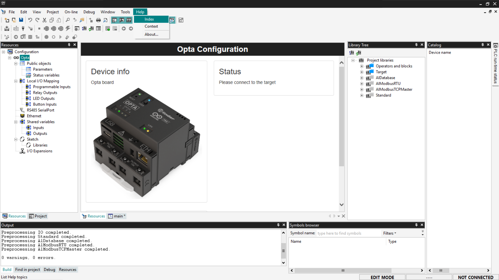
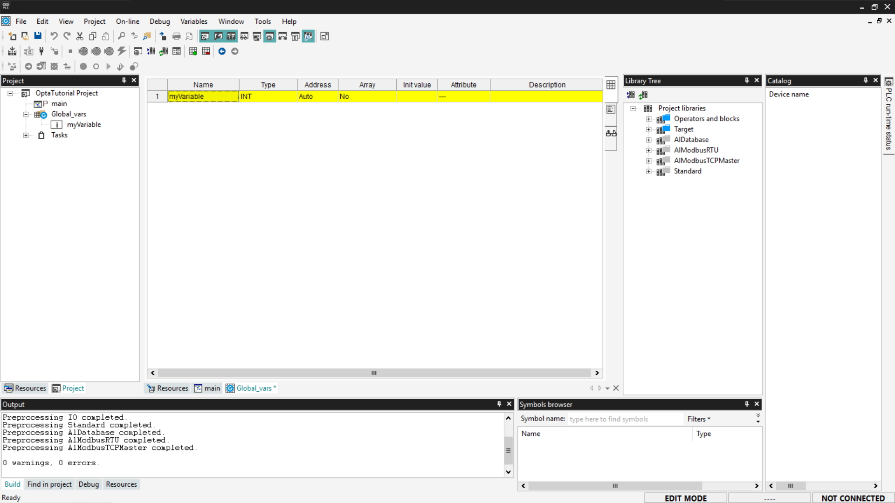
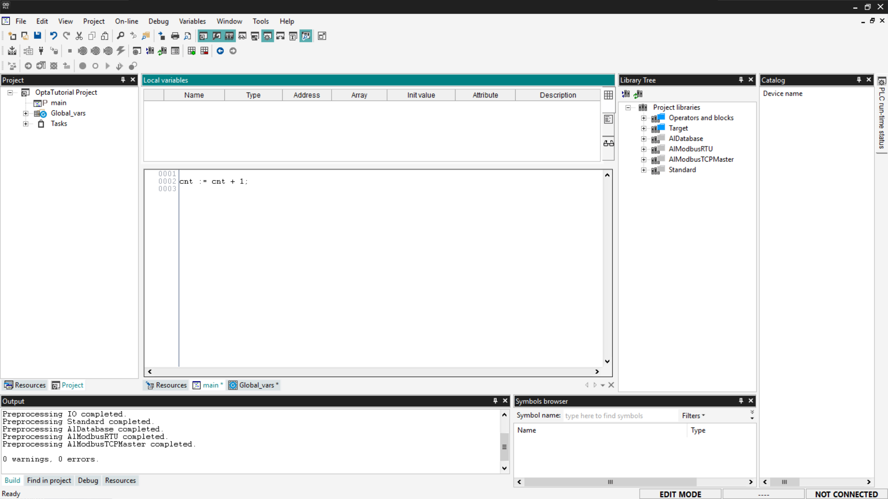
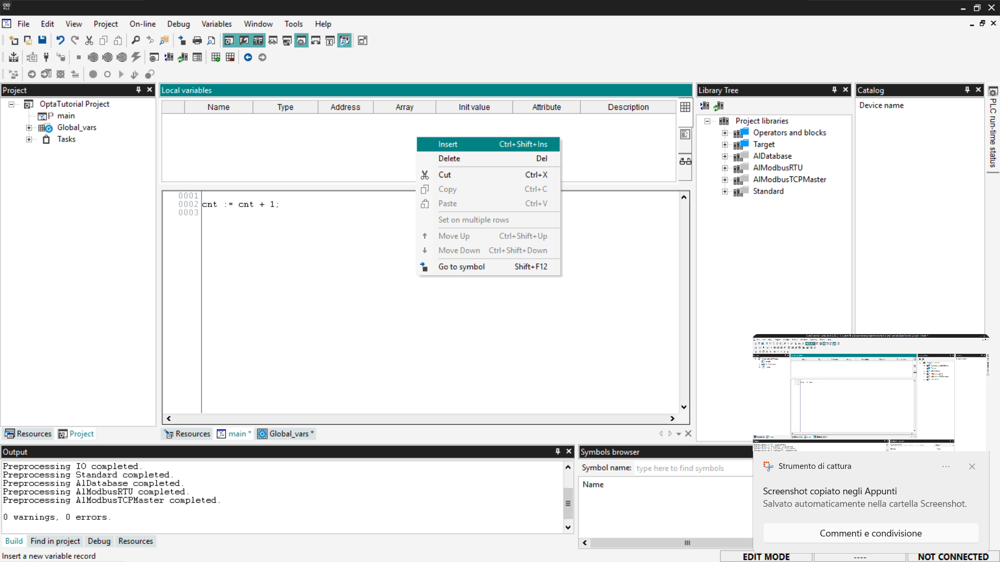
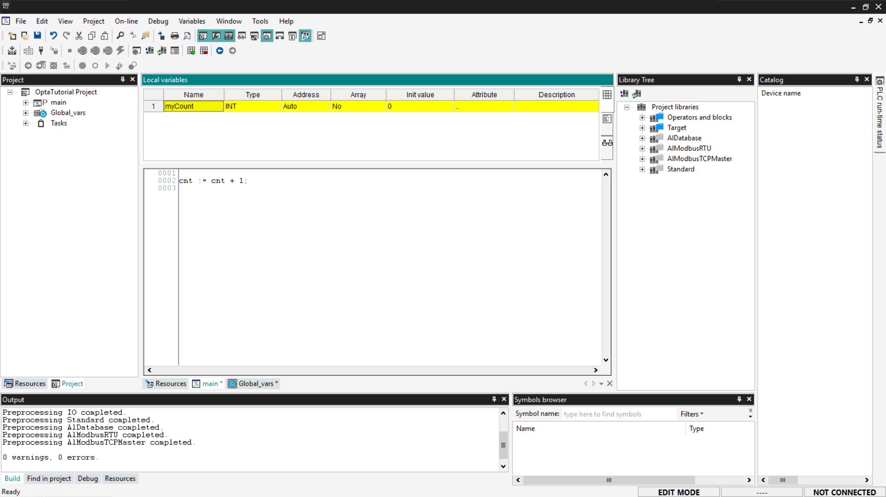
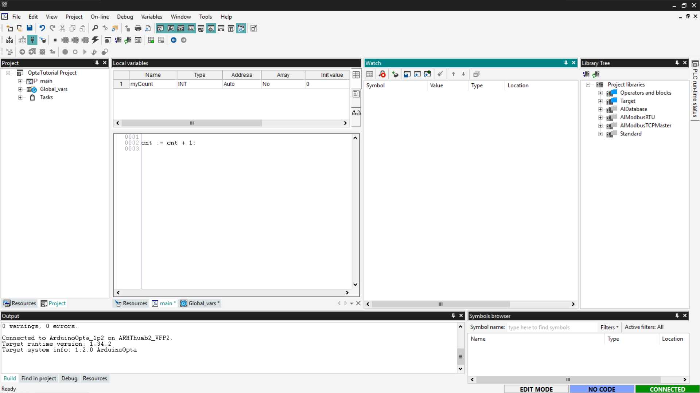
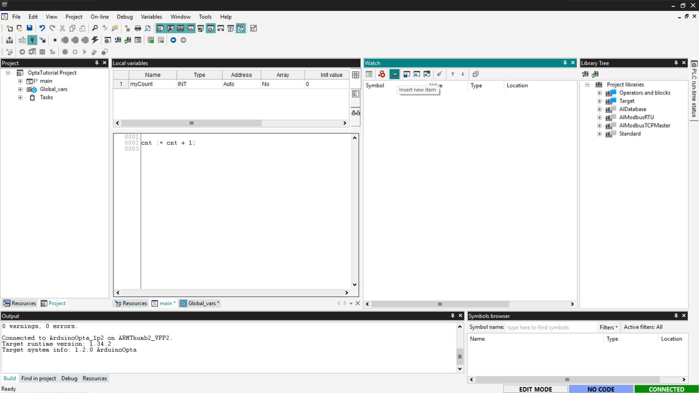
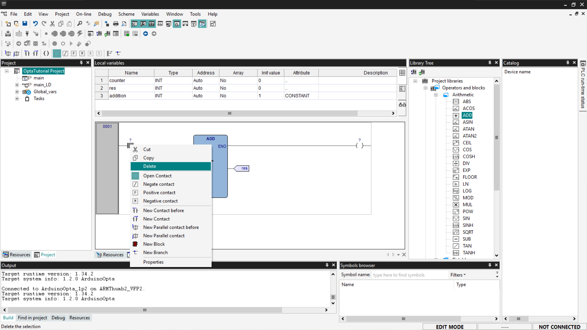
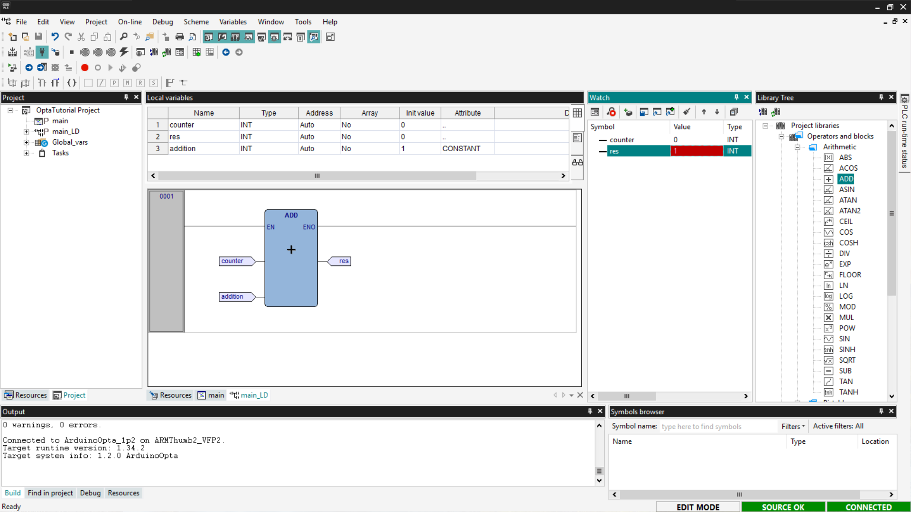
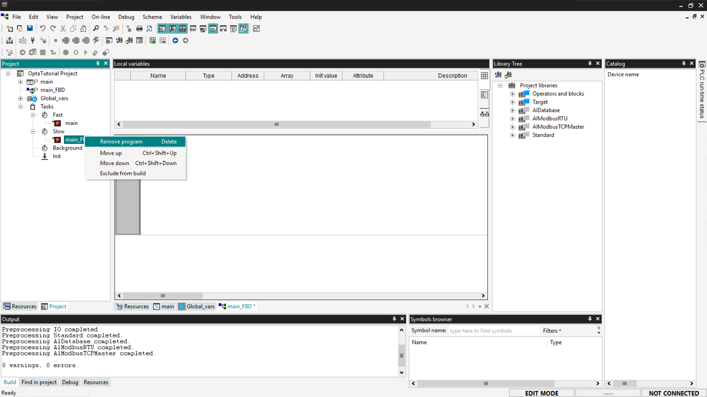

# First Steps with Finder OPTA and PLC IDE

Guide for using Finder OPTA with Arduino PLC IDE.

## Overview

This tutorial provides a step-by-step guide for using Finder OPTA with Arduino
PLC IDE, covering variable management and task configuration.

## What you will need

Before starting, make sure you have:

* [Finder OPTA PLC](https://opta.findernet.com/en/arduino) (x1)
* USB-C cable (x1)
* **Arduino PLC IDE** correctly installed on your computer.

If you have not yet activated the license for your Finder OPTA device, follow
[this guide](https://opta.findernet.com/en/tutorial/plc-ide-setup-license) to
complete the activation.

## How to use PLC IDE

In this section, we provide an introduction to programming Finder OPTA using
Arduino PLC IDE, through a step-by-step guide that covers the basic operations
useful for programming Finder OPTA.

As stated in the requirements, the tutorial assumes that you have already
completed the guide "[Getting Started with Finder OPTA and PLC
IDE](https://opta.findernet.com/en/tutorial/plc-ide-setup-license)", and
therefore you have a configured Finder OPTA and a project already created in
PLC IDE.

### Consult the User Manual

To consult the integrated user manual of PLC IDE, click on *Help > Index*.

A PDF containing the user manual will open, where you will find detailed
information on how to use PLC IDE.

### Variables

In Arduino PLC IDE, variables are the foundation of every program: they
represent the data that the PLC reads, modifies, and uses to control the
machine. There are two types of variables:

* **Global variables**: accessible from the entire project.
* **Local variables**: visible only within a function block, program, or
  action.

Below we see the procedure for adding variables to the project.

#### Adding global variables

To begin, go to the *Project* tab, where you can view the complete list of
global variables currently defined in the project.

Next, double-click on the *Global_vars* entry to view the list of global
variables already present in the project.

To add a new global variable, right-click on the table and select *Insert*.

Arduino PLC IDE will create a new global variable with a default value. You can
modify it by double-clicking each field to specify its name, type, and initial
value.

The newly added variable will be displayed in the *Global_vars* section and
will be accessible from all programs contained in the project.

#### Adding local variables

To add local variables, first view the list of local variables present in the
program: double-click within the *Project* tab and then select the program. The
top panel will show a table containing the local variables associated with the
selected program.

To add a new local variable, right-click on the table and select *Insert*.

After entering the new variable, double-click each field to modify it according
to the needs of the program.

#### Adding a Watch for variables

The **Watch** tool in Arduino PLC IDE is essential for real-time monitoring of
variables during project execution. First, you need to connect to Finder OPTA:
go to *On-line > Connect*.

To display the Watch tab, go to *View > Tool Windows > Watch*.

A new tool window will open, where you can drag and drop the variables you want
to monitor.

Alternatively, click the *Insert new item* button to add a specific variable.

Once the variable of interest has been added, you will have a real-time display
of its value, useful for debugging and monitoring the system.

### Adding function blocks

Function blocks are components available in the Arduino PLC IDE libraries that
allow you to perform predefined operations such as:

* Logic gates (`AND`, `OR`, `NOT`)
* Mathematical functions (`ADD`, `SUB`, `MUL`)

These blocks can be used in programs written in languages that support function
block logic, such as Ladder Diagram (LD), Sequential Function Chart (SFC), and
Function Block Diagram (FBD). In this example, we will use **Ladder Diagram
(LD)**.

First, add a new LD program to your project: go to the *Project* section and
right-click on the name of your project; then select *Add > New program*.

Select the *LD* option, enter the program name, and click *OK*.

Function blocks are located in the *Library Tree* section on the right; if you
do not see it, go to *View > Tool Windows > Library Tree*. From the menu,
expand the desired entry. In this tutorial, we will use as an example an
arithmetic block that performs a simple sum between two inputs and returns the
result in an output. To select an *ADD* block, expand the *Operators and
blocks* entry and then *Arithmetic*.

To add the block to the workspace, drag the desired block inside the contact
lines. Once the block is inserted, PLC IDE generates an element with
configurable input and output pins. If necessary, you can right-click on the
block to add more pins.

To complete the program, you need to connect variables to the block's inputs
and outputs; first, add local variables as previously shown. The necessary
variables are as follows:

* *counter*: a variable we will use as input.
* *addition*: a variable we will use as input; set its initial value to `1` and
  set its *Attribute* field to *CONSTANT* to indicate that it is a constant.
* *res*: the variable we will use as output; set its initial value to `0`.

Now you need to associate the variables with the correct pins: the left side of
the block hosts the input pins, while the right side hosts the output pins. To
associate them, click on the pins; a window will open, then click the *Browse*
button indicated by the three dots.

A list of variables will appear; choose which one to associate with the
selected pin and click *OK* to close the windows.

Repeat the operation for all the pins of the *ADD* block. Once the pin mapping
is complete, we need to delete the *Contact* and *Coil* components since they
are not used in our example. To delete them, right-click on the operators and
select *Delete*.

The configuration of our diagram will appear as in the following screenshot.

At this point, to test the LD program, you need to connect to Finder OPTA and
then press the *Download PLC code* button.

You will be asked to compile the code; confirm by pressing *Yes*.

Finally, show the *Watch* section that allows you to add variables to monitor.
Then drag the *counter* and *res* variables into the watch and select the
*Start/Stop Watch* button; in this way, you will see the value of the *res*
variable changed from its initial value. This confirms that the program works
and Finder OPTA has been correctly programmed.

### Configuring tasks

In Arduino PLC IDE, a task determines how often a program is executed. Once a
program is created, it can be assigned to one of four available tasks:

* *Init*: executed once at initialization.
* *Fast*: loop execution every 10 ms (default value, configurable).
* *Slow*: loop execution every 100 ms.
* *Background*: loop execution every 500 ms.

To assign a program to a task, you have two options:

1. Right-click on the task, select *Add > New program*, then assign the task
   from the list shown in the popup window.

2. Drag and drop the program into the desired task.

By default, the main program is assigned to the *Fast* task. If necessary, you
can remove it by right-clicking on the program and selecting *Remove program*.

To configure a task, right-click and select *Task configuration*.

In the configuration menu, you can change the execution time of the *Fast*
task, adapting it to your project's needs. Click on the *Set period* field and
select the desired period in ms from the drop-down menu in the *Period [ms]*
field.

Within each task, programs are executed sequentially from top to bottom,
following the order displayed in the list of programs assigned to the task.

## Conclusion

You have completed a practical overview of using **Finder OPTA** with **Arduino
PLC IDE**, learning how to create variables, use function blocks, configure
tasks, and run a first program.  
Now you have the basics to start building more complex logic and developing
projects tailored to your needs.
