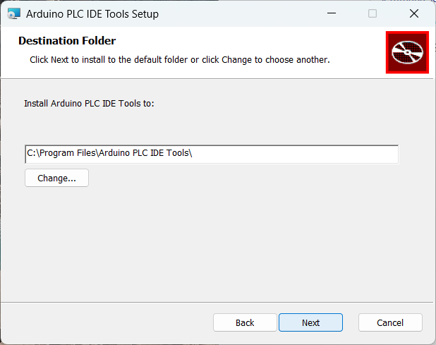
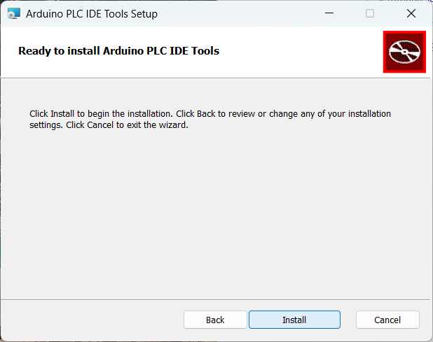
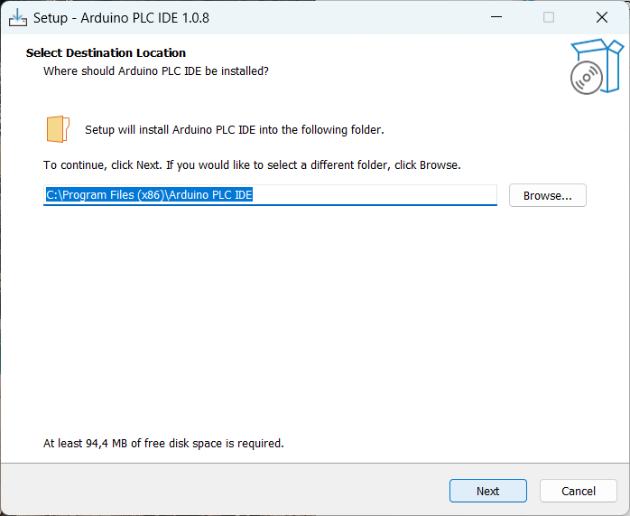

# Guida al primo avvio di Finder OPTA con PLC IDE

Guida per l'installazione di Arduino PLC IDE e l'attivazione della licenza di Finder OPTA.

## Panoramica

**Arduino PLC IDE** consente di programmare **Finder OPTA** utilizzando i
cinque linguaggi standard **IEC 61131-3**: Ladder Diagram (LD), Functional
Block Diagram (FBD), Structured Text (ST), Sequential Function Chart (SFC) e
Instruction List (IL).

Questa guida mostra come collegare Finder OPTA ad Arduino PLC IDE, attivare la
licenza del dispositivo e configurarlo per il corretto utilizzo con l'ambiente
di sviluppo.

## Di cosa avrai bisogno

Prima di iniziare, assicurati di avere:

* [PLC Finder OPTA](https://opta.findernet.com/it/arduino) (x1)
* Cavo USB-C (x1)
* L'installer di Arduino PLC IDE. Puoi scaricarlo [a questo
  link](https://opta.findernet.com/it/arduino#download-ide).

## Istruzioni

Per ottenere il software Arduino PLC IDE, visita il sito ufficiale e scarica il
file di installazione denominato **Arduino PLC IDE Installer**. Il software è
compatibile con Windows 10 o versioni successive per architetture x64.

Il programma di installazione include l'IDE e tutti i driver, le librerie e i
core necessari per utilizzare Finder OPTA.

***Nota: se hai già installato Arduino PLC IDE in passato, assicurati di aver rimosso
le versioni precedenti. Inoltre, rimuovi la cartella `C:\Users\<nome
utente>\AppData\Local\T`.***

### Installare Arduino PLC IDE

Prima di iniziare viene richiesto di accettare la licenza d'uso. Spunta la
casella di conferma e fai clic su *Install* per procedere.

Per prima cosa vengono installati i **PLC IDE Tools**, un pacchetto di
strumenti essenziali per il corretto funzionamento dell'IDE. Fai clic su
*Next* per continuare.

Successivamente, viene richiesto di selezionare una directory di installazione
per i **PLC IDE Tools**. Scegli una cartella di destinazione o utilizza il
percorso predefinito, quindi fai clic su *Next*.

Fai clic su *Install* per avviare l'installazione dei **PLC IDE Tools** alla
destinazione scelta.

Una volta completata l'installazione, premi il pulsante *Finish* e prosegui.

A questo punto verrà avviato il setup di Arduino PLC IDE. Anche in questo
caso, seleziona una directory di installazione e premi *Next*.

Procedi con l'installazione premendo il pulsante *Install*.

Al termine dell'installazione, premi *Finish* per chiudere la finestra.

Comparirà anche la seguente finestra conclusiva, chiudi la finestra per uscire
dall'installer.

***Nota: se dopo l'installazione il software non funziona correttamente,
riavviare il computer può essere utile per completare l'integrazione di driver,
librerie e dipendenze. Se i problemi persistono, prova a ripetere
l'installazione disabilitando l'antivirus e avviando il setup con privilegi
amministrativi.***

### Creazione del progetto e installazione del runtime

In questa sezione vedrai come creare un nuovo progetto con Finder OPTA e come
installare il runtime sul dispositivo utilizzando Arduino PLC IDE. Questo
passaggio è essenziale, poiché il runtime agisce come ponte di comunicazione
tra Finder OPTA e l’ambiente di sviluppo.

Prima di tutto **collega Finder OPTA al computer con il cavo USB-C** e apri
Arduino PLC IDE. Verrà visualizzata la schermata di benvenuto:

Per iniziare, crea un nuovo progetto facendo clic sul pulsante *New project*
o su *File > New project*. Assicurati che il sistema selezionato per il
progetto sia *Opta 1.2*.

La schermata di nuovo progetto apparirà come nell'immagine seguente.

Adesso clicca sulla tab *Risorse* che trovi in basso a sinistra, in
alternativa clicca su *Vista > Finestre strumenti > Risorse*. Si aprirà una
struttura ad albero con una voce *Opta*, cliccala per aprire la schermata di
configurazione di Finder OPTA.

Adesso scarichiamo il runtime sul dispositivo, per farlo scorri nella pagina di
configurazione verso il basso fino a che non compare il selettore delle porte
COM di Finder OPTA. A questo punto seleziona la prima porta disponibile.

Adesso fai clic su *Download* per scaricare il software su Finder OPTA.

***Nota: scarica il runtime ogni volta che aggiorni Arduino PLC IDE a una nuova
versione. Questo passaggio garantisce la corretta comunicazione tra Finder OPTA
e Arduino PLC IDE.***

#### Porte di Finder OPTA

Arduino PLC IDE mostra due porte COM per Finder OPTA:

* Porta predefinita: porta seriale di Finder OPTA, ha numero più basso.
* Porta secondaria: porta virtuale per la comunicazione tra Finder OPTA e il
  computer, ha numero più alto.

Prendi nota di entrambe, ci serviranno per connetterci a Finder OPTA.

#### Risoluzione degli errori

Durante la procedura di download potresti vedere un messaggio di errore di
questo tipo:

Se compare, procedi come segue:

1. Premi due volte il pulsante di reset utilizzando la punta di una penna o un
   oggetto appuntito.
2. Verifica che il LED sopra il pulsante di reset lampeggi.
3. Clicca nuovamente sul pulsante *Download* per ripetere l'installazione del
   runtime.

Se i problemi persistono, avvia Arduino PLC IDE come amministratore. Questo
passaggio può risolvere eventuali problemi di autorizzazione che impediscono la
comunicazione con Finder OPTA.

### Collegarsi al dispositivo

Dopo aver installato il runtime, è necessario configurare la comunicazione con
Finder OPTA. Apri il menu *On-line > Imposta comunicazione*.

Dalla finestra che appare, accedi alle proprietà del protocollo Modbus.

Imposta come porta iniziale il numero di porta seriale predefinito, ovvero la
porta con il numero più basso.

Clicca su *OK* per applicare le modifiche ed esci dalle impostazioni di
comunicazione. Adesso è il momento di collegarsi al dispositivo, per farlo
clicca su *On-line > Connect* per stabilire la connessione tra il dispositivo
e Arduino PLC IDE.

Una volta stabilita la connessione, la schermata di configurazione mostra i
dettagli del dispositivo collegato, indicandone le caratteristiche e lo stato
della licenza. È possibile vedere lo stato della connessione nel riquadro in
basso.

#### Risoluzione degli errori di connessione

Nel caso in cui la porta predefinita non stabilisca la connessione (vedi figura
in seguito), modifica la porta usata nella configurazione del Modbus e utilizza
la porta secondaria, generalmente indicata con un numero più alto.

In seguito, connettiti al dispositivo e verifica che PLC IDE non mostri più
alcun errore.

### Attivare la licenza di Finder OPTA

Finder OPTA viene fornito con una licenza preconcessa che deve essere attivata.
Pertanto nella schermata di configurazione del dispositivo è presente il tasto
*Activate PLC runtime*, assicurati che Finder OPTA si collegato al PC e
clicca il pulsante per attivare la licenza.

Il messaggio di conferma avverte che Arduino PLC IDE verrà disconnesso in
seguito all'operazione, premi *OK* e prosegui.

Un altro avviso chiede di far ripartire il dispositivo dopo l'attivazione della
licenza, premi *OK* e continua.

A questo punto fai ripartire Finder OPTA premendo una volta il tasto reset sul
dispositivo, poi ripeti la procedura di connessione vista in precedenza.

L'attivazione del dispositivo è completa, lo **Status** di Finder OPTA é **OK**
ed è pronto per essere utilizzato con Arduino PLC IDE.

### Scaricare un programma

Per eseguire il primo programma su Finder OPTA, utilizzeremo il codice di
default incluso nel progetto. Si tratta di un semplice contatore che incrementa
il proprio valore di 1 ad ogni ciclo di esecuzione. L'obiettivo è verificare
che il dispositivo sia in grado di eseguire correttamente il codice e
aggiornare i valori in tempo reale, consentendo di monitorare l'incremento
direttamente all'interno di Arduino PLC IDE.

Apri la sezione *Progetto* affianco a *Risorse* oppure clicca su *Vista >
Finestre strumenti > Progetto*. In seguito seleziona la voce *main* dalla
struttura ad albero, in questo modo verrà mostrato il codice del contatore.

Per trasferire il programma al dispositivo, compila il codice usando il
pulsante in alto a sinistra.

Adesso avvia il download sul PLC cliccando su *On-line > Trasferimento
codice*.

Comparirà un messaggio di avviso, clicca su *Sì* e prosegui.

A questo punto il codice è stato scaricato correttamente sul dispositivo, che
lo sta eseguendo.

### Verificare l'esecuzione del programma

Per controllare il corretto funzionamento del programma in esecuzione su Finder
OPTA, possiamo monitorare il valore del contatore direttamente all'interno di
Arduino PLC IDE.  Per farlo dobbiamo aggiungere un **Watch**, ovvero uno
strumento che accede ad una variabile e ne monitora il valore.

È necessario essere connessi a Finder OPTA, se dopo il download il tuo PC si è
disconnesso dal dispositivo, ripeti l'operazione di connessione come fatto in
precedenza. Adesso vai su *Vista > Finestra strumenti > Watch*.

Si aprirà una finestra sul lato destro della schermata con al suo interno un
pulsante *Inserisci nuovo elemento*, cliccalo.

In questo modo stiamo indicando le variabili da monitorare, seleziona il primo
pulsante *Sfoglia*.

Dalla lista delle variabili del programma seleziona `cnt`, che rappresenta il
valore del contatore.

Premi *OK* per applicare le modifiche e chiudere le finestre. Se la variabile
sta venendo monitorata correttamente, vedrai una schermata come quella
seguente.

Se il contatore `cnt` — all'interno della cella evidenziata di rosso — viene
incrementato costantemente, significa che Finder OPTA sta eseguendo il codice e
che i dati vengono aggiornati in tempo reale all'interno di Arduino PLC
IDE.

## Conclusione

Hai completato con successo la configurazione iniziale di **Finder OPTA** con
**Arduino PLC IDE**. Ora che **Finder OPTA** è correttamente configurato e
operativo, puoi iniziare a esplorare le potenzialità offerte dai linguaggi
**IEC 61131-3**.

<!-- Per saperne di più ti consigliamo di seguire il prossimo [tutorial](...). -->
