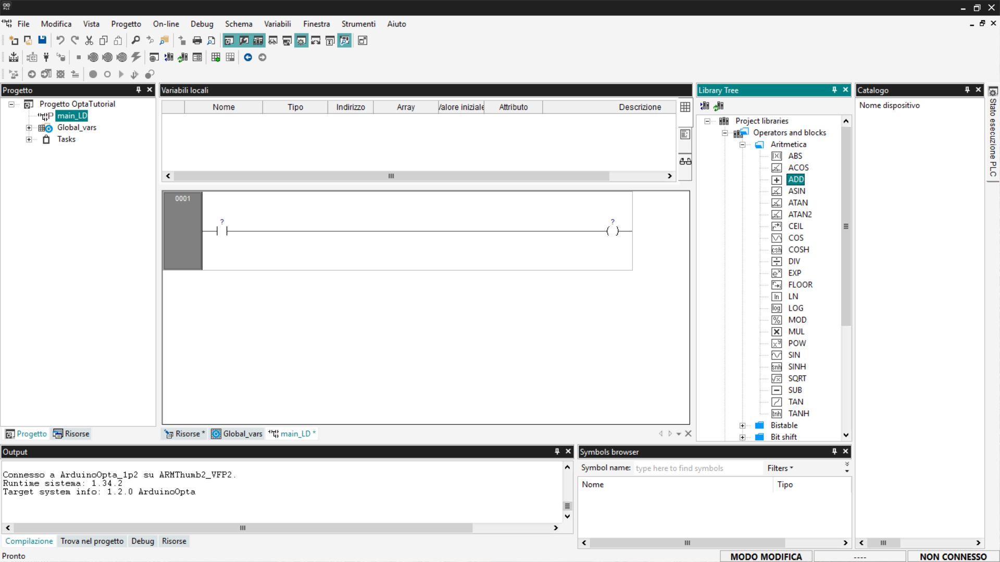
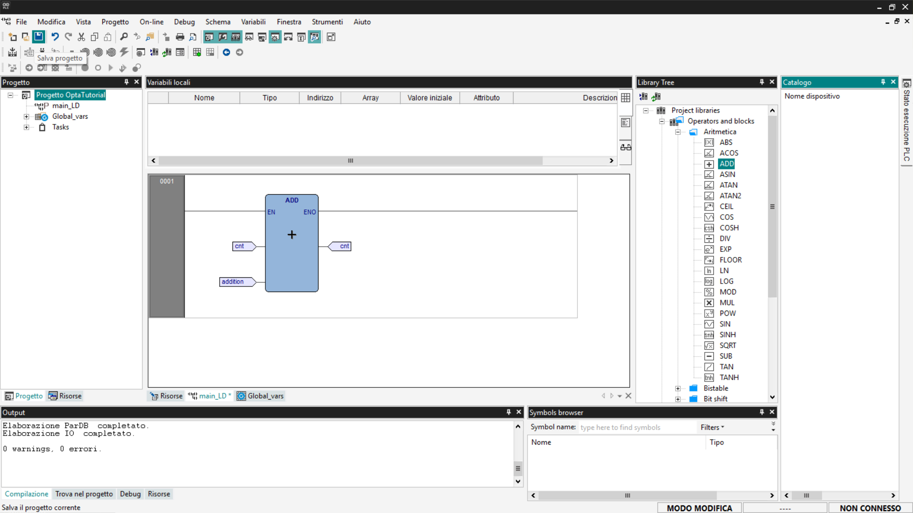
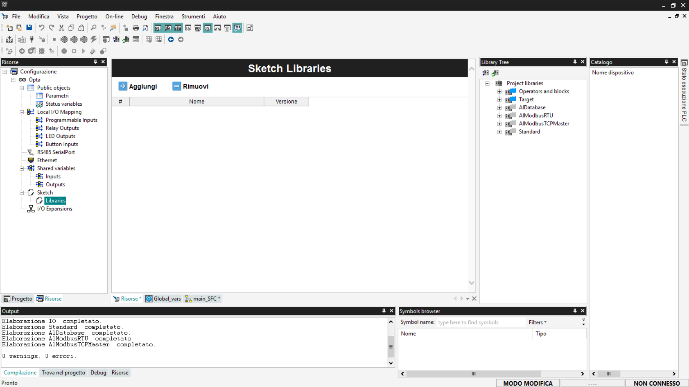

# Introduzione alla programmazione in PLC IDE con Finder OPTA

Guida per iniziare a programmare Finder OPTA in Arduino PLC IDE.

## Panoramica

Questo tutorial offre un'introduzione alla programmazione PLC in Arduino PLC
IDE con Finder OPTA. All’interno della guida scoprirai quali linguaggi di
programmazione sono compatibili con Arduino PLC IDE e come utilizzarli in modo
efficace.

## Di cosa avrai bisogno

Prima di iniziare, assicurati di avere:

* [PLC Finder OPTA](https://opta.findernet.com/it/arduino) (x1)
* Cavo USB-C (x1)
* **Arduino PLC IDE** correttamente installato sul tuo computer.

Se non hai ancora attivato la licenza per il dispositivo Finder OPTA, segui
[questa guida](https://opta.findernet.com/it/tutorial/plc-ide-setup-license)
per completare l'attivazione.

In questo tutorial si presume che tu abbia già familiarità con alcuni concetti
di base, trattati nella guida “[Primi passi con Finder OPTA e PLC
IDE](https://opta.findernet.com/it/tutorial/plc-first-steps)”. Se non l’hai
ancora consultata, ti consigliamo di seguirla prima di procedere: ti fornirà le
fondamenta necessarie per comprendere al meglio i passaggi descritti in
seguito.

## Lo standard IEC-61131-3

Lo standard IEC-61131-3 definisce un framework per la programmazione PLC,
consentendo agli sviluppatori di scrivere codice in un formato uniforme,
indipendentemente dal produttore dell'hardware.

IEC-61131-3 include cinque linguaggi di programmazione che possono essere
utilizzati singolarmente o combinati all'interno dello stesso progetto:

* Structured Text (ST)
* Instruction List (IL)
* Ladder Diagram (LD)
* Sequential Function Chart (SFC)
* Functional Block Diagram (FBD)

Arduino PLC IDE supporta tutti questi linguaggi, consentendo di combinarli
nello stesso progetto e di farli interagire utilizzando variabili condivise.

Vedremo degli esempi pratici per ogni tipo di linguaggio, implementeremo la
stessa funzione di contatore in ogni linguaggio. Prima di fare ciò dobbiamo
creare delle variabili che ci serviranno per implementare il contatore.

### Preparazione delle variabili e del Watch

In questo tutorial useremo delle variabili globali in modo da non doverle
ricreare per ogni linguaggio. Se vuoi saperne di più sulle variabili globali e
locali segui [questa
guida](https://opta.findernet.com/it/tutorial/plc-first-steps).

Per la funzione di contatore useremo due variabili, una viene usata come
contatore che accumula il valore di conteggio, l'altra viene usata come
incremento costante:

* *cnt*: variabile con valore iniziale `0`, viene usata per contenere il valore
  aggiornato del contatore.
* *addition*: variabile con valore iniziale `1`, il campo *Attributo* deve
  essere impostato su *CONSTANT* per segnalare che il valore è costante.

Per aggiungere le variabili accedi alla sezione *Progetto > Global_vars*.
Imposta il valore iniziale della variabile *cnt* di default premendo sulla
casella corrispondente.


Per inserire una nuova variabile premi il tasto destro e clicca su *Inserisci*.


Si creerà una nuova riga in tabella, modifica i seguenti valori:

* *Nome*: `addition`.
* *Tipo*: `INT`, deve essere di tipo intero.
* *Valore iniziale*: `1`.
* *Attributo*: `CONSTANT`, indica che il valore è costante.


A questo punto salva le modifiche premendo il pulsante *Salva* in alto a
sinistra.


Per monitorare la variabile di conteggio e capire se il suo valore sta
incrementando, dobbiamo preparare il Watch. Se vuoi avere più informazioni su
questo strumento segui [questa
guida](https://opta.findernet.com/it/tutorial/plc-first-steps).

Mostra la sezione del Watch selezionando *Vista > Finestre Strumenti > Watch*.  


Per aggiungere la variabile al Watch trascina l'elemento *cnt* dalla lista
delle variabili globali nello spazio del Watch.


In alternativa, clicca su *Inserisci nuovo elemento* e scegli la variabile
*cnt* dalla lista di variabili proposte.


In questo modo avremo il Watch già pronto per monitorare la variabile *cnt* e
controllare se i programmi scaricati su Finder OPTA funzionano.

### Structured Text (ST)

Il Structured Text (ST) è un linguaggio di programmazione testuale simile al C,
progettato per implementare logiche complesse in modo leggibile e strutturato.
Il codice che implementa un contatore in ST è il seguente:

```st
cnt := cnt + addition;
```

Questa istruzione aggiorna la variabile *cnt* sommando al suo valore attuale
una costante (o variabile) *addition*. Copia il codice e incollalo nella voce
*main* del menu ad albero nella sezione *Progetto*.


Successivamente, compila il codice utilizzando il pulsante *Compile PLC
project* in alto a sinistra.


Adesso connettiti al dispositivo e scarica il codice su Finder OPTA premendo il
pulsante *Download PLC code*.


Ti verrà chiesto se desideri procedere con il reset delle variabili, premi *Sì*
per confermare


Apri la finestra di Watch per verificare che il valore del contatore aumenti
correttamente. Se il valore non è visibile, premi su *Avvia/Arresta Watch*.


Se il valore di *cnt* si incrementa, significa che il programma di conteggio
scritto in ST è stato caricato correttamente su Finder OPTA ed è in esecuzione
senza errori.

### Instruction List (IL)

Instruction List (IL) è un linguaggio di programmazione testuale compatto,
simile ad Assembly. È particolarmente adatto per operazioni sequenziali e
logiche semplici, utilizzando comandi diretti e sintassi lineare.

Un esempio di contatore in IL è il seguente:

```asm
LD cnt
ADD addition
ST cnt
```

Nel dettaglio:

* `LD cnt` carica il valore della variabile *cnt* nello stack dell’unità
  logica.
* `ADD addition` somma a questo valore quello della variabile *addition*.
* `ST cnt` salva il risultato nuovamente nella variabile *cnt*.

Prima di procedere, elimina il programma precedente per evitare conflitti sulle
variabili globali: fai clic con il tasto destro sul programma creato in
precedenza e seleziona *Delete program*.


Ti verrà chiesto di confermare la cancellazione, premi *Sì*.


Adesso aggiungi il nuovo programma IL, per farlo premi il tasto destro sul nome
del progetto e seleziona *Aggiungi > Nuovo Programma*.


Imposta il linguaggio *IL* e assegna il programma al task di tipo *Fast* per
aumentare la frequenza di esecuzione del programma. Se vuoi sapere di più sul
funzionamento dei task segui questa guida<!-- add link -->.


Copia il codice mostrato in precedenza ed inseriscilo nella voce *main_IL* del
menu ad albero nella sezione *Progetto*.


Adesso compila il programma premendo il tasto *Compile PLC project* in alto a
sinistra.


Effettua la connessione a Finder OPTA e scarica il programma sul PLC premendo
il pulsante *Download PLC code*.


A questo punto il programma sta eseguendo su Finder OPTA, controlla il Watch
come fatto precedentemente e verifica che il valore di *cnt* stiamo aumentando.


Se il contatore si aggiorna come previsto, il programma IL è stato caricato ed
eseguito correttamente su Finder OPTA.

### Ladder Diagram (LD)

Il Ladder Diagram (LD) è un linguaggio di programmazione basato su linee e
blocchi, utilizzato per rappresentare logiche di controllo in modo visivo.

In un Ladder Diagram, ogni linea rappresenta un flusso di corrente virtuale che
procede da sinistra a destra. Il flusso deve attraversare tutti i blocchi
intermedi, come porte logiche (*AND*, *OR*), prima di raggiungere il lato
destro, dove si trova una bobina (*coil*).

Se il flusso supera con successo tutti i blocchi intermedi, la bobina viene
attivata, eseguendo l'azione associata, come ad esempio chiudere un contatto
Normally-Open (NO) o attivare un relè.

Nel nostro caso, per scrivere una semplice funzione di conteggio, non servono i
componenti *contatto* e *coil*. Useremo un blocco *ADD* a cui collegeremo le
variabili degli addendi e quella del risultato.

Come prima cosa elimina i programmi creati in precedenza come mostrato di sopra
e creane uno nuovo in linguaggio *LD* e assegnalo ad un task di tipo *Fast*. Il
nuovo programma apparirà come nell'immagine seguente.


Adesso dobbiamo aggiungere un blocco logico, per farlo vai nella sezione
*Library Tree*, se non la vedi clicca su *Vista > Finestre strumenti > Library
Tree*. Clicca sulla voce *Operators and blocks* poi su *Aritmetica*, vedrai
comparire diverse tipologie di blocchi logici.



Per aggiungere un blocco al tuo programma clicca sul nome del blocco
desiderato, *ADD* nel nostro caso e trascinalo sul componente *contatto* a
sinistra nel programma. In alternativa puoi cliccare con il tasto destro e
selezionare l'opzione *Nuovo Blocco*, filtrare per *Operatori* e selezionare il
blocco *ADD* dalla lista.


Una volta aggiunto il blocco, elimina i componenti *contatto* e *coil*
cliccandoci sopra con il tasto destro e selezionando la voce *Elimina*; come
detto in precedenza, non servono per il nostro esempio.


A questo punto è necessario associare le variabili ai pin del blocco funzione,
per il blocco *ADD* le variabili di input sono sul lato sinistro del blocco,
quella di output è sul lato destro. Per collegare le variabili ai pin clicca
sul pin di interesse, si aprirà una finestra da cui è possibile accedere ad un
pulsante *Sfoglia* indicato da tre puntini.


Dalla lista scegli la variabile da associare al pin selezionato.


Una volta completata l'associazione, il tuo programma LD deve apparire come
nella schermata seguente. Ricordati di associare *cnt* e *addition* come input
e di nuovo *cnt* come output.


Salva il progetto.



Procedi alla compilazione del programma premendo il pulsante *Compile PLC
project* in alto a sinistra.


Connettiti a Finder OPTA e scarica il codice sul PLC premendo *Download PLC
code*.


Apri il Watch e monitora il valore della variabile *cnt*.


Se il contatore si aggiorna come previsto, il programma LD è stato caricato ed
eseguito correttamente su Finder OPTA.

### Sequential Function Chart (SFC)

SFC è un linguaggio che consente di scrivere programmi PLC in modo visivo,
seguendo una logica simile a un diagramma di flusso. I programmi SFC sono
composti da blocchi che eseguono operazioni specifiche, seguiti da transizioni
che determinano il passaggio al passo successivo.

È importante notare che il linguaggio SFC non può interagire direttamente con
gli output del dispositivo. Per controllare le uscite  è necessario utilizzare
**azioni**, ovvero script scritti in altri linguaggi.

In questa sezione vedremo come scrivere un contatore in SFC. Prima di tutto
elimina i programmi creati precedentemente e aggiungine uno nuovo impostando il
linguaggio su *SFC* e assegnandolo al task *Fast*.


#### Creare un’azione

Un’azione è un blocco di codice, scritto in un altro linguaggio - ad esempio ST
-, che viene eseguito quando attivato da uno step nel diagramma SFC.

Per creare una nuova azione clicca con il tasto destro sulla voce del nuovo
programma e seleziona *Nuova Azione*.


A questo punto seleziona il linguaggio di interesse, nel nostro caso useremo
*ST*, e nomina la nuova azione.


Per accedere al codice dell'azione appena creata naviga nella voce di menu del
programma SFC, espandi la voce *Azioni* e clicca sul nome dell'azione.


In questo modo puoi inserire il codice ST che preferisci, per il nostro
esempio, inseriamo lo stesso codice che abbiamo visto precedentemente per la
sezione del [linguaggio ST](#structured-text-st). Copia il codice seguente e
inseriscilo nel programma come in figura.

```st
cnt := cnt + addition;
```


Dopo averlo inserito, salva il progetto.

#### Programma SFC

Un programma SFC segue una sequenza precisa:

```text
Passo0 → Transizione0 → Passo1 → Transizione1 → … → Salto
```

* Un *Passo* rappresenta un'azione da eseguire.
* Una *Transizione* indica quando passare allo step successivo, in base al
  risultato dell’azione precedente.
* Un *Salto* serve per collegarsi a un altro step nel diagramma. Se vuoi creare
  un ciclo, usa un *Jump* per tornare allo step iniziale chiamato *Init*.

Prima di iniziare, premi il tasto destro e controlla che l'opzione
*Autoconnessione* sia abilitata, questa funzione ti permette di collegare i
blocchi automaticamente dopo l'aggiunta.


Per aggiungere una transizione premi il tasto destro e seleziona *Oggetto >
Nuovo > Transizione*. Oppure puoi usare la barra strumenti SFC che viene
mostrata selezionando *Vista > Barra degli strumenti > SFC*.


Collega la transizione all'output del blocco *Init*. Le transizioni sono
richieste dopo ogni blocco di azione *Passo*, per il nostro esempio ci basta
usare una semplice transizione fissata a *True*.


Adesso aggiungi un blocco *Salto*, questo blocco permette di ricollegare il
flusso ad un blocco già esistente.


Associa il nuovo blocco al blocco *Init* in modo da permettere al programma di
ripartire da capo.


Nei blocchi azione puoi impostare due modalità di esecuzione:

* **Codice P** (*Pulse*): l’azione viene eseguita una sola volta ogni volta che
  il blocco si attiva.
* **Codice N** (*Normal not stored*): l’azione viene eseguita in modo
  continuativo, a ogni ciclo del PLC, finché il blocco rimane attivo.

Nel nostro esempio utilizzeremo il Codice N, così da poter osservare
l’incremento costante del valore di cnt. Per impostare questa modalità,
seleziona il blocco *Init*, aggiungi o modifica l’azione e assegna ad essa il
Codice N.


A questo punto salva, compila il progetto, connettiti a Finder OPTA e scarica
il codice sul PLC con *Download PLC code*.


Apri il Watch e inizia a monitorare la variabile *cnt*.


Se il contatore si aggiorna come previsto, il programma SFC è stato caricato ed
eseguito correttamente su Finder OPTA.

### Functional Block Diagram (FBD)

FBD è un linguaggio che consente di scrivere programmi PLC utilizzando una
rappresentazione grafica basata su blocchi funzionali. In FBD non esiste un
flusso sequenziale rigido: i blocchi vengono eseguiti simultaneamente a ogni
ciclo di scansione del PLC, in base alle connessioni tra ingressi e uscite.

Ogni blocco rappresenta una specifica funzione logica o matematica. Ad esempio,
aggiungendo un blocco `Add`, si esegue l’operazione di somma a ogni ciclo di
esecuzione.

Per implementare un contatore in FBD è molto semplice, inizia eliminando i
programmi creati nei passaggi precedenti e aggiungine uno nuovo al progetto
selezionando il linguaggio FBD e assegnandolo al task di tipo *Fast*.


A questo punto i passaggi sono molto simili a quelli visti nella [sezione
dedicata al programma LD](#ladder-diagram-ld). Aggiungi un blocco di tipo *ADD*
trascinandolo dalla sezione *Library Tree* oppure usando il menu del tasto
destro.


Associa le variabili di interesse come visto in precedenza: gli input *cnt* e
*addition* a sinistra del blocco, l'output *cnt* a destra del blocco. Per farlo
ti basterà fare doppio clic sull'estremità dei connettori del blocco *ADD*. Una
volta configurati, i pin appariranno come in seguito.


A questo punto salva, compila il progetto, connettiti a Finder OPTA e scarica
il codice sul PLC con *Download PLC code*.


Apri il Watch e inizia a monitorare la variabile *cnt*.


Se il contatore si aggiorna come previsto, il programma FBD è stato caricato ed
eseguito correttamente su Finder OPTA.

## Integrazione con gli sketch Arduino

Oltre ai linguaggi standard, PLC IDE consente di integrare anche sketch
Arduino, permettendo di combinare la programmazione PLC con il codice C++.
Questa integrazione avviene attraverso **variabili condivise**, che consentono
di far comunicare il codice IEC-61131-3 con gli sketch Arduino.

In questo modo, è possibile — ad esempio — riutilizzare la logica PLC esistente
e arricchirla con codice C++ per implementare funzionalità avanzate. Questo
approccio permette di espandere un sistema esistente senza doverne riprogettare
la logica di base.

In questa sezione vedremo come far comunicare uno sketch Arduino con un
programma ST. Scriveremo un contatore in C++ che comunica con il codice ST in
modo da poter controllare che la variabile si aggiorni correttamente.

Elimina i programmi scritti in precedenza, creane uno nuovo in linguaggio ST e
assegnalo al task *Fast*. È necessario aggiungere una variabile condivisa che
possa essere accessibile sia dallo sketch che dal programma ST. Le variabili
condivise sono suddivise in due tipologie:

* **Input**: le variabili di input vengono utilizzate per passare un valore dal
  programma PLC allo sketch e sono accessibili con il prefisso *PLCIn.*
* **Output**: le variabili di output vengono utilizzate per passare un valore
  dallo sketch al programma PLC e sono accessibili con il prefisso *PLCOut.*

In questo caso avremo bisogno di utilizzare una varibile di output che viene
aggiornata dallo sketch. Per aggiungere una variabile di output vai nella
sezione *Risorse*, espandi *Shared variables* e seleziona la voce *Outputs*.
Comparirà una lista vuota, clicca sul pulsante *Aggiungi* e rinomina la
variabile appena aggiunta come di seguito.


Ora scriviamo il codice C++ che implementa la logica del contatore. Definiamo
innanzitutto una variabile costante – *addition_cpp* – utilizzata come
incremento. All’interno della funzione *loop()*, aggiorniamo la variabile
condivisa *cnt_cpp* sommando il valore di *addition_cpp* ad ogni ciclo. Ricorda
che le variabili di output condivise sono accessibili dallo sketch tramite il
prefisso *PLCOut*. Inseriamo inoltre un delay di 1 secondo nel ciclo, in modo
da rendere facilmente osservabile l’incremento della variabile durante il
monitoraggio.

Copia il codice che trovi in seguito e incollalo nella pagina di *Sketch*
all'interno della sezione *Risorse*.

```arduino
const int addition_cpp = 1;

void setup()
{
}

void loop()
{
    PLCOut.cnt_cpp += addition_cpp;
    delay(1000);
}
```


A questo punto non ti resta che scrivere un semplice programma ST che
sostituisca il valore della variabile globale *cnt* con il valore aggiornato di
*cnt_cpp*. Di seguito il codice da incollare all'interno del programma, segui
il procedimento indicato nella [sezione dedicata al linguaggio
ST](#structured-text-st).

```st
cnt := cnt_cpp;
```


Salva il progetto, compilalo, connettiti a Finder OPTA e scarica il codice sul
PLC. Poi apri il Watch e inizia a monitorare la variabile *cnt*.


Se il contatore si aggiorna come previsto, lo sketch è stato caricato e
comunica correttamente con il programma ST.

### Aggiungere una libreria allo sketch

Come già anticipato, PLC IDE permette di combinare la programmazione PLC con il
codice C++.

Se vuoi aggiungere una libreria allo sketch, vai alla scheda *Risorse* e fare
clic su *Libraries*, sotto la voce *Sketch*.



Con la finestra *Sketch Libraries* aperta, fai clic su *Aggiungi* e verrà
aggiunta una riga alla lista. Inserisci manualmente nome e versione della
libreria, verificabili nella documentazione della libreria stessa disponibile.
In questo esempio aggiungiamo la libreria *ArduinoHttpClient*, il numero di
versione e la sua documentazione si trovano [a questo
link](https://docs.arduino.cc/libraries/arduinohttpclient/).


Una volta aggiunta la libreria al progetto non resta che includerla nel codice,
per farlo clicca sulla voce *Sketch* del menu *Risorse* e inserisci la seguente
riga in testa al codice:

```cpp
#include <ArduinoHttpClient.h>
```


In questo modo la libreria è utilizzabile in tutto il codice dello sketch.

***Nota: attualmente, PLC IDE può includere solo librerie indicizzate
pubblicamente sul [sito di Arduino](https://docs.arduino.cc/libraries/).***

## Conclusione

In questo tutorial abbiamo esplorato le potenzialità di **Arduino PLC IDE** con
**Finder OPTA**, mostrando come configurare variabili globali e creare
programmi di esempio nei cinque linguaggi IEC-61131-3 (ST, IL, LD, SFC e FBD).
Abbiamo inoltre illustrato come integrare uno sketch Arduino C++ tramite
variabili condivise, ampliando così le funzionalità del PLC con codice C++.
