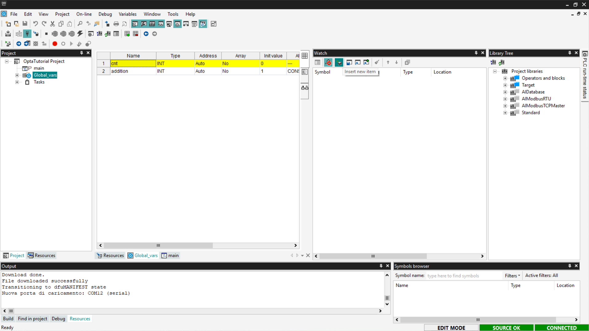
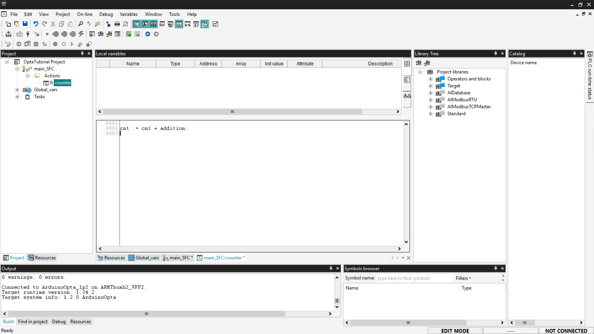

# Introduction to Programming in PLC IDE with Finder OPTA

Guide to get started programming Finder OPTA in Arduino PLC IDE.

## Overview

This tutorial offers an introduction to PLC programming in Arduino PLC IDE with
Finder OPTA. Within this guide, you will discover which programming languages
are compatible with Arduino PLC IDE and how to use them effectively.

## What You Will Need

Before starting, make sure you have:

* [Finder OPTA PLC](https://opta.findernet.com/en/arduino) (x1)
* USB-C cable (x1)
* **Arduino PLC IDE** correctly installed on your computer.

If you have not yet activated the license for the Finder OPTA device, follow
[this guide](https://opta.findernet.com/en/tutorial/plc-ide-setup-license) to
complete the activation.

This tutorial assumes you are already familiar with some basic concepts covered
in the guide “[First Steps with Finder OPTA and PLC
IDE](https://opta.findernet.com/en/tutorial/plc-first-steps)”. If you have not
yet consulted it, we recommend doing so before proceeding: it will provide the
necessary foundation to better understand the steps described below.

## The IEC-61131-3 Standard

The IEC-61131-3 standard defines a framework for PLC programming, allowing
developers to write code in a uniform format, regardless of the hardware
manufacturer.

IEC-61131-3 includes five programming languages that can be used individually
or combined within the same project:

* Structured Text (ST)
* Instruction List (IL)
* Ladder Diagram (LD)
* Sequential Function Chart (SFC)
* Functional Block Diagram (FBD)

Arduino PLC IDE supports all these languages, allowing them to be combined in
the same project and interact using shared variables.

We will see practical examples for each language type, implementing the same
counter function in each language. Before doing that, we need to create the
variables that we will use to implement the counter.

### Preparing Variables and Watch

In this tutorial, we will use global variables so that we don't have to
recreate them for each language. If you want to learn more about global and
local variables, follow [this
guide](https://opta.findernet.com/en/tutorial/plc-first-steps).

For the counter function, we will use two variables: one to serve as the
counter that accumulates the count value, and the other to serve as a constant
increment:

* **cnt**: variable with initial value `0`, used to hold the updated counter
  value.
* **addition**: variable with initial value `1`; the *Attribute* field must be
  set to *CONSTANT* to indicate that the value is constant.

To add the variables, go to *Project > Global_vars*. Set the initial value of
the *cnt* variable to 0 by clicking on the corresponding field.


To insert a new variable, right-click and select on *Insert*.


A new row will appear in the table; modify the following values:

* *Name*: `addition`.
* *Type*: `INT`, it must be of integer type.
* *Init Value*: `1`.
* *Attribute*: `CONSTANT`, indicates that the value is constant.


At this point, save your changes by clicking the *Save* button at the top left.


To monitor the counter variable and understand if its value is increasing, we
need to prepare the Watch. If you want more information about this tool, follow
[this guide](https://opta.findernet.com/en/tutorial/plc-first-steps).

Show the Watch section by selecting *View > Tool Windows > Watch*.


To add the variable to the Watch, drag the *cnt* element from the list of
global variables into the Watch area.


Alternatively, click on *Insert New Item* and choose the *cnt* variable from
the list of proposed variables.



This way, we will have the Watch ready to monitor the *cnt* variable and check
if the programs downloaded to Finder OPTA are working.

### Structured Text (ST)

Structured Text (ST) is a textual programming language similar to C, designed
to implement complex logic in a readable and structured way. The code that
implements a counter in ST is as follows:

```st
cnt := cnt + addition;
```

This instruction updates the *cnt* variable by adding a constant (or variable)
*addition* to its current value. Copy the code and paste it into the *main*
entry in the tree menu under the *Project* section.


Next, compile the code using the *Compile PLC project* button at the top left.


Now connect to the device and download the code to Finder OPTA by clicking the
*Download PLC code* button.


You will be asked if you want to proceed with resetting the variables; click
*Yes* to confirm.


Open the Watch window to verify that the counter value is increasing correctly.
If the value is not visible, click on *Start/Stop Watch*.


If the value of *cnt* increments, it means that the counting program written in
ST has been loaded correctly onto Finder OPTA and is running without errors.

### Instruction List (IL)

Instruction List (IL) is a compact textual programming language, similar to
Assembly. It is particularly suitable for sequential operations and simple
logic, using direct commands and linear syntax.

An example of a counter in IL is as follows:

```asm
LD cnt
ADD addition
ST cnt
```

In detail:

* `LD cnt` loads the value of the *cnt* variable onto the logic unit’s stack.
* `ADD addition` adds to this value the value of the *addition* variable.
* `ST cnt` stores the result back into the *cnt* variable.

Before proceeding, delete the previous program to avoid conflicts with global
variables: right-click on the previously created program and select *Delete
program*.


You will be asked to confirm the deletion; click *Yes*.


Now add the new IL program: right-click on the project name and select *Add >
New Program*.


Set the language to *IL* and assign the program to the *Fast* task type to
increase the program’s execution frequency. If you want to know more about how
tasks work, follow the guide “[First Steps with Finder OPTA and PLC
IDE](https://opta.findernet.com/en/tutorial/plc-first-steps)”.


Copy the previous code and insert it into the *main_IL* entry in the tree menu
under the *Project* section.


Now compile the program by clicking the *Compile PLC project* button at the top
left.


Connect to Finder OPTA and download the program to the PLC by clicking the
*Download PLC code* button.


At this point, the program is running on Finder OPTA; check the Watch as done
previously and verify that the value of *cnt* is increasing.


If the counter updates as expected, the IL program has been loaded and executed
correctly on Finder OPTA.

### Ladder Diagram (LD)

Ladder Diagram (LD) is a programming language based on lines and blocks, used
to represent control logic visually.

In a Ladder Diagram, each line represents a virtual current flow that moves
from left to right. The flow must pass through all intermediate blocks, such as
logic gates (*AND*, *OR*), before reaching the right side, where a coil is
located.

If the flow successfully passes through all intermediate blocks, the coil is
energized, executing the associated action, such as closing a Normally-Open
(NO) contact or activating a relay.

In our case, to write a simple counting function, the *contact* and *coil*
components are not needed. We will use an *ADD* block to which we will connect
the operand variables and the result variable.

First, delete the previously created programs as shown above and create a new
one in *LD* language, assigning it to a *Fast* task type. The new program will
appear as shown in the following image.


Now we need to add a logic block; to do this, go to the *Library Tree* section.
If you don't see it, click *View > Tool Windows > Library Tree*. Click on
*Operators and blocks*, then on *Arithmetic*, and you will see various types of
logic blocks.


To add a block to your program, click on the desired block name (*ADD* in our
case) and drag it onto the *contact* component on the left in the program.
Alternatively, you can right-click and select *New Block*, filter by
*Operators*, and select the *ADD* block from the list.


Once the block is added, delete the *contact* and *coil* components by
right-clicking on them and selecting *Delete*; as mentioned before, they are
not needed for our example.


At this point, you need to associate the variables with the function block
pins. For the *ADD* block, the input variables are on the left side of the
block, and the output variable is on the right side. To connect the variables
to the pins, click on the desired pin; a window will open with a *Browse*
button indicated by three dots.


From the list, choose the variable to associate with the selected pin.


Once the association is complete, your LD program should look like the
screenshot below. Remember to associate *cnt* and *addition* as inputs and
*cnt* again as the output.


Save the project.


Proceed to compile the program by clicking the *Compile PLC project* button at
the top left.


Connect to Finder OPTA and download the code to the PLC by clicking *Download
PLC code*.


Open the Watch and monitor the value of the *cnt* variable.


If the counter updates as expected, the LD program has been loaded and executed
correctly on Finder OPTA.

### Sequential Function Chart (SFC)

SFC is a language that allows writing PLC programs visually, following a
flowchart-like logic. SFC programs are composed of blocks that perform specific
operations, followed by transitions that determine when to move to the next
step.

It is important to note that the SFC language cannot interact directly with the
device’s outputs. To control the outputs, **actions** must be used, which are
scripts written in other languages.

In this section, we will see how to write a counter in SFC. First, delete the
previously created programs and add a new one by setting the language to *SFC*
and assigning it to the *Fast* task.


#### Creating an Action

An action is a block of code written in another language—such as ST—that is
executed when triggered by a step in the SFC diagram.

To create a new action, right-click on the new program entry and select *New
Action*.


At this point, select the language of interest—in our case, we will use
*ST*—and name the new action.


To access the code of the newly created action, navigate to the SFC program
entry in the menu, expand the *Actions* entry, and click on the action name.


This way, you can insert the ST code you prefer; for our example, we will
insert the same code we saw previously in the [ST language
section](#structured-text-st). Copy the following code and insert it into the
program as shown in the image.

```st
cnt := cnt + addition;
```



After inserting it, save the project.

#### SFC Program

An SFC program follows a precise sequence:

```text
Step0 → Transition0 → Step1 → Transition1 → … → Jump
```

* A *Step* represents an action to be executed.
* A *Transition* indicates when to move to the next step based on the result of
  the previous action.
* A *Jump* is used to connect to another step in the diagram. If you want to
  create a loop, use a *Jump* to return to the initial step called *Init*.

Before starting, right-click and ensure that the *Auto-connect* option is
enabled. This function allows you to automatically connect blocks after adding
them.


To add a transition, right-click and select *Object > New > Transition*.
Alternatively, you can use the SFC toolbar, which is shown by selecting *View >
Toolbar > SFC*.


Connect the transition to the output of the *Init* block. Transitions are
required after each *Step* block; for our example, a simple transition set to
*True* is sufficient.


Now add a *Jump* block; this block allows you to reconnect the flow to an
already existing block.


Associate the new block with the *Init* block to allow the program to start
over again.


In action blocks, you can set two execution modes:

* **Code P** (*Pulse*): the action is executed only once each time the block is
  activated.
* **Code N** (*Normal not stored*): the action is executed continuously, on
  every PLC cycle, as long as the block remains active.

In our example, we will use Code N, so we can observe the constant increment of
the *cnt* value. To set this mode, select the *Init* block, add or modify the
action, and assign Code N to it.


At this point, save, compile the project, connect to Finder OPTA, and download
the code to the PLC using *Download PLC code*.


Open the Watch and start monitoring the *cnt* variable.


If the counter updates as expected, the SFC program has been loaded and
executed correctly on Finder OPTA.

### Functional Block Diagram (FBD)

FBD is a language that allows writing PLC programs using a graphical
representation based on function blocks. In FBD, there is no rigid sequential
flow: blocks are executed simultaneously on each PLC scan cycle, based on the
connections between inputs and outputs.

Each block represents a specific logical or mathematical function. For example,
by adding an `Add` block, the addition operation is performed on each execution
cycle.

To implement a counter in FBD is very simple. Start by deleting the programs
created in previous steps and adding a new one to the project by selecting the
FBD language and assigning it to a *Fast* task.


At this point, the steps are very similar to those seen in the [Ladder Diagram
section](#ladder-diagram-ld). Add an *ADD* block by dragging it from the
*Library Tree* section or by using the right-click menu.


Associate the variables of interest as seen previously: inputs *cnt* and
*addition* on the left side of the block, output *cnt* on the right side of
the block. To do this, simply double-click on the block connectors. Once
configured, the pins will appear as shown below.


Now save, compile the project, connect to Finder OPTA, and download the code to
the PLC using *Download PLC code*.


Open the Watch and start monitoring the *cnt* variable.


If the counter updates as expected, the FBD program has been loaded and
executed correctly on Finder OPTA.

## Integration with Arduino Sketches

In addition to standard languages, PLC IDE allows integrating Arduino sketches,
enabling the combination of PLC programming with C++ code. This integration
occurs through **shared variables**, which allow communication between
IEC-61131-3 code and Arduino sketches.

This way, it is possible, for example, to reuse existing PLC logic and enhance
it with C++ code to implement advanced features. This approach allows expanding
an existing system without having to redesign the basic logic.

In this section, we will see how to make an Arduino sketch communicate with an
ST program. We will write a counter in C++ that communicates with the ST code
so that we can verify that the variable updates correctly.

Delete the previously written programs, create a new one in ST language and
assign it to a *Fast* task. It is necessary to add a shared variable that can
be accessed by both the sketch and the ST program. Shared variables are divided
into two types:

* **Input**: input variables are used to pass a value from the PLC program to
  the sketch and are accessible with the prefix *PLCIn*.
* **Output**: output variables are used to pass a value from the sketch to the
  PLC program and are accessible with the prefix *PLCOut*.

In this case, we will need to use an output variable that is updated by the
sketch. To add an output variable, go to the *Resources* section, expand
*Shared variables*, and select the *Outputs* entry. A blank list will appear;
click the *Add* button and rename the newly added variable as follows.


Now let's write the C++ code that implements the counter logic. First, define a
constant variable — *addition_cpp* — used as the increment. Inside the *loop()*
function, update the shared variable *cnt_cpp* by adding the value of
*addition_cpp* each cycle. Remember that shared output variables are accessible
from the sketch via the *PLCOut* prefix. Also, include a 1-second delay in the
loop, so that the increment of the variable is easily observable during
monitoring.

Copy the code below and paste it into the *Sketch* page under the *Resources*
section.

```arduino
const int addition_cpp = 1;

void setup()
{
}

void loop()
{
    PLCOut.cnt_cpp += addition_cpp;
    delay(1000);
}
```


At this point, all you need to do is write a simple ST program that replaces
the value of the global variable *cnt* with the updated value of *cnt_cpp*.
Below is the code to paste into the program, following the procedure indicated
in the [ST language section](#structured-text-st).

```st
cnt := cnt_cpp;
```


Save the project, compile it, connect to Finder OPTA, and download the code to
the PLC. Then open the Watch and start monitoring the *cnt* variable.


If the counter updates as expected, the sketch has been loaded and communicates
correctly with the ST program.

### Adding a Library to the Sketch

As mentioned earlier, PLC IDE allows combining PLC programming with C++ code.

If you want to add a library to the sketch, go to the *Resources* tab and click
on *Libraries* under the *Sketch* entry.


With the *Sketch Libraries* window open, click *Add*, and a new row will be
added to the list. Enter the library name and version manually, which can be
found in the library’s documentation. In this example, we add the
*ArduinoHttpClient* library; the version number and its documentation can be
found [at this link](https://docs.arduino.cc/libraries/arduinohttpclient/).


Once the library is added to the project, simply include it in the code by
clicking on the *Sketch* entry in the *Resources* menu and inserting the
following line at the top of the code:

```cpp
#include <ArduinoHttpClient.h>
```


In this way, the library is usable throughout the sketch code.

***Note: currently, PLC IDE can only include libraries publicly indexed on the
[Arduino website](https://docs.arduino.cc/libraries/).***

## Conclusion

In this tutorial, we explored the capabilities of **Arduino PLC IDE** with
**Finder OPTA**, showing how to configure global variables and create sample
programs in the five IEC-61131-3 languages (ST, IL, LD, SFC, and FBD). We also
demonstrated how to integrate an Arduino C++ sketch via shared variables,
thereby extending the PLC’s functionality with C++ code.
